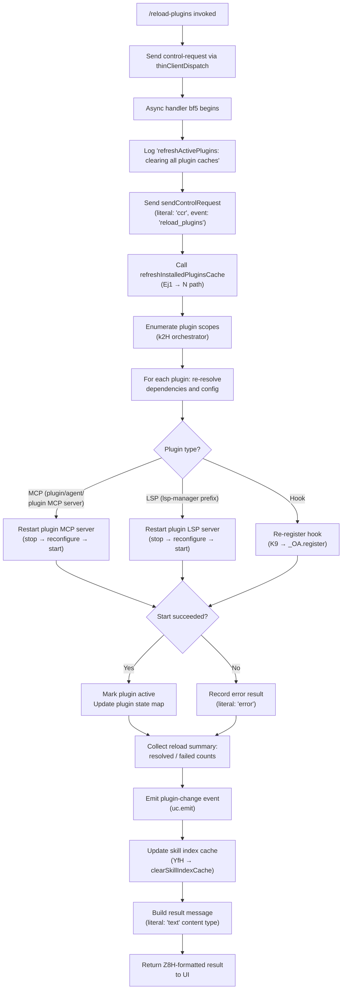

# `/reload-plugins`

> Analysis basis: CC v2.1.157 bundle.js (AST extraction + Claude interpretation)
> Minimum version: v2.1.157

---

## Overview

`/reload-plugins` activates any pending plugin changes in the current Claude Code session without requiring a full restart. It clears all plugin caches, re-discovers installed plugins across all scopes, re-connects plugin MCP and LSP servers, and emits an internal event to notify the rest of the application that the plugin set has changed.

---

## Registration

| Field | Value |
|---|---|
| type | `local` |
| name | `reload-plugins` |
| description | `Activate pending plugin changes in the current session` |
| loc_byte | `12296342` |
| loc_byte_end | `12296561` |
| loc_line | `8229` |
| supportsNonInteractive | `false` |
| thinClientDispatch | `control-request` |
| module_id | `Pi1` |
| load_inline | `true` |
| arbor_handler.name | `bf5` |
| arbor_handler.fqn | `claude-2.1.157::bf5` |
| arbor_handler.kind | `AsyncFunction` |
| arbor_handler.resolution_path | `module_id` |
| arbor_handler.n_hits | `0` |

Analysis basis: CC v2.1.157 bundle.js:+12296342

---

## Input Branching

The command takes no user-supplied arguments. Its branching is driven entirely by runtime state: which plugin types exist, whether they start/stop cleanly, and whether errors occur at each phase. Four or more distinct outcomes are possible, so a flowchart is used.



---

## Behavioral Spec

### 1. Handler Entry and Control-Request Dispatch

The async handler `bf5` is the entry point (resolved by Arbor via `module_id` path).

```
async function reloadPluginsHandler(context):
    log("refreshActivePlugins: clearing all plugin caches")
    sendControlRequest(channel="ccr", event="reload_plugins")
    result = await refreshActivePlugins(context)
    updateSkillIndex(result)
    return formatTextResult(result)
```

Analysis basis: CC v2.1.157 bundle.js:+12295364, +12295401

The `thinClientDispatch` field is `"control-request"`, meaning that in thin-client mode the invocation is forwarded to the controlling process rather than executed locally.

Analysis basis: CC v2.1.157 bundle.js:+12296342

---

### 2. Plugin Cache Clearing (`refreshInstalledPluginsCache`)

Before re-enumerating, all caches related to installed plugins are invalidated.

```
function clearAllPluginCaches():
    clearInstalledPluginsCache()       // Ej1 → N, logs "Cleared installed plugins cache"
    clearKnownMarketplacesCache()      // mf → known_marketplaces.json
    clearCacheCollections(vz)          // kC6.clear(), Ru8.clear()
    clearSkillCaches()                 // hu → clearSkillIndexCache
```

Analysis basis: CC v2.1.157 bundle.js:+12293250, +12293302, +9773626

---

### 3. Plugin Discovery and Re-Loading (`k2H` orchestrator)

The core orchestration function enumerates all plugin sources across scopes.

```
async function refreshActivePlugins(context):
    pluginSources = collectPluginSources(context)
    // Sources include: .mcp.json files, .mcpb archives, .lsp.json files,
    //                  plugin: prefixed entries, hook entries
    
    installedList = await readInstalledPlugins(k$, WC)
    lspConfigs    = await readLspConfigs(UyH)
    
    resolvedPlugins, failedPlugins = await resolveDependencies(
        pluginSources, installedList)
    
    activeMcpServers  = filterByType(resolvedPlugins, prefix="plugin:")
    activeLspServers  = filterByType(resolvedPlugins, prefix="lsp-manager")
    activeHooks       = filterByType(resolvedPlugins, type="hook")
    
    mcpResults  = await Promise.all(activeMcpServers.map(startMcpServer))
    lspResults  = await Promise.all(activeLspServers.map(startLspServer))
    hookResults = activeHooks.map(registerHook)
    
    pluginChangeEvent = buildSummary(mcpResults, lspResults, hookResults,
                                     failedPlugins)
    uc.emit(pluginChangeEvent)
    
    return pluginChangeEvent
```

Analysis basis: CC v2.1.157 bundle.js:+12293308, +12293357, +12293370, +12293715, +12294337

---

### 4. Plugin Type Handling

#### 4a. MCP Server Restart

```
async function startMcpServer(pluginEntry):
    existing = getMcpConnection(pluginEntry.name)
    if existing:
        existing.close()               // A.close(), q.close()
    conn = await sendControlRequest(pluginEntry)
    activeConnections.add(conn)        // L → q.add, q.delete
    return conn
```

Literal markers: `"plugin MCP server"` (bundle.js:+12295587), `"plugin"` (+12295496), `"agent"` (+12295555).

Analysis basis: CC v2.1.157 bundle.js:+12295401, +15478004, +15478014, +15472012

#### 4b. LSP Server Restart

```
async function startLspServer(lspEntry):
    existing = getLspConnection("lsp-manager")
    if existing:
        existing.stop()
    refreshed = await readLspConfig(lspEntry)  // UyH
    newServer = configureLspServer(refreshed)
    newServer.start()
    return newServer
```

Literal marker: `"lsp-manager"` (bundle.js:+12294752), `"plugin LSP server"` (+12296080).

Analysis basis: CC v2.1.157 bundle.js:+12293715, +12294752

#### 4c. Hook Re-registration

```
function registerHook(hookEntry):
    _OA.register(hookEntry)       // K9 → _OA.register
```

Literal marker: `"hook"` (bundle.js:+12296021).

Analysis basis: CC v2.1.157 bundle.js:+12294026, +58858

---

### 5. Dependency Resolution (`La`, `Uk9`, `IX6`)

Each plugin's declared dependencies are resolved before the plugin is started.

```
async function resolvePluginDependencies(plugin):
    // Read manifest: supports .mcpb, .mcp.json, manifest.json
    manifest = await readManifest(plugin)     // mk_, IX6
    deps = manifest.dependencies or []
    
    resolved = []
    for dep in deps:
        if dep.startsWith("http") or dep.startsWith("download"):
            fetch and extract dep         // Uk9 download path
        elif dep.source == "file" or dep.source == "directory":
            resolve local path            // IX6 local path
        elif dep.source == "npm":
            resolve npm package           // d58, bX6
        elif dep.source == "git" or dep.source == "github":
            resolve git ref               // d58 git-ls-remote path
        resolved.append(dep)
    
    return resolved
```

Error literals encountered during resolution: `"dependency-unsatisfied"` (+11466187), `"not-found"` (+11466224), `"resolution-failed"` (+5201122), `"dependency-blocked-by-policy"` (+5201241), `"generic-error"` (+12294899).

Analysis basis: CC v2.1.157 bundle.js:+6674196, +6673230, +5183005, +5190437

---

### 6. Skill Index Update (`YfH`)

After all plugins are loaded the skill/tool index is rebuilt.

```
async function updateSkillIndex(reloadResult):
    existingSkillSet = skillIndex.get()
    newTools = []
    for plugin in reloadResult.activePlugins:
        tools = await loadPluginTools(plugin)   // VNH, I8
        for tool in tools:
            validate tool schema                // xX6 extensive validation
            newTools.push(tool)
    skillIndex.set(newTools)
    notifyToolRegistryChanged()                 // G.add, J.add
```

Analysis basis: CC v2.1.157 bundle.js:+12295804, +11466251, +11466287, +11466309

---

### 7. Result Formatting (`Z8H`)

The final return value is a structured text result.

```
function formatReloadResult(summary):
    lines = summary.plugins.map(p =>
        p.name.padEnd(width) + " · " + p.status)
    if summary.errors.length > 0:
        lines.append("error: " + summary.errors.join(", "))
    return { type: "text", content: lines.join("\n") }
```

Literals: `"text"` (+12295744), `" · "` (+12295614), `"error"` (+12295669).

Analysis basis: CC v2.1.157 bundle.js:+12295847, +4990356

---

## State & Side Effects

| Item | Detail |
|---|---|
| Telemetry — `tengu_feature_ok` | Fired on successful sub-feature execution (bundle.js:+966033) |
| Telemetry — `tengu_feature_bad` | Fired when a sub-feature fails (bundle.js:+966091) |
| Telemetry — `tengu_feature_sad` | Fired on partial/degraded completion (bundle.js:+966168) |
| Telemetry — `tengu_daemon_control` | Fired when a control request is dispatched to the daemon (bundle.js:+15502788) |
| Telemetry — `tengu_daemon_config_reload` | Fired when daemon re-reads its plugin configuration (bundle.js:+15481439) |
| Cache invalidation | Installed-plugins cache, known-marketplaces cache, skill-index cache — all cleared at start |
| MCP connections | Existing MCP connections for affected plugins are closed and re-opened |
| LSP connections | Existing LSP server connections are stopped and restarted with fresh config |
| Hook registry | All plugin hooks are re-registered via `_OA.register` |
| Event bus | `uc.emit` is called with plugin-change payload after reload completes |
| Skill index | Tool/skill registry is rebuilt from the fresh plugin set |
| appState changes | Plugin active-set map and tool registry maps are updated in place |
| Sound | None detected in depth-2 traversal |
| Non-interactive | `supportsNonInteractive: false` — command cannot be invoked from non-interactive (scripted) mode |

---

## Version History

| Version | Change |
|---|---|
| v2.1.157 | Initial analysis |

---

## Common Mistakes

1. **Running in non-interactive mode**: `supportsNonInteractive` is `false`. Attempting to invoke `/reload-plugins` from a script or non-interactive session will not execute the handler.
2. **Expecting immediate MCP tool availability**: The command is asynchronous. Tools provided by reloaded plugins become available only after the full `Promise.all` over all server restarts resolves. Do not issue tool calls to newly-loaded plugins in the same turn.
3. **Assuming no session impact**: The command closes and reopens MCP transport connections. Any in-flight MCP requests to affected servers at the moment of reload may be dropped.
4. **Confusing with `/reload-config`**: `/reload-plugins` specifically targets plugin-system state (MCP servers, LSP servers, hooks, skill index). General Claude Code settings are handled separately.
5. **Calling after plugin config edits without saving**: Configuration changes must be written to disk (e.g., via `/plugins` configuration flow) before calling `/reload-plugins`. The literal `"Configuration saved. Run /reload-plugins for changes to take effect."` (bundle.js:+11596258) confirms this ordering expectation.

---

## Appendix — Identifier Mapping

> For bundle debugging only. Identifiers change across versions.

| Identifier | Role |
|---|---|
| `bf5` | Main async handler for `/reload-plugins` (Arbor-resolved entry point) |
| `V$` | Control-request sender called from `bf5` |
| `f0H` | Low-level transport helper called by control-request sender |
| `Ln` | Intermediate helper called from `bf5` before cache refresh |
| `k8` | Utility called by `Ln` and other helpers |
| `k2H` | Core plugin-refresh orchestrator (enumerates scopes, coordinates restarts) |
| `N` | Generic logger / notification helper used throughout |
| `QCK` | Plugin cache lookup helper |
| `qOA` | Sub-helper for plugin cache operations |
| `RH` | JSON-stringify utility |
| `v4` | UUID / identifier generator |
| `uYA` | UUID byte-mapping helper |
| `EuH` | Stream/write helper |
| `VYA` | Low-level write helper |
| `lCK` | Log-file writer (append-file path with rotation) |
| `rxH` | Buffered log/queue flusher |
| `M$H` | Log rotation helper |
| `g6` | Path resolution / home-dir utility |
| `qK6` | File-system helper (EISDIR guard) |
| `dYA` | Path join + existence check helper |
| `QYA` | File stat / rename / unlink helper (log rotation) |
| `cCK` | Log directory creator + appender |
| `K9` | Hook registration caller |
| `Ej1` | Installed-plugin cache invalidator |
| `k$` | Plugin loader / reader coordinator |
| `cRL` | Plugin configuration reader |
| `F0` | Settings layer reader |
| `WT8` | Settings type helper |
| `Af8` | Settings merge helper |
| `mM8` | Settings validation helper |
| `wk_` | Plugin root directory resolver |
| `SH` | Error logger / error boundary helper |
| `B58` | Plugin state helper |
| `cd_` | Plugin scope helper |
| `Mj1` | Plugin metadata helper |
| `WC` | Skill/plugin index cache clearing coordinator |
| `hu` | Skill index cache clearer |
| `_j1` | Plugin index helper |
| `ISH` | Index synchronization helper |
| `FX6` | Settings accessor helper |
| `SV_` | Plugin scope validator |
| `Aa` | Cache-map clearer (`YT8.clear`) |
| `zh9` | Plugin enumeration helper |
| `Ce9` | Plugin configuration enricher |
| `O_` | Async notification helper |
| `AN` | Low-level async primitive |
| `La` | Plugin-list loader (reads `.mcp.json`, `.mcpb`, `.dxt` files) |
| `knH` | Plugin file existence helper |
| `LB` | Extension checker (`.mcpb`, `.dxt`) |
| `HQ` | Plugin source classifier |
| `mk_` | `.mcp.json` file reader and parser |
| `P8` | Error-code classifier (ENOENT / EISDIR) |
| `p6` | JSON parse utility |
| `Uk9` | Downloadable plugin resolver (http/download/network sources) |
| `IX6` | Local plugin installer (manifest.json extraction, md5 hashing) |
| `EH` | String coercion utility |
| `UyH` | LSP config reader (`.lsp.json` files) |
| `BJL` | LSP config validator and path checker |
| `UJL` | LSP path relative-check helper |
| `$` | Background-session / daemon-status accumulator |
| `Ls1` | Daemon status file writer (`daemon.status.json`) |
| `ii` | Daemon status initializer |
| `s9` | Async-local storage accessor |
| `uI6` | Status-file path builder |
| `O` | Stopped-session / background-session tracker |
| `Rf5` | Active-plugin filter (includes) |
| `Xi1` | Plugin active-set membership helper |
| `Cf5` | Failed-plugin filter |
| `YfH` | Skill/tool index rebuilder |
| `Ek` | Known-marketplaces reader |
| `mf` | Marketplace JSON file reader |
| `VT8` | Marketplace file path builder |
| `VNH` | Tool schema enumerator |
| `I8` | Tool schema type builder |
| `Ng6` | Schema primitive builders |
| `$Q` | Schema type registry |
| `ME` | Schema error constructor |
| `BA` | Path/scope parser (splits scope strings) |
| `L2` | Plugin source URL/path normalizer |
| `Nf9` | URL protocol stripper |
| `VJ6` | Git/GitHub URL resolver |
| `HL8` | Schema builder for git sources |
| `kf9` | Host-pattern matcher |
| `If9` | Path-pattern matcher |
| `MI7` | Git reference resolver |
| `W8H` | Schema builder for local sources |
| `hf9` | Combined git/local resolver |
| `vf9` | Scope-relative path resolver |
| `ro` | Plugin marketplace manifest reader (`.claude-plugin/marketplace.json`) |
| `jV6` | Marketplace file path builder |
| `id_` | Marketplace JSON schema validator |
| `j8` | Schema safe-parse helper |
| `GT` | Plugin definition loader (reads plugin scope + marketplace + installed data) |
| `jV_` | Plugin local-copy reader |
| `rH5` | Installed-plugin set membership tester |
| `xX6` | Full plugin-load pipeline (most complex function in the call graph) |
| `VW` | Tool scope builder |
| `n58` | Path/scope normalizer for npm packages |
| `f56` | Relative-path checker (`./` prefix) |
| `z` | MCP server state map |
| `hH` | MCP server state getter (slot A) |
| `bH` | MCP server state getter (slot B) |
| `hy` | First-party MCP flag setter |
| `Fm` | Process exit / race helper (daemon watchdog) |
| `h6` | Async-local store reader |
| `lB6` | Context store accessor |
| `OE` | Plugin config file reader + entry parser |
| `od_` | Plugin config file sync reader |
| `ad_` | Plugin config entry enumerator |
| `J` | Active-connection set |
| `w` | MCP process manager (spawn, kill, memory check) |
| `T` | MCP connection map |
| `Jv6` | MCP connection factory |
| `Lx8` | MCP transport layer |
| `iV` | Plugin scope validator (managed-scope guard) |
| `Pk` | Managed-scope error builder |
| `yL8` | Semver validator (`Xc.valid`, `Xc.coerce`, `Xc.satisfies`) |
| `G` | UI event dispatcher (preventDefault, settings handler) |
| `b` | UI event source |
| `h0` | User-settings accessor |
| `Y` | MCP supervisor (stop/updateConfig/start lifecycle) |
| `yM9` | Dependency graph walker |
| `M` | File-system cleanup helper |
| `qV` | Flag-settings filter |
| `s96` | Settings store accessor |
| `P` | MCP connection pool manager |
| `F_` | Error string formatter |
| `C` | stdio/sse transport selector |
| `S` | stdio transport handler |
| `p` | SSE transport handler |
| `Hj9` | Plugin-load queue manager |
| `R` | MCP connection handle |
| `x` | MCP heartbeat / idle-timeout handler |
| `d` | Low-level event emitter |
| `U_` | Settings file writer (atomic, with symlink handling) |
| `ZO` | Schema + settings merger |
| `Ga8` | Settings scope resolver |
| `wP` | Settings notifier |
| `Jo8` | Settings-change timestamp recorder |
| `iGH` | Settings validation gateway |
| `yL6` | Atomic file writer (temp → rename, fchmod, fsync) |
| `vz` | In-memory cache clearer (`kC6.clear`, `Ru8.clear`) |
| `bF6` | File-based settings logger |
| `cb` | `.claude/settings.json` path builder |
| `t6` | Event emitter wrapper |
| `Cp` | Settings scope composer |
| `CX6` | Module path resolver (security: startsWith check) |
| `l` | Active MCP connection filter |
| `t` | Voice-input handler (unrelated to reload, reached via deep graph) |
| `fH` | Key-event dispatcher (UI input handler) |
| `tCH` | Key-event type checker |
| `zh6` | Form-field value reader |
| `wH` | Voice WebSocket |
| `HH` | Voice silence-timeout handler |
| `_6` | MCP tool list builder |
| `e` | Notification adder |
| `OH` | Output queue enqueuer |
| `mH` | MCP tool-map rebuilder |
| `Yh6` | Form value setter |
| `_H` | MCP server pending-restart handler |
| `xqH` | Form-field extra helper |
| `lA6` | Form layout helper |
| `Dh6` | Form submission handler |
| `jH` | Plugin-to-tool map |
| `QH` | Queue / timer handle |
| `W` | Debug layer |
| `o` | Voice silence-timeout controller |
| `KH` | MCP connection event handlers |
| `zH` | Plugin metadata map |
| `UJ6` | Version-range resolver |
| `_Z_` | Version-too-complex error builder |
| `Q58` | npm child-window spawner |
| `cw9` | npm IPC channel creator |
| `d58` | Git `ls-remote` runner |
| `lb7` | git executable locator |
| `v8` | Shell command runner |
| `j` | Process kill helper |
| `bX6` | npm package installer |
| `viH` | MCPB archive extractor |
| `r58` | Plugin update checker |
| `qj9` | Plugin update applier |
| `y8H` | Content-hash generator |
| `Zk` | Plugin install path builder |
| `X` | stdio framing decoder |
| `CL8` | npm dependency installer |
| `fB` | npm channel helper |
| `QwH` | Plugin path canonicalizer |
| `l58` | Temp-dir cleanup helper |
| `MV_` | Plugin registry updater (Updated / Added literals) |
| `Q` | Virtual-FS read/unlink helper |
| `mN6` | Virtual-FS read helper |
| `zh1` | Virtual-FS unlink helper |
| `BH` | Notification push list |
| `bU_` | Notification formatter |
| `PH` | Permission check helper |
| `wF` | Permission UI helper |
| `k6` | Async notification primitive |
| `a` | Permission store |
| `NH` | Full MCP server list builder (kl + wCH + uS + DH + za + GH + llH) |
| `kl` | Built-in server list builder |
| `wCH` | Coordinator-mode server filter |
| `uS` | Server list async notifier |
| `DH` | Voice transcription handler |
| `za` | Plugin marketplace server merger |
| `GH` | Plugin-file server loader |
| `y4` | Server deduplication helper |
| `_b6` | Server list sorter |
| `llH` | Server list cache (`l49`) |
| `kH` | Tool list concatenator |
| `V` | Plugin validation helper |
| `sb7` | Plugin tool schema builder |
| `c` | Permission store list |
| `vS8` | Permission entry builder |
| `r` | Voice focus-timeout controller |
| `Wk` | Extension/language-key normalizer |
| `T$` | String canonicalizer |
| `CH` | String-to-string coercer |
| `D4` | OTEL metric emitter |
| `vm8` | OTEL metric builder |
| `GNH` | OTEL attribute collector |
| `f16` | OTEL prompt-id extractor |
| `qH` | Voice focus-gain handler |
| `Z8H` | Result formatter (maps plugin list → padded text lines) |

---

Note: index built via Arbor fallback; some signals (telemetry, literals) may be missing — see arbor-fallback.js.