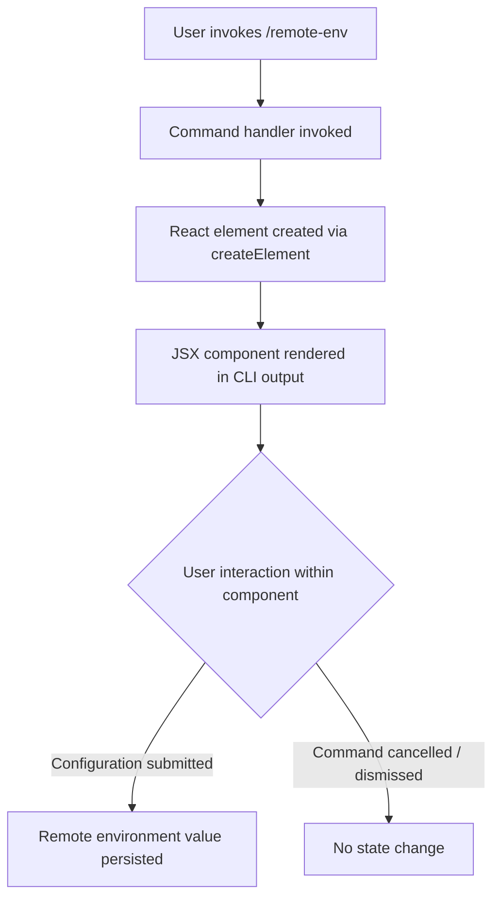

# `/remote-env`

> Analysis basis: CC v2.1.143 bundle.js (AST extraction + Claude interpretation)
> Minimum version: v2.1.143

---

## Overview

The `/remote-env` command configures the default remote environment used for Teleport sessions in Claude Code. It is implemented as a local JSX command, meaning its user interface is rendered as a React component inline within the CLI. The command provides a configuration surface for specifying which remote environment Claude Code should target when establishing Teleport-based remote connections.

---

## Registration

| Field | Value |
|---|---|
| type | `local-jsx` |
| name | `remote-env` |
| description | `Configure the default remote environment for teleport sessions` |
| module_id | `jEq` |

Analysis basis: CC v2.1.143 bundle.js:+11673381

---

## Input Branching

The depth-2 call graph for this command resolves to a single React element creation call. No branching literals or conditional dispatch paths were captured at this traversal depth.



> Note: Paths F and G are inferred from the `local-jsx` type pattern common to other configuration commands in this bundle. The specific interaction flows inside the rendered component are <!-- TODO: not found in depth-2 traversal; needs --depth 4 -->.

---

## Behavioral Spec

### Command Render Entry Point

The sole confirmed call edge at depth ≤ 2 is the construction of a React element by the command's top-level handler function.

```
function remoteEnvCommandHandler(props):
    element = createReactElement(RemoteEnvComponent, props)
    return element
```

Analysis basis: CC v2.1.143 bundle.js:+11673265

### Component Internal Logic

<!-- TODO: not found in depth-2 traversal; needs --depth 4 -->

The internal behavior of `RemoteEnvComponent` — including form fields, validation rules, persistence targets, and any conditional rendering — was not reachable within the depth-2 call graph. A deeper traversal starting from the `TS7` → `rB_.createElement` edge is required to enumerate sub-component structure and state management.

### Configuration Persistence

<!-- TODO: not found in depth-2 traversal; needs --depth 4 -->

The mechanism by which a selected remote environment value is stored (e.g., written to a config file, updated in `appState`, or dispatched via an event) was not observed in the extracted data.

---

## State & Side Effects

| Item | Detail |
|---|---|
| Telemetry | None detected at depth ≤ 2 (telemetry array is empty) |
| Hook registration | <!-- TODO: not found in depth-2 traversal; needs --depth 4 --> |
| appState changes | <!-- TODO: not found in depth-2 traversal; needs --depth 4 --> |
| Sound | <!-- TODO: not found in depth-2 traversal; needs --depth 4 --> |

> No `tengu_*` telemetry event strings were found associated with this command in the depth-2 traversal. It is possible telemetry is emitted from deeper callees not yet traversed.

---

## Version History

| Version | Change |
|---|---|
| v2.1.143 | Initial analysis |

---

## Common Mistakes

1. **Assuming this command controls live session behavior**: `/remote-env` configures the *default* remote environment for future Teleport sessions. It does not modify an already-active session's connection target.
2. **Expecting CLI text output**: Because this command is registered as `local-jsx`, it renders an interactive React component rather than printing plain text. Tools or scripts that parse stdout from this command will not receive structured text output.
3. **Confusing with session-level overrides**: A per-session remote environment override (if one exists) may take precedence over the default set here; the relationship between the two is <!-- TODO: not found in depth-2 traversal; needs --depth 4 -->.

---

## Appendix — Identifier Mapping

> For bundle debugging only. Identifiers change across versions.

| Identifier | Role |
|---|---|
| `TS7` | Top-level command handler function; entry point for `/remote-env`; constructs the root React element (Analysis basis: CC v2.1.143 bundle.js:+11673265) |