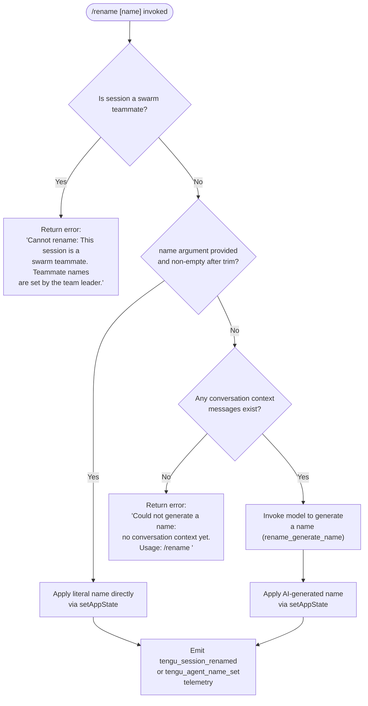

# `/rename`

> Analysis basis: CC v2.1.157 bundle.js (AST extraction + Claude interpretation)
> Minimum version: v2.1.157

---

## Overview

The `/rename` command sets or generates a display name for the current Claude Code conversation session. When a name argument is supplied the session is immediately renamed to that literal string; when no argument is provided the command invokes the model to synthesize a name from existing conversation context. The command is also available under the alias `/name`.

---

## Registration

| Field | Value |
|---|---|
| type | `local-jsx` |
| name | `rename` |
| description | `Rename the current conversation` |
| argumentHint | `[name]` |
| immediate | `true` |
| aliases | `["name"]` |
| module_id | `Pp1` |
| load_inline | `true` |
| loc_byte | `11748925` |
| loc_byte_end | `11749124` |
| loc_line | `7663` |
| arbor_handler.name | `Wq5` |
| arbor_handler.kind | `AsyncFunction` |
| arbor_handler.fqn | `claude-2.1.157::Wq5` |
| arbor_handler.resolution_path | `module_id` |
| arbor_handler.n_hits | `0` |

Analysis basis: CC v2.1.157 bundle.js:+11748925

---

## Input Branching

Four distinct branches exist based on session kind and argument presence, requiring a flowchart.



Analysis basis: CC v2.1.157 bundle.js:+11748083 (swarm error), +11748300 (no-context error), +11748188 (trim), +11748428 (setAppState)

---

## Behavioral Spec

### Top-level handler (`Wq5`)

The Arbor-resolved handler is the async function `Wq5` (resolution path: `module_id`).

```
async function renameCommandHandler(context):
    result = await innerRenameHandler(context)
    setupResultDisplay(context)
    checkSwarmStatus(context)
```

Analysis basis: CC v2.1.157 bundle.js:+11748621 (`Wq5` → `lN8`), +11748637, +11748679

---

### Inner rename logic (`lN8`)

```
async function innerRenameHandler(context):
    // 1. Swarm-teammate guard
    swarmRole = getStoreValue(asyncLocalStore)   // via of → v0 → u1_.getStore
    if swarmRole indicates teammate:
        return errorResult(
            "Cannot rename: This session is a swarm teammate. ..."
        )

    // 2. Determine the requested name
    requestedName = context.args.trim()

    if requestedName is non-empty:
        // Direct rename path
        performDirectRename(requestedName, context)
    else:
        // AI-generation path
        hasContext = conversationHasMessages(context)
        if not hasContext:
            return errorResult(
                "Could not generate a name: no conversation context yet. ..."
            )
        generatedName = await generateNameViaModel(context)
        performDirectRename(generatedName, context)

    // 3. Persist name to appState
    context.setAppState({ sessionName: finalName })

    // 4. Flush conversation storage
    persistConversationMetadata(context)   // eYH

    // 5. Derive display title for sidebar
    displayTitle = deriveDisplayTitle(finalName)   // Oj
```

Analysis basis: CC v2.1.157 bundle.js:+11748063 (store lookup), +11748083 (swarm error literal), +11748188 (trim), +11748222 (rename dispatch `e86`), +11748428 (setAppState), +11748447 (metadata flush `PV8`), +11748470 (persistence `eYH`), +11748474 (display title `Oj`)

---

### Rename execution / session fork (`e86`)

When a rename is actually applied (either branch), the session-fork subsystem is engaged.

```
function applyRename(name, context):
    // Record timestamp for this rename event
    timestampedEvent = buildRenameEvent(Date.now())   // sr_

    // Initiate full-session fork to preserve history under new name
    forkSession(context, name)   // G6
    // Telemetry: tengu_rename_full_session_fork emitted here

    // Set up abort controller for the rename operation
    abortController = createAbortController()   // Pq5
    abortController.signal.addEventListener("abort", handler)

    // Run the primary query loop for name generation (if AI path)
    queryResult = await runQueryLoop(context, abortController)   // d0

    // Build system message array for the rename context
    systemMessages = buildSystemMessageArray(context)   // QN8

    // Execute the rename emission pipeline
    await emitRenameEvent(context, name)   // ey

    // Apply error type filter
    filteredErrors = filterErrors(context)   // jK

    // Finalize display name token
    finalToken = resolveDisplayToken(context)   // Xp1

    // Normalize output
    normalizedOutput = normalizeOutput(context)   // N, EH
```

Analysis basis: CC v2.1.157 bundle.js:+11746768 (`e86` → `G6`), +11746771 (`tengu_rename_full_session_fork`), +11746809 (`sr_`), +11746828 (`Pq5`), +11746880 (`QN8`), +11746921 (`ey`), +11747389 (`jK`), +11747418 (`Xp1`)

---

### Session fork subsystem (`G6`)

```
function forkSession(context, name):
    // Read feature flags for fork behavior
    flagA = featureFlagReader_A()   // az6
    flagB = featureFlagReader_B()   // sz6

    // Encode the new name
    encodedName = encodeSessionName(name)   // Ex → CH, Zx

    // Check if this session ID is already in the fork registry
    if forkRegistry.has(sessionId):   // izH.has
        existingFork = forkMap.get(sessionId)   // e88
        if not activeSet.has(existingFork):   // mz_.has
            activeSet.add(existingFork)        // mz_.add
            emitForkEvent(existingFork)        // uz_
    else:
        // Register a new fork entry
        forkRegistry.add(sessionId)            // rz6.add

    // Look up current persistence unit
    if persistenceMap.has(sessionId):          // PU.has
        unit = persistenceMap.get(sessionId)   // PU.get
        persistFork(unit, name)                // S6
```

Analysis basis: CC v2.1.157 bundle.js:+3187108 (`az6`), +3187145 (`sz6`), +3187180 (`Ex`), +3187197 (`izH.has`), +3187208 (`e88`), +3187220 (`rz6.add`), +3187234 (`PU.has`), +3187251 (`PU.get`), +3187271 (`S6`)

---

### AI name generation query loop (`d0`)

When no explicit name is provided and conversation context exists, the model is queried to produce a name.

```
async function generateNameViaModel(context):
    startTime = Date.now()

    // Build the initial message state for the sub-query
    initialState = buildInitialMessageState(context)   // i08
    // i08 calls H.getAppState, sets avoid_prompts flag,
    // calls H.setAppState, generates a random UUID (EV1.randomUUID)

    // Generate random request ID
    requestId = generateRequestId()   // jh → Sy9.randomBytes (8 bytes, hex)

    // Prepare the rename-specific payload
    payload = buildRenamePayload(context, requestId)   // VAH

    // Normalize conversation history for the sub-query
    normalizedMessages = normalizeHistory(context)   // N

    // Get the most recent message
    lastMessage = messages.at(-1)   // H.at

    // Execute sub-agent query
    subQueryResult = await runSubAgentQuery(context, payload)   // Om

    // Check for tombstone / special message types
    hasTombstone = checkTombstone(subQueryResult)   // Rv6 → fQL.has ("tombstone")

    // Execute the streaming query pipeline
    streamResult = await executeStreamingQuery(context)   // e7H

    // Collect stream output tokens
    outputTokens = collectOutputTokens(streamResult)   // D.map

    // Format final response
    formattedResponse = formatResponse(outputTokens)   // d, klL

    return formattedResponse
```

The sub-query uses the tool permission context with the setting `"deny"` and `"Session name generation cannot use tools"` to prevent tool calls during name generation.

Analysis basis: CC v2.1.157 bundle.js:+10676716 (`d0` start), +10676839 (`i08`), +10677053 (`r08`), +10677071 (`jh`), +10677095 (`VAH`), +10677115 (`N`), +10677185 (`H.at`), +10677246 (`Om`), +10677426 (`Rv6`), +10677516 (`rAH`), +10677545 (`qV8`), +10677566 (`hT1`), +10677671 (`D.push`), +10677683 (`e7H`), +11746213 (`"deny"`), +11746228 (tool denial message)

---

### Name generation telemetry tagging

```
function tagRenameOrigin(name, isAIGenerated):
    if isAIGenerated:
        tag = "ai-title"       // written to session log via iAH
        emit tengu_session_renamed
        // or for agent sessions:
        tag = "agent-name"     // via s5H
        emit tengu_agent_name_set
    else:
        tag = "custom-title"   // written to session log via th
        emit tengu_session_renamed
```

Analysis basis: CC v2.1.157 bundle.js:+12906486 (`"custom-title"`), +12906565 (`tengu_session_renamed`), +12906651 (`"ai-title"`), +12906724 (`tengu_agent_name_set` path), +12909509 (`"agent-name"`), +12909594 (`tqA.emit`)

---

### Conversation metadata persistence (`eYH`)

```
async function persistConversationMetadata(context):
    // Resolve storage path
    storagePath = buildStoragePath(context)   // gK → aP.join, YT

    // Load existing job queue
    jobs = loadJobQueue(storagePath)           // t9

    // Atomically write updated metadata
    atomicWrite(storagePath, metadata)         // ff → B3
    // B3 uses fK_.randomBytes(4) for temp-file suffix,
    // LHH.writeFile, LHH.rename, and LHH.copyFile

    // Delete stale entries
    deleteStaleEntry(context)                  // $j → sYH.delete

    // Signal write completion
    notifyWriteComplete(context)               // P8, SH
```

Analysis basis: CC v2.1.157 bundle.js:+4091381 (`gK`), +4091395 (`t9`), +4091516 (`ff`), +4089163 (`B3`), +4089425 (`$j`), +4091606 (`P8`), +4091612 (`SH`)

---

### Logging pipeline (`KRH`)

Every rename action (both paths) passes through the logging pipeline.

```
function logRenameAction(context, name):
    // Format the log entry using the active log formatter
    entry = formatLogEntry(context)   // k6, MI, AM

    // Write the structured entry
    writeLogEntry(entry)              // th → cfH (appendFileSync, mkdirSync)
    // Log rotation: max entry size 384 bytes compressed / 448 bytes raw

    // Emit agent rename event on internal event bus
    bus.emit("rename", entry)         // Cy6.emit

    // Persist updated config via mQ → iM6
    persistConfig(context)            // mQ
    // iM6 uses Wy.readFile / Wy.writeFile with JSON round-trip

    // Clean up temp files
    cleanupTempFiles(context)         // M → A0.rm
```

Analysis basis: CC v2.1.157 bundle.js:+10572290 (`k6`), +10572297 (`MI`), +10572303 (`AM`), +10572328 (`th`), +10572343 (`iAH`), +10572476 (`M`), +10572550 (`s5H`), +10572569 (`V$`), +10572711 (`mQ`), +12905533 (`cfH` → `appendFileSync`), +12905560 (384 bytes), +12905604 (448 bytes)

---

## State & Side Effects

| Item | Detail |
|---|---|
| Telemetry: `tengu_rename_full_session_fork` | Fired when session-fork is initiated during rename (bundle.js:+11746771) |
| Telemetry: `tengu_session_renamed` | Fired after a successful rename (custom or AI-generated title) (bundle.js:+12906578) |
| Telemetry: `tengu_agent_name_set` | Fired when an agent/subagent session name is set (bundle.js:+12909607) |
| Telemetry: `tengu_config_parse_error` | Fired if config file cannot be parsed during persistence (bundle.js:+3210553) |
| Telemetry: `tengu_fork_agent_query` | Fired within the sub-agent query that generates names (bundle.js:+10678694) |
| Telemetry: `tengu_forked_agent_default_turns_exceeded` | Fired if the name-generation sub-agent exceeds its turn limit (bundle.js:+10678251) |
| Telemetry: `tengu_bg_spare_enable` / `tengu_bg_spare_spawn` | Background spare agent lifecycle, triggered by session fork side-path (bundle.js:+15466284, +15466644) |
| appState changes | `sessionName` field updated via `H.setAppState` / `_.setAppState` (bundle.js:+11748428) |
| Conversation log write | Atomic file write via `LHH.writeFile` + `LHH.rename` using 4-byte random suffix (bundle.js:+2233544, +2233598) |
| Session fork | Full session fork recorded in `izH` / `PU` maps, entry added to `rz6` set (bundle.js:+3187197–+3187271) |
| AbortController | An `AbortController` is registered on the rename operation; `"abort"` event triggers cleanup (bundle.js:+11746036) |
| Log file append | Session title tag (`"custom-title"` or `"ai-title"` or `"agent-name"`) appended to JSONL log file, with mkdirSync if needed (bundle.js:+12906486, +12906651, +12909509) |
| Tool usage during name generation | Explicitly blocked: tool permission set to `"deny"` with message `"Session name generation cannot use tools"` (bundle.js:+11746213, +11746228) |
| Swarm guard | Swarm-teammate sessions return an error and make no state changes (bundle.js:+11748083) |

---

## Version History

| Version | Change |
|---|---|
| v2.1.157 | Initial analysis |

---

## Common Mistakes

1. **Providing no argument in an empty session**: If `/rename` is invoked without an argument and there are no conversation messages yet, the command returns an error ("Could not generate a name: no conversation context yet."). Provide an explicit name instead: `/rename MySession`.
2. **Attempting to rename a swarm teammate session**: Swarm teammate sessions cannot be renamed via `/rename`; only the team leader can set teammate names. The command will return an error immediately.
3. **Expecting instant persistence**: The rename triggers an async file-write pipeline (`eYH` → `ff` → `B3`) using atomic temp-file rename. If the process exits immediately after issuing `/rename`, the new name may not have been flushed to disk.
4. **Confusing `/rename` with `/compact`**: `/rename` only changes the session display name; it does not compress or summarize the conversation history.
5. **Using `/rename` to pass a name containing special characters without quoting**: The argument is accepted as a raw string after trimming; shell-level quoting may be needed when invoking non-interactively.

---

## Appendix — Identifier Mapping

> For bundle debugging only. Identifiers change across versions.

| Identifier | Role |
|---|---|
| `Wq5` | Top-level async handler for `/rename` command (arbor_handler) |
| `lN8` | Inner rename logic: swarm guard, trim, branch dispatch, setAppState |
| `cN8` | Utility called by `Wq5`; display/result setup |
| `of` | Async-store accessor wrapper |
| `v0` | Async-store reader (calls `u1_.getStore`) |
| `e86` | Rename execution dispatcher: calls fork, abort controller, query loop |
| `G6` | Session fork subsystem |
| `az6` | Feature-flag reader A (used by fork) |
| `sz6` | Feature-flag reader B (used by fork) |
| `Ex` | Session name encoder (calls `CH`, `Zx`) |
| `CH` | String coercion / encoding utility |
| `Zx` | Secondary encoder (calls `vR`) |
| `e88` | Fork-registry lookup and insertion |
| `uz_` | Fork event emitter (calls `Zx`, `FEH`, `wU`, `_QH`, `Cz_.randomUUID`, `RH`, `Er.emit`) |
| `Fz_` | Fork-event pipeline helper (calls `Nyq`, `B_`, `jFq`, `B$H`) |
| `S6` | Persistence unit handler for fork (calls `g6`, `qT`, `sz_`, `szH`, `b17`, `Date.now`) |
| `g6` | Path/config base resolver |
| `sz_` | Config utility |
| `szH` | Config file reader/writer (uses `q.readFileSync`, `q.statSync`, `q.mkdirSync`) |
| `b17` | File watcher for persistence unit (calls `z_8.watchFile`, `z_8.unwatchFile`) |
| `sr_` | Rename-event timestamp builder (calls `Date.now`, `x96`) |
| `x96` | Timestamp formatter |
| `Pq5` | Abort controller setup for rename operation |
| `p8H` | Abort payload builder |
| `A` | AbortController instance / connection handle |
| `f` | Stream/socket connection object |
| `d0` | AI name-generation query loop |
| `i08` | Initial message state builder (reads/sets appState, generates UUID) |
| `r08` | Request metadata builder |
| `jh` | Random request-ID generator (uses `Sy9.randomBytes`) |
| `VAH` | Rename-specific sub-query payload builder (calls `U4`, `RSH`) |
| `N` | Conversation history normalizer |
| `Om` | Sub-agent query executor (calls `JlL`, `rM8`, `hH`, `bH`) |
| `Rv6` | Tombstone/special-message checker (calls `fQL.has`) |
| `rAH` | Post-query result handler |
| `qV8` | Query value extractor |
| `hT1` | Hint-clear check (calls `Rv6`) |
| `D` | Background spare agent manager |
| `e7H` | Streaming query executor (calls `Ej`, `Dr7`, `H.filter`, `L.has`, `H.push`) |
| `d` | Output token formatter |
| `klL` | Final response formatter (calls `d`) |
| `E8` | Stream reader (calls `X`, `Nv.randomUUID`, `J`) |
| `X` | Buffer/stream chunk processor |
| `J` | Socket/stream wrapper (calls `w`) |
| `q` | File-system or stream utility collection |
| `Xp1` | Display name token resolver (calls `V9`, `sS`) |
| `sS` | String trim helper |
| `EH` | String output normalizer (calls `String`) |
| `QN8` | System message array builder (calls `_.push`, `Array.isArray`, `_.join`, `A.slice`) |
| `_` | General-purpose array/string accumulator |
| `ey` | Rename emission pipeline (calls `EK`, `YZ8`, `E8`, `jCH`, `hP`, `fT`) |
| `EK` | Event-key resolver |
| `YZ8` | Conversation-context serializer / loader |
| `zZ8` | Zero-state check for conversation |
| `ZT` | Turn/message builder (large function, many callees) |
| `IuL` | Message-list iterator/mapper |
| `h6` | Hash/path helper (calls `lB6`, `O_`) |
| `RH` | JSON serializer wrapper |
| `p6` | JSON parser wrapper |
| `cX1` | Context-hash loader (calls `huL`) |
| `j8` | Error/warning logger |
| `L` | Async task queue |
| `jCH` | Post-query assistant-message extractor (calls `Ll_`, `TqK`, `Error`) |
| `Ll_` | Conversation-state loader for sub-query (calls `zZ8`, `YZ8`, `A.push`) |
| `TqK` | Core API query executor (very large; manages streaming, retries, tool permissions) |
| `hP` | Provider/endpoint resolver (calls `TA`, `u5`, `y1_`, `J9`, `LFH`) |
| `TA` | Auth/credential handler |
| `u5` | URL builder |
| `y1_` | API key prefix checker (detects `"sk-ant-"` prefix, `/login managed key`) |
| `J9` | Session-credential resolver (calls `se`, `_1`, `XX`) |
| `LFH` | HTTP client factory (calls `w5`) |
| `fT` | Final emit / cleanup step |
| `jK` | Error-type filter (calls `H.filter`) |
| `KRH` | Logging pipeline dispatcher (calls `k6`, `MI`, `AM`, `th`, `iAH`, `xT`, `Ds`, `M`, `vAH`, `s5H`, `V$`, `y0`, `mQ`) |
| `k6` | Log-entry format selector (calls `AN`) |
| `AN` | ANSI/plain string renderer |
| `MI` | Log metadata injector |
| `AM` | Log entry assembler (calls `RS`, `CO`, `O_`, `VjH.join`, `k6`) |
| `RS` | Log renderer step A |
| `O_` | Log renderer step B |
| `th` | Custom-title log writer (calls `yv`, `cfH`, `k6`, `U4`, `Cy6.emit`) |
| `yv` | Log formatter for custom titles |
| `cfH` | File-append log writer (uses `appendFileSync`, `mkdirSync`; 384/448 byte limits) |
| `U4` | Log file path resolver (calls `K9`) |
| `iAH` | AI-title log writer (calls `cfH`, `yv`, `k6`, `U4`, `Cy6.emit`) |
| `xT` | Extended log metadata handler |
| `Ds` | Diagnostic log step |
| `M` | Temp-file cleanup (calls `cS6`, `f.has`, `A0.rm`) |
| `cS6` | Path safety validator (checks for `".staging"`, `".."` traversal, reserved paths) |
| `lS6` | Path join helper for plugins directory |
| `vAH` | Log verbosity handler |
| `s5H` | Agent-name log writer (calls `yv`, `cfH`, `k6`, `U4`, `tqA.emit`) |
| `mQ` | Config persistence wrapper (calls `iM6`, `Date.now`) |
| `iM6` | Config read/write with JSON round-trip (uses `Wy.readFile`, `Wy.writeFile`) |
| `V$` | Temp-file manager (calls `f0H`) |
| `f0H` | Temp-file record |
| `PV8` | AppState key enumerator (calls `Object.keys`) |
| `eYH` | Conversation metadata persistence coordinator (calls `gK`, `t9`, `$j`, `ff`, `P8`, `SH`) |
| `gK` | Storage path builder (calls `aP.join`, `YT`) |
| `YT` | Base storage path resolver (calls `aP.join`, `F8`) |
| `t9` | Job-queue loader (reads conversation file, caches via `sYH`) |
| `P8` | Write-completion notifier (calls `j8`) |
| `$j` | Stale-entry deleter (calls `sYH.delete`) |
| `ff` | Atomic metadata writer (calls `B3`, `aP.join`, `RH`, `$j`) |
| `B3` | Atomic file write primitive (uses `fK_.randomBytes(4)`, `LHH.writeFile`, `LHH.rename`, `LHH.copyFile`, `LHH.unlink`) |
| `SH` | Storage completion handler (calls `F_`, `CH`, `L1`, `X_4`, `Vi.logError`) |
| `F_` | Error formatter (calls `Error`, `String`) |
| `L1` | Storage flush helper (calls `fVA`) |
| `fVA` | Flush callback (calls `CH`) |
| `X_4` | Queue rotation helper (calls `BB6.shift`, `BB6.push`) |
| `Oj` | Display-title deriver from basename (calls `aP.basename`, `k6`) |

---

Note: index built via Arbor fallback; some signals (telemetry, literals) may be missing — see arbor-fallback.js.