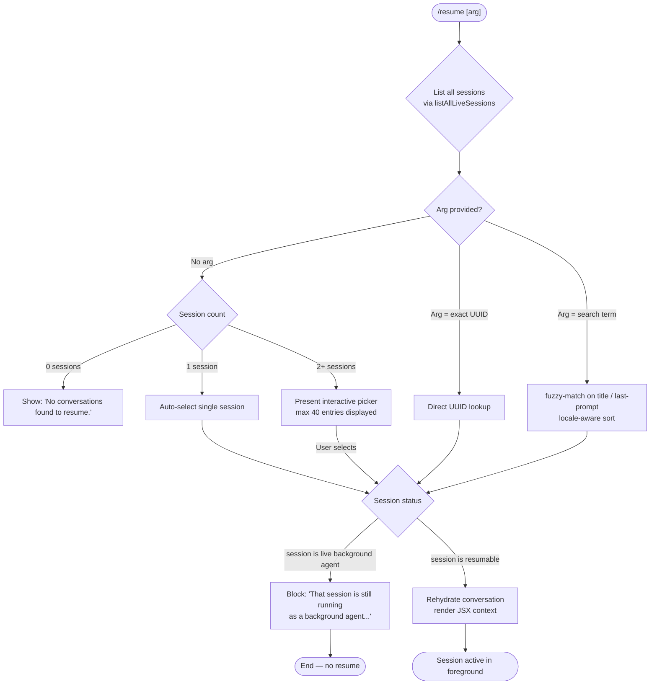

# `/resume`

> Analysis basis: CC v2.1.157 bundle.js (AST extraction + Claude interpretation)
> Minimum version: v2.1.157

---

## Overview

`/resume` (alias: `/continue`) lets the user restart a previously saved Claude Code conversation by supplying a conversation ID or a free-text search term. It enumerates all known live and completed sessions, resolves the best match, guards against resuming a session that is still running as a background agent, and then rehydrates the conversation into the current UI context.

---

## Registration

| Field | Value |
|---|---|
| type | `local-jsx` |
| name | `resume` |
| description | `Resume a previous conversation` |
| aliases | `["continue"]` |
| argumentHint | `[conversation id or search term]` |
| module_id | `pF1` |
| load_inline | `true` |
| loc_byte | `11908435` |
| loc_byte_end | `11908632` |
| loc_line | `7702` |
| arbor_handler.name | `gK5` |
| arbor_handler.fqn | `claude-2.1.157::gK5` |
| arbor_handler.kind | `AsyncFunction` |
| arbor_handler.resolution_path | `module_id` |
| arbor_handler.n_hits | `0` |

Analysis basis: CC v2.1.157 bundle.js:+11908435

---

## Input Branching

Five distinct execution paths exist depending on what argument is supplied and what sessions are found.



Analysis basis: CC v2.1.157 bundle.js:+11907027 (session listing), +11907037 (background-agent guard), +11907472 (no-sessions message)

---

## Behavioral Spec

### 1. Session Discovery (`sessionDiscovery`)

The handler calls `listAllLiveSessions` via the internal session store helper (identifier `D5H`). The call resolves a `Promise` and returns the full roster of sessions whose status is not permanently closed.

```
async function sessionDiscovery():
    roster = await Promise.resolve(sessionStore.listAllLiveSessions())
    filter roster for sessions with type "interactive"
    return filteredRoster
```

Analysis basis: CC v2.1.157 bundle.js:+8842459 (`listAllLiveSessions`), +8842407 (`Promise.resolve`), +8842550 (literal `"interactive"`)

---

### 2. Argument Resolution (`resolveTargetSession`)

After discovery, `gK5` examines whether the user supplied an argument:

- **No argument**: if exactly one session exists it is auto-selected; if zero sessions exist the literal `"No conversations found to resume."` is surfaced; if multiple sessions exist an interactive list is rendered.
- **UUID argument**: direct map lookup against the session roster.
- **Search-term argument**: the term is lowercased and matched against session titles and last-prompt excerpts using locale-aware comparison (`localeCompare`). Results are sorted and truncated to the top 40 entries (`literals value 40` at bundle.js:+15492686).

```
function resolveTargetSession(sessions, arg):
    if arg is empty:
        if sessions.length == 0:
            return { error: "No conversations found to resume." }
        if sessions.length == 1:
            return { session: sessions[0] }
        return { needsPicker: true, candidates: sessions }

    lowerArg = arg.toLowerCase()
    match = sessions.find(s => s.id.startsWith(lowerArg))
    if match:
        return { session: match }

    filtered = sessions
        .filter(s => s.title.toLowerCase().startsWith(lowerArg)
                  || s.lastPrompt.toLowerCase().startsWith(lowerArg))
        .sort((a, b) => a.title.localeCompare(b.title))
        .slice(0, 40)

    if filtered.length == 0:
        return { error: "sessionNotFound" }
    if filtered.length > 1:
        return { needsPicker: true, candidates: filtered }
    return { session: filtered[0] }
```

Analysis basis: CC v2.1.157 bundle.js:+11904395 (`L.find`), +11904414 (`H.startsWith`), +11904441 (`L.filter`), +11904474 (`$.localeCompare`), +11907472 (`"No conversations found to resume."`), +11904681 (literal `"sessionNotFound"`), +11904752 (literal `"multipleMatches"`)

---

### 3. Background-Agent Guard (`backgroundAgentGuard`)

Before rehydration, `gK5` checks whether the resolved session is currently running as a live background agent. If so, it surfaces a blocking message and halts without resuming.

```
function backgroundAgentGuard(session):
    if session.status is "background" and session.isLive:
        display("That session is still running as a background agent. " +
                "Open `claude agents` to attach to it, or stop it there first to resume here.")
        return BLOCKED

    return ALLOWED
```

The exact blocking message literal is found at bundle.js:+11907037. The session role field is tagged `"user"` (bundle.js:+11907178) and the skip sentinel `"skip"` (bundle.js:+11907240) signals an aborted selection flow.

Analysis basis: CC v2.1.157 bundle.js:+11907037 (blocking string), +11907035 (`H` dispatch), +11907258 (`SH` state update)

---

### 4. Worktree Detection (`worktreeDetection`)

When a session is selected for resume, `gK5` triggers a git worktree scan via helper `ACH`. It runs the equivalent of `git worktree list --porcelain` (literals at bundle.js:+11904037 `"worktree"`, +11904048 `"list"`, +11904055 `"--porcelain"`). Results are normalised to NFC Unicode (literal `"NFC"` at bundle.js:+11904300) and compared against the stored session working directory. A `tengu_worktree_detection` event is emitted.

```
async function worktreeDetection(sessionCwd):
    output = await runGit(["worktree", "list", "--porcelain"])
    worktrees = parseWorktreeOutput(output, prefixLen=9)   // "worktree " = 9 chars
    normalised = worktrees.map(p => p.normalize("NFC"))
    match = normalised.find(p => p == sessionCwd)
    emit("tengu_worktree_detection", { found: match != null })
    return match
```

Analysis basis: CC v2.1.157 bundle.js:+11904028 (`G_` call), +11904137 (telemetry), +11904256 (`"worktree "` prefix), +11904287 (literal `9`)

---

### 5. Session List Rendering (`renderSessionList`)

When a picker is needed, `gK5` builds a JSX element via `hw.createElement` (bundle.js:+11907323). The helper `ll` coordinates the candidate list, delegates to `ACH` for title/search-match data, `$_K` for file-path resolution, and `uCH` for binary JSONL chunk reading. The list is capped and sorted before display.

```
function renderSessionList(candidates):
    entries = candidates
        .slice(0, MAX_ENTRIES)          // MAX_ENTRIES = 40
        .map(s => buildListRow(s))
    return createElement(SessionPickerComponent, { entries })
```

Analysis basis: CC v2.1.157 bundle.js:+11907323 (`hw.createElement`), +11907858 (`ll`), +11907394 (`ACH`), +11907412 (`kk8`)

---

### 6. Conversation Rehydration (`rehydrateConversation`)

`gK5` passes the selected session ID through `EZ6` → `M_K` → `wAH`. `wAH` reconstructs the full message chain: it reads the JSONL transcript file (via `M7.readFile`, bundle.js:+12920863), re-links parent UUIDs, resolves compact-boundary markers (literal `"compact_boundary"` at bundle.js:+10493635), and populates all typed message-store maps (`summary`, `last-prompt`, `custom-title`, `ai-title`, `tag`, `agent-name`, `agent-color`, `agent-setting`, `mode`, `permission-mode`, `isolation-latch`, `worktree-state`, `pr-link`, `bridge-session`). The `Date.now()` call (bundle.js:+11907349) timestamps the resume event.

```
async function rehydrateConversation(sessionId):
    raw = await fs.readFile(transcriptPath(sessionId))
    messages = parseJSONL(raw)
    chain = relinkParents(messages)
    store = buildMessageStore(chain)   // populates typed maps for summary, title, tags …
    timestamp = Date.now()
    emitSessionReady(store, timestamp)
    return store
```

Telemetry events `slash_command_session_id` (bundle.js:+11907733) and `slash_command_title` (bundle.js:+11907957) are attached as metadata.

Analysis basis: CC v2.1.157 bundle.js:+11907778 (`EZ6`), +12920863 (`M7.readFile`), +12919008 (`"last-prompt"`), +12919104 (`"custom-title"`), +12919182 (`"ai-title"`)

---

## State & Side Effects

| Item | Detail |
|---|---|
| Telemetry — worktree detection | `tengu_worktree_detection` emitted on every resume attempt (bundle.js:+11904137) |
| Telemetry — session metadata | `slash_command_session_id` (bundle.js:+11907733) and `slash_command_title` (bundle.js:+11907957) recorded |
| Telemetry — background dispatch guard | `tengu_bg_dispatch_sigkill_escalate` (bundle.js:+15466951) may fire if a zombie process is encountered during claim |
| Telemetry — spare-slot claim | `tengu_bg_spare_claim` (bundle.js:+15468346), `tengu_bg_spare_claim_fail` (bundle.js:+15468609) during daemon attachment |
| appState changes | Message-store maps for `summary`, `last-prompt`, `custom-title`, `ai-title`, `tag`, `agent-name`, `agent-color`, `agent-setting`, `mode`, `permission-mode`, `isolation-latch`, `worktree-state`, `pr-link`, `bridge-session`, `file-history-snapshot`, `attribution-snapshot`, `content-replacement`, `fork-context-ref` are populated |
| JSX render | `hw.createElement` produces the session-picker or confirmation component |
| Hook registration | None observed in depth-2 traversal |
| Sound | None observed in depth-2 traversal |
| Background-agent block | Displays static error string; session state is not mutated |

---

## Version History

| Version | Change |
|---|---|
| v2.1.157 | Initial analysis |

---

## Common Mistakes

1. **Supplying a partial UUID that matches multiple sessions** — the command enters picker mode instead of directly resuming; supply enough characters to uniquely identify the session.
2. **Trying to resume an active background agent** — the command blocks with an explicit message; use `/agents` to attach or stop the background session first.
3. **Using `/resume` when no prior sessions exist** — the command surfaces `"No conversations found to resume."` and exits immediately.
4. **Expecting case-sensitive search** — the argument is lowercased before matching, so casing in the search term is irrelevant.
5. **Working directory mismatch after a git worktree move** — the worktree detection step (`tengu_worktree_detection`) may fail to locate the original path, potentially preventing correct file-context restoration.

---

## Appendix — Identifier Mapping

> For bundle debugging only. Identifiers change across versions.

| Identifier | Role |
|---|---|
| `gK5` | Main async handler for `/resume` (arbor_handler) |
| `mF1` | Module-level filter / entry shim for the resume registration |
| `z$` | Session status predicate / filter utility |
| `D5H` | Session-store accessor; calls `listAllLiveSessions` |
| `ACH` | Worktree detection + session title resolver |
| `G_` | Subprocess / git execution wrapper |
| `RGH` | Low-level child-process spawner |
| `SH` | UI state dispatcher / notification helper |
| `F_` | Error constructor wrapper |
| `CH` | String coercion utility |
| `L1` | Traffic/telemetry mode resolver |
| `fVA` | Telemetry-channel helper (calls `CH`) |
| `X_4` | Ring-buffer manager (shift/push) |
| `EH` | String formatter for error messages |
| `ll` | Session-list builder; coordinates `ACH`, `$_K`, `uCH` |
| `$_K` | File-path and JSONL index resolver |
| `uCH` | Binary JSONL chunk reader (Buffer.alloc based) |
| `oJ5` | JSONL low-level record parser |
| `kk8` | Session display formatter; calls `xy6` |
| `xy6` | Entry rendering helper; calls `$_K`, `uCH` |
| `J5H` | Conversation message-store hydrator |
| `wAH` | Full session reconstitutor; populates all typed maps |
| `EZ6` | Session accessor facade; delegates to `M_K` |
| `M_K` | Message-store factory; calls `gJ5` and `wAH` |
| `gJ5` | Session directory resolver |
| `GZ` | Directory walker for session files |
| `fh8` | UUID / timestamp extractor |
| `j5H` | Parent-chain linker |
| `yJ5` | Chain consolidator; handles branching histories |
| `NJ5` | Queue-based chain sorter |
| `IJ5` | NaN-safe chain validator |
| `q_K` | Map-based parent-pointer cache |
| `jeH` | Message map builder |
| `iqA` | Compact-summary text normalizer |
| `tk6` | Inline content block parser |
| `oqA` | Media type classifier (`image`, `document`) |
| `hJ5` | Array content validator |
| `SJ5` | Nested-array content validator |
| `Mh8` | Summary message accessor |
| `$h8` | Summary message lister (Array.from wrapper) |
| `mqA` | Message accessor facade (at/filter) |
| `F2H` | Conversation entry formatter with slicing |
| `UqA` | Directory-based session file enumerator |
| `ky6` | Keyed metadata getter/setter |
| `F8K` | Walk-based transcript re-linker |
| `vJ5` | Reverse-linked-list walker |
| `A_` | Identity / passthrough wrapper |
| `BJ5` | Low-level JSONL binary block reader/writer |
| `FJ5` | Synchronous JSONL file initialiser |
| `UJ5` | JSONL index builder (Buffer.from based) |
| `BGH` | BOM-aware JSON stream parser |
| `S94` | BOM detector |
| `R94` | Framed JSON record extractor |
| `b94` | JSON substring parser |
| `C94` | JSON line assembler |
| `wJ5` | Conversation write helper |
| `CC` | Conversation commit helper |
| `yYA` | Markdown/YAML serialiser |
| `kYA` | Regex-based token classifier |
| `IYA` | Token replacement helper |
| `Ej` | Entry type tagger |
| `cS6` | Plugin path validator |
| `k8` | Session state constant holder |
| `hH` | `tengu_feature_ok` emitter |
| `bH` | `tengu_feature_bad` emitter |
| `hy` | Daemon-control event emitter |
| `Fm` | Foreground process lifecycle manager |
| `w` | Background session dispatcher |
| `S` | Background worker process wrapper |
| `Lw6` | Config/settings file reader |
| `B` | MCP tool-use filter |
| `DfA` | Daemon IPC socket connector |
| `GfA` | Session lifecycle state machine |
| `G6` | Session registry lookup |
| `uy8` | Platform memory check (macOS) |
| `YfA` | Background PTY host spawner |
| `D` | Background session spawner / dispatcher |
| `N` | Logger / debug emitter |
| `j8` | JSON serialiser shorthand |
| `kz` | Session key formatter |
| `lq4` | String padding helper |
| `O_` | Path normaliser |
| `AN` | Absolute-path resolver |
| `mc` | Projects directory path builder |
| `W` | Terminal escape-code replacer |
| `K` | Column padding utility |
| `aA` | Session age calculator |
| `hz` | Path shortener / display formatter |
| `G` | Keyboard / remote-control event handler |
| `Y` | Supervisor session writer |
| `E` | MCP server lifecycle handle |
| `j` | Active process registry |
| `X` | IPC data-frame reader |
| `P` | MCP SDK session connector |
| `J` | Foreground session wrapper |
| `T` | MCP transport factory |
| `$a` | UUID pattern tester |
| `aa` | Conversation metadata accessor |
| `xF1` | Bold text formatter (uses `j6.bold`) |
| `RS` | Relative-path resolver |
| `ZfH` | Session-not-found / multiple-matches UI component |
| `oq` | JSON stringify shorthand |
| `DH` | Voice-stream session loop handler |
| `Vy8` | Voice WebSocket stream manager |
| `zH` | Voice silence timer |
| `gy5` | Voice audio-chunk forwarder |
| `wH` | Voice WebSocket connection object |
| `vH` | Voice promise-race audio queue |
| `N7A` | File-watcher registration helper |
| `LH` | MCP elicitation handler |
| `WH` | G6-based registry queue |
| `B_` | Compact-prompt serialiser |
| `bxH` | Language/locale normaliser |
| `aYA` | Date/time formatter (Intl.DateTimeFormat) |
| `k7A` | Voice timestamp recorder |
| `kzK` | Audio energy smoothing (sqrt/min) |
| `t` | Main voice-recording session controller |
| `k` | Away-summary generator |
| `h` | Away-summary throttle controller |
| `Xd` | Focus/blur state tracker |
| `uf8` | Away-summary API caller |
| `zZ1` | UUID generator wrapper |
| `g` | Message history slice accessor |
| `eb5` | Away-summary eligibility checker |
| `w08` | Global app state reader |
| `cXK` | Cache staleness evaluator |
| `mN6` | JSONL file read helper |
| `zh1` | JSONL file unlink helper |
| `Q` | Notification/audio-alert dispatcher |
| `R` | Timeout handle reference |
| `V` | Voice WebSocket client |
| `z` | Agent session store |
| `Fm` | Process-exit race manager |
| `p` | Terminal write-buffer manager |
| `O` | Session-state constant map |
| `M` | Plugin path / rm helper |
| `c` | Permission-check gate |
| `a` | Permission allow/deny handler |