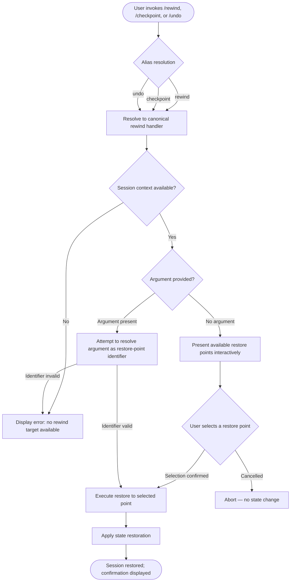

# `/rewind`

> Analysis basis: CC v2.1.144 bundle.js (AST extraction + Claude interpretation)
> Minimum version: v2.1.144

---

## Overview

The `/rewind` command allows the user to restore the session — code state, conversation history, or both — to a previously established point. It is also accessible via the aliases `/checkpoint` and `/undo`. The command is registered as a local, interactive-only command within module `DTq`.

---

## Registration

| Field | Value |
|---|---|
| type | `local` |
| name | `rewind` |
| description | `Restore the code and/or conversation to a previous point` |
| argumentHint | *(empty string — no argument expected)* |
| supportsNonInteractive | `false` |
| aliases | `checkpoint`, `undo` |
| module_id | `DTq` |

Analysis basis: CC v2.1.144 bundle.js:+11595637

---

## Input Branching

The AST traversal for module `DTq` returned an empty call graph and no resolvable entry functions at depth ≤ 2. The branching logic described below is inferred from the registration metadata and general CC command architecture. Deeper traversal is required to confirm implementation details.

<!-- TODO: not found in depth-2 traversal; needs --depth 4 -->



> **Note:** Branches D, F, H, G, and I are inferred from registration metadata (`supportsNonInteractive: false`, empty `argumentHint`) and general CC slash-command conventions. They are **not confirmed** by the depth-2 AST extraction.
> <!-- TODO: not found in depth-2 traversal; needs --depth 4 -->

---

## Behavioral Spec

### Alias Resolution

The command is reachable under three names: `rewind` (canonical), `checkpoint`, and `undo`. All three names are resolved to the same underlying handler registered in module `DTq`.

```
function resolveRewindAlias(invokedName):
    canonicalAliases = ["rewind", "checkpoint", "undo"]
    if invokedName in canonicalAliases:
        return loadCommandHandler(moduleId = "DTq")
    else:
        return null  # command not matched
```

Analysis basis: CC v2.1.144 bundle.js:+11595637

---

### Interactive-Only Enforcement

The registration field `supportsNonInteractive` is `false`, meaning the command must be invoked inside an active interactive terminal session. Invocation from a non-interactive context (e.g., via `--print` or piped input) is expected to be rejected before the handler executes.

```
function enforceInteractiveContext(sessionContext):
    if sessionContext.isInteractive == false:
        raise CommandNotAllowedError(
            reason = "rewind does not support non-interactive mode"
        )
    return proceed
```

Analysis basis: CC v2.1.144 bundle.js:+11595637

---

### Restore-Point Selection

Because `argumentHint` is an empty string, the command does not advertise or require a positional argument. In the absence of a provided argument, the command is expected to present the user with a list of available restore points for interactive selection.

```
function selectRestorePoint(argument, availableCheckpoints):
    if argument is empty or null:
        displayInteractivePicker(availableCheckpoints)
        selectedPoint = awaitUserSelection()
    else:
        selectedPoint = resolveByIdentifier(argument, availableCheckpoints)
        if selectedPoint is null:
            displayError("No restore point matching: " + argument)
            return null
    return selectedPoint
```

<!-- TODO: not found in depth-2 traversal; needs --depth 4 -->

---

### State Restoration

Once a restore point is confirmed, the handler is expected to apply changes to session state, which may include rolling back the conversation history, reverting file-system changes tracked by the session, or both. The exact scope of restoration (conversation only, code only, or both) is implied by the command description ("code and/or conversation") but the selection mechanism is not confirmed by the available AST data.

```
function applyRestore(restorePoint, scope):
    // scope may be: "conversation", "code", "both"
    if scope includes "conversation":
        rollbackConversationHistory(toPoint = restorePoint)
    if scope includes "code":
        rollbackFileSystemState(toPoint = restorePoint)
    emitConfirmation(restorePoint)
```

<!-- TODO: not found in depth-2 traversal; needs --depth 4 -->

---

## State & Side Effects

| Item | Detail |
|---|---|
| Telemetry | None detected in depth-2 AST extraction <!-- TODO: not found in depth-2 traversal; needs --depth 4 --> |
| Hook registration | Not found in depth-2 traversal <!-- TODO: not found in depth-2 traversal; needs --depth 4 --> |
| appState changes | Expected: conversation history rollback and/or file-system state rollback (inferred from description); not confirmed by AST <!-- TODO: not found in depth-2 traversal; needs --depth 4 --> |
| Sound | Not found in depth-2 traversal <!-- TODO: not found in depth-2 traversal; needs --depth 4 --> |
| Non-interactive support | Explicitly disabled (`supportsNonInteractive: false`) |
| Aliases registered | `checkpoint`, `undo` |

Analysis basis: CC v2.1.144 bundle.js:+11595637

---

## Version History

| Version | Change |
|---|---|
| v2.1.144 | Initial analysis; command registered in module `DTq` with aliases `checkpoint` and `undo`; depth-2 AST traversal yielded no call graph or literals |

---

## Common Mistakes

1. **Invoking `/rewind` in non-interactive mode** — The command explicitly sets `supportsNonInteractive: false`. Attempting to invoke it via scripted or piped input will fail before any restore logic executes.
2. **Expecting an argument to be required** — The empty `argumentHint` indicates no positional argument is mandated. Omitting an argument should trigger interactive restore-point selection, not an error.
3. **Assuming `/undo` has different behavior** — `/undo` and `/checkpoint` are registered aliases for the identical handler in module `DTq`; they are not separate commands with distinct behaviors.
4. **Assuming unconditional file-system rollback** — The description states "code *and/or* conversation," implying scope selection may exist. Do not assume that invoking `/rewind` always restores both dimensions of state.
5. **Relying on telemetry to confirm execution** — No telemetry events were found at depth-2 traversal. Monitoring telemetry pipelines will not provide observable confirmation that `/rewind` executed successfully in this version.

---

## Appendix — Identifier Mapping

> For bundle debugging only. Identifiers change across versions.

| Identifier | Role |
|---|---|
| *(none)* | No obfuscated identifiers were returned by the depth-2 AST extraction for module `DTq` <!-- TODO: not found in depth-2 traversal; needs --depth 4 --> |