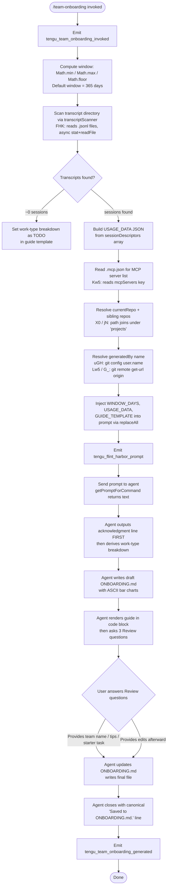

# `/team-onboarding`

> Analysis basis: CC v2.1.157 bundle.js (AST extraction + Claude interpretation)
> Minimum version: v2.1.157

---

## Overview

`/team-onboarding` is a `prompt`-type slash command that analyzes the invoking user's local Claude Code session transcripts over a configurable window (default 365 days) and co-authors a structured `ONBOARDING.md` guide suitable for teammates new to Claude Code. The command operates as a two-turn collaborative flow: it immediately generates a concrete draft guide from real usage data, then asks three targeted review questions before finalizing and writing the file.

---

## Registration

| Field | Value |
|---|---|
| type | `prompt` |
| name | `team-onboarding` |
| description | `Help teammates ramp on Claude Code with a guide from your usage` |
| isHidden | `false` |
| handler_method | `getPromptForCommand` |
| handler_method_start (byte) | `12708598` |
| handler_method_end (byte) | `12709308` |
| loc_byte | `12708260` |
| loc_byte_end | `12709309` |
| loc_line | `8940` |
| prompt_body.length | `4539` characters |
| prompt_body.trace | `identifier→$ (local→1 ext vars)` |
| arbor_handler.name | `getPromptForCommand` |
| arbor_handler.kind | `Method` |
| arbor_handler.fqn | `claude-2.1.157::getPromptForCommand` |
| arbor_handler.resolution_path | `direct` |
| arbor_handler.n_hits | `2` |
| `handler_method_start` | `12708598` |
| `handler_method_end` | `12709308` |

Analysis basis: CC v2.1.157 bundle.js:+12708260

---

## Input Branching

The handler follows 4+ distinct paths depending on transcript availability, session count, and git context — a Mermaid flowchart is used.



Analysis basis: CC v2.1.157 bundle.js:+12708598 – +12709308

---

## Behavioral Spec

### 1. Handler Entry and Invocation Telemetry

The primary handler is `getPromptForCommand` (Arbor-resolved as `claude-2.1.157::getPromptForCommand`, `direct` resolution, 2 hits). On entry, the handler immediately emits the `tengu_team_onboarding_invoked` telemetry event and calls the session-scanning infrastructure (`G6` → transcript scanner chain).

```
function getPromptForCommand(context):
    emit("tengu_team_onboarding_invoked")
    windowDays = clampWindow(365)          // Math.min / Math.max / Math.floor
    usageData  = scanTranscripts(windowDays)
    mcpConfig  = readMcpJson()
    repoInfo   = resolveRepos()
    authorName = resolveGitUser()
    prompt     = buildPrompt(windowDays, usageData, mcpConfig, repoInfo, authorName)
    emit("tengu_flint_harbor_prompt")
    return prompt
```

Analysis basis: CC v2.1.157 bundle.js:+12708598, +12708801, +12708858, +12708635

---

### 2. Window Calculation

The lookback window is computed using `Math.min`, `Math.max`, and `Math.floor` on a base value of **365 days**.

```
function clampWindow(base):
    raw = Math.floor(base)
    return Math.max(0, Math.min(raw, MAX_WINDOW))
```

Constant: base window = 365 days (bundle.js:+12708847).

Analysis basis: CC v2.1.157 bundle.js:+12708801, +12708810, +12708819, +12708847

---

### 3. Transcript Scanning (`transcriptScanner` / `FHK`)

The scanner reads the Claude Code transcript directory asynchronously:

1. Calls `readdir` on the transcripts folder.
2. Filters entries to `.jsonl` extension only (literal `.jsonl` at bundle.js:+12697211).
3. For each `.jsonl` file: calls `stat` to confirm it is a regular file, then `readFile`.
4. Splits each file's content into lines; parses each line for session data.
5. Applies regex patterns (`eD5.exec`, `Hw5.exec`, `_w5.exec`) to extract:
   - Session title
   - `prNumbers` (linked code reviews)
   - First user message
   - Tool and MCP usage counts
6. Identifies MCP tool calls by matching the prefix `"name":"mcp__` (literal at bundle.js:+12697790).
7. Parses `"content":[` blocks (literal at bundle.js:+12698140) to extract message content.
8. Limits per-session first-message extraction to the first **3 lines** (literal `3` at bundle.js:+12698243) and first **10 characters** per line (literal `10` at bundle.js:+12697607).
9. Applies a **24-hour × 60-minute × 1000-ms** timestamp cutoff (literals at bundle.js:+12697096, +12697099, +12697105) to restrict sessions to the specified window.

```
async function scanTranscripts(windowDays):
    cutoffMs = Date.now() - windowDays * 24 * 60 * 1000
    files = await fA6.readdir(transcriptDir)
    jsonlFiles = files.filter(f => path.extname(f) === ".jsonl")
    sessions = []
    for file in jsonlFiles:
        stat = await fA6.stat(path.join(transcriptDir, file))
        if not stat.isFile(): continue
        raw = await fA6.readFile(path.join(transcriptDir, file))
        lines = raw.split("\n")
        session = parseSessionLines(lines, cutoffMs)
        if session: sessions.push(session)
    return buildUsageData(sessions)
```

Analysis basis: CC v2.1.157 bundle.js:+12697083, +12697124, +12697194, +12697211, +12697230, +12697265, +12697295, +12697311, +12697467, +12697581, +12697607, +12697668, +12697931, +12697987, +12698011, +12698162, +12698247

---

### 4. MCP Configuration Reader (`Kw5`)

Reads the project-local `.mcp.json` file (literal at bundle.js:+12699322) from the workspace root using `QHK.readFile` and `yy8.join`. Parses the JSON (`p6` → `JSON.parse`) and extracts the `mcpServers` key (literal at bundle.js:+12699378). Handles missing files gracefully via `P8` error-handling wrapper. Each server entry exposes `name` and, where present, `urlOrigin`.

```
async function readMcpJson(workspaceRoot):
    filePath = path.join(workspaceRoot, ".mcp.json")
    try:
        raw = await QHK.readFile(filePath)
        parsed = JSON.parse(raw)
        return parsed.mcpServers ?? {}
    catch (err):
        if err indicates missing file: return {}
        throw err
```

Analysis basis: CC v2.1.157 bundle.js:+12699298, +12699311, +12699322, +12699345, +12699378, +12699474, +12699480

---

### 5. Repository Resolution (`X0` / `jN` / `hz`)

Determines the current and sibling repositories:

1. `jN` joins the `projects` subdirectory path (literal `"projects"` at bundle.js:+1002360) using `PpH.join` and `F8`.
2. `X0` resolves the current project path using `PpH.join`.
3. `hz` normalizes relative path segments via `H.replace` and `_.slice`, using a base of **36** characters (literal at bundle.js:+1002207) for hashing.
4. `e_4` computes absolute offset via `Math.abs` with `MpH`.

```
function resolveRepos(workspaceRoot):
    projectsDir = path.join(configDir, "projects")
    currentRepoPath = path.join(projectsDir, encodeProjectPath(workspaceRoot))
    siblings = discoverSiblingRepos(workspaceRoot)
    return { currentRepo: currentRepoPath, siblings }
```

Analysis basis: CC v2.1.157 bundle.js:+1002346, +1002355, +1002360, +1002394, +1002403, +1002408, +1002181, +1002190, +1002207

---

### 6. Git User Resolution (`uGH` / `G_`)

Resolves the `generatedBy` name for the guide header:

1. Runs `git config user.name` (literals at bundle.js:+12699945, +12699952, +12699961) via `G_` → `RGH` (subprocess spawner).
2. If that fails or is empty, runs `git remote get-url origin` (literals at bundle.js:+12700017, +12700026, +12700036) to derive a fallback name.
3. `uGH` trims whitespace (`H.trim`), applies `_.match` regex, handles `localhost` origins (literal at bundle.js:+1070638), and strips `git/` prefixes (literal at bundle.js:+1066519).
4. Extracts `yy8.basename` of the resolved path as the display name (bundle.js:+12700133).
5. If neither source yields a name, `generatedBy` is omitted from the guide.

```
async function resolveGitUser(workspaceRoot):
    nameResult = await runGit(["config", "user.name"], workspaceRoot)
    if nameResult.trim():
        return nameResult.trim()
    remoteUrl = await runGit(["remote", "get-url", "origin"], workspaceRoot)
    return extractNameFromRemote(remoteUrl)   // basename, strip git/ prefix

function extractNameFromRemote(url):
    if url.includes("localhost"): return null
    normalized = url.replace(...).slice(...)
    return path.basename(normalized)
```

Analysis basis: CC v2.1.157 bundle.js:+12699942, +12699945, +12699952, +12699961, +12700017, +12700026, +12700036, +12700087, +12700125, +12700133, +1066256, +1066289, +1066498, +1066506, +1066519, +1066534, +1066547, +1066602, +1070638

---

### 7. Prompt Assembly and Template Injection

Three template placeholders are substituted into the prompt body via `_.replaceAll`:

| Placeholder | Substituted Value |
|---|---|
| `{{WINDOW_DAYS}}` | Computed window in days (literal at bundle.js:+12709058) |
| `{{USAGE_DATA}}` | JSON-serialized session data from transcript scan (literal at bundle.js:+12709133) |
| `{{GUIDE_TEMPLATE}}` | Guide skeleton template string (literal at bundle.js:+12709098) |

The final prompt string is returned as type `"text"` (literal at bundle.js:+12709292) via `String()` coercion (bundle.js:+12709076).

```
function buildPrompt(windowDays, usageData, guideTemplate):
    base = PROMPT_TEMPLATE_BODY          // 4539 chars
    p1 = base.replaceAll("{{WINDOW_DAYS}}", String(windowDays))
    p2 = p1.replaceAll("{{USAGE_DATA}}", JSON.stringify(usageData))
    p3 = p2.replaceAll("{{GUIDE_TEMPLATE}}", guideTemplate)
    return { type: "text", content: p3 }
```

Analysis basis: CC v2.1.157 bundle.js:+12709045, +12709058, +12709076, +12709098, +12709133, +12709154, +12709292

---

### 8. Agent Prompt Instructions (Behavioral Contract)

The injected prompt (4539 chars; `identifier→$ (local→1 ext vars)`) imposes a strict ordering and behavioral contract on the agent:

**Step 1 — Immediate acknowledgment line.** Before any reasoning, classification, or tool calls, the agent must output the exact acknowledgment blockquote referencing `{{WINDOW_DAYS}}`. The prompt explicitly warns against delaying this output.

**Step 2 — Work-type breakdown.** The agent classifies each entry in the `sessionDescriptors` array into one of seven canonical task types (displayed in title case in the rendered guide):

| Internal key | Display label |
|---|---|
| `build_feature` | Build Feature |
| `debug_fix` | Debug Fix |
| `improve_quality` | Improve Quality |
| `analyze_data` | Analyze Data |
| `plan_design` | Plan Design |
| `prototype` | Prototype |
| `write_docs` | Write Docs |

Classification priority: first user message → title + `prNumbers` → tool/MCP counts (weak signal). Top 3–5 categories with rough percentages are selected. If sessions ≈ 0, the breakdown section is left as a TODO.

**Step 3 — Context gathering.** The agent locates repos (`currentRepo` + siblings), infers MCP server descriptions from `name` and `urlOrigin`, and leaves Team Tips / Get Started as TODOs pending review answers.

**Step 4 — Guide generation.** The agent writes `ONBOARDING.md` following the `{{GUIDE_TEMPLATE}}` skeleton. Requirements:
- Fill real numbers from usage data (no placeholder values).
- Use `generatedBy` for the author name; omit entirely if absent.
- ASCII bar charts using `█` (filled) and `░` (empty), 20 characters wide.
- Preserve the HTML comment instruction at the bottom of the template verbatim.

**Step 5 — Review turn.** After rendering the guide in a fenced code block, the agent appends a `---` separator and a `**Review**` heading with exactly three numbered questions: (1) team name confirmation, (2) starter task link, (3) team tips not already in `CLAUDE.md`. After user answers, the agent updates `ONBOARDING.md` and closes the conversation with the canonical close line referencing `ONBOARDING.md`. All subsequent edits from the user are applied to the file.

Analysis basis: CC v2.1.157 bundle.js:+12708598 – +12709308 (prompt body, 4539 chars)

---

### 9. Post-Generation Telemetry

After the prompt is constructed and dispatched, `tengu_team_onboarding_generated` is emitted via `RH6` → `BZ` / `G6` chain (bundle.js:+12709177). The `tengu_flint_harbor_share` event is also emitted via `RH6` (bundle.js:+9590796), indicating integration with the Flint Harbor sharing subsystem.

Analysis basis: CC v2.1.157 bundle.js:+12709154, +12709177, +9590793, +9590796

---

## State & Side Effects

| Item | Detail |
|---|---|
| Telemetry: invocation | `tengu_team_onboarding_invoked` (bundle.js:+12708858) |
| Telemetry: prompt sent | `tengu_flint_harbor_prompt` (bundle.js:+12708635) |
| Telemetry: guide generated | `tengu_team_onboarding_generated` (bundle.js:+12709177) |
| Telemetry: share event | `tengu_flint_harbor_share` (bundle.js:+9590796) |
| Telemetry: config parse error | `tengu_config_parse_error` (bundle.js:+3210553) — fired if transcript/config JSON is malformed |
| Telemetry: config lock contention | `tengu_config_lock_contention` (bundle.js:+3207978) |
| Telemetry: config stale write | `tengu_config_stale_write` (bundle.js:+3208114) |
| Telemetry: config auth loss prevented | `tengu_config_auth_loss_prevented` (bundle.js:+3208457) |
| Telemetry: feature flag ok/bad | `tengu_feature_ok` / `tengu_feature_bad` (bundle.js:+966033, +966091) |
| Telemetry: background session | `tengu_bg_dispatch_sigkill_escalate`, `tengu_bg_dispatch_low_mem`, `tengu_bg_spare_enable`, `tengu_bg_spare_claim`, `tengu_bg_spare_claim_fail`, `tengu_bg_spare_spawn`, `tengu_bg_low_mem_mb` — background daemon infrastructure events, not directly command-specific |
| Telemetry: daemon control | `tengu_daemon_control` (bundle.js:+15502788) |
| File read | `.jsonl` transcript files under the Claude Code transcript directory |
| File read | `.mcp.json` in workspace root |
| File written (agent action) | `ONBOARDING.md` in the current working directory — written in Step 4 and updated after the review turn |
| Git subprocess | `git config user.name` and `git remote get-url origin` |
| Hook registration | `K9` → `_OA.register` (bundle.js:+58858) — file-watch hook registered via `b17` |
| File watch | `z_8.watchFile` / `z_8.unwatchFile` on config file (bundle.js:+3206307, +3206640) — config change watch |
| Config lock | `AY_` acquires and releases a write lock on `~/.claude.json`; warns on contention (message: `"Lock acquisition took longer than expected..."` at bundle.js:+3207889) |
| Config auth guard | Refuses to write config if re-read is missing auth that cache has (bundle.js:+3208305, +3208457) |
| Backup | Config backup files written with `.backup.` prefix (literal at bundle.js:+3208775); maximum **5** backups retained (literal at bundle.js:+3208908) |
| Sound | None detected |
| appState changes | None directly — command returns a prompt string; no direct appState mutation observed in depth-2 traversal |

---

## Version History

| Version | Change |
|---|---|
| v2.1.157 | Initial analysis |

---

## Common Mistakes

1. **Expecting immediate output of the guide template**: The agent is instructed to emit the acknowledgment blockquote as its very first visible text — before any reasoning. If the agent appears "stuck" at startup, the most likely cause is that a tool call or extended thinking was triggered before this required line.

2. **Empty or near-empty usage data**: If no `.jsonl` transcript files exist in the expected directory (e.g., on a fresh install or a different machine), `USAGE_DATA` will be empty. The work-type breakdown will be rendered as a TODO, and the guide will lack real usage statistics. Run `/team-onboarding` on the machine where Claude Code has been actively used.

3. **Missing `generatedBy` name**: If both `git config user.name` and `git remote get-url origin` fail or return empty/localhost values, the author name is omitted from the guide. This is intentional behavior, not a bug.

4. **Skipping the review turn**: The command is designed as a two-turn flow. Immediately accepting the first draft without answering the three Review questions will leave the Team Tips and Get Started sections as TODOs in `ONBOARDING.md`.

5. **Incorrect `ONBOARDING.md` location**: The file is written to the current working directory at the time of invocation. Running `/team-onboarding` from an unexpected directory will place the file there.

6. **Modifying the guide template expectations**: The agent uses ASCII bar charts with exactly `█` and `░` characters at 20 chars wide. Requesting a different chart format or width will require explicit instruction in the review turn.

7. **`{{GUIDE_TEMPLATE}}` not populated**: If the guide template variable is not resolved at bundle load time (e.g., a partial install), the agent will receive the literal `{{GUIDE_TEMPLATE}}` string in the prompt and produce a malformed guide.

---

## Appendix — Identifier Mapping

> For bundle debugging only. Identifiers change across versions.

| Identifier | Role |
|---|---|
| `__handler_team-onboarding` | Synthetic BFS entry node; represents the `getPromptForCommand` ObjectMethod body |
| `G6` | Session/agent orchestrator — dispatches transcript scanning and prompt construction |
| `az6` | Orchestrator sub-routine A (exact role unclear at depth 2) |
| `sz6` | Orchestrator sub-routine B (exact role unclear at depth 2) |
| `Ex` | Prompt text encoder / character-set handler |
| `CH` | String coercion utility (calls `String`) |
| `Zx` | Low-level stream or buffer abstraction |
| `vR` | Transport or request wrapper (calls `O97`, `u3`, `TL6`) |
| `e88` | Deduplication / cache-miss handler; checks `mz_.has`, calls `uz_` |
| `uz_` | Session creation / UUID assignment (`Cz_.randomUUID`) |
| `FEH` | Event emitter helper (calls `yy`) |
| `wU` | Random-bytes utility for session IDs (calls `hFq.randomBytes`, `S6`) |
| `RH` | JSON serializer wrapper (`JSON.stringify`) |
| `q17` | Queuing or sequencing helper |
| `Fz_` | Feature-flag / experiment resolver (calls `Nyq`, `B_`, `jFq`, `B$H`) |
| `Nyq` | Config key resolver (`_QH`) |
| `B_` | Config accessor (`Cp`) |
| `jFq` | Experiment filter |
| `B$H` | Permission set membership check (`psK.has`) |
| `S6` | Transcript file reader / config reader (calls `szH`, `Date.now`, `b17`) |
| `g6` | Filesystem error classifier |
| `sz_` | Path utility |
| `szH` | Config file loader: reads, parses, validates JSON config; throws `"Config accessed before allowed."` |
| `q` | Synchronous filesystem module alias |
| `p6` | JSON parser wrapper (`JSON.parse`) |
| `gb` | Path prefix stripper (`H.startsWith`, `H.slice`) |
| `_` | Async filesystem module alias (readdirStringSync, statSync) |
| `j8` | Logger / debug emitter |
| `yFq` | Backup directory enumerator (readdirStringSync, MD.basename, MD.join) |
| `N` | Log formatter / output utility |
| `d` | App state / context accessor |
| `qY_` | Backup path resolver (`MD.join`, `F8`) |
| `w` | Background session process manager (spawn, kill, memory check) |
| `b17` | Config file watcher (watchFile / unwatchFile, registers hook via `K9`) |
| `Vr` | Watch callback handler |
| `K9` | Hook registration wrapper (`_OA.register`) |
| `z8` | Config write / save orchestrator (calls `AY_`, `szH`, `AY6`) |
| `AY_` | Atomic config writer with lock (mkdirSync, copyFileSync, unlinkSync, rename) |
| `L` | Async filesystem module alias (mkdirSync, statSync, copyFileSync, etc.) |
| `f` | Connection/resource handle (close, finally) |
| `dOq` | Config object merger (`Object.assign`, calls `qK_`) |
| `qK_` | Config schema validator (`QOq`) |
| `AY6` | Auth-presence guard for config writes |
| `A` | Process or connection map (get, set, values, add, delete) |
| `V` | Path string being checked (`V.startsWith`) |
| `P` | MCP server connection manager (Promise.all, `Lx8`, `nh`, `$m`) |
| `Lx8` | MCP transport factory |
| `SH` | MCP connection handler (calls `F_`, `CH`, `L1`, `X_4`, `YpH.push`) |
| `F_` | Error normalizer (`Error`, `String`) |
| `E` | Slice buffer |
| `yL6` | Atomic file writer with symlink safety (randomBytes, open, write, fsync, rename) |
| `O` | Stat result object (`O.isSymbolicLink`, `O.isFile`) |
| `P8` | Error code inspector for ENOENT/EACCES/EPERM/EROFS |
| `H` | Generic string / event-emitter variable (context-dependent) |
| `pQH` | Config state classifier (produces: `"unknown"`, `"local"`, `"migrated"`, `"native"`, `"installed"`, `"disabled"`, `"enabled"`, `"no_permissions"`, `"global"`, `"not_configured"`) |
| `IFq` | Object.entries iterator over config state map |
| `UQH` | Timestamp-based config state accessor (`Date.now`) |
| `_Y_` | Global config fallback writer (`yL6`, `RH`, `D0`) |
| `Lw5` | Top-level usage-data assembler (calls `O_`, `X0`, `FHK`, `Kw5`, `qw5`, `G_`, `uGH`) |
| `O_` | Platform/env accessor (`AN`) |
| `AN` | Platform constant |
| `X0` | Current project path resolver (`PpH.join`, `jN`, `hz`) |
| `jN` | Projects directory resolver (`PpH.join`, `F8`) |
| `hz` | Path normalizer / relative-path encoder (`H.replace`, `_.slice`, `e_4`) |
| `e_4` | Absolute-offset hash helper (`Math.abs`, `MpH`) |
| `FHK` | Transcript scanner (readdir, stat, readFile, regex parse, `.jsonl` filter) |
| `oq` | File I/O error wrapper (`j8`) |
| `K` | Array map + pad utility |
| `$` | Transcript line splitter; also references `Ls1` (session transcript reader) |
| `Ls1` | Individual transcript session reader (`ii`, `Date.now`, `s9`, `uI6`, `RH`) |
| `z` | Subprocess / daemon control object (`hH`, `bH`, `hy`, `Fm`) |
| `hH` | Daemon stop handler |
| `bH` | Daemon stop-failed handler |
| `hy` | Daemon control event emitter (`Zx`, `FEH`, `xz_`) |
| `Fm` | Process race / graceful-exit handler (`Promise.race`, `process.exit`) |
| `D` | Active subprocess dispatcher (calls `G6`, `uy8`, `YfA`, `SH`) |
| `uy8` | Memory guard — checks platform (`"macos"`) before dispatching |
| `YfA` | Background session spawner (`Bun.spawn`, `CI.mkdir`, `CI.open`, randomBytes) |
| `kz` | Logging sink |
| `Kw5` | `.mcp.json` reader (`QHK.readFile`, `yy8.join`, `p6`, `mcpServers` key) |
| `qw5` | Additional workspace metadata collector |
| `G_` | Git subprocess runner (calls `RGH`; runs `git config`, `git remote get-url`) |
| `RGH` | Generic subprocess execution engine (spawn, timeout, kill, stdio pipes) |
| `wkA` | Subprocess argument builder (win32 `.exe`/`cmd` handling) |
| `vr8` | Stdio stream reader for subprocess stdout |
| `Nr8` | Stdio stream reader for subprocess stderr |
| `Ir8` | Subprocess output aggregator (`Fq4`) |
| `ZNA` | Timeout validator (`Number.isFinite`, `TypeError`) |
| `SL6` | Subprocess result parser / error mapper (`Aq4`, `Error`, `Boolean`) |
| `Vr8` | Reflect-based proxy for subprocess result (`Reflect.apply`, `Reflect.defineProperty`) |
| `sNA` | Process exit-event listener (`H.on`, `"exit"`) |
| `TNA` | Subprocess timeout enforcer (`setTimeout`, `clearTimeout`, `Promise.race`) |
| `ENA` | Subprocess kill handler (`ki`, `H.kill`, `q.finally`) |
| `WNA` | Process exit callback binder |
| `GNA` | SIGKILL escalation handler (`H.kill`) |
| `oNA` | Async stdio drain (`Er8`, `Promise.all`, `Zr8`) |
| `xL6` | Output stream combiner (`qr8`) |
| `iNA` | Pipe setup for subprocess stdio (`Cq4`, `JF6`, `A.pipe`) |
| `rNA` | Subprocess child-process tracker (`cNA.default`, `A.add`) |
| `kNA` | Stdout binding helper (`wr8.bind`) |
| `lq4` | String coercion for subprocess result |
| `uGH` | Git URL / username extractor (trim, match, `"git/"` strip, `"localhost"` check) |
| `T94` | Git URL hostname extractor (`nq`) |
| `nq` | String index/slice utility (`H.indexOf`, `H.slice`) |
| `RH6` | Post-generation dispatcher — emits `tengu_team_onboarding_generated` and `tengu_flint_harbor_share`; calls `L1`, `BZ`, `G6` |
| `L1` | Telemetry event builder (`fVA`) |
| `fVA` | Telemetry formatter (`CH`) |
| `BZ` | Sharing / distribution helper (`Bq`) |

---

*Note: index built via Arbor fallback; some signals (telemetry, literals) may be missing — see arbor-fallback.js.*