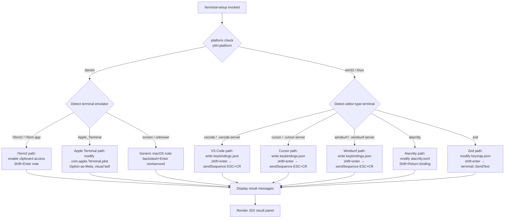

# `/terminal-setup`

> Analysis basis: CC v2.1.157 bundle.js (AST extraction + Claude interpretation)
> Minimum version: v2.1.157

---

## Overview

`/terminal-setup` installs the Shift+Enter key binding (and related terminal settings) so that pressing Shift+Enter in supported terminals sends a newline rather than submitting the current input. It detects the current platform and terminal emulator at runtime and applies the appropriate configuration changes for each supported terminal (Apple Terminal, iTerm2, VS Code, Cursor, Windsurf, Alacritty, Zed, and others).

---

## Registration

| Field | Value |
|---|---|
| type | `local-jsx` |
| name | `terminal-setup` |
| description | `Install Shift+Enter key binding for newlines` |
| loc_byte | `12086241` |
| loc_byte_end | `12086873` |
| loc_line | `8011` |
| module_id | `UH9` |
| load_inline | `true` |
| arbor_handler.name | `zJ7` |
| arbor_handler.fqn | `claude-2.1.157::zJ7` |
| arbor_handler.kind | `AsyncFunction` |
| arbor_handler.resolution_path | `module_id` |
| arbor_handler.n_hits | `1` |

Analysis basis: CC v2.1.157 bundle.js:+12086241

---

## Input Branching

The command has 7+ distinct terminal-type branches, requiring a Mermaid flowchart.



Analysis basis: CC v2.1.157 bundle.js:+3961290 (platform check), +3959276 (eVH platform), +3959293–+3959450 (terminal literals)

---

## Behavioral Spec

### Main Handler — `asyncHandlerZJ7`

The Arbor-resolved handler is `zJ7` (AsyncFunction, resolved via `module_id` → `UH9`).

```
async function asyncHandlerZJ7(context):
    platform = getPlatform()                  // y6H.platform
    terminalEnv = detectTerminalEnv()         // pH9 / eVH
    editor = detectEditorContext()            // r98: checks for .vscode-server, .cursor-server, .windsurf-server
    results = []

    if platform == "darwin":
        if terminalEnv contains "iTerm.app" or "iTerm2":
            result = runITerm2Setup()         // pH9 path
        elif terminalEnv contains "Apple_Terminal":
            result = runAppleTerminalSetup()  // o98 → DJ7
        elif terminalEnv is "screen" or unknown:
            result = showGenericNote()
        results.push(result)

    if editor matches "vscode" / "cursor" / "windsurf" (server or direct):
        result = runVSCodeFamilySetup(editorName)  // vX_, VX_, n98
        results.push(result)

    if terminalEnv matches "alacritty":
        result = runAlacrittySetup()          // wJ7
        results.push(result)

    if terminalEnv matches "zed":
        result = runZedSetup()                // jJ7
        results.push(result)

    displayResults(results)                   // $A, j6.dim, D.join
    return JSX panel
```

Analysis basis: CC v2.1.157 bundle.js:+3961290, +3961487, +3961618, +3961838, +3962761

---

### Sub-feature: Platform Detection — `platformDetector` (`eVH`)

```
function platformDetector():
    return y6H.platform()    // node os.platform()
```

Analysis basis: CC v2.1.157 bundle.js:+3959276

---

### Sub-feature: Terminal Environment Detection — `terminalEnvDetector` (`pH9`)

```
function terminalEnvDetector():
    dimOutput = applyDimStyle(...)
    rawEnv = readTerminalEnvVars()     // v8
    envStr = rawEnv.trim()
    formatted = applyColorOutput($A)  // foreground / rgb / ansi256 color logic
    logOutput(SH)
    return envStr
```

Also checks for remote-server heuristics by inspecting path segments:
- `".vscode-server"` → VS Code remote
- `".cursor-server"` → Cursor remote
- `".windsurf-server"` → Windsurf remote

Analysis basis: CC v2.1.157 bundle.js:+3960282 (pH9), +3958864, +3958894, +3958924

---

### Sub-feature: Apple Terminal Setup — `appleTerminalSetup` (`DJ7`)

```
async function appleTerminalSetup():
    backup = await backupTerminalPrefs()   // hH9
    if backup.status != "ok":
        throw Error("Failed to create backup of Terminal.app preferences, bailing out")
        // literal at +3969161

    defaultProfile = await runDefaults("read", "Default Window Settings")
    // literal "read" at +3969271, "Default Window Settings" at +3969299
    if not defaultProfile:
        throw Error("Failed to read default Terminal.app profile")
        // literal at +3969359

    startupProfile = await runDefaults("read", "Startup Window Settings")
    // literal "Startup Window Settings" at +3969476
    if not startupProfile:
        throw Error("Failed to read startup Terminal.app profile")
        // literal at +3969536

    modifiedProfiles = []

    for each profile in [defaultProfile, startupProfile, ...allProfiles]:
        result = configureSingleProfile(profile)   // bH9, xH9
        modifiedProfiles.push(result)

    if no profile succeeded:
        logError("Failed to enable Option as Meta key or disable audio bell for any Terminal.app profile")
        // literal at +3969746

    killall("cfprefsd")                      // literals "killall" +3969845, "cfprefsd" +3969856

    messages = []
    messages.push("- Enabled \"Use Option as Meta key\"")  // literal at +3969965
    messages.push("- Switched to visual bell")             // literal at +3970027
    messages.push("Shift+Return will now enter a newline.") // literal at +3970072
    or messages.push("Option+Enter will now enter a newline.") // literal at +3970121
    messages.push("You must restart Terminal.app for changes to take effect.") // literal at +3970206

    return formatSuccess("Configured Terminal.app settings:", messages)
    // literal at +3969898
```

Analysis basis: CC v2.1.157 bundle.js:+3959536 (o98→DJ7), +3969115 (DJ7 entry)

---

### Sub-feature: Backup Terminal Preferences — `backupTerminalPrefs` (`hH9`)

```
async function backupTerminalPrefs():
    prefsPath = path.join(os.homedir(),
        "Library", "Preferences", "com.apple.Terminal.plist")
    // literals at +3955373, +3955383, +3955397

    stat = await fs.stat(prefsPath)           // WX_.stat at +3955573

    // Export via `defaults export com.apple.Terminal <tmpPath>`
    // literals "defaults" +3955496, "export" +3955508, "com.apple.Terminal" +3955517
    exportResult = await runCommand(prefsPath) // fJ7 → z8

    if exportResult.status == "no_backup":    // literal at +3955780
        return { status: "no_backup" }

    return { status: "ok", backupPath: ... }
```

Analysis basis: CC v2.1.157 bundle.js:+3969143 (DJ7→hH9), +3955452

---

### Sub-feature: VS Code / Cursor / Windsurf Keybinding Setup — `vscodeFamilySetup` (`vX_`, `VX_`, `n98`)

All three editor variants follow the same pattern:

```
async function vscodeFamilySetup(editorName, configBasePath):
    // editorName one of: "VSCode" +3966366, "Cursor" +3959667, "Windsurf" +3959762
    keybindingsPath = path.join(configBasePath, "keybindings.json")
    // literal "keybindings.json" at +3967052

    existing = await fs.readFile(keybindingsPath, "utf-8") or "[]"
    // literal "[]" at +3967115, "utf-8" at +3967166

    parsed = parseJSON(existing)              // oL6
    alreadyHas = checkForBinding(parsed,      // hX_
        key="shift+enter",                    // literal at +3967501
        command="workbench.action.terminal.sendSequence")  // literal at +3967523

    if alreadyHas:
        return { status: "already_configured" }

    backup = await backupFile(keybindingsPath)  // pcH.randomBytes, nP.copyFile
    if backup fails:
        return { status: "backup_failed" }      // literal at +3965712

    newEntry = {
        key: "shift+enter",
        command: "workbench.action.terminal.sendSequence",
        args: { text: "\x1b\r" },             // ESC+CR literal at +3967575
        when: "terminalFocus"                  // literal at +3967590
    }
    updatedBindings = [...parsed, newEntry]

    writeResult = await fs.writeFile(keybindingsPath, JSON.stringify(updatedBindings))
    if writeResult fails:
        return { status: "write_failed" }      // literal at +3965491

    if GPU acceleration setting detected:
        log("terminal_setup_gpu_accel")        // literal at +3964897
    if remote SSH context:
        log("remote_ssh")                      // literal at +3964924

    return { status: "success", editor: editorName }
```

Analysis basis: CC v2.1.157 bundle.js:+3959570 (o98→vX_), +3967434 (vX_→iy), +3967501, +3967523, +3967575

---

### Sub-feature: Alacritty Setup — `alacrittySetup` (`wJ7`)

```
async function alacrittySetup():
    candidatePaths = buildAlacrittyConfigCandidates()
    // path.join(os.homedir(), ..., "alacritty.toml") literal at +3970850

    configPath = candidatePaths.find(p => fileExists(p))
    if not configPath:
        throw Error("No valid config path found for Alacritty")
        // literal at +3971213

    content = await fs.readFile(configPath)

    if content includes 'mods = "Shift"' and 'key = "Return"':
        // literals at +3971281, +3971311
        return { status: "already_configured",
                 message: "Alacritty Shift+Enter key binding already configured" }
                 // literal at +3971354

    backup = await backupFile(configPath)   // pcH.randomBytes, nP.copyFile
    if backup fails:
        throw Error("Error backing up existing Alacritty config. Bailing out.")
        // literal at +3971564

    // Append TOML key binding block to config
    updatedContent = appendAlacrittyBinding(content)
    await fs.writeFile(configPath, updatedContent)

    return {
        status: "success",
        messages: [
            "Installed Alacritty Shift+Enter key binding",   // literal at +3971938
            "You may need to restart Alacritty for changes to take effect"  // literal at +3972008
        ]
    }
```

Analysis basis: CC v2.1.157 bundle.js:+3959860 (o98→wJ7), +3970850, +3971213, +3971354

---

### Sub-feature: Zed Setup — `zedSetup` (`jJ7`)

```
async function zedSetup():
    keymapPath = path.join(os.homedir(), ..., "keymap.json")
    // literal "keymap.json" at +3972368

    await fs.mkdir(dirname(keymapPath), { recursive: true })

    existing = await fs.readFile(keymapPath) or "[]"
    parsed = parseJSON(existing)             // p6 → JSON.parse

    if Array.isArray(parsed):
        alreadyHas = parsed.some(entry => entry includes "shift-enter")
        // literal "shift-enter" at +3972534
        if alreadyHas:
            return { status: "already_configured",
                     message: "Zed Shift+Enter key binding already configured" }
                     // literal at +3972574

    backup = await backupFile(keymapPath)   // pcH.randomBytes, nP.copyFile
    if backup fails:
        throw Error("Error backing up existing Zed keymap. Bailing out.")
        // literal at +3972778

    newEntry = {
        context: "Terminal",                // literal at +3972987
        bindings: {
            "shift-enter": "terminal::SendText"  // literals at +3972534, +3973023
        }
    }
    updated = [...(Array.isArray(parsed) ? parsed : []), newEntry]
    await fs.writeFile(keymapPath, JSON.stringify(updated))
    // RH = JSON.stringify at +3973078

    return {
        status: "success",
        message: "Installed Zed Shift+Enter key binding"  // literal at +3973134
    }

    on error:
        throw Error("Failed to install Zed Shift+Enter key binding")
        // literal at +3973343
```

Analysis basis: CC v2.1.157 bundle.js:+3959891 (o98→jJ7), +3972368, +3972534, +3973023

---

### Sub-feature: iTerm2 Setup — `iterm2Setup` (`pH9` + `c98`)

```
async function iterm2Setup():
    // Check existing setting:
    // defaults read com.googlecode.iterm2 AllowClipboardAccess
    // literals "com.googlecode.iterm2" at +3960347, "AllowClipboardAccess" at +3960371
    currentVal = await runDefaults("read", "com.googlecode.iterm2", "AllowClipboardAccess")

    if currentVal == "1":
        return { message: "iTerm2 clipboard access already enabled" }
        // literal at +3960446

    writeResult = await runDefaults("write", "com.googlecode.iterm2",
                                   "AllowClipboardAccess", "-bool", "YES")
    // literals "write" +3960534, "-bool" +3960589

    if writeResult fails:
        return { message: "Couldn't update iTerm2 clipboard setting." }
        // literal at +3960640

    return {
        message: "Enabled \"Applications in terminal may access clipboard\" in iTerm2",
        // literal at +3960731
        note: "Restart iTerm2 for this to take effect. Undo: defaults write com.googlecode.iterm2 AllowClipboardAccess -bool false"
        // literal at +3960814
    }
```

Note about Shift+Enter in iTerm2:
- The command displays: `"Note: iTerm2, WezTerm, Ghostty, Kitty, Warp, and Windows Terminal support Shift+Enter natively."` (literal at +3962619)
- And for backslash workaround: `"Note: You can already use backslash (\\) + return to add newlines."` (literal at +3962284)

Analysis basis: CC v2.1.157 bundle.js:+3961487 (zJ7→pH9), +3960347, +3960371

---

### Sub-feature: Generic Command Executor — `runSubprocess` (`v8`)

```
async function runSubprocess(command, args):
    // Spawns child process with up to 10 concurrent limit
    // Max concurrency: 10 (literal at +1049606)
    // Timeout: 1000000 ms (literal at +1050128) if needed
    result = await spawnProcess(command, args)  // G_ → RGH, D, lq4, kz, N, j8, SH
    logOutput(h6)                               // lB6, O_
    return { stdout, stderr, exitCode }
```

Analysis basis: CC v2.1.157 bundle.js:+1049661 (v8→G_), +1049606, +1050128

---

### Sub-feature: Atomic Config Write — `atomicFileWriter` (`z8`)

Used for safely writing preference files:

```
async function atomicFileWriter(filePath, content):
    // Acquire config lock to avoid concurrent writes
    // Checks for auth-loss prevention: tengu_config_auth_loss_prevented
    tmpPath = filePath + ".tmp"
    writeFile(tmpPath, content)
    renameSync(tmpPath, filePath)          // atomic on POSIX
    // On stale write detected: tengu_config_stale_write
    // On lock contention: tengu_config_lock_contention
```

Analysis basis: CC v2.1.157 bundle.js:+3955064 (fJ7→z8), +3204911

---

## State & Side Effects

| Item | Detail |
|---|---|
| Telemetry | `tengu_config_auth_loss_prevented` (+3205246), `tengu_bg_spare_enable` (+15466284), `tengu_bg_low_mem_mb` (+12729087), `tengu_daemon_control` (+15502788), `tengu_bg_spare_spawn` (+15466644), `tengu_feature_sad` (+966168), `tengu_feature_ok` (+966033), `tengu_config_lock_contention` (+3207978), `tengu_config_stale_write` (+3208114), `tengu_config_parse_error` (+3210553) |
| File writes | `~/Library/Preferences/com.apple.Terminal.plist` (macOS Terminal), `keybindings.json` (VS Code family), `alacritty.toml` (Alacritty), `keymap.json` (Zed) |
| File backups | Atomic backup created before any config modification using `pcH.randomBytes` for temp suffix; backup stored in `backups/` subdirectory |
| System commands | `defaults export com.apple.Terminal`, `defaults read/write com.googlecode.iterm2`, `/usr/libexec/PlistBuddy -c` (+3968388), `killall cfprefsd` (+3969845, +3969856) |
| appState changes | Onboarding event `"onboarding_project_complete"` may fire (+3954711) depending on context |
| Hook registration | <!-- TODO: not found in depth-2 traversal; needs --depth 4 --> |
| Sound | None detected |
| Config lock | Uses global config lock (`szH`, `AY_`) with 60000 ms timeout (literal at +3208659) |
| Error logging | `Vi.logError` called on subprocess failure (+971771) |

---

## Version History

| Version | Change |
|---|---|
| v2.1.157 | Initial analysis |

---

## Common Mistakes

1. **Running on a non-macOS platform and expecting Apple Terminal changes**: The Apple Terminal plist path and `defaults` commands are macOS-only. On Linux and Windows only VS Code-family, Alacritty, or Zed paths will activate.
2. **Not restarting the terminal after running the command**: The command explicitly warns `"You must restart Terminal.app for changes to take effect."` (+3970206) and `"You may need to restart Alacritty for changes to take effect"` (+3972008).
3. **Running in a terminal that already natively supports Shift+Enter**: iTerm2, WezTerm, Ghostty, Kitty, Warp, and Windows Terminal support Shift+Enter natively (+3962619) — the command will note this rather than modifying anything.
4. **Expecting the command to work inside VS Code remote SSH without the correct server directory**: Detection of `".vscode-server"` / `".cursor-server"` / `".windsurf-server"` in `$HOME` path is used to identify remote contexts (+3958864, +3958894, +3958924); if the home directory structure differs, detection may fail.
5. **Interrupting the command mid-write**: The atomic backup step uses random-suffixed temp files; an interrupted write leaves a `.backup.*` file in the config directory (+3208775) which must be cleaned up manually.

---

## Appendix — Identifier Mapping

> For bundle debugging only. Identifiers change across versions.

| Identifier | Role |
|---|---|
| `zJ7` | Main async handler for `/terminal-setup` (Arbor-resolved, AsyncFunction) |
| `eVH` | Platform detection wrapper (calls `y6H.platform`) |
| `o98` | Terminal-type dispatch router |
| `DJ7` | Apple Terminal setup orchestrator |
| `hH9` | Apple Terminal preferences backup function |
| `mcH` | Builds path to `com.apple.Terminal.plist` |
| `v8` | Generic subprocess executor |
| `G_` | Subprocess spawn core |
| `h6` | Subprocess output logger |
| `fJ7` | Terminal preferences export via `defaults` |
| `z8` | Atomic config file writer |
| `SH` | Async task queue / sequential runner |
| `F_` | Error formatter |
| `CH` | String coercion helper |
| `L1` | Essential-traffic queue wrapper |
| `X_4` | Queue rotate (shift + push) |
| `bH9` | PlistBuddy profile configurator (default profile) |
| `xH9` | PlistBuddy profile configurator (startup profile) |
| `ucH` | PlistBuddy command runner |
| `$A` | Terminal output colorizer (supports rgb, ansi256, named colors) |
| `OYH` | ANSI color code mapper |
| `D` | Telemetry event dispatcher |
| `G6` | Telemetry event sender |
| `S6` | Telemetry session tracker |
| `Ls1` | Telemetry log entry builder |
| `uy8` | Background process telemetry (macOS) |
| `YfA` | Daemon spare process spawner |
| `d98` | Preference file restore/rollback handler |
| `MJ7` | Config state reporter |
| `vX_` | VS Code keybinding installer |
| `VX_` | Cursor keybinding installer |
| `n98` | Windsurf keybinding installer |
| `r98` | Remote server environment detector |
| `a98` | Editor config base path resolver |
| `oL6` | JSON keybinding parser/validator |
| `gb` | String prefix stripper |
| `oq` | Error code classifier |
| `iy` | Config file path URL resolver |
| `dP` | Hyperlink / terminal capability probe |
| `LIA` | JSON keybinding inserter |
| `Yo8` | JSON AST node inserter |
| `skA` | JSON document insert operation |
| `Do8` | JSON document modify operation |
| `pF6` | JSON document substring locator |
| `wo8` | JSON keybinding modifier |
| `hX_` | Array binding existence checker |
| `wJ7` | Alacritty config installer |
| `jJ7` | Zed keymap installer |
| `p6` | JSON.parse wrapper |
| `xcH` | Onboarding / workspace setup JSX renderer |
| `IO` | Workspace state initializer |
| `vH9` | Project path builder |
| `PX_` | CLAUDE.md path resolver |
| `g6` | File existence checker |
| `$F6` | File stat helper |
| `mz` | Project config writer |
| `AY_` | Config file atomic write with lock |
| `dOq` | Config lock object constructor |
| `szH` | Config read with file lock |
| `AY6` | Config schema validator |
| `qY_` | Backup path builder |
| `_Y_` | Config atomic symlink writer |
| `yL6` | Atomic file write with permissions |
| `SX_` | Settings-check sub-handler |
| `YJ7` | Settings key validator |
| `pH9` | iTerm2 setup handler |
| `c98` | iTerm2 clipboard config writer |
| `kX_` | Telemetry ok reporter |
| `IX_` | Telemetry feature reporter |
| `yX_` | Telemetry sad reporter |
| `NX_` | <!-- TODO: not found in depth-2 traversal; needs --depth 4 --> |
| `t6` | Date/time utility |
| `hH` | Feature flag ok emitter |
| `E` | Array slice helper |
| `V` | Path segment validator |
| `P` | SDK connection orchestrator |
| `pQH` | Config cache getter |
| `UQH` | Config timestamp checker |
| `QCK` | Telemetry batch sender |
| `N` | Telemetry event builder |
| `RH` | JSON.stringify wrapper |
| `v4` | File path normalizer |
| `EuH` | UUID/version generator |
| `lCK` | API request sender |
| `H` | Timer / random delay utility |
| `_` | String upper-case converter |