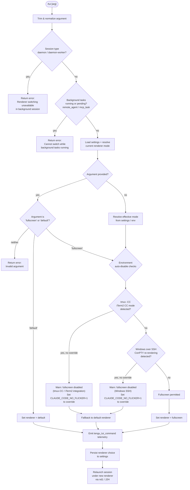

# `/tui`

> Analysis basis: CC v2.1.157 bundle.js (AST extraction + Claude interpretation)
> Minimum version: v2.1.157

---

## Overview

The `/tui` command switches the active terminal UI renderer between `default` and `fullscreen` modes. It validates the current execution context (session type, background task state, and environment compatibility) before applying the requested renderer mode, then relaunches the session under the new renderer if the switch is permitted.

---

## Registration

| Field | Value |
|---|---|
| type | `local-jsx` |
| name | `tui` |
| description | `Set the terminal UI renderer (default \| fullscreen)` |
| argumentHint | `[default\|fullscreen]` |
| module_id | `id1` |
| load_inline | `true` |
| loc_byte | `12111451` |
| loc_byte_end | `12111633` |
| loc_line | `8014` |
| arbor_handler.name | `YL5` |
| arbor_handler.fqn | `claude-2.1.157::YL5` |
| arbor_handler.kind | `AsyncFunction` |
| arbor_handler.resolution_path | `module_id` |
| arbor_handler.n_hits | `0` |

Analysis basis: CC v2.1.157 bundle.js:+12111451

---

## Input Branching

Six or more distinct branches are present (background-session guard, active-task guard, valid-mode check, environment auto-disable paths, fullscreen upsell, and renderer relaunch). A Mermaid flowchart is required.



Analysis basis: CC v2.1.157 bundle.js:+12109381, +12109463, +12109551, +12109669, +12109703, +12110028, +12110154, +12110197, +12110368, +12110495

---

## Behavioral Spec

### 1. Entry Point — Handler Dispatch (`YL5`)

The async handler `YL5` is resolved via `module_id` → `id1` resolution path.

```
async function tuiCommandHandler(context):
    rawArg = context.argument.trim()          // A.trim  (+12109381)
    loadSettingsAndTelemetry()                // B_      (+12109406)
    sessionState = getAppState()             // Aq      (+12109417)

    if sessionType(sessionState) in ["daemon", "daemon-worker"]:
        // v9 / QOH check (+12109689)
        return errorMessage(
            "Renderer switching isn't available in a background session" +
            " — press ← to detach and run /tui from a foreground session."
        )                                    // literal  (+12109703)

    activeTasks = Object.values(taskMap)     // (+12110028)
    if any task.status in ["running","pending"]
       AND task.type in ["remote_agent","mcp_task"]:
        emit("tengu_tui_refused")            // (+12110156)
        return errorMessage(
            "Cannot switch renderers while background tasks are running" +
            " — wait for them to finish (or stop them via /tasks), then run /tui again."
        )                                    // literal  (+12110197)

    resolvedMode = resolveTargetMode(rawArg, sessionState)  // _I8 (+12109669)
    currentMode  = getCurrentRendererMode(sessionState)     // V_  (+12109673)
    envFlags     = readEnvironmentFlags(sessionState)       // y$  (+12109679)

    rendererDecision = evaluateFullscreenEligibility(resolvedMode, envFlags)
    // LYH (+12110368)

    emit("tengu_tui_command", { resolvedMode, rendererDecision })
    // (+12110628)

    persistAndRelaunch(resolvedMode, rendererDecision)      // U_  (+12110384)
```

Analysis basis: CC v2.1.157 bundle.js:+12109381

---

### 2. Argument Resolution (`_I8`)

```
function resolveTargetMode(rawArg, sessionState):
    // Collect known arg sources in priority order
    sources = Array.from(...)     // Array.from (+12106466)

    // CLI arg sources: "cliArg", "session"   (+12106541, +12106562)
    // Flags: "--add-dir", "--allow-dangerously-skip-permissions",
    //        "--effort", "--permission-mode"
    //        (+12106641, +12106810, +12106952, +12106969)

    validModes = ["fullscreen", "default"]   // literals (+3377288, +3377314)

    if rawArg in validModes:
        return rawArg
    elif rawArg == "":
        return inferFromCurrentSettings(sessionState)
    else:
        return ERROR_INVALID_ARG
```

Analysis basis: CC v2.1.157 bundle.js:+12106466

---

### 3. Current Renderer Mode Resolution (`V_` / `y$`)

```
function getCurrentRendererMode(appState):
    state = appState.getAppState()           // H.getAppState (+10679373)
    last  = state.findLast(...)              // A.findLast    (+10679453)

    // Inspects keys:
    //   "working_directory"  (+10679478)
    //   "allowed_tools"      (+10679533)
    //   "disallowed_tools"   (+10679588)
    //   "avoid_prompts"      (+10679649)
    //   "effort"             (+10679973)
    //   "model"              (+10679986)
    //   "flag_settings"      (+10679998)

    return _V8(last) OR AV8(last)
    // _V8 / AV8 both delegate to aA (+10672941, +10673089)
```

Analysis basis: CC v2.1.157 bundle.js:+10679373

---

### 4. Fullscreen Eligibility Evaluation (`LYH`)

```
function evaluateFullscreenEligibility(requestedMode, envFlags):
    // Decision keys (string literals found in LYH subtree):
    //   "bg_forced_on"    (+3377707)
    //   "env_off"         (+3377737)
    //   "env_on"          (+3377795)
    //   "tmux_cc_auto_off"(+3377819)
    //   "win_ssh_auto_off" (+3377853)
    //   "settings_on"     (+3377912)
    //   "settings_off"    (+3377946)
    //   "downsell_on"     (+3378019)
    //   "gb_on"           (+3378084)
    //   "gb_off"          (+3378092)

    // CLAUDE_CODE_NO_FLICKER env var can override auto-disable
    // (literal present in nd1/J2H subtree at +12107170)

    tmuxCC = detectTmuxControlMode()         // oN / JM7 (+12110495)
    winSSH = detectWindowsSSH()              // ZD_      (+12109669)

    if requestedMode == "fullscreen":
        if tmuxCC AND NOT env_override:
            emit("tengu_amber_creek")        // (+3377471)
            return { mode: "default",
                     reason: "fullscreen disabled: tmux -CC (iTerm2 integration mode) detected" }
                     // literal (+3376954)
        if winSSH AND NOT env_override:
            emit("tengu_pewter_brook")       // (+3377379)
            return { mode: "default",
                     reason: "fullscreen disabled: Windows over SSH (ConPTY re-rendering) detected" }
                     // literal (+3377140)
        return { mode: "fullscreen", reason: "permitted" }
    else:
        return { mode: "default", reason: "user-requested" }
```

Analysis basis: CC v2.1.157 bundle.js:+3377707

---

### 5. tmux Control-Mode Detection (`oN` / `JM7`)

```
function detectTmuxControlMode(termEnv):
    // Checks CHH.includes (terminal env string)  (+3448961)
    // Checks mY6.isJetBrainsIdeTerminal()        (+3448990)

    if termEnv includes "cursor" or "vscode":    // literals (+3449667, +3449716)
        return via Xw_ / jM7

    // IDE terminal version range check:
    //   version >= 1092000 AND <= 1105000        // (+3449792, +3449803)
    //   uses xterm.js identifier                 // (+3449836)

    // Platform checks: "darwin", "win32"         // (+3449200, +3449247)
    // Tmux check: "screen", "tmux" in TERM/TMUX  // (+3375998, +3376023)
    // Runs tmux display-message -p #{client_control_mode}
    //   with 2000 ms timeout                     // (+3376208, +3376282)
    // iTerm.app check                            // (+3375930)

    limit = Math.min(parsed, 20)                 // (+3450163, +3450174)
    return Boolean(controlModeActive)
```

Analysis basis: CC v2.1.157 bundle.js:+3448921

---

### 6. Settings Load (`B_` → `Cp`)

```
function loadSettingsAndTelemetry():
    // Trace marker: "loadSettingsFromDisk_start"  (+1226870)
    // Loads layers in order:
    //   flagSettings      (+1215869)
    //   policySettings    (+1215891)
    //   userSettings      (+1219077)
    //   projectSettings   (+1219128)
    //   localSettings     (+1219150)
    //   "SDK inline settings" (+1218149)
    // Log event: "settings_load_started"  (+1223489) at level "info" (+1223482)
    // Log event: "settings_load_completed" (+1224214)
    // Trace marker: "loadSettingsFromDisk_end"    (+1226926)
    // Settings paths:
    //   .claude/settings.json        (+1219331, +1219341)
    //   .claude/settings.local.json  (+1219403)
    performanceMarks = ["perf_hooks"]            // (+212263)
    recordMemoryUsage()                          // process.memoryUsage (+212914)
```

Analysis basis: CC v2.1.157 bundle.js:+1226537

---

### 7. Persist and Relaunch (`U_` → `nd1` → `J2H`)

```
async function persistAndRelaunch(mode, decision):
    // Write new renderer setting to disk (bF6 / yL6 subtrees)
    // Settings file I/O: mkdir, readFile, writeFile, appendFile
    //                    via L3H.* (+1076508, +1076550, +1076895)

    // Clear caches before relaunch  (vz: kC6.clear, Ru8.clear +26612, +26624)
    clearCaches()

    // Emit opH event to signal renderer change (+1229395)

    // nd1 / J2H: relaunch sequence
    relaunchSession():
        stat(workDir)                           // Qd1.stat (+12105065)
        stopCurrentRenderer()                   // zkH      (+12105145)
            unmountCurrentUI()                  // H.unmount (+5355450)
            writeTerminalResetSequences()       // mq8 / Ao.writeSync (+3716030)
                // ESC 7 / ESC 8 restore sequences (+3716184, +3716195)

        flushPendingWrites(timeout=30000ms)     // sL / Promise.race (+12105184)
            // "flush timeout (relaunch)"        (+12105190)
        flushAnalytics(timeout=500ms)           // hf8 (+12105291)
            // "analytics flush timeout"         (+12105302)

        removeSignalListeners()                 // process.removeAllListeners (+12105686)
        registerSignalHandlers(SIGINT, SIGTERM, SIGHUP)  // (+12105657–12105676)

        // Native execve via bun:ffi / libc     // Bd1 (+12105619)
        //   macOS: /usr/lib/libSystem.B.dylib   (+12104265)
        //   Linux: libc.so.6                    (+12104294)
        //   Entrypoint flag: --resume           (+12105117)

        if spawnFailed:
            // "relaunch_spawn_error"            (+12105968)
            process.exit(128)                   // (+12106105)

        process.kill(pid, signal) if needed     // (+12106057)
```

Analysis basis: CC v2.1.157 bundle.js:+12110384

---

### 8. Renderer-Decision Telemetry Payload (`G6` → `S6`)

```
function recordRendererDecisionEvent(decision):
    // Emitted via tengu_amber_creek or tengu_pewter_brook depending on
    // which auto-disable path fired
    payload = {
        az6: ...,                 // feature flag value
        sz6: ...,                 // setting value
        reason: decision.reason,
        timestamp: Date.now(),    // S6 (+3206894)
    }
    // b17 called for structured log (+3206947)
```

Analysis basis: CC v2.1.157 bundle.js:+3187108

---

## State & Side Effects

| Item | Detail |
|---|---|
| Telemetry — `tengu_tui_command` | Fired on every `/tui` invocation that passes the background-session and active-task guards (bundle.js:+12110628) |
| Telemetry — `tengu_tui_refused` | Fired when active background tasks block the renderer switch (bundle.js:+12110156) |
| Telemetry — `tengu_amber_creek` | Fired when fullscreen is auto-disabled due to tmux -CC / iTerm2 integration mode (bundle.js:+3377471) |
| Telemetry — `tengu_pewter_brook` | Fired when fullscreen is auto-disabled due to Windows-over-SSH ConPTY detection (bundle.js:+3377379) |
| Telemetry — `tengu_feature_ok` | General feature-success path (bundle.js:+966033) |
| Telemetry — `tengu_feature_sad` | General feature-soft-failure path (bundle.js:+966168) |
| Telemetry — `tengu_feature_bad` | General feature-hard-failure path (bundle.js:+966091) |
| Telemetry — `tengu_scroll_summary` | Emitted during renderer teardown scroll metrics (bundle.js:+5356918) |
| Telemetry — `tengu_bg_dispatch_sigkill_escalate` | Background-task signal escalation during relaunch cleanup (bundle.js:+15466951) |
| Telemetry — `tengu_bg_dispatch_low_mem` | Low-memory event during background dispatch (bundle.js:+15467530) |
| Telemetry — `tengu_bg_spare_enable` | Spare session enabled (bundle.js:+15468225) |
| Telemetry — `tengu_bg_spare_claim` | Spare session claimed (bundle.js:+15468346) |
| Telemetry — `tengu_bg_spare_claim_fail` | Spare session claim failed (bundle.js:+15468609) |
| Telemetry — `tengu_daemon_control` | Daemon lifecycle control event (bundle.js:+15502788) |
| Settings I/O | Reads `.claude/settings.json` and `.claude/settings.local.json`; writes updated `terminalRenderer` key before relaunch |
| Cache invalidation | Clears `kC6` and `Ru8` caches via `vz` before relaunch (bundle.js:+26612, +26624) |
| Process relaunch | Executes `execve` via native FFI (`bun:ffi` → `libSystem.B.dylib` / `libc.so.6`) with `--resume` flag; exits with code 128 on spawn failure |
| Signal handlers | Removes all existing `SIGINT`/`SIGTERM`/`SIGHUP` listeners then re-registers clean handlers before exec (bundle.js:+12105657–12105686) |
| Terminal reset | Emits ESC-7 / ESC-8 cursor-save sequences during renderer unmount (bundle.js:+3716184, +3716195) |
| Event bus | Emits event on `opH` event emitter to signal renderer change to other subsystems (bundle.js:+1229395) |
| Environment variables read | `CLAUDE_CODE_NO_FLICKER` (+12107170), `CLAUDE_CODE_DISABLE_ALTERNATE_SCREEN` (+12107195), `CLAUDE_CODE_FORCE_FULLSCREEN_UPSELL` (+12107234) |

---

## Version History

| Version | Change |
|---|---|
| v2.1.157 | Initial analysis |

---

## Common Mistakes

1. **Running `/tui` inside a background or daemon session.** The command immediately returns an error and refuses to switch; detach to a foreground session first.
2. **Expecting fullscreen to work in tmux with iTerm2 control-mode active.** The handler auto-detects `#{client_control_mode}` via a `tmux display-message` probe and silently falls back to `default` unless `CLAUDE_CODE_NO_FLICKER=1` is exported.
3. **Running `/tui` while remote-agent or MCP tasks are in `running` or `pending` state.** The command refuses with an explicit error; use `/tasks` to stop or wait for those tasks first.
4. **Expecting `/tui` to be instant.** The relaunch path flushes pending writes (up to 30 000 ms) and analytics (up to 500 ms) before exec-replacing the process, so there is a short but measurable delay.
5. **Providing an unrecognised argument.** Only `default` and `fullscreen` are valid; any other string produces an argument error.
6. **Assuming Windows-over-SSH users can use fullscreen without override.** ConPTY re-rendering is detected automatically and fullscreen is disabled unless `CLAUDE_CODE_NO_FLICKER=1` is set.

---

## Appendix — Identifier Mapping

> For bundle debugging only. Identifiers change across versions.

| Identifier | Role |
|---|---|
| `YL5` | Main async handler for `/tui` command (arbor_handler) |
| `A` | Trimmed argument string / general temp variable |
| `f` | File/stream handle or temp function reference |
| `q` | General queue / filesystem operation target |
| `L` | General collection / file write helper |
| `B_` | Settings-load initiator |
| `Cp` | Core settings-load orchestrator |
| `YZ` | Settings-load sub-step A |
| `Z9` | Performance-mark registration helper |
| `Nb` | `perf_hooks` require wrapper |
| `Ta8` | Settings-load telemetry emitter |
| `w8` | Log file append helper |
| `yC6` | Settings-load intermediate step |
| `J56` | Flag-settings loader |
| `KhA` | Settings key enumeration helper |
| `K` | Column padding / settings row formatter |
| `E3H` | User-settings file loader |
| `MQ` | Project-settings file loader |
| `_hA` | SDK inline settings injector |
| `$Q` | Settings merge/compose function |
| `O_` | App-state accessor helper |
| `s96` | Settings-merge sub-step |
| `dm8` | Settings-merge sub-step |
| `i96` | Settings-merge sub-step |
| `tWH` | Settings-merge sub-step |
| `eWH` | Settings-merge sub-step |
| `e96` | Settings-merge sub-step |
| `W3H` | Settings-merge sub-step |
| `G3H` | Settings-merge sub-step |
| `Da8` | Settings-merge sub-step |
| `ByA` | Settings-merge sub-step |
| `Si` | Settings-merge sub-step |
| `X56` | WSL-environment detection helper |
| `IC6` | Settings-compose finalizer |
| `Aq` | Session-state reader / app-state inspector |
| `B$H` | Permission-set membership checker |
| `ED_` | Boolean-coercion helper for env vars |
| `y1` | String normaliser ("no"/"off" → false) |
| `CH` | String normaliser ("yes"/"on" → true) |
| `mr` | Terminal multiplexer environment probe |
| `J77` | tmux control-mode query dispatcher |
| `j77` | iTerm.app / screen / tmux prefix checker |
| `N` | Generic logging / telemetry dispatch helper |
| `QCK` | Structured log emitter |
| `qOA` | Log-level router |
| `H` | Miscellaneous string / stream handle |
| `RH` | JSON.stringify-based serialiser |
| `_` | Utility accumulator / filter target |
| `v4` | Path-component extractor |
| `uYA` | Character-map builder |
| `EuH` | Output write helper |
| `VYA` | Stream write wrapper |
| `lCK` | Log-file write coordinator |
| `rxH` | Buffered async writer |
| `M$H` | Log metadata builder |
| `g6` | Generic logger |
| `qK6` | Log-rotation helper |
| `dYA` | Log-path builder |
| `QYA` | Log-file rotation executor |
| `cCK` | Log-file append handler |
| `K9` | Output-drain hook registrar |
| `ZD_` | Windows / platform-detection helper |
| `X77` | Renderer-decision evaluator entry |
| `G6` | Renderer feature-flag resolver |
| `az6` | Feature-flag value accessor A |
| `sz6` | Feature-flag value accessor B |
| `Ex` | Renderer eligibility sub-check |
| `e88` | Feature-flag set membership checker |
| `S6` | Renderer telemetry payload builder |
| `_I8` | CLI argument normaliser / mode resolver |
| `p96` | Argument-source iterator |
| `V_` | Current renderer mode reader |
| `_V8` | App-state sub-field extractor A |
| `aA` | App-state field accessor |
| `AV8` | App-state sub-field extractor B |
| `y$` | Environment-flag reader from app state |
| `v9` | Session-type classifier (daemon / daemon-worker) |
| `QOH` | Session-type enum |
| `d` | Telemetry event emitter (feature ok/sad/bad) |
| `LYH` | Fullscreen eligibility evaluator |
| `U_` | Settings persist + relaunch orchestrator |
| `ZO` | Settings compose helper in relaunch path |
| `Ga8` | Settings reload before relaunch |
| `wP` | File-inclusion guard helper |
| `Ni` | File reader with encoding detection |
| `F$` | Filesystem special-file detector |
| `nB6` | File-read error handler |
| `iB6` | Encoding-detection sub-helper |
| `P8` | Error-code wrapper (`j8` caller) |
| `j8` | ENOENT / EISDIR error constructor |
| `Jo8` | Timestamp-keyed store setter |
| `iGH` | Settings-path resolver for relaunch |
| `vg6` | Settings-directory path builder |
| `yL6` | Atomic file writer (temp + rename) |
| `O` | Symbolic-link / special-file check wrapper |
| `k8` | File-type constant |
| `vz` | Cache-clear helper (kC6 + Ru8) |
| `bF6` | Settings file read/write coordinator |
| `h6` | AsyncLocalStorage context accessor |
| `lB6` | Context store getter |
| `tr8` | I4 initialiser in settings path |
| `CF6` | Git-ignore check orchestrator |
| `G_` | Git subprocess runner |
| `Z94` | Path normaliser (home-dir expansion) |
| `lkA` | `git ls-files` tracker |
| `nkA` | Git-ignore write helper |
| `cb` | `.claude` path joiner |
| `hH` | `tengu_feature_ok` telemetry emitter wrapper |
| `t6` | `tengu_feature_sad` telemetry emitter wrapper |
| `bH` | `tengu_feature_bad` telemetry emitter wrapper |
| `SH` | Error log + UI message display helper |
| `F_` | Error string coercer |
| `L1` | Error display sub-component |
| `fVA` | CH-based string renderer |
| `X_4` | Bounded error-queue manager |
| `oN` | IDE / embedded-terminal detector |
| `iY6` | Terminal-type identifier |
| `FD` | Terminal-feature capability query |
| `Xw_` | Cursor / VS Code terminal probe |
| `jM7` | xterm.js version range checker |
| `VY` | Terminal FD capability wrapper |
| `JM7` | tmux client control-mode version parser |
| `Pw_` | tmux version string parser |
| `Zx` | React JSX renderer for TUI output |
| `vR` | TUI root render component |
| `O97` | Top-level layout component |
| `NO` | Network-tier guard (firstParty check) |
| `u3` | Render sub-component |
| `TL6` | fVA-based text formatter |
| `N9` | Telemetry consent / product-feedback resolver |
| `n89` | Consent-store accessor |
| `Dw6` | Consent decision evaluator |
| `gR` | Consent record builder |
| `Yw6` | Consent file reader |
| `c4H` | Consent inclusion checker |
| `gKH` | CH-based consent string formatter |
| `nd1` | Relaunch sequence initiator |
| `J2H` | Full relaunch orchestrator |
| `dh` | Claude binary path resolver |
| `nW8` | Version-directory path builder |
| `Q_H` | Local-bin path builder |
| `l$` | Array type guard |
| `MI` | Working-directory accessor |
| `k6` | `AN`-based path helper |
| `AN` | Path join / resolve utility |
| `MP6` | Interval-clear helper for renderer teardown |
| `wv_` | clearInterval wrapper |
| `zkH` | Current renderer unmount handler |
| `hR` | Renderer cleanup sub-step |
| `mq8` | Terminal escape-sequence writer |
| `yf8` | Scroll-state snapshot emitter |
| `jZ` | Scroll sub-component |
| `CX9` | Scroll metrics collector |
| `RX9` | Frame-timing calculator |
| `sL` | Promise.race timeout helper |
| `BT` | Background-task teardown helper |
| `U4` | Task drain coordinator |
| `oxH` | Output drain (`_OA.drain`) caller |
| `hf8` | Analytics flush helper |
| `g8` | Abortable timeout promise |
| `S6A` | Relaunch argument builder |
| `UK` | `AN`-based argument array builder |
| `Bd1` | Native `execve` via bun:ffi dispatcher |
| `$` | Argument array accumulator |
| `w` | Background-task process manager |
| `M` | Temp-file cleanup helper |
| `z` | Process-stop aggregator |
| `EH` | String coercer for exit code |
| `ej` | Crash-report file writer |

---

Note: index built via Arbor fallback; some signals (telemetry, literals) may be missing — see arbor-fallback.js.