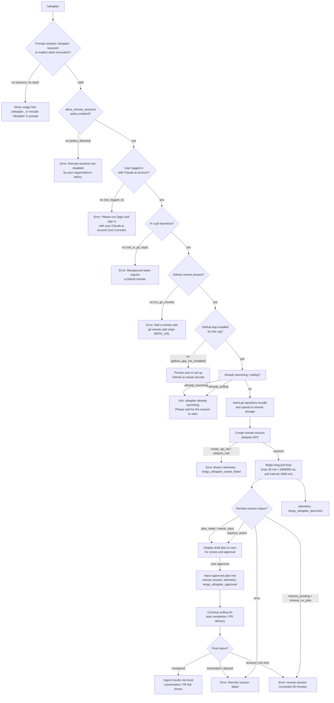

# `/ultraplan`

> Analysis basis: CC v2.1.157 bundle.js (AST extraction + Claude interpretation)
> Minimum version: v2.1.157

---

## Overview

`/ultraplan` launches a remote Claude Code web session that drafts a plan for the given prompt, presents it to the user for review and approval, then — upon approval — executes the plan autonomously on a cloud-hosted sandbox and delivers results as a GitHub pull request. The command handles the full lifecycle: eligibility pre-checks, repository seeding, remote session creation, long-poll monitoring, plan refinement, and final result ingestion back into the local conversation.

---

## Registration

| Field | Value |
|---|---|
| type | `local-jsx` |
| name | `ultraplan` |
| description | `· Claude Code on the web drafts a plan you can edit and approve. See …` |
| argumentHint | `<prompt>` |
| load_inline | `true` |
| load_ident | `Y45` |
| loc_byte | `11941052` |
| loc_byte_end | `11941296` |
| loc_line | `7793` |
| arbor_handler.name | `Y45` |
| arbor_handler.fqn | `claude-2.1.157::Y45` |
| arbor_handler.kind | `AsyncFunction` |
| arbor_handler.resolution_path | `load_ident` |
| arbor_handler.n_hits | `1` |

Analysis basis: CC v2.1.157 bundle.js:+11941052

---

## Input Branching

The command has five or more distinct branches depending on eligibility state, session launch outcome, and plan review result. A Mermaid flowchart is used.



---

## Behavioral Spec

Analysis basis: CC v2.1.157 bundle.js:+11939196

### Top-Level Handler (`Y45`)

The handler is an `AsyncFunction` resolved via the `load_ident` path (inline `Promise.resolve({call: Y45})`).

```
async function ultraplanHandler(args, context):
    1. Extract raw prompt text from args.
    2. Normalize prompt: strip leading slash command token via normalizePromptText().
    3. Check allow_remote_sessions policy via getAppState(); if disabled → return policy error.
    4. Check login state (Claude.ai account required, not API key); if not logged in → return auth error.
    5. Verify git repository and GitHub remote presence via checkGitRemote(); on failure return appropriate error code.
    6. Run GitHub App pre-flight check via checkGithubAppInstalled(); on failure → prompt user to install app.
    7. Guard against concurrent launch: if alreadyLaunching or alreadyPolling flag set → return "already launching" message.
    8. Invoke mainLaunchFlow(prompt, context).
    9. Call setAppState() to record new session state.
    10. Return JSX result element to CLI renderer.
```

Analysis basis: CC v2.1.157 bundle.js:+11939196 – +11939749

---

### Prompt Normalization (`LT8` → `Ed_`)

```
function normalizePromptText(rawInput):
    // Strip leading slash-command prefix if present
    if rawInput.startsWith("/"):
        head = rawInput.slice(0, COMMAND_PREFIX_LENGTH)
        tail = rawInput.slice(COMMAND_PREFIX_LENGTH)
        // Replace repeated whitespace patterns matching regex /gi flag
        normalized = tail.replace(WHITESPACE_PATTERN, "$1$2")
        if len(normalized) > 5:   // minimum meaningful prompt length
            return normalized
    // Fall through: check whether "ultraplan" appears anywhere in prompt
    matches = rawInput.matchAll(ULTRAPLAN_KEYWORD_RE)  // "ultraplan" literal
    if matches.some(...):
        return extracted portions joined with replacement "$1$2"
    return rawInput.toLowerCase() via transformCase()
```

Analysis basis: CC v2.1.157 bundle.js:+11939196, +9683682, +9683330, +9684008, +9684031, +9683338, +9683430

---

### Eligibility Pre-check (`N9` → `Dw6` / `c4H` / `gR`)

```
async function checkEligibility(context):
    // Tier check
    tier = readConfigField("firstParty" | "enterprise" | "team")
        via readFileSync() with encoding "utf-8"
    // Policy check
    if config includes "allow_product_feedback" → record flag
    // Remote sessions policy
    if NOT $P7.has("allow_remote_sessions"):
        return { ok: false, reason: "policy_blocked",
                 message: "Remote sessions are disabled by your organization's policy.
                           Contact your organization admin to enable them." }
    // Auth state
    orgUUID = resolveOrgUUID()   // via gKH → CH → String
    if orgUUID missing:
        return { ok: false, reason: "not_logged_in",
                 message: "Please run /login and sign in with your Claude.ai account (not Console)." }
    return { ok: true, orgUUID }
```

Analysis basis: CC v2.1.157 bundle.js:+11939214, +4107605, +4107900, +4107103, +4107376, +4107411, +4107652, +11939217, +8939098, +8939120, +8939608, +8939631

---

### Git / GitHub Pre-flight (`IXH` → `D41`)

```
async function checkGitAndGitHub(context):
    // 1. Confirm git repo
    if NOT inGitRepository():
        return error("not_in_git_repo")

    // 2. Confirm github.com remote
    remoteURL = getGitRemoteURL("remote.origin.url")   // git config --get
    if NOT remoteURL.includes("github.com"):
        return error("no_git_remote",
            "Background tasks require a GitHub remote. Add one with `git remote add origin REPO_URL`.")

    // 3. Check BYOC flag
    if byocMode:
        record telemetry("tengu_ccr_bundle_seed_enabled")

    // 4. Run parallel checks: Promise.all([
    //       checkGithubApp(),   → via YhH
    //       checkBundleMode(),  → via Q28 / h6 / I4
    //       resolveEnvironment() → via Ry / aS
    //    ])
    results = await Promise.all([...])

    // 5. Evaluate github_app_not_installed
    if results.githubApp == NOT_INSTALLED:
        return error("github_app_not_installed",
            ". Please setup GitHub on https://claude.ai/code")

    return results
```

Analysis basis: CC v2.1.157 bundle.js:+8937184, +8937845, +8937557, +8937254, +8939199, +8939337, +8939359, +8939454

---

### Repository Seeding and Bundle Upload (`YB_`)

```
async function seedGitBundle(context):
    // Validate repo is not empty
    if repo has no commits:
        return error("empty_repo",
            "Repository has no commits yet. Run `git add . && git commit -m 'initial'` then retry.")

    // Attempt stash-based seed bundle
    stashRef  = "refs/seed/stash"
    rootRef   = "refs/seed/root"
    bundleName = "ccr-seed.bundle"
    seedFile  = "_source_seed.bundle"

    // git stash create → capture stash OID
    stashOID = runGit("stash", "create")
    if stashOID failed:
        record "stash_failed"
        // Fallback: use HEAD directly
        bundleRef = "fallback_head"
    else:
        bundleRef = "head"   // or "squashed" / "fallback_squashed"

    // git update-ref / for-each-ref / rev-parse --verify HEAD
    // Write .bundle file; upload via teleport API
    uploadResult = await uploadBundle(bundleFile)
    if uploadResult.status != 200:
        record telemetry("tengu_ccr_bundle_upload") with status "upload_failed"
        return error("upload_failed")

    record telemetry("tengu_ccr_bundle_upload") with status "success"
    // Cleanup: unlink temp bundle via XeH.unlink
    return { bundleRef, uploadURL }
```

Analysis basis: CC v2.1.157 bundle.js:+8853075, +8853133, +8853165, +8853205, +8853223, +8853256, +8853511, +8854392, +8854403, +8854695, +8854840, +8854989, +8855092

---

### Remote Session Creation (`Nl` — teleport orchestrator)

```
async function teleportToRemote(prompt, bundleInfo, orgUUID, environment):
    // Construct session request headers:
    //   anthropic-beta: "ccr-byoc-2025-07-29"
    //   x-organization-uuid: orgUUID
    //   anthropic-version: "2023-06-01"
    //   Content-Type: "application/json"

    // Determine environment list via listEnvironments()   → oa / YeH
    envs = await listEnvironments(orgUUID)   // GET with 15000 ms timeout
    if envs empty:
        // Auto-create default cloud env (anthropic_cloud)
        // Default env: name="Default - trusted network access",
        //   home="/home/user", python="3.11", node="20"
        newEnv = await createDefaultEnvironment(orgUUID)  // POST via YeH
        log("[teleportToRemote] Auto-created default cloud env")
        if creation fails:
            warn("Could not create a cloud environment. Set one up at https://claude.ai/code/onboarding?magic=env-setup")

    // Determine source repository bundle mode (tengu_teleport_bundle_mode)
    //   modes: "bundle" | "explicit_env_bundle" | "git_repository" | "no source"
    bundleMode = determineBundleMode(bundleInfo)
    record telemetry("tengu_teleport_bundle_mode") with { mode: bundleMode }
    record telemetry("tengu_teleport_source_decision")

    // Generate task title via BTL (truncated to 75 chars,
    //   POST to "claude/task" endpoint with json_schema output)
    title = await generateTitle(prompt)   // tengu_teleport_generate_title

    // POST session creation
    response = await httpClient.post(sessionEndpoint, {
        title,
        prompt,
        sourceBundle: bundleInfo,
        environment: selectedEnv,
        permissionMode: "set_permission_mode"
    })

    if response.status == 401 or 403:
        return error("not_logged_in",
            "Claude Code web sessions require authentication with a Claude.ai account…")
    if response.status == 429 or 500:
        return error (rate-limit / server error)
    if response.status == 409:
        return error("github_repo_access_denied")
    if response.status not in [200, 201]:
        return error("unexpected")
    if response.sessionId missing:
        return error("Server returned a malformed session response (no session id)")

    record telemetry("tengu_ccr_session_link") with sessionId
    return { sessionId, sessionURL }
```

Analysis basis: CC v2.1.157 bundle.js:+8867584, +8867692, +8868324, +8868341, +8868363, +8869107, +8869518, +8869569, +8869623, +8869659, +8869726, +8869730, +8869734, +8870081, +8821142, +8821573, +8822153, +8822183, +8822259, +8822321, +8822338, +8822352, +8822367, +8870436

---

### Long-Poll Monitor (`VhH` → `X41` / `fg1`)

```
async function pollRemoteSession(sessionId, context):
    POLL_INTERVAL_MS  = 1000          // bundle.js:+8945689
    MAX_DURATION_MS   = 1800000       // 30 minutes  bundle.js:+8945696
    TIMEOUT_DISPLAY   = 5400          // seconds, for UI countdown  bundle.js:+11932134
    startTime = Date.now()

    // Generate random session token via S_K.randomBytes (8 bytes) → Fk
    // Open browser/deep-link via At.open → KeH

    loop:
        elapsed = Date.now() - startTime
        if elapsed >= MAX_DURATION_MS:
            record telemetry("tengu_ultraplan_timeout_seconds")
            return error("remote session exceeded 30 minutes")

        status = await fetchSessionStatus(sessionId)  // GET via X41 / PZL.get

        switch status:
            case "pending":
                // still starting; display countdown  →  WZL / N / String
                continue

            case "running" | "starting":
                continue

            case "plan_ready" | "needs_input" | "requires_action":
                // Retrieve draft plan text from response
                // Display to user for review
                record telemetry("tengu_ultraplan_plan_ready")
                result = await awaitUserApproval(draftPlan)  // → L45 / K45 / _45
                if result == "approved":
                    record telemetry("tengu_ultraplan_approved")
                    // Inject approval into remote session via Km
                    await sendApproval(sessionId, approvedPlan)
                else:
                    // User edited plan; loop continues
                break

            case "completed":
                finalOutput = extractResult(response)  // find last "result" marker
                ingestResultIntoConversation(finalOutput)
                return success

            case "archived":
                return error("remote session returned an error")

            case "terminated" | "aborted":
                return error("Remote Ultraplan session failed. Wait for the user's next instructions.")

            case "error":
                return error(statusMessage)

        await sleep(POLL_INTERVAL_MS)
```

Analysis basis: CC v2.1.157 bundle.js:+8944008, +8944027, +8944044, +8944271, +8944331, +8945689, +8945696, +8946140, +8946215, +8946703, +8946886, +8947322, +8947406, +8947496, +8948297, +8948338, +11932134

---

### Plan Draft Presentation and Approval (`f45` / `L45` / `K45`)

```
function buildPlanPrompt(draftPlanText):
    // Prepend header literal "Here is a draft plan to refine:"
    // Append plan body
    // Join with q.join()
    return assembledPrompt

async function awaitUserApproval(draftPlan):
    record telemetry("tengu_ultraplan_awaiting_input")
    display buildPlanPrompt(draftPlan) in interactive UI

    // Poll state: _I → SSL / ySL / RSL / CSL
    //   SSL: retain task state
    //   ySL: task_updated event dispatch
    //   RSL: local_workflow poll with Date.now() tracking
    //   CSL: user_typed / active / aborted state tracking
    //   IAH: input event handler (agentType, workflowName, prompt fields)

    userResponse = await waitForInput()  // track via IAH event loop
    if userResponse.action == "approved":
        return "approved"
    return userResponse.editedPlan
```

Analysis basis: CC v2.1.157 bundle.js:+11932441, +11932434, +11932524, +11932267, +11932744, +11932812, +9662469, +9661586, +9658693, +9658741

---

### Approval Injection and Session Update (`Km`)

```
async function sendApprovalToRemoteSession(sessionId, approvedPlanText, orgUUID):
    headers = buildHeaders(orgUUID)  // via XB_ → Bq / CH
    // POST with timeout 10000 ms
    response = await httpClient.post(sessionUpdateEndpoint, {
        sessionId,
        plan: approvedPlanText,
        permissionMode: "none"
    }, { timeout: 10000 })  // bundle.js:+8876692

    if response.status == 409:  // conflict
        // retry after backoff
    // Deserialize response via ZX / d2
    record telemetry via RH → JSON.stringify
    return response
```

Analysis basis: CC v2.1.157 bundle.js:+8876692, +8876693, +8876797, +8876819, +8876893, +8876997

---

### Post-Completion Result Injection (`z45` → `AI6` → `M45`)

```
async function ingestRemoteResult(sessionOutput, context):
    // Parse final output blocks from remote session
    // Inject into local conversation as assistant messages
    // Set appState to reflect remote task done
    // If session errored:
    //   display "Remote Ultraplan session failed. Wait for the user's next instructions."
    // If unexpected error during launch:
    //   display "Ultraplan hit an unexpected error during launch. Wait for the user's next instructions."
    //   record telemetry("tengu_ultraplan_failed") with reason "unexpected_error"
    // Attempt to archive any orphaned sessions; log warning on failure:
    //   "ultraplan: failed to archive orphaned session"
```

Analysis basis: CC v2.1.157 bundle.js:+11934500, +11938575, +11938733, +11938881, +11934093

---

### Background Session Daemon (`w` / `GfA` / `DfA`)

The command reuses the shared background-session daemon infrastructure. Key behaviors:

- Sessions are tracked in a registry; duplicate detection via `dup_retry_exhausted` (bundle.js:+15467288).
- Low-memory guard: checks `TfA.freemem()`; records `tengu_bg_dispatch_low_mem` and `tengu_bg_low_mem_mb` when memory is constrained (bundle.js:+15467360, +15467530).
- Spare-process pool: pre-spawns worker via `cF.spawn`; records `tengu_bg_spare_enable`, `tengu_bg_spare_claim`, `tengu_bg_spare_spawn`, `tengu_bg_spare_claim_fail` (bundle.js:+15468225, +15468308, +15468325, +15468609).
- Session lifecycle states: `pending` → `starting` → `running` → `completed` / `terminated` / `archived` / `crashed` / `killed` / `stopped` / `blocked` / `working` / `resuming`.
- macOS memory baseline: 1024 MB (bundle.js:+12729109).
- SIGKILL escalation after SIGTERM: recorded as `tengu_bg_dispatch_sigkill_escalate` (bundle.js:+15466951), with thresholds 30 s / 15 s (bundle.js:+15466906, +15466917).
- Daemon IPC write loop: `z.write` / `supervisor` channel (bundle.js:+15485914).

Analysis basis: CC v2.1.157 bundle.js:+15467261, +15467288, +15467360, +15467530, +15468225, +15468325, +15466951

---

## State & Side Effects

| Item | Detail |
|---|---|
| Telemetry: launch | `tengu_ultraplan_launched` (bundle.js:+11938166) |
| Telemetry: create failed | `tengu_ultraplan_create_failed` (bundle.js:+11936496) |
| Telemetry: prompt identifier | `tengu_ultraplan_prompt_identifier` (bundle.js:+11932267) |
| Telemetry: awaiting input | `tengu_ultraplan_awaiting_input` (bundle.js:+11932744) |
| Telemetry: plan ready | `tengu_ultraplan_plan_ready` (bundle.js:+11932812) |
| Telemetry: approved | `tengu_ultraplan_approved` (bundle.js:+11933220) |
| Telemetry: failed | `tengu_ultraplan_failed` (bundle.js:+11934093) |
| Telemetry: timeout seconds | `tengu_ultraplan_timeout_seconds` (bundle.js:+11932100) |
| Telemetry: bundle upload | `tengu_ccr_bundle_upload` (bundle.js:+8853397) |
| Telemetry: bundle seed enabled | `tengu_ccr_bundle_seed_enabled` (bundle.js:+8937649) |
| Telemetry: session link | `tengu_ccr_session_link` (bundle.js:+8863152) |
| Telemetry: teleport bundle mode | `tengu_teleport_bundle_mode` (bundle.js:+8868745) |
| Telemetry: teleport source decision | `tengu_teleport_source_decision` (bundle.js:+8873877) |
| Telemetry: config parse error | `tengu_config_parse_error` (bundle.js:+3210553) |
| Telemetry: BG daemon (sigkill, low mem, spare pool) | `tengu_bg_dispatch_sigkill_escalate`, `tengu_bg_low_mem_mb`, `tengu_bg_dispatch_low_mem`, `tengu_bg_spare_enable`, `tengu_bg_spare_claim`, `tengu_bg_spare_spawn`, `tengu_bg_spare_claim_fail`, `tengu_bg_sendclaim_failed` |
| Telemetry: feature flags | `tengu_feature_ok`, `tengu_feature_bad` |
| appState reads | `_.getAppState()` to read `allow_remote_sessions` policy (bundle.js:+11939531) |
| appState writes | `_.setAppState()` to persist session state after launch (bundle.js:+11939749) |
| Hook registration | `K9` → `_OA.register` (bundle.js:+58858); task-notification hook registered at `11937476` |
| Session flags | `alreadyLaunching` (`already_launching`), `alreadyPolling` (`already_polling`) guard concurrent invocations (bundle.js:+11936711, +11936729) |
| Git side effects | Stash created (`refs/seed/stash`), seed bundle written to disk and uploaded, temp bundle unlinked after upload |
| File system | Temp `.bundle` file written and then removed via `XeH.unlink` / `RZ6` → `M7.unlink` |
| Sound | <!-- TODO: not found in depth-2 traversal; needs --depth 4 --> |
| Browser / URL open | `At.open` called from `KeH` to open remote session URL (bundle.js:+12962910) |

---

## Version History

| Version | Change |
|---|---|
| v2.1.157 | Initial analysis |

---

## Common Mistakes

1. **Using an API key instead of a Claude.ai account login.** `/ultraplan` requires a Claude.ai account (`/login`). API key authentication triggers the `not_logged_in` error: "Claude Code web sessions require authentication with a Claude.ai account."
2. **Running outside a git repository.** The command requires a git repo with a `github.com` remote. Running in a plain directory triggers `not_in_git_repo` or `no_git_remote`.
3. **GitHub App not installed.** Even with a GitHub remote, the Anthropic GitHub App must be installed for the org. Missing installation yields `github_app_not_installed` and directs the user to `claude.ai/code`.
4. **Invoking twice before the session starts.** A second `/ultraplan` call while the first is still launching returns "ultraplan: already launching. Please wait for the session to start." (bundle.js:+11935323).
5. **Empty or uncommitted repository.** If the repo has no commits, bundle seeding fails with "Repository has no commits — run `git add . && git commit -m 'initial'` then retry."
6. **Org policy blocking remote sessions.** Enterprise or team admins can disable remote sessions. The error `policy_blocked` is non-recoverable by the user; they must contact their organization admin.
7. **Expecting immediate results.** The remote session runs for up to 30 minutes (1 800 000 ms poll ceiling). Results are delivered as a GitHub pull request, not inline in the terminal.

---

## Appendix — Identifier Mapping

> For bundle debugging only. Identifiers change across versions.

| Identifier | Role |
|---|---|
| `Y45` | Top-level ultraplan async handler (arbor_handler) |
| `LT8` | Prompt normalization entry (calls `Ed_`) |
| `KT8` | Prompt text pre-processor (called by `LT8`) |
| `Ed_` | Core prompt extraction logic (keyword scan, `startsWith`, `matchAll`) |
| `N9` | Eligibility checker (policy, auth, org UUID) |
| `n89` | Eligibility sub-check orchestrator |
| `Dw6` | Config read and tier detection dispatcher |
| `gR` | Tier resolver (`firstParty`, `enterprise`, `team`) |
| `Yw6` | Config file reader (`readFileSync`, utf-8) |
| `c4H` | Config field access checker (`some`, `includes`) |
| `L1` | Telemetry consent resolver |
| `fVA` | Telemetry flag resolver (calls `CH`) |
| `CH` | String coercion / value converter |
| `gKH` | Org UUID resolver (calls `CH`) |
| `W5H` | Session state accessor |
| `AI6` | Main launch flow orchestrator |
| `d` | Generic async dispatcher / util |
| `L` | Promise lifecycle tracker (`add`, `finally`, `delete`) |
| `jg1` | Session guard / lock helper |
| `Rk8` | Pre-launch validation wrapper |
| `Sk8` | Validation step runner (calls `G6`, `A45`) |
| `G6` | Feature flag / permission checker |
| `A45` | Permission mode validator |
| `z45` | Full ultraplan execution flow (seed → teleport → poll → result) |
| `IXH` | Git and GitHub pre-flight dispatcher |
| `D41` | Detailed eligibility result evaluator (`bg_remote_eligibility_check`) |
| `L45` | Plan prompt builder (`push`, `K45`, `join`) |
| `K45` | Plan segment assembler (calls `_45`) |
| `Nl` | Teleport-to-remote orchestrator (session creation, header construction) |
| `h6` | HTTP helper base (calls `lB6`, `O_`) |
| `kO` | URL builder (calls `z3_`) |
| `XB_` | Request header assembler (`Bq`, `CH`, `di`) |
| `SH` | Error logger / display handler (`F_`, `CH`, `L1`, `X_4`, `YpH.push`, `Vi.logError`) |
| `tb` | Bq-based message formatter (`S6`, `YV`, `hOH`) |
| `Iq` | Environment/endpoint resolver (`local`, `staging`, `prod`) |
| `ZX` | Response deserializer (calls `d2`) |
| `YB_` | Git bundle seed uploader (`teleport_git_bundle_upload`) |
| `k6` | App info accessor (calls `AN`) |
| `N` | Message formatter/normalizer (`wK6`, `QCK`, `H.includes`, `RH`, `FS`, etc.) |
| `aS` | Git remote URL resolver (`git config --get remote.origin.url`) |
| `CK1` | Session control event builder (`randomUUID`) |
| `RH` | JSON serializer (wraps `JSON.stringify`) |
| `RK1` | Session link recorder (calls `d`) |
| `oa` | List environments API caller (`teleport_environments_list`) |
| `YeH` | Create default environment API caller (`teleport_default_environment_create`) |
| `EH` | String coercion wrapper (wraps `String`) |
| `BTL` | Title generation task runner (`claude/task`, `json_schema`, `teleport_generate_title`) |
| `Ry` | Feature flag presence checker (`az6`, `sz6`, `Ex`, `izH.has`, `rz6.add`) |
| `YhH` | GitHub App installation checker (`checkGithubAppInstalled`) |
| `XN` | Default branch resolver (`symbolic-ref`, `main`/`master` fallback) |
| `J9` | Diff/status helper (`se`, `_1`, `XX`) |
| `c` | Tool-use filter (calls `vS8`) |
| `Ge` | Git remote URL parser (https/http scheme detection) |
| `F_` | Error message formatter (`Error`, `String`) |
| `sj` | Cancellation signal checker |
| `Iz` | Cancel-safe wrapper |
| `jw` | Base URL resolver (`local`/`staging`/`prod` URLs via `Z_`, `EG_`) |
| `Z_` | Environment module initializer (`UWH`, `fu8`, `gR6.call`, `QR6.bind`, `KNK`, `sfA.set`) |
| `EG_` | Environment getter (`Fj6`, `Yv7`) |
| `$45` | Session state snapshot helper |
| `VhH` | Remote agent polling controller (`remote_agent`) |
| `Fk` | Token generator (`S_K.randomBytes`, 8 bytes) |
| `KeH` | Browser URL opener (`At.open`, `Vh8`, `z9A`, `h$`) |
| `Z2` | Pending state timer (`Date.now`, `h$`) |
| `WZL` | Progress display builder (`CB_`, `N`, `String`) |
| `X41` | Session status fetch + state machine (1000 ms poll, 1800000 ms cap) |
| `_I` | Task poll state manager (`SSL`, `ySL`, `RSL`, `CSL`, `IAH`) |
| `SSL` | Retain-state handler |
| `ySL` | Task-updated event dispatcher |
| `RSL` | Local workflow poll tracker (`Date.now`, `QW`, `Xd_`) |
| `CSL` | User-typed / active state watcher (`Object.keys`, `Date.now`, `Xd_`) |
| `IAH` | Input event handler (`agentType`, `workflowName`, `prompt` fields) |
| `f45` | Plan presentation and approval loop |
| `fg1` | Poll loop core (`Date.now`, error, ZXH, vQH, `L.ingest`, `Math.round`) |
| `H45` | Session display header builder (calls `G6`) |
| `O45` | Plan output formatter |
| `RZ6` | Temp file cleanup (`gqA`, `M7.unlink`, `oq`) |
| `K` | Column formatter (`L.map`, `f.padEnd`) |
| `Km` | Approval injection POST (`XB_`, `Iq`, `c_.post`, `ZX`, `N`, `RH`, `EH`) |
| `K9` | Hook registrar (`_OA.register`) |
| `M45` | Post-result state updater |
| `S6` | Config state manager + file watcher (`g6`, `qT`, `sz_`, `szH`, `Date.now`, `b17`) |
| `szH` | Config file parser (reads, backs up, migrates config) |
| `p6` | JSON parser wrapper (`JSON.parse`) |
| `gb` | String path prefix handler (`H.startsWith`, `H.slice`) |
| `j8` | JSON/binary serializer |
| `yFq` | Backup directory scanner (`MD.basename`, `readdirStringSync`, `statSync`) |
| `qY_` | Backup path builder (`MD.join`, `F8`) |
| `$` | Promise/array utility (`Ls1`) |
| `w` | Background session worker entry point |
| `S` | Subprocess wrapper (`dVK`, `kz`, `N`, `SH`, `HF5`, `z.write`) |
| `bH` | Bad-feature telemetry emitter (`tengu_feature_bad`) |
| `hH` | Good-feature telemetry emitter (`tengu_feature_ok`) |
| `uy8` | macOS memory inspector (`i6`, `G6`) |
| `Lw6` | Config file async reader (`oP.readFile`, `XP_`, `p6`, `Array.isArray`) |
| `B` | MCP tool-use filter (`VH.filter`, `dH.has`) |
| `DfA` | Background session IPC connector (`cF.claim`, `Jx8.connect`, `f.on/once/write/end`) |
| `GfA` | Background session lifecycle manager (state machine, roster, cleanup) |
| `D` | Spare-process idle recycler (`G6`, `$.dispose`, `uy8`, `YfA`, `Date.now`) |
| `b17` | Config file watcher (`z_8.watchFile/unwatchFile`, `K9`) |
| `Vr` | Config change notifier |
| `J_6` | Parallel pre-flight launcher (`Promise.all`, `aS`, `Ry`, `I4`, `h6`, `CH`, `YhH`) |

---

Note: index built via Arbor fallback; some signals (telemetry, literals) may be missing — see arbor-fallback.js.