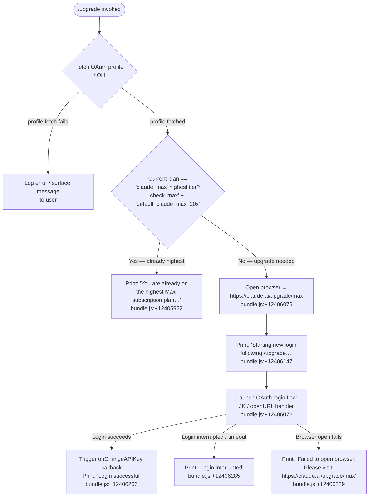

# `/upgrade`

> Analysis basis: CC v2.1.157 bundle.js (AST extraction + Claude interpretation)
> Minimum version: v2.1.157

---

## Overview

The `/upgrade` command guides the user from a standard Claude account to the **Claude Max** subscription tier, which offers higher rate limits and expanded access to Opus models. It checks the user's current subscription state and, if they are not already on the highest Max plan, opens `https://claude.ai/upgrade/max` in the system browser and then launches a fresh OAuth login flow to bind the newly upgraded account. If the user is already on the highest plan, it prints an informational message and exits without opening a browser.

---

## Registration

| Field | Value |
|---|---|
| type | `local-jsx` |
| name | `upgrade` |
| description | `Upgrade to Max for higher rate limits and more Opus` |
| module_id | `O_A` |
| load_inline | `true` |
| loc_byte | `12406546` |
| loc_byte_end | `12406806` |
| loc_line | `8265` |
| arbor_handler.name | `II6` |
| arbor_handler.fqn | `claude-2.1.157::II6` |
| arbor_handler.kind | `AsyncFunction` |
| arbor_handler.resolution_path | `module_id` |
| arbor_handler.n_hits | `0` |

Analysis basis: CC v2.1.157 bundle.js:+12406546

---

## Input Branching

The command has four distinct paths depending on the user's current subscription and the outcome of the browser/login flow.



---

## Behavioral Spec

### 1. Handler entry — `upgradeCommandHandler` (`II6`)

The top-level async handler is `II6`, resolved by Arbor via `module_id → O_A`.

```
async function upgradeCommandHandler(context):
    authState = fetchAuthState(context)              // calls authStateResolver (WA)
    planInfo  = determineCurrentPlan(authState)      // checks 'max', 'default_claude_max_20x'

    if planInfo.isHighestMax:
        displayMessage(ALREADY_HIGHEST_MAX_TEXT)
        return

    browserOpened = openSystemBrowser("https://claude.ai/upgrade/max")

    if not browserOpened:
        displayMessage(BROWSER_OPEN_FAILED_TEXT)
        return

    displayMessage(STARTING_LOGIN_TEXT)

    loginResult = await launchOAuthLogin(context)    // calls JK (URL opener + login)

    if loginResult.success:
        context.onChangeAPIKey(loginResult.key)
        displayMessage(LOGIN_SUCCESSFUL_TEXT)
    else if loginResult.interrupted:
        displayMessage(LOGIN_INTERRUPTED_TEXT)
```

Analysis basis: CC v2.1.157 bundle.js:+12405591

---

### 2. Auth-state resolution — `authStateResolver` (`WA`)

Called immediately by the handler to determine what authentication profile the user is currently operating under.

```
function authStateResolver(context):
    profile = resolveAuthProfile(context)     // EY: evaluates env vars + stored credentials
    planFlags = extractPlanFlags(profile)     // YR: Array.isArray check + H.includes
    return { profile, planFlags }
```

Key literals consulted during resolution:

- Profile type `"profile-implicit"` (bundle.js:+2941338)
- Auth type `"user_oauth"` (bundle.js:+2941411)
- Excluded provider names: `"bedrock"`, `"foundry"`, `"anthropicAws"`, `"mantle"`, `"vertex"`, `"firstParty"` (bundle.js:+2046248–2046465) — upgrade is only applicable to direct Anthropic consumer accounts
- Environment variable `ANTHROPIC_API_KEY` (bundle.js:+2944366)
- If no recognised credential source is present the resolver raises: `"ANTHROPIC_API_KEY, ANTHROPIC_AUTH_TOKEN, CLAUDE_CODE_OAUTH_TOKEN, or WIF env vars … required"` (bundle.js:+2944829)

Analysis basis: CC v2.1.157 bundle.js:+2960816

---

### 3. Plan-tier check

```
function isAlreadyHighestMax(planFlags):
    if planFlags.tier == "max" AND planFlags.variant == "default_claude_max_20x":
        return true
    return false
```

- String constant `"max"` (bundle.js:+12405677)
- String constant `"default_claude_max_20x"` (bundle.js:+12405702)
- String constant `"claude_max"` (bundle.js:+12405821) — used to label the plan category in the already-subscribed check

When `isAlreadyHighestMax` returns `true`, the exact displayed message begins with `"You are already on the highest Max subscription plan…"` and ends by suggesting `/login` as an alternative (bundle.js:+12405922).

Analysis basis: CC v2.1.157 bundle.js:+12405763

---

### 4. OAuth profile fetch — `oauthProfileFetcher` (`hOH`)

```
async function oauthProfileFetcher(oauthToken):
    endpoint = resolveOAuthEndpoint(oauthToken)     // Iq: validates custom URL, builds endpoint
    response = await httpGet(endpoint, {
        headers: { "Content-Type": "application/json" },
        timeout: 10000                               // bundle.js:+2053096
    })
    telemetry.emit("oauth_profile_fetch")           // bundle.js:+2053112
    if response.error:
        telemetry.emit("oauth_profile_token_failed") // bundle.js:+2053179
        log("error", ...)
    return response.data
```

- Fetch timeout: **10 000 ms** (bundle.js:+2053096)
- Telemetry event on success: `"oauth_profile_fetch"` (bundle.js:+2053112)
- Telemetry event on token failure: `"oauth_profile_token_failed"` (bundle.js:+2053179)
- OAuth token read from `CLAUDE_CODE_OAUTH_TOKEN_FILE_DESCRIPTOR` (bundle.js:+2068413)
- API key read from `CLAUDE_CODE_API_KEY_FILE_DESCRIPTOR` (bundle.js:+2068556)

Analysis basis: CC v2.1.157 bundle.js:+12405763

---

### 5. OAuth endpoint resolution — `oauthEndpointResolver` (`Iq`)

```
function oauthEndpointResolver(token):
    env = process.env.CLAUDE_CODE_CUSTOM_OAUTH_URL

    if env is set:
        if env not in APPROVED_ENDPOINTS:
            throw Error("CLAUDE_CODE_CUSTOM_OAUTH_URL is not an approved endpoint.")
                        // bundle.js:+951338
        suffix = "-custom-oauth"                   // bundle.js:+951854
    else if environment == "local":
        base = one of:
            "http://localhost:8000"                 // bundle.js:+950273
            "http://localhost:4000"                 // bundle.js:+950360
            "http://localhost:3000"                 // bundle.js:+950450
        suffix = "-local-oauth"                    // bundle.js:+951004
    else if environment == "staging":
        base = "http://localhost:8205"             // bundle.js:+951033
    else:   // "prod" (bundle.js:+949999)
        base = canonical Anthropic endpoint

    return constructUrl(base, suffix, token)
```

Approved environment names: `"local"` (bundle.js:+951153), `"staging"` (bundle.js:+951178), `"prod"` (bundle.js:+949999).

Analysis basis: CC v2.1.157 bundle.js:+2052952

---

### 6. Browser open + login — `urlOpenerAndLogin` (`JK`)

```
async function urlOpenerAndLogin(url, context):
    validated = validateUrl(url)           // Lo7: must start with "http:" or "https:"
    openResult = openInSystemBrowser(validated, platform)

    // Platform dispatch (v8 / FD)
    platform = process.platform
    if platform == "darwin":
        spawn("open", [url])               // bundle.js:+6699194
    else if platform == "win32":
        spawn("rundll32", ["url,OpenURL", url])  // bundle.js:+6699120,6699132
    else:
        spawn("xdg-open", [url])           // bundle.js:+6699201

    setTimeout(loginTimeoutMs, ...)        // bundle.js:+12405907
    result = await loginFlow(context)      // full OAuth login
    return result
```

- URL must use `http:` or `https:` scheme (bundle.js:+6698711, +6698733)
- Upgrade target URL: `"https://claude.ai/upgrade/max"` (bundle.js:+12406075)

Analysis basis: CC v2.1.157 bundle.js:+12406072

---

### 7. Logging / session writer — `sessionLogger` (`SH`)

The session logger is reached by both the handler and subordinate helpers. It manages a rotating buffer of log entries.

```
function sessionLogger(level, message, meta):
    entry = formatEntry(level, message, meta)   // F_: coerces to String, handles Error
    if level == "error":
        errorBuffer.shift()                     // X_4: rotate circular buffer
        errorBuffer.push(entry)
    sessionBuffer.push(entry)                   // YpH.push
    if unhandled:
        Vi.logError(entry)                      // bundle.js:+971771
```

Traffic-shaping constants found in context: `"essential-traffic"` (bundle.js:+970052), `"no-telemetry"` (bundle.js:+970111), `"default"` (bundle.js:+970185).

Analysis basis: CC v2.1.157 bundle.js:+12406318

---

## State & Side Effects

| Item | Detail |
|---|---|
| Telemetry — `oauth_profile_fetch` | Emitted on successful OAuth profile fetch (bundle.js:+2053112) |
| Telemetry — `oauth_profile_token_failed` | Emitted when OAuth token validation fails during profile fetch (bundle.js:+2053179) |
| Telemetry — `tengu_feature_ok` | Emitted on successful feature usage path (bundle.js:+966033) |
| Telemetry — `tengu_feature_sad` | Emitted on feature failure path (bundle.js:+966168) |
| Telemetry — `tengu_bg_spare_enable` | Background spare process enabled signal (bundle.js:+15466284) |
| Telemetry — `tengu_bg_spare_spawn` | Background spare process spawned signal (bundle.js:+15466644) |
| Browser launch | Opens system browser via platform-native command (`open` / `rundll32` / `xdg-open`) |
| OAuth login flow | Launches full OAuth flow after browser open; reads `CLAUDE_CODE_OAUTH_TOKEN_FILE_DESCRIPTOR` |
| `onChangeAPIKey` callback | Called with new key on successful login (bundle.js:+12406243) |
| Session log buffer | Rotating error buffer maintained by `sessionLogger` (`SH`) |
| File I/O | `sessionLogger` helpers write to append-only log file via `gI.appendFile`, `gI.mkdir`, `gI.rename`, `gI.unlink` |
| Sound | None detected |

---

## Version History

| Version | Change |
|---|---|
| v2.1.157 | Initial analysis |

---

## Common Mistakes

1. **Running `/upgrade` on an enterprise or API-key-billed account.** The command only applies to direct consumer OAuth accounts. Users on Bedrock, Vertex, Foundry, or `firstParty` provider routes will be blocked at the auth-state resolution step.
2. **Already on the highest Max tier.** If the plan flags match `"max"` + `"default_claude_max_20x"`, the command exits immediately with an informational message and does **not** open a browser. Use `/login` instead to switch to an API-billed account.
3. **No browser available (headless / SSH environment).** The command attempts to open a system browser. If it fails, it prints the fallback message directing the user to visit `https://claude.ai/upgrade/max` manually.
4. **Custom OAuth URL not in the approved list.** Setting `CLAUDE_CODE_CUSTOM_OAUTH_URL` to an unapproved endpoint causes a hard error before any network request is made.
5. **Interrupting the login flow.** Pressing Ctrl-C after the browser opens cancels the OAuth callback; the command prints `"Login interrupted"` and the account remains unchanged.

---

## Appendix — Identifier Mapping

> For bundle debugging only. Identifiers change across versions.

| Identifier | Role |
|---|---|
| `II6` | Main upgrade command handler (`AsyncFunction`, Arbor-resolved via `module_id`) |
| `WA` | Auth-state resolver — fetches current auth profile and plan flags |
| `EY` | Auth profile evaluator — interprets env vars and stored credentials |
| `BK` | Credential builder / formatter utility |
| `CH` | String coercion / formatting helper |
| `pP` | Auth configuration parser — extracts provider type, profile, OAuth settings |
| `fr6` | OAuth token file-descriptor reader helper |
| `rgH` | Auth profile selector / switcher |
| `di` | Env-var token reader (OAuth + API key file descriptors) |
| `lN` | Flag-settings loader |
| `YR` | Array membership checker for plan flags |
| `NO` | Provider-exclusion checker (bedrock, vertex, etc.) |
| `TA` | Provider type classifier |
| `AX` | Auxiliary auth state accessor |
| `F3` | Core auth resolution orchestrator |
| `aO6` | API key helper resolver |
| `gxH` | VS Code integration / IDE client detector |
| `YM6` | API key file-descriptor writer |
| `S6` | Telemetry event emitter for auth events |
| `DR` | History slicer (limits recent context, max 20 entries — bundle.js:+2070222) |
| `tO6` | Supplementary auth-profile switcher |
| `hOH` | OAuth profile fetcher (HTTP GET with 10 000 ms timeout) |
| `Iq` | OAuth endpoint URL resolver |
| `tZA` | OAuth base-URL builder |
| `M84` | OAuth environment classifier |
| `hH` | Telemetry feature-ok reporter |
| `d` | Low-level telemetry dispatcher |
| `t6` | Telemetry feature-sad reporter |
| `Iz` | Auth response parser |
| `N` | Structured logger / debug emitter |
| `QCK` | Log-level gate / transport selector |
| `qOA` | Log sink writer |
| `RH` | JSON-serialiser for log payloads |
| `v4` | Log-entry formatter (redacts sensitive values) |
| `uYA` | Redaction mapper |
| `EuH` | Log-file writer coordinator |
| `VYA` | Raw stream writer |
| `lCK` | File-based session-log writer (mkdir, appendFile, rotate) |
| `rxH` | Buffered async writer with debounce |
| `M$H` | Log-file metadata manager |
| `g6` | Telemetry client instance accessor |
| `qK6` | File-size limit checker |
| `dYA` | Log file path builder |
| `QYA` | Log file rotator (stat → rename → unlink) |
| `cCK` | Log-file append worker |
| `K9` | Hook / signal registration helper |
| `SH` | Session logger — formats and buffers log entries |
| `F_` | Log-entry formatter (handles Error objects and String coercion) |
| `L1` | Log traffic-shaping policy evaluator |
| `fVA` | Traffic-shaping level classifier |
| `X_4` | Circular error-buffer rotator |
| `JK` | URL opener + OAuth login launcher |
| `Lo7` | URL scheme validator (http/https guard) |
| `FD` | Login flow coordinator |
| `v8` | Browser-open dispatcher (platform-aware) |
| `G_` | Platform browser spawner |
| `RGH` | Low-level process spawner for browser commands |
| `D` | Background spare-process manager |
| `lq4` | Process argument stringifier |
| `kz` | App-state reader |
| `j8` | App-state writer |
| `h6` | Async-local-storage context accessor |
| `lB6` | Store accessor (getStore) |
| `O_` | Node.js async-context runner |

---

Note: index built via Arbor fallback; some signals (telemetry, literals) may be missing — see arbor-fallback.js.