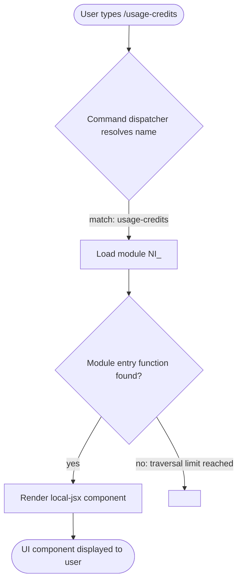

# `/usage-credits`

> Analysis basis: CC v2.1.144 bundle.js (AST extraction + Claude interpretation)
> Minimum version: v2.1.144

---

## Overview

The `/usage-credits` command opens a configuration interface that allows users to set up or manage usage credits within Claude Code, enabling continued operation when a usage limit has been reached. It is registered as a local JSX command (type `local-jsx`), meaning its output is rendered as an interactive UI component rather than plain text. No dynamic call graph or runtime telemetry was captured for this command at depth ≤ 2 traversal.

---

## Registration

| Field | Value |
|---|---|
| type | `local-jsx` |
| name | `usage-credits` |
| description | `Configure usage credits to keep working when you hit a limit` |
| module\_id | `NI_` |
| loc\_line | 2762 |

Analysis basis: CC v2.1.144 bundle.js:+8492458

---

## Input Branching

The depth-2 AST traversal returned an empty call graph and no extracted literals for module `NI_`. The internal branching logic of the rendered JSX component cannot be fully reconstructed from available data.

The following flowchart represents the minimum guaranteed behavior derivable from the registration record alone:



> **Note:** The AST extraction note explicitly records `"no entry functions found for module 'NI_'"`.
> All sub-paths within the rendered component are therefore unverified at this traversal depth.
>
> Analysis basis: CC v2.1.144 bundle.js:+8492458

---

## Behavioral Spec

### Command Dispatch and Module Loading

When the user invokes `/usage-credits`, the command dispatcher matches the name string `"usage-credits"` against the registered command table and selects this entry. Because the type is `local-jsx`, the dispatcher does not produce a text response directly; instead it instantiates a JSX component from module `NI_` and mounts it into the CLI's interactive rendering layer.

```
function dispatchUsageCredits(userInput):
    commandName = parseCommandName(userInput)  # resolves to "usage-credits"
    registration = lookupCommand(commandName)
    if registration.type == "local-jsx":
        component = loadModule(registration.module_id)  # module_id = "NI_"
        mountInteractiveComponent(component)
    else:
        # unreachable given current registration
        renderTextResponse(registration)
```

Analysis basis: CC v2.1.144 bundle.js:+8492458

### Usage Credits Configuration UI

The rendered component is intended to let the user configure usage credits so that Claude Code can continue operating after a usage limit is hit. The precise fields, validation logic, API calls, and confirmation flows within the component are:

<!-- TODO: not found in depth-2 traversal; needs --depth 4 -->

---

## State & Side Effects

| Item | Detail |
|---|---|
| Telemetry | <!-- TODO: not found in depth-2 traversal; needs --depth 4 --> |
| Hook registration | <!-- TODO: not found in depth-2 traversal; needs --depth 4 --> |
| appState changes | <!-- TODO: not found in depth-2 traversal; needs --depth 4 --> |
| Sound | <!-- TODO: not found in depth-2 traversal; needs --depth 4 --> |

> The `telemetry`, `callGraph`, `literals`, and `identifiers` arrays were all empty in the extracted AST data. No side effects can be stated as verified facts at this traversal depth.
>
> Analysis basis: CC v2.1.144 bundle.js:+8492458

---

## Version History

| Version | Change |
|---|---|
| v2.1.144 | Initial analysis; command registered as `local-jsx` type, module `NI_`, line 2762 |

---

## Common Mistakes

1. **Expecting plain-text output.** Because the command type is `local-jsx`, invoking `/usage-credits` renders an interactive UI component rather than printing a text message. Scripted or non-interactive environments may not display this component correctly.
2. **Assuming the command modifies credits immediately.** The description states the command is for *configuration* of usage credits; the actual credit application depends on completing the configuration flow within the rendered component, not merely invoking the slash command.
3. **Invoking the command when no limit is approaching.** The command's primary use case is recovery from or preparation for a usage limit. Using it outside that context may result in a no-op or an incomplete configuration if no credit source is available to configure.
4. **Relying on undocumented sub-behavior.** Because no call graph or literals were recovered for module `NI_`, any assumptions about internal validation rules, API endpoints, or field constraints are unverified and may change across versions.

---

## Appendix — Identifier Mapping

> For bundle debugging only. Identifiers change across versions.

| Identifier | Role |
|---|---|
| `NI_` | Module containing the `/usage-credits` JSX component implementation |

> No additional obfuscated identifiers were present in the extracted AST data (`identifiers` array was empty).
>
> Analysis basis: CC v2.1.144 bundle.js:+8492458