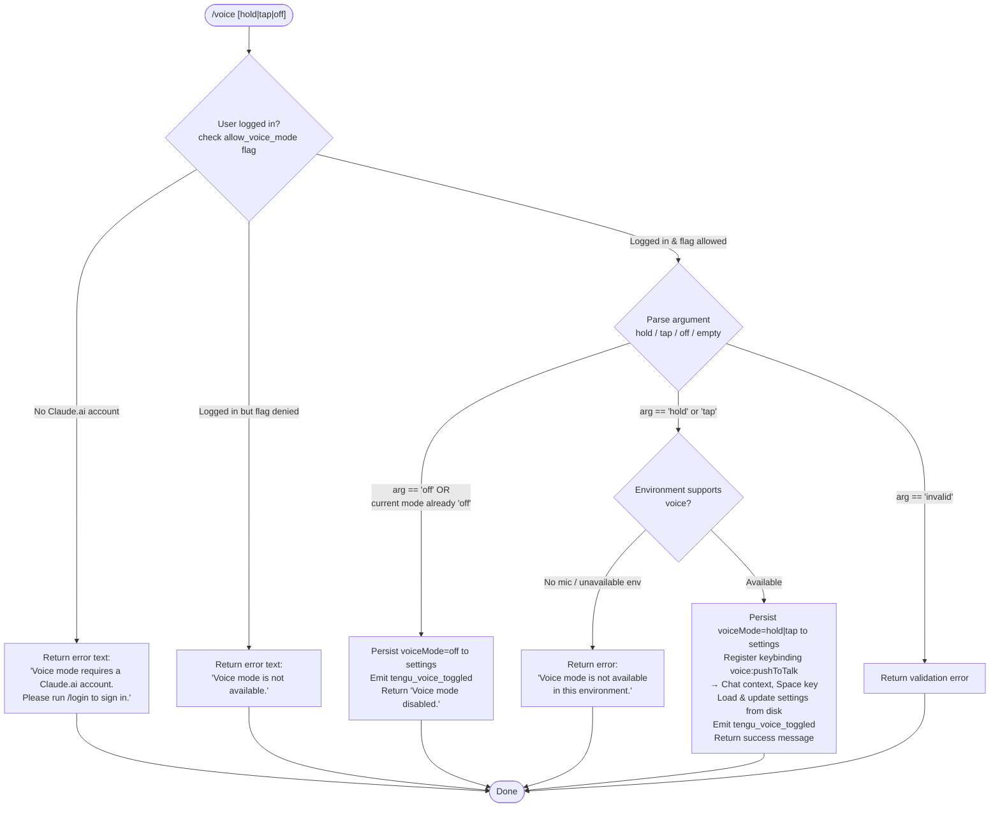

# `/voice`

> Analysis basis: CC v2.1.157 bundle.js (AST extraction + Claude interpretation)
> Minimum version: v2.1.157

---

## Overview

The `/voice` command toggles voice mode in Claude Code, supporting three sub-modes: `hold` (push-to-talk), `tap` (toggle-to-talk), and `off` (disable). It enforces authentication and account eligibility checks before activating voice, persists the selected mode to settings, registers a keybinding for push-to-talk (`Space` in the `Chat` context), and emits a telemetry event on every mode change.

---

## Registration

| Field | Value |
|---|---|
| type | `local` |
| name | `voice` |
| description | `Toggle voice mode` |
| argumentHint | `[hold\|tap\|off]` |
| supportsNonInteractive | `false` |
| isHidden | `null` |
| module_id | `OHK` |
| load_inline | `true` |
| loc_byte | `12674097` |
| loc_byte_end | `12674339` |
| loc_line | `8798` |
| arbor_handler.name | `YD5` |
| arbor_handler.fqn | `claude-2.1.157::YD5` |
| arbor_handler.kind | `AsyncFunction` |
| arbor_handler.resolution_path | `module_id` |
| arbor_handler.n_hits | `1` |

Analysis basis: CC v2.1.157 bundle.js:+12674097

---

## Input Branching

Five distinct execution paths exist (auth failure, feature-flag denial, `off`, `hold`/`tap` enable with environment check, and environment unavailable), requiring a Mermaid flowchart.



---

## Behavioral Spec

### Entry point — `voiceCommandHandler` (YD5)

`YD5` is an `AsyncFunction` resolved via `module_id → OHK`. It is the sole handler for the `/voice` command.

Analysis basis: CC v2.1.157 bundle.js:+12671551

```
async function voiceCommandHandler(args, context):
    # Step 1 — authentication & feature-flag check
    loginState = getLoginState()          # calls authStateReader (EY) → AA6
    featureAllowed = checkFeatureFlag("allow_voice_mode")  # calls featureFlagCheck (hAA → N9)
    # literal "allow_voice_mode" at bundle.js:+12662034

    if NOT loginState.isAuthenticated:
        return { type: "text",            # literal "text" at +12671579
                 text: "Voice mode requires a Claude.ai account. Please run /login to sign in." }
        # literal at +12671592

    if NOT featureAllowed:
        return { type: "text",
                 text: "Voice mode is not available." }
        # literal at +12671691

    # Step 2 — argument normalisation
    rawArg = trimArgument(args)           # calls argumentTrimmer (zD5 → H.trim) at +12671421
    mode = parseVoiceMode(rawArg)         # valid values: "hold", "tap", "off", "invalid"
        # literals at +12671468, +12671480, +12671491, +12671512

    if mode == "invalid":
        return validationError(rawArg)

    # Step 3 — "off" branch
    if mode == "off":
        ok = persistVoiceSetting("off")   # calls settingsWriter (U_) at +12671912
        if NOT ok:
            return { type: "text",
                     text: "Failed to update settings. Check your settings file for syntax errors." }
            # literal at +12672010
        emit("tengu_voice_toggled", { mode: "off" })   # at +12672093
        return { type: "text", text: "Voice mode disabled." }
        # literal at +12672148

    # Step 4 — enable branch (hold / tap)
    envAvailable = checkVoiceEnvironment()   # calls envChecker (bxH) at +12673492
    if NOT envAvailable:
        return { type: "text",
                 text: "Voice mode is not available in this environment." }
        # literal at +12672392

    # Step 5 — register keybinding
    registerKeybinding({                  # calls keybindingLoader (NX) at +12673358
        action:  "voice:pushToTalk",      # literal at +12673361
        context: "Chat",                  # literal at +12673380
        key:     "Space"                  # literal at +12673387
    })

    # Step 6 — persist & notify
    ok = persistVoiceSetting(mode)        # calls settingsWriter (U_) at +12671912
    if NOT ok:
        return { type: "text",
                 text: "Failed to update settings. Check your settings file for syntax errors." }

    emit("tengu_voice_toggled", { mode: mode })
    return success(mode)
```

Analysis basis: CC v2.1.157 bundle.js:+12671551 – +12673819

---

### Sub-feature: Authentication & feature-flag resolution (`AA6` / `hAA` → `N9`)

```
function resolveAuthAndFlag(context):
    loginState  = readAuthState()          # AA6 → yAA → EY
    flagAllowed = readFeatureFlag(         # AA6 → hAA → N9
        "allow_voice_mode"                 # +12662034
    )
    return { loginState, flagAllowed }
```

The feature flag `allow_voice_mode` is read from user settings. The flag check (`N9`) also inspects plan-level entitlements: plan values `"enterprise"` and `"team"` are referenced in the same traversal path (literals at +4107376 and +4107411).

Analysis basis: CC v2.1.157 bundle.js:+12662031, +12662034, +12662076, +12662083, +12662090

---

### Sub-feature: Argument parsing (`zD5`)

```
function parseVoiceMode(rawArg):
    trimmed = rawArg.trim()               # H.trim at +12671421, +12671843
    if trimmed == "hold":   return "hold"
    if trimmed == "tap":    return "tap"
    if trimmed == "off":    return "off"
    return "invalid"
```

Accepted literal values: `"hold"` (+12671468), `"tap"` (+12671480), `"off"` (+12671491). Any other non-empty value produces `"invalid"` (+12671512).

Analysis basis: CC v2.1.157 bundle.js:+12671421

---

### Sub-feature: Settings persistence (`U_`)

`U_` (settingsWriter) loads the settings file from disk, applies the `voiceMode` field, and writes back atomically. Internally it calls:

- `loadSettingsFromDisk` (`Cp` → `Ta8`) — reads `~/.claude/settings.json` and `settings.local.json` (literals at +1219331, +1219341, +1219403).
- `writeSettingFile` (`bF6`) — uses `path.dirname` + `mkdir` + `readFile`/`writeFile`/`appendFile` (async `L3H.*` calls).
- `clearCaches` (`vz`) — clears two in-memory caches (`kC6`, `Ru8`) after a successful write (+26612, +26624).
- Settings write failure returns the human-readable error string at +12672010.

Analysis basis: CC v2.1.157 bundle.js:+12671912, +1228239, +1076274, +26612

---

### Sub-feature: Environment availability check (`bxH`)

```
function checkVoiceEnvironment():
    platform = getPlatformLower()          # H.toLowerCase at +27603
    langSet  = getSupportedLanguages()     # B3A.has check at +27653
    parts    = splitEnvDescriptor()        # _.split at +27718
    # Returns false when running in an environment without microphone access
    # e.g. non-interactive, piped stdin, or unsupported OS configuration
    return isVoiceCapableEnvironment(platform, langSet, parts)
```

On macOS, the error path suggests the user open **System Settings → Privacy & Security → Microphone** (literal at +12672899) — this string appears in the broader error message branch when the environment is present but permission is denied.

Analysis basis: CC v2.1.157 bundle.js:+12673492, +27603, +27653, +27718, +12672899

---

### Sub-feature: Keybinding registration (`NX`)

```
function registerPushToTalkKeybinding():
    config = loadKeybindingsConfig()       # NX → z98 → CD6
        # reads keybindings.json at +3799407
        # expects top-level "bindings" array (+3801439)
    defaultBinding = {
        action:  "voice:pushToTalk",       # +12673361
        context: "Chat",                   # +12673380
        key:     "Space"                   # +12673387
    }
    resolvedBindings = resolveActionBindings(config, defaultBinding)
        # NX → Y98 → BJ_ → UJ_
    if actionNotFoundInConfig:
        emit("tengu_keybinding_fallback_used")   # +3808346
        useDefaultBinding()
    deduplicateAndApply(resolvedBindings)
        # NX checks ysq.has / ysq.add to avoid double-registration (+3808322, +3808333)
```

Keybinding config validation emits `tengu_custom_keybindings_loaded` (+3799313) on success and `tengu_keybinding_config_invalid_format` / `tengu_keybinding_config_invalid_structure` / `tengu_keybinding_config_parse_error` on failure (literals at +3801482, +3802093, +3802815).

Analysis basis: CC v2.1.157 bundle.js:+12673358, +3808264, +3808274, +3808322

---

### Sub-feature: Telemetry emission (`d` — generic feature-event sink)

Every completed command invocation calls into one of three generic telemetry wrappers:

| Wrapper | Event emitted | Meaning |
|---|---|---|
| `hH` (`d`) | `tengu_feature_ok` | Command succeeded |
| `bH` (`d`) | `tengu_feature_bad` | Command failed with a non-recoverable error |
| `t6` (`d`) | `tengu_feature_sad` | Command produced a warning / partial result |

The voice-specific event `tengu_voice_toggled` is emitted inline inside the handler at +12672093 in addition to the generic wrapper.

Analysis basis: CC v2.1.157 bundle.js:+966031, +966091, +966168, +12672093

---

## State & Side Effects

| Item | Detail |
|---|---|
| Telemetry — voice-specific | `tengu_voice_toggled` emitted on every mode change (+12672093) |
| Telemetry — generic | `tengu_feature_ok` / `tengu_feature_bad` / `tengu_feature_sad` (+966033, +966091, +966168) |
| Telemetry — keybindings | `tengu_custom_keybindings_loaded`, `tengu_keybinding_fallback_used`, `tengu_keybinding_config_invalid_format`, `tengu_keybinding_config_invalid_structure`, `tengu_keybinding_config_parse_error`, `tengu_keybinding_customization_release` |
| Telemetry — config I/O | `tengu_config_lock_contention`, `tengu_config_stale_write`, `tengu_config_auth_loss_prevented`, `tengu_config_parse_error` |
| Settings written | `voiceMode` field in `~/.claude/settings.json` (or local variant) |
| In-memory caches cleared | Two internal caches (`kC6`, `Ru8`) invalidated after each settings write (+26612, +26624) |
| Keybinding registered | `voice:pushToTalk` → `Space` in `Chat` context, deduplicated via a Set (`ysq`) |
| Non-interactive support | `supportsNonInteractive: false` — command is CLI-interactive only |
| macOS permission hint | Surfaces "System Settings → Privacy & Security → Microphone" string when mic permission is absent (+12672899) |
| Daemon / background sessions | Settings writer (`U_`) interacts with background-session infrastructure (`GfA`, `DfA`) for file locking; no direct daemon spawn from this command |

---

## Version History

| Version | Change |
|---|---|
| v2.1.157 | Initial analysis |

---

## Common Mistakes

1. **Running without a Claude.ai account.** `/voice` requires OAuth login (`/login`). API-key-only authentication will produce the "Voice mode requires a Claude.ai account" error.
2. **Passing an unrecognised argument.** Only `hold`, `tap`, and `off` are accepted. Any other token is treated as `"invalid"` and returns an error; omitting the argument may default to cycling or produce a validation error.
3. **Using in a non-interactive/piped session.** `supportsNonInteractive` is `false`; piping input to Claude Code and attempting `/voice` will be rejected before the handler runs.
4. **Missing microphone permissions on macOS.** The command will succeed in updating settings but the voice feature will silently fail until microphone access is granted in System Settings → Privacy & Security → Microphone.
5. **Malformed `keybindings.json`.** If the user has a custom keybindings file that lacks a top-level `"bindings"` array or contains duplicate keys in the same context, the command will log a validation error and fall back to the default `Space` binding.
6. **Expecting the setting to survive a corrupted settings file.** If `~/.claude/settings.json` has syntax errors, the write will fail and the command will return the "Failed to update settings. Check your settings file for syntax errors." message.

---

## Appendix — Identifier Mapping

> For bundle debugging only. Identifiers change across versions.

| Identifier | Role |
|---|---|
| `YD5` | Main voice command handler (`AsyncFunction`, arbor entry point) |
| `AA6` | Auth + feature-flag resolution coordinator |
| `yAA` | Auth state reader (calls `EY`) |
| `EY` | Core auth/login state resolver |
| `BK` | Auth token accessor |
| `pP` | OAuth/profile state reader |
| `NO` | First-party auth type check |
| `AX` | Auth context accessor |
| `F3` | Auth credential builder |
| `tO6` | Auth refresh helper |
| `rgH` | Auth state formatter |
| `BZ` | Auth state subscriber |
| `hAA` | Feature flag gate for voice (`allow_voice_mode`) |
| `N9` | Feature flag reader (checks plan entitlements) |
| `n89` | Feature flag disk reader |
| `gR` | Feature flag state aggregator |
| `L1` | Feature flag cache loader |
| `gKH` | Feature flag channel helper |
| `Dw6` | Feature flag refresh coordinator |
| `_y6` | Auth context injector |
| `zD5` | Argument parser / voice mode token normaliser |
| `H` | String utility / random/timeout host (context-dependent) |
| `U_` | Settings persistence / writer for voice mode |
| `ZO` | Settings path resolver |
| `Ga8` | Settings aggregator (merges all layers) |
| `wP` | Settings file watcher / reader |
| `Ni` | File reader with encoding detection |
| `F$` | File stat / real-path resolver |
| `N` | Platform/environment detector |
| `nB6` | File content normaliser |
| `iB6` | File slice helper |
| `P8` | ENOENT error classifier |
| `j8` | Generic error code mapper |
| `Jo8` | Settings timestamp recorder |
| `iGH` | Settings index / path builder |
| `vg6` | Settings path resolver (project-relative) |
| `yL6` | Atomic file writer (symlink-safe) |
| `O` | Background session state holder |
| `k8` | Background session status reader |
| `RH` | JSON serialiser wrapper |
| `vz` | In-memory settings cache invalidator |
| `bF6` | Settings file I/O handler (read/write/append) |
| `h6` | AsyncLocalStorage settings store reader |
| `lB6` | AsyncLocalStorage getter |
| `tr8` | Settings inheritance resolver |
| `A` | Multi-purpose array/string utility |
| `CF6` | Git ignore checker (settings file filtering) |
| `G_` | Git command runner |
| `Z94` | Path normaliser (tilde expansion, absolute check) |
| `lkA` | Git ls-files tracker |
| `nkA` | Git config reader helper |
| `cb` | Claude config directory path builder |
| `hH` | `tengu_feature_ok` telemetry emitter |
| `d` | Generic feature telemetry dispatcher |
| `t6` | `tengu_feature_sad` telemetry emitter |
| `bH` | `tengu_feature_bad` telemetry emitter |
| `SH` | Structured logger / error logger |
| `F_` | Error stringifier |
| `CH` | String coercion helper |
| `X_4` | Log ring-buffer manager |
| `M` | Plugin / temp directory cleaner |
| `cS6` | Plugin path validator |
| `lS6` | Plugin synced-path resolver |
| `$` | Daemon status reader |
| `Ls1` | Daemon status file loader |
| `ii` | Daemon status parser |
| `s1H` | Daemon status struct builder |
| `s9` | AsyncLocalStorage daemon-context reader |
| `uI6` | Daemon status file path builder |
| `NX` | Keybinding registration coordinator |
| `z98` | Keybinding config reader |
| `CD6` | Keybinding config file parser |
| `xJ_` | Keybinding block validator |
| `uU` | Keybinding feature-flag gate |
| `S4H` | Keybindings file path builder |
| `p6` | JSON.parse wrapper |
| `M98` | Keybinding array shape validator |
| `K98` | Keybinding entry expander |
| `Gsq` | Keybinding telemetry emitter (custom loaded) |
| `CJ_` | Duplicate key detector in keybinding JSON |
| `bJ_` | Keybinding block normaliser |
| `EH` | Error message stringifier |
| `Y98` | Keybinding action resolver |
| `BJ_` | Keybinding action lookup |
| `UJ_` | Keybinding action registry reader |
| `W6H` | Keybinding map builder |
| `bxH` | Voice environment availability checker |
| `S6` | Config/settings file watcher coordinator |
| `sz_` | Config watch path resolver |
| `szH` | Config file reader with backup support |
| `gb` | Config comment stripper |
| `yFq` | Config backup directory scanner |
| `qY_` | Config backup path builder |
| `w` | Background session lifecycle manager |
| `S` | Background session process supervisor |
| `uy8` | macOS memory / platform reporter |
| `Lw6` | Background session roster reader |
| `B` | MCP session filter |
| `G6` | Config state reader |
| `DfA` | Background session claim dispatcher |
| `GfA` | Background session lifecycle runner |
| `D` | Background session pool health monitor |
| `b17` | File-watch debouncer for config changes |
| `Vr` | Config change event emitter |
| `K9` | Finaliser (FinalizationRegistry) registrar |
| `z8` | Global config read/write coordinator |
| `AY_` | Global config atomic writer (with lock) |
| `dOq` | Config lock acquisition helper |
| `qK_` | Config lock state machine |
| `AY6` | Config merge helper |
| `V` | Path prefix matcher |
| `P` | MCP server lifecycle manager |
| `Lx8` | MCP server startup helper |
| `E` | Slice utility |
| `pQH` | Config schema validator |
| `IFq` | Config entry iterator |
| `UQH` | Config write timestamp recorder |
| `_Y_` | Config fallback writer (auth-loss guard) |