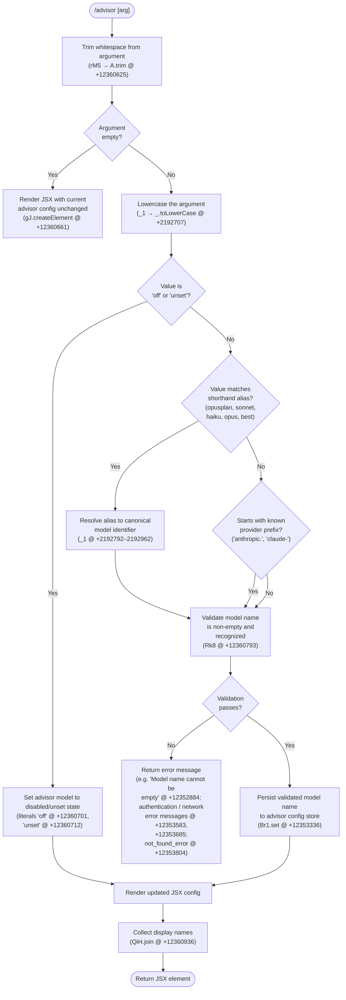

# `/advisor`

> Analysis basis: CC v2.1.158 bundle.js (AST extraction + Claude interpretation)
> Minimum version: v2.1.158

---

## Overview

The `/advisor` command configures the **Advisor Tool**, a subsystem that consults a stronger (or explicitly named) model for guidance at key moments during an ongoing task. When invoked, the command parses a model identifier supplied by the user, validates it against the known model catalog, and then renders a JSX component that reflects the updated advisor configuration. The command is delivered as an async function resolved through a module-id load path (`module_id: "cr1"`).

---

## Registration

| Field | Value |
|---|---|
| type | `local-jsx` |
| name | `advisor` |
| description | `Configure the Advisor Tool to consult a stronger model for guidance at key moments during a task` |
| module_id | `cr1` |
| load_inline | `true` |
| argumentHint | `null` |
| isHidden | `null` |
| loc_byte | `12361169` |
| loc_byte_end | `12361456` |
| loc_line | `8258` |
| arbor_handler.name | `rM5` |
| arbor_handler.fqn | `claude-2.1.158::rM5` |
| arbor_handler.kind | `AsyncFunction` |
| arbor_handler.resolution_path | `module_id` |
| arbor_handler.n_hits | `1` |

Analysis basis: CC v2.1.158 bundle.js:+12361169

---

## Input Branching

The command processes the user-supplied argument through multiple distinct branches: empty/whitespace input, a shorthand alias, a well-known tier keyword, an arbitrary model name, and finally an "off"/"unset" sentinel. Five or more distinct paths require a flowchart.



---

## Behavioral Spec

### Handler Entry — `advisorCommandHandler` (`rM5`)

The async handler is the sole entry point resolved by Arbor via `module_id → cr1`.

```
async function advisorCommandHandler(commandInput, context):
    rawArg = commandInput.trim()                          // +12360625

    if rawArg is empty:
        return renderAdvisorPanel(getCurrentAdvisorConfig())

    normalizedArg = normalizeModelInput(rawArg)           // calls _1
    validatedModel = validateAndResolveModel(normalizedArg) // calls Rk8

    if validatedModel is error:
        return renderError(validatedModel.message)

    persistAdvisorModel(validatedModel)                   // Br1.set +12353336
    return renderAdvisorPanel(validatedModel)             // gJ.createElement +12360661
```

Analysis basis: CC v2.1.158 bundle.js:+12360625, +12360661, +12360793

---

### Sub-feature: Model Alias & Normalization (`normalizeModelInput`, `_1`)

Shorthand tier names are mapped to canonical model strings before validation. The function also strips formatting artifacts from the raw input.

```
function normalizeModelInput(raw):
    lowered = raw.toLowerCase()                           // +2192707

    // Replace bold-markdown wrapper if present "[1m]" fragment
    cleaned = lowered.replace(formattingPattern, "")      // +2192735, literal "[1m]" @ +2192818

    alias = matchAlias(cleaned)
    // Known aliases (literals at +2192792–2192962):
    //   "opusplan" → resolve via opusplan path
    //   "sonnet"   → resolve to current sonnet model
    //   "haiku"    → resolve to current haiku model
    //   "opus"     → resolve to current opus model
    //   "best"     → resolve to highest-capability model

    if alias found:
        return resolveAliasToModel(alias)                 // UN, cG, AOq paths

    return cleaned
```

Analysis basis: CC v2.1.158 bundle.js:+2192707, +2192735, +2192792

---

### Sub-feature: Model Validation (`validateAndResolveModel`, `Rk8`)

The validation function enforces that the model name is non-empty, recognized in the catalog, and not blocked by a deny-list.

```
function validateAndResolveModel(modelName):
    trimmed = modelName.trim()                             // +12352847

    if trimmed is empty:
        throw Error("Model name cannot be empty")         // literal @ +12352884

    lowered = trimmed.toLowerCase()                        // +12353007

    if lowered is in blocklist (n1H):                     // +12353026
        return error("model not permitted")

    if Br1 cache already has this model:                  // Br1.has @ +12353128
        return cachedEntry

    // Probe the API with a minimal request (Vu @ +12353173)
    probeResult = probeModelViaApi(trimmed, context)

    if probeResult is auth error:
        return error("Authentication failed. Please check your API credentials.")
                                                          // literal @ +12353583
    if probeResult is network error:
        return error("Network error. Please check your internet connection.")
                                                          // literal @ +12353685
    if probeResult.type == "not_found_error":             // literals @ +12353783, +12353804
        return error("model: " + trimmed + " not found") // literal "model:" @ +12353886

    Br1.set(lowered, probeResult)                         // +12353336
    return probeResult
```

Ephemeral cache key `"ephemeral"` (literal at +12353317) and a minimal `"Hi"` probe message (literal at +12353292) are used for the validation request. The probe is tagged as `"model_validation"` internally (literal at +12353223).

Analysis basis: CC v2.1.158 bundle.js:+12352847, +12352884, +12353007, +12353173, +12353336

---

### Sub-feature: API Probe (`modelApiProbe`, `Vu`)

The validation probe dispatches a lightweight API call. It integrates with the main API client pipeline (`OU`) and inherits full header construction, OAuth token handling, and retry logic.

```
async function modelApiProbe(modelName, context):
    headers = buildApiHeaders(context)     // OU @ +13164741
    // Headers include:
    //   "x-app": "cli" / "cli-bg"         +2914891, +2914904, +2914913
    //   "User-Agent": <agent string>       +2914919
    //   "X-Claude-Code-Session-Id"         +2914937
    //   "x-claude-code-agent-id"           +2915095

    request = {
        model: modelName,
        messages: [{ role: "user", content: "Hi" }],  // +12353292
        max_tokens: 1,
        cache_control: { type: "ephemeral" }           // +12353317
    }

    response = await callAnthropicApi(request, headers)

    // Side-query label applied: "side_query"           // literal @ +13164773
    return parseProbeResponse(response)
```

Analysis basis: CC v2.1.158 bundle.js:+13164741, +13164773, +12353292, +12353317

---

### Sub-feature: Model Name Display (`displayNameCollector`)

After a successful configuration update, the handler collects human-readable display names for the configured model set and joins them for the JSX panel.

```
function buildDisplayString(advisorConfig):
    names = collectDisplayNames(advisorConfig)   // HP6 @ +12360867
    // HP6 lowercases and checks includes        // +5349132, +5349155

    return names.join(", ")                      // QiH.join @ +12360936, literal ", " @ +12360945
```

Analysis basis: CC v2.1.158 bundle.js:+12360867, +12360936, +12360945

---

### Sub-feature: Model Resolution Helpers

Several helper functions resolve shorthand tier names to concrete model identifiers. The known model strings found in the traversal include (illustrative, non-exhaustive):

- `"claude-opus-4-0"` (literal @ +2932671)
- `"claude-sonnet-4-0"` (literal @ +2932694)
- `"claude-opus-4-1"`, `"claude-opus-4-5"`, `"claude-opus-4-6"` (@ +2932864, +2932887, +2932910)
- `"claude-sonnet-4-5"`, `"claude-sonnet-4-6"` (@ +2932958, +2932983)
- `"claude-haiku-4-5"` (@ +2933008)

Provider prefix checks recognise `"anthropic."` (@ +2186761) and `"claude-"` (@ +2186382).

```
function resolveModelForProvider(alias, providerContext):
    provider = detectProvider(providerContext)
    // Recognized providers: bedrock, foundry, anthropicAws,
    //   mantle, vertex, firstParty, gateway
    //   (literals @ +2046248, +2046298, +2046354, +2046408, +2046456, +2046465, +2046937)

    canonical = lookupCanonicalName(alias, provider)  // iM, w5, WA pipeline
    return canonical
```

Analysis basis: CC v2.1.158 bundle.js:+2046248, +2186382, +2186761, +2932671

---

## State & Side Effects

| Item | Detail |
|---|---|
| Telemetry (API success) | `tengu_api_success` — fired on successful Anthropic API response (@ +13166224); emitted by the shared API pipeline reached during model probe |
| Telemetry (prompt cache) | `tengu_prompt_cache_1h_config` — emitted when 1-hour prompt cache config path is taken (@ +13125632) |
| Telemetry (background/daemon) | `tengu_bg_dispatch_sigkill_escalate`, `tengu_bg_dispatch_low_mem`, `tengu_bg_spare_enable`, `tengu_bg_spare_claim`, `tengu_bg_spare_claim_fail`, `tengu_bg_proto_mismatch`, `tengu_bg_dispatch_stale_drop`, `tengu_bg_attach_legacy_autorespawn`, `tengu_bg_attach`, `tengu_bg_attach_stall_gave_up`, `tengu_bg_attach_stall_respawn`, `tengu_bg_attach_kick` — emitted by background session infrastructure reached transitively during the API probe |
| Advisor model store | `Br1` (Map) — keyed by lowercase model name; updated via `Br1.set` on successful validation (@ +12353336); checked via `Br1.has` before re-probing (@ +12353128) |
| API request | A single-message probe request (`max_tokens: 1`) is dispatched to the Anthropic API to verify the model exists; tagged `"side_query"` |
| JSX render | Returns a `gJ.createElement` tree (@ +12360661) representing the updated advisor panel |
| appState changes | Advisor model preference is persisted in config state after successful validation |
| Sound | None observed in traversal |
| Hook registration | None observed in traversal |

---

## Version History

| Version | Change |
|---|---|
| v2.1.158 | Initial analysis |

---

## Common Mistakes

1. **Providing an alias without checking provider compatibility** — aliases such as `"opus"` or `"best"` resolve differently depending on the active provider (Bedrock, Vertex, etc.). On non-first-party providers the resolved canonical name may differ from what is expected.
2. **Expecting instant effect with an unavailable model** — the command dispatches a live API probe; if the network is unreachable or credentials are invalid, the command returns an error and leaves the previous advisor configuration unchanged.
3. **Using `"off"` vs `"unset"` interchangeably without knowing the difference** — both literals are recognized (@ +12360701, +12360712), but they may map to subtly different internal states (disabled vs. reverted-to-default); prefer `"off"` to fully disable.
4. **Passing a model string with uppercase letters** — the handler lowercases all input before matching; however, the raw (pre-lowercase) value is sent to the API probe, so mixed-case names that differ only in case from a valid model may still fail API-side lookup.
5. **Omitting the argument** — invoking `/advisor` with no argument silently renders the current configuration without making any change; this is intentional read-only behavior, not a bug.

---

## Appendix — Identifier Mapping

> For bundle debugging only. Identifiers change across versions.

| Identifier | Role |
|---|---|
| `rM5` | Main async handler for `/advisor` command (arbor_handler) |
| `_1` | Model alias normalization and input cleaning function |
| `Rk8` | Model validation and API-probe orchestrator |
| `Vu` | Anthropic API probe dispatcher (lightweight side-query) |
| `OU` | Core API client / request builder |
| `bQ` | Model name parsing and provider-prefix checking |
| `pM5` | Model alias resolution wrapper |
| `UM5` | Canonical model name lookup by tier/alias |
| `HP6` | Display name collector (lowercase + includes check) |
| `V0` | Alias-to-model resolution (opusplan path) |
| `o1H` | Sub-resolver within alias pipeline |
| `CH` | String coercion / formatting utility |
| `i1H` | Blocklist membership check |
| `UN` | Tier-to-model resolver entry |
| `iM` | Provider-aware model lookup |
| `WA` | Provider canonical name mapper |
| `w5` | Model-set builder / capabilities resolver |
| `pxH` | Provider filter predicate |
| `IC4` | Capability-aware model selector |
| `a1q` | Object-entries iterator for model map |
| `ei6` | Model-set finder |
| `LFH` | Lazy model-set builder |
| `cG` | Composite model resolver (iM + w5 + WA) |
| `AOq` | Top-level alias dispatcher |
| `xo6` | Model string inclusion checker |
| `fFH` | String formatter for model name output |
| `Hr6` | Object-entries model iterator |
| `B_` | Base model-map builder |
| `KFH` | Known-model-list membership check |
| `_Oq` | Model index finder |
| `Lm4` | Model includes + alias resolution chain |
| `fm4` | Model-family prefix matcher |
| `HOq` | `"claude-"` prefix checker |
| `nS6` | Plugin / path normalization utility |
| `K` | String pad/map utility |
| `Mw` | Async store getter |
| `ZH7` | String split/trim/slice utility |
| `v9` | Background context resolver |
| `Jr` | User-agent / issue-reporter helper |
| `I6` | Internal query dispatcher |
| `b1_` | URL encoder / header builder |
| `N` | Request header assembler |
| `IO` | Network I/O wrapper |
| `$Oq` | Boolean coercion helper |
| `EY` | Auth configuration resolver |
| `GH7` | Session-ID generator |
| `R_` | Remote container ID resolver |
| `ic6` | Proxy auth helper invoker |
| `kH7` | API stream / response handler |
| `Lw` | Provider type classifier |
| `Cz` | OAuth / credential manager |
| `TH7` | Streaming message processor |
| `nOH` | Rate-limit / promise scheduler |
| `em8` | Timestamp helper |
| `cO6` | Authorization header normalizer |
| `uzH` | SDK error logger |
| `mH8` | SSE frame parser |
| `S` | Supervisor/file-watch handler |
| `h` | Focus/blur idle timer |
| `I` | Away-summary generator |
| `E` | Response event processor |
| `$0H` | Model family finder |
| `qW` | Token formatter |
| `pP` | Auth strategy selector |
| `GFH` | Provider-info assembler |
| `ja6` | WIF credential resolver |
| `G` | OAuth token getter |
| `X` | Socket/stream multiplexer |
| `J` | Stream demuxer |
| `w` | Background process manager |
| `Qf` | Stream finalizer |
| `FB5` | Background session protocol handler |
| `EH` | String utility (toString wrapper) |
| `GEH` | Model eligibility filter |
| `f9` | Model capability checker |
| `YR` | Provider-map reducer |
| `T` | Transport type registry |
| `Y25` | Model-list searcher |
| `Q9A` | SHA-256 hash utility |
| `po6` | Cache-control header builder |
| `y1` | String coercion helper |
| `uo6` | Async-local-storage store accessor |
| `T_8` | Prompt-cache config applicator |
| `cIH` | Repl-thread context injector |
| `GA` | Agent state compositor |
| `Cp8` | Context-window calculator |
| `G6` | Rendering / output-stream manager |
| `bp8` | File-extension checker |
| `PV` | Compliance / HIPAA flag resolver |
| `K3_` | Compliance config reader |
| `WEH` | Compliance string builder |
| `vqK` | Version-query helper |
| `tw` | Text replacement / scrubbing utility |
| `nH8` | Temperature / parameter injector |
| `IP` | Message mapper |
| `fDH` | API payload finalizer |
| `RH` | JSON serializer |
| `wU` | Random-bytes session-ID generator |
| `_7` | Agent-state / stream combiner |
| `QMH` | Metrics collector |
| `d` | Date/timing helper |
| `xJ6` | Cache-block injector |
| `TM9` | Cache-block builder |
| `UnH` | Cache-entry constructor |
| `bJ6` | Cache-TTL selector |
| `jc` | Agent-type dispatcher |
| `mk7` | Built-in agent name parser |
| `M8H` | Thread-type classifier |
| `SH` | Structured log / error reporter |
| `m96` | Metrics finalizer |
| `pM5` | Model alias resolution wrapper (duplicate row — same as above) |
| `UM5` | Canonical model name lookup (duplicate row — same as above) |
| `HP6` | Display name collector (duplicate row — same as above) |