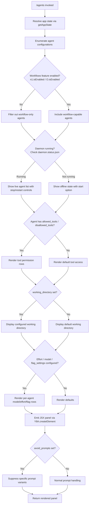

# `/agents`

> Analysis basis: CC v2.1.157 bundle.js (AST extraction + Claude interpretation)
> Minimum version: v2.1.157

---

## Overview

The `/agents` command provides a management interface for agent configurations within Claude Code. It renders an interactive JSX panel that allows the user to inspect, configure, and control agent instances — including their allowed/disallowed tools, working directories, session parameters, and daemon lifecycle (start/stop). The command also integrates with multi-agent workflow and feature-flag systems to determine which agents are eligible for display and control.

---

## Registration

| Field | Value |
|---|---|
| type | `local-jsx` |
| name | `agents` |
| description | `Manage agent configurations` |
| module_id | `Ki1` |
| load_inline | `true` |
| loc_byte | `12289721` |
| loc_byte_end | `12289846` |
| loc_line | `8227` |
| arbor_handler.name | `Zf5` |
| arbor_handler.fqn | `claude-2.1.157::Zf5` |
| arbor_handler.kind | `AsyncFunction` |
| arbor_handler.resolution_path | `module_id` |
| arbor_handler.n_hits | `0` |

Analysis basis: CC v2.1.157 bundle.js:+12289721

---

## Input Branching

The command's rendering logic involves more than three distinct branches based on feature flags, agent state, daemon status, and workflow eligibility. A Mermaid flowchart is used below.



Analysis basis: CC v2.1.157 bundle.js:+12289572 (handler entry), +10679373 (getAppState), +9615998 (rendering tree root), +9616405 (feature flag check), +9616416 (isEnabled), +10679453 (agent list resolution)

---

## Behavioral Spec

### 1. Handler Entry and Component Assembly

The primary handler (`Zf5`, resolved via `module_id` → `Ki1`) is an `AsyncFunction`. Upon invocation it:

1. Calls the agent-resolution helper (`V_`) to retrieve the current set of agent configurations from app state.
2. Calls the JSX component builder (`Zv`) to assemble the interactive panel.
3. Passes the result to `Y8A.createElement` to produce the renderable JSX tree.

```
async function agentsCommandHandler(context):
    agentList   = resolveAgentConfigurations(context)
    panelJSX    = buildAgentsPanel(agentList, context)
    return createElement(panelJSX)
```

Analysis basis: CC v2.1.157 bundle.js:+12289572, +12289580, +12289593

---

### 2. Agent Configuration Resolution (`V_`)

Retrieves and normalises agent configuration entries from the current app state.

```
function resolveAgentConfigurations(context):
    state = appState.getAppState()

    // Find the most-recently-active agent entry
    lastAgent = agentList.findLast(entry =>
        entry matches working_directory / allowed_tools / disallowed_tools criteria
    )

    // Build normalised config snapshots
    allowedConfig    = buildAllowedToolsView(lastAgent)   // _V8 → aA
    disallowedConfig = buildDisallowedToolsView(lastAgent) // AV8 → aA

    return { state, lastAgent, allowedConfig, disallowedConfig }
```

Key configuration field names extracted from the bundle:

| Field | Purpose |
|---|---|
| `working_directory` | Per-agent working directory override |
| `allowed_tools` | Explicit tool allow-list for this agent |
| `disallowed_tools` | Explicit tool deny-list for this agent |
| `avoid_prompts` | Suppresses certain prompt variants |
| `session` | Session identifier / type |
| `effort` | Effort level configuration |
| `model` | Model override for this agent |
| `flag_settings` | Feature flags scoped to this agent |

Analysis basis: CC v2.1.157 bundle.js:+10679373, +10679453, +10679478, +10679533, +10679588, +10679649, +10679948, +10679973, +10679986, +10679998, +10679551, +10679609

---

### 3. Panel Builder (`Zv`) — Main Rendering Orchestrator

Coordinates all sub-panels and wires up event handlers before returning the composite JSX tree.

```
function buildAgentsPanel(agentList, context):
    // 1. Boolean-normalise configuration values ("yes"/"on" → true, "no"/"off" → false)
    boolConfig = normaliseBooleanConfig(context)  // CH, x0

    // 2. Resolve display locale / formatting context
    displayContext = resolveDisplayContext()       // G6 with az6, sz6, Ex

    // 3. Build the agent list rows
    rows = []
    for each agent in agentList:
        row = buildAgentRow(agent)                // Y.push — u2H, Re1
        rows.push(row)

    // 4. Wire keyboard/event handler
    keyHandler = buildKeyHandler()                // eQ_, Z_

    // 5. Wire workflow sub-panel
    workflowPanel = buildWorkflowPanel()          // JW → F18, r89, RP_, OP7

    // 6. Collect blocked / denied tool entries
    deniedPanel = buildDeniedToolsPanel()         // NAH → dE6 → n5H, vi_, LT1

    // 7. Build the per-agent detail panel
    detailPanel = buildDetailPanel()              // Hd_ → _C, EeH, Z_

    // 8. Resolve active-agent indicator
    activeIndicator = buildActiveIndicator()      // q4 → i6, A1H

    // 9. Assemble daemon control items
    daemonItems = []
    daemonItems.push(daemonStopItem)              // z → hH ("daemon_stop")
    daemonItems.push(daemonStopFailedItem)        // z → bH ("daemon_stop_failed")
    daemonItems.push(firstPartyItem)              // z → hy ("firstParty")
    daemonItems.push(daemonShutdownItem)          // z → Fm → Promise.race/all, process.exit

    // 10. Assemble supervisor session view
    supervisorView = buildSupervisorView()        // js → supervisor logic

    // 11. Feature-flag gates
    hasAgent   = agentSet.has(...)                // A.has
    someActive = agentList.some(...)              // K.some
    featureY4  = checkFeatureY4()                // y4
    isEnabled  = featureFlag.isEnabled()          // n1.isEnabled, O.isEnabled

    // 12. Filter and map final agent display list
    filtered = agentList
        .filter(a => !blockedSet.has(a))          // K.filter, clH.has → "blocked"
        .map(a => renderAgent(a))                 // K.map

    // 13. Remote / CLI context detection
    clientKind = detectClientKind()               // xX → "cli" | "remote"
    includedKinds = ["sdk-ts","sdk-py","sdk-cli","local-agent"]

    return compositePanel(rows, keyHandler, workflowPanel,
                          deniedPanel, detailPanel, daemonItems,
                          supervisorView, filtered)
```

Analysis basis: CC v2.1.157 bundle.js:+9615998, +9616037, +9616109, +9616124, +9616138, +9616160, +9616175, +9616187, +9616247, +9616347, +9616365, +9616393, +9616405, +9616416, +9616492, +9616507, +9616535, +9616546, +9616588, +9616633

---

### 4. Boolean Configuration Normalisation (`CH` / `x0`)

Converts string literals to booleans for flag fields:

```
function normaliseBooleanConfig(value):
    if value in ["yes", "on"]:  return true
    if value in ["no",  "off"]: return false
    return value   // pass through non-boolean values unchanged
```

Accepted truthy strings: `"yes"` (bundle.js:+26948), `"on"` (bundle.js:+26954)  
Accepted falsy strings: `"no"` (bundle.js:+27099), `"off"` (bundle.js:+27104)

Analysis basis: CC v2.1.157 bundle.js:+26899, +26948, +26954, +27049, +27099, +27104

---

### 5. Agent Row Renderer (`u2H` / `Re1`)

Renders one row per configured agent with a column-padded layout.

```
function buildAgentRow(agent):
    // Check config file existence; handle ENOENT gracefully
    configData = loadAgentConfig(agent)  // s9, j8 — "ENOENT" guard

    // Format columns; pad each label to fixed width
    labelColumns = agentKeys
        .map(key => key.padEnd(COLUMN_WIDTH))   // K → f.padEnd, width 40 (loc_byte 15492686)
        .join("  ")                             // separator "  " (loc_byte 15490715)

    // Compute max column width
    maxWidth = Math.max(...columnWidths)         // Re1 → Math.max

    return { label: labelColumns, data: configData }
```

Column pad width: **40 characters** (bundle.js:+15492686)  
Column separator: two spaces `"  "` (bundle.js:+15490715)

Analysis basis: CC v2.1.157 bundle.js:+12632726, +12632751, +12632759, +15490681, +15490694, +15490715, +15492686, +12633772, +12633817

---

### 6. Daemon Lifecycle Control (`hH`, `bH`, `hy`, `Fm`)

The command renders controls for daemon start/stop and emits telemetry accordingly.

```
function buildDaemonControls():
    // Stop action
    stopItem = {
        label: "daemon_stop",         // loc_byte 15502713
        action: () => stopDaemon()    // hH → d
    }

    // Stop-failure action
    stopFailedItem = {
        label: "daemon_stop_failed",  // loc_byte 15502750
        action: () => notifyFailure() // bH → d
    }

    // First-party agent heartbeat / control
    firstPartyItem = buildFirstPartyItem()  // hy → Zx → vR, fd.push, FEH, xz_

    // Graceful shutdown with timeout race
    shutdownItem = {
        action: async () => {
            result = await Promise.race([
                Promise.all([shutdownAgent(), clearPendingTimer()]),  // Fm → Md, Yd
                timeoutAfter(500)                                     // g8, 500 ms (loc_byte 15497926)
            ])
            if timed_out:
                process.exit()                                        // loc_byte 15497965
        }
    }

    return [stopItem, stopFailedItem, firstPartyItem, shutdownItem]
```

Shutdown race timeout: **500 ms** (bundle.js:+15497926)

Analysis basis: CC v2.1.157 bundle.js:+15502710, +15502713, +15502733, +15502750, +15502785, +15502839, +15497884, +15497898, +15497926, +15497965

---

### 7. Supervisor Session View (`js`)

Manages the "supervisor" session panel, which consolidates cross-agent state.

```
function buildSupervisorView(context):
    // Resolve active-agent indicator (reuses q4)
    indicator = buildActiveIndicator()

    // Detect client origin (cli / remote / sdk-*)
    clientKind = detectClientKind()   // xX → "cli" | "remote" | "sdk-ts" | ... (loc_byte 5262808+)

    // Resolve workflow connection
    workflowConn = resolveWorkflowConn()   // Jw → y1

    // Emit session identifier
    sessionTag = "supervisor"              // loc_byte 15480646

    // Check --agent-teams CLI flag
    agentTeams = cliArgs.includes("--agent-teams")  // b9, loc_byte 5390280

    // Build keyboard shortcuts for supervisor panel
    shortcutA = buildShortcut(ohL)   // ohL → uY1, Z_
    shortcutB = buildShortcut(ahL)   // ahL → gY1, Z_

    // Apply detail panel
    detail = buildDetailPanel()      // Hd_

    // Render result / diagnostics
    renderResult = buildRenderResult()  // RD1

    // Agent effort/mode selector
    effortSelector = buildEffortSelector()  // Ik → Al_ → "standard","tst","tst-auto"

    return composeSupervisorPanel(indicator, clientKind, workflowConn,
                                  sessionTag, agentTeams, shortcutA,
                                  shortcutB, detail, renderResult,
                                  effortSelector)
```

Agent-teams CLI flag: `"--agent-teams"` (bundle.js:+5390280)  
Effort levels available: `"standard"` (bundle.js:+9986143), `"tst"` (bundle.js:+9986222), `"tst-auto"` (bundle.js:+9986272)

Analysis basis: CC v2.1.157 bundle.js:+9614728, +9614744, +9614865, +9614958, +9615029, +9615048, +9615089, +9615095, +9615101, +9615240, +9615281, +9615308, +9615683, +9615689, +9615722, +9615728

---

### 8. Workflow Feature Gating (`JW`, `zP7`, `N9`, `OP7`)

```
function buildWorkflowPanel(context):
    header = buildHeader()          // F18 → CH, YZ

    // Check allow_product_feedback flag
    productFeedbackOk = flagCheck("allow_product_feedback")  // N9, loc_byte 4107652

    // Check allow_workflows flag
    workflowsOk = flagCheck("allow_workflows")               // RP_ → zP7, loc_byte 4108888
    if workflowsOk:
        emitTelemetry("tengu_workflows_enabled")             // loc_byte 4109089

    // Pro entitlement check
    isPro = entitlementCheck("pro")                          // zP7 → f1, loc_byte 4109334

    // Gate rendering behind both flags
    if workflowsOk and not blocked:
        return renderWorkflowSubPanel()   // OP7 → YZ
    else:
        return renderDisabledState()
```

Analysis basis: CC v2.1.157 bundle.js:+4108561, +4108580, +4108624, +4108652, +4107652, +4108888, +4109089, +4109334

---

### 9. Daemon Config Reload and Agent Update Loop (`Y` — agent update handler)

```
function onAgentUpdate(agent, event):
    write(agent.outputStream)             // q.write

    if event == "stop":
        agent.stop()                      // E.stop
        agent.updateConfig(newConfig)     // E.updateConfig
        agent.start()                     // E.start
        emitTelemetry("tengu_daemon_config_reload")  // loc_byte 15481439

    // Heartbeat/FVK registration
    registerHeartbeat("heartbeat", agent) // FVK → oHH, loc_byte 15479867

    // Track in agent map
    agentMap.set(agentId, agent)          // f.set
    agent.start()                         // V.start

    // Background session label
    backgroundLabel = "background session"  // loc_byte 15502665
```

Analysis basis: CC v2.1.157 bundle.js:+15480638, +15480840, +15480894, +15480914, +15481034, +15481043, +15481061, +15481163, +15481208, +15481219, +15481437, +15481439, +15479867, +15502665

---

### 10. Tool Access Filtering (`NAH` → `dE6`, `n5H`, `vi_`)

```
function buildDeniedToolsPanel(agentConfig):
    // Collect all tools via flatMap across registered sources
    allTools = toolRegistry.flatMap(source => source.tools)   // n5H → GE8.flatMap, aO

    // Filter to denied entries
    denied = allTools.filter(tool => tool.access == "deny")   // vi_ → Qo8, O56, HR
                                                              // "deny" loc_byte 10392496

    // Separate cliArg-blocked and toolsNarrowing-blocked
    cliArgBlocked      = denied.filter(t => t.source == "cliArg")         // loc_byte 10393082
    narrowingBlocked   = denied.filter(t => t.source == "toolsNarrowing") // loc_byte 10393103
    blocked            = denied.filter(t => t.source == "blocked")        // loc_byte 9615413

    return renderDeniedPanel(cliArgBlocked, narrowingBlocked, blocked, LT1)
```

Analysis basis: CC v2.1.157 bundle.js:+9615352, +9615367, +10393145, +10392419, +10392513, +10392756, +10392806, +10392861, +10393082, +10393103, +9615413

---

### 11. Client Kind Detection (`xX`)

```
function detectClientKind(context):
    kind = context.clientKind
    switch kind:
        case "cli":          return ClientKind.CLI      // loc_byte 4708207
        case "remote":       return ClientKind.Remote   // loc_byte 4708218
        case "sdk-ts":       return ClientKind.SdkTs    // loc_byte 5262880
        case "sdk-py":       return ClientKind.SdkPy    // loc_byte 5262894
        case "sdk-cli":      return ClientKind.SdkCli   // loc_byte 5262908
        case "local-agent":  return ClientKind.Local    // loc_byte 5262923
        default:             return ClientKind.Unknown
    emitTelemetry("tengu_slate_harbor")                 // loc_byte 4708237
```

Analysis basis: CC v2.1.157 bundle.js:+5262808, +4708207, +4708218, +5262880, +5262894, +5262908, +5262923, +4708237

---

### 12. Effort Level / Mode Selector (`Ik` → `Al_`)

```
function buildEffortSelector(context):
    baseMode = "standard"                         // loc_byte 9986143
    tstMode  = "tst"                              // loc_byte 9986222; threshold 100 (loc_byte 9986235)
    tstAuto  = "tst-auto"                         // loc_byte 9986272

    // Check Vertex AI limitation for tool-search
    if provider == "vertex":
        if not ENABLE_TOOL_SEARCH env var:
            warn("[ToolSearch:optimistic] disabled: Vertex AI does not accept "
                 + "the tool-search beta header. Set ENABLE_TOOL_SEARCH=true to override.")
                                                  // loc_byte 9987157

    // Resolve per-provider API target
    apiTarget = resolveApiTarget(provider)        // TA → "bedrock"|"foundry"|"anthropicAws"|
                                                  //        "mantle"|"vertex"|"api.anthropic.com"

    return { mode: baseMode | tstMode | tstAuto, apiTarget }
```

Analysis basis: CC v2.1.157 bundle.js:+9986131, +9986195, +9986259, +9986286, +9986307, +9986621, +9986813, +9986835, +9987157, +2046208, +2046248, +2046298, +2046354, +2046408, +2046456, +2047139

---

### 13. Daemon Status Check (`Ls1` / `uI6`)

```
function checkDaemonStatus():
    // Read status file from known path
    statusPath = joinPath(knownDirs, "daemon.status.json")  // uI6 → Ks1.join, "daemon.status.json"
                                                            // loc_byte 12448301

    timestamp  = Date.now()                                 // loc_byte 12448413
    storeRef   = asyncStore.getStore()                      // s9 → $J7.getStore
    statusData = readStatusFile(statusPath)                 // uI6 → F8

    if statusData.state == "stopped":                       // loc_byte 15502622
        return DaemonStatus.Stopped

    return DaemonStatus.Running
```

Status file name: `"daemon.status.json"` (bundle.js:+12448301)  
Stopped sentinel value: `"stopped"` (bundle.js:+15502622)

Analysis basis: CC v2.1.157 bundle.js:+12448287, +12448296, +12448301, +12448398, +12448413, +12448445, +12448462, +12448468, +15502622

---

## State & Side Effects

| Item | Detail |
|---|---|
| Telemetry: `tengu_slate_harbor` | Emitted when client kind is resolved (loc_byte 4708237) |
| Telemetry: `tengu_daemon_config_reload` | Emitted when an agent's configuration is reloaded/updated (loc_byte 15481439) |
| Telemetry: `tengu_workflows_enabled` | Emitted when the `allow_workflows` feature flag is active (loc_byte 4109089) |
| Telemetry: `tengu_cobalt_ridge` | Emitted during per-agent detail panel construction (loc_byte 4826557) |
| Telemetry: `tengu_feature_ok` | Emitted on successful feature check (loc_byte 966033) |
| Telemetry: `tengu_feature_bad` | Emitted on failed feature check (loc_byte 966091) |
| Telemetry: `tengu_daemon_control` | Emitted on daemon stop/start control action (loc_byte 15502788) |
| Telemetry: `tengu_amber_flint` | Emitted in agent-teams / supervisor context (loc_byte 5390392) |
| Daemon lifecycle | Can stop and restart agent daemon processes; calls `process.exit` after 500 ms race timeout |
| Agent map mutation | Adds/removes entries from the live agent registry (`f.set`, `f.delete`) |
| Heartbeat registration | Registers a periodic heartbeat (`"heartbeat"`) via `FVK` → `oHH` |
| File I/O | Reads `daemon.status.json`; may call `JVK.unlinkSync` to clean up stale lock files |
| Config reload | Calls `E.stop` / `E.updateConfig` / `E.start` cycle on config change |
| JSX render | Returns a React-compatible element tree via `Y8A.createElement` (loc_byte 12289593) |
| Random / timing | Uses `Math.random` (loc_byte 13423031) and `setTimeout` (loc_byte 13423068) for jitter in daemon reconnect |
| `appState` changes | Reads app state via `H.getAppState`; does not appear to write global state directly |
| Sound | <!-- TODO: not found in depth-2 traversal; needs --depth 4 --> |

---

## Version History

| Version | Change |
|---|---|
| v2.1.157 | Initial analysis |

---

## Common Mistakes

1. **Assuming `/agents` is a text command.** It is `local-jsx` type — it renders an interactive panel, not a text response. Piping its output programmatically will not yield structured text.
2. **Ignoring feature flags before expecting workflow agents.** The `allow_workflows` flag must be enabled; otherwise, workflow-capable agents are filtered out of the panel silently.
3. **Expecting instant daemon shutdown.** The graceful shutdown path uses a 500 ms `Promise.race`; if agents do not terminate in time, `process.exit` is called, which may interrupt in-flight work.
4. **Misinterpreting `"stopped"` daemon state.** The daemon status is read from `daemon.status.json`; a missing or stale file may be misread as running rather than stopped. The `JVK.unlinkSync` path cleans stale locks but this is not guaranteed on all paths.
5. **Using `--agent-teams` without the pro entitlement.** The `"pro"` entitlement check gates certain multi-agent features; without it, the `--agent-teams` flag is accepted but its panel may not render fully.
6. **Assuming tool access lists are merged.** `allowed_tools` and `disallowed_tools` are tracked separately and not merged — a tool appearing in both lists results in implementation-defined behaviour not fully resolvable at depth 2.
7. **Overlooking client-kind restrictions.** Certain sub-panels (e.g., remote-control views) are gated behind the `"remote"` vs `"cli"` client kind; running in an SDK client (`sdk-ts`, `sdk-py`, `sdk-cli`, `local-agent`) may yield a different panel layout.

---

## Appendix — Identifier Mapping

> For bundle debugging only. Identifiers change across versions.

| Identifier | Role |
|---|---|
| `Zf5` | Primary handler (AsyncFunction) for `/agents` command |
| `V_` | Agent configuration resolver (reads app state, finds last active agent) |
| `H` | App-state container / event emitter; also used as general collection |
| `A` | Agent collection / set; used for `findLast`, `has` operations |
| `f` | Agent file/stream handle; `close`, `get`, `set`, `delete`, `padEnd` |
| `q` | Secondary stream/queue; `close`, `write`, `add`, `delete`, `includes` |
| `L` | Task/promise tracker; `add`, `delete`, `finally`, `map`, `unref` |
| `_V8` | Builds allowed-tools configuration view |
| `aA` | Shared config normalisation utility used by `_V8` and `AV8` |
| `AV8` | Builds disallowed-tools configuration view |
| `Zv` | Main JSX panel builder / rendering orchestrator |
| `CH` | Boolean/string config normaliser (yes/on/no/off → bool) |
| `x0` | Extended config normaliser; calls `Ad`, `y1`, `CH`, `G6` |
| `Ad` | Configuration attribute accessor |
| `y1` | String coercion helper (calls `String`) |
| `G6` | Display context / locale resolver |
| `az6` | Locale data source A |
| `sz6` | Locale data source B |
| `Ex` | Display context formatter; calls `CH`, `Zx` |
| `e88` | Cache-aware config loader using `mz_` and `izH` maps |
| `S6` | Session/timestamp builder; calls `Date.now`, `b17` |
| `Y` | Agent update handler / row renderer |
| `u2H` | Per-agent row data builder |
| `s9` | Async-store accessor (`$J7.getStore`) |
| `j8` | Config file reader (handles ENOENT) |
| `TAA` | Row pre-processor calling `GAA` |
| `EH` | String formatter |
| `K` | Agent display list; supports `some`, `filter`, `map`, `has` |
| `Re1` | Column width calculator (`Math.max`, `Object.keys`) |
| `G` | Keyboard/event handler dispatcher |
| `b` | Event object (calls `preventDefault`) |
| `h0` | User settings accessor (`"userSettings"`) |
| `E` | Agent process controller (`stop`, `updateConfig`, `start`) |
| `FVK` | Heartbeat registrar |
| `oHH` | Heartbeat implementation |
| `V` | Secondary agent process (`start`) |
| `d` | Telemetry emitter (feature ok/bad, daemon events) |
| `eQ_` | Keyboard shortcut registry builder |
| `Z_` | Shortcut binding utility (uses `UWH`, `fu8`, `gR6`, `QR6`, `KNK`, `sfA`) |
| `QR6` | Shortcut bind helper |
| `JW` | Workflow panel builder |
| `F18` | Workflow panel header renderer |
| `YZ` | Shared panel component |
| `r89` | Workflow sub-panel renderer |
| `N9` | Feature flag checker (`allow_product_feedback`, `$P7`, `gKH`, `Dw6`) |
| `RP_` | Workflow permission resolver |
| `zP7` | Workflow entitlement checker (`allow_workflows`, `pro`) |
| `OP7` | Workflow disabled-state renderer |
| `NAH` | Denied-tools panel builder |
| `dE6` | Tool-access filter orchestrator |
| `n5H` | Tool registry flattener (`GE8.flatMap`) |
| `vi_` | Tool access classifier (`Qo8`, `O56`, `HR`) |
| `LT1` | Denied-tools panel renderer |
| `Hd_` | Agent detail panel builder |
| `_C` | Detail panel content builder (`i6`, `CH`, `y1`, `A1H`, `G6`) |
| `q4` | Active-agent indicator builder |
| `z` | Daemon control item list |
| `hH` | Daemon-stop item builder |
| `bH` | Daemon-stop-failure item builder |
| `hy` | First-party agent item builder |
| `Zx` | First-party item formatter |
| `FEH` | First-party event handler (`yy`) |
| `xz_` | UUID-based agent event emitter (`Cz_.randomUUID`, `H.emit`) |
| `Fm` | Graceful shutdown orchestrator (`Promise.race`, `Promise.all`, `process.exit`) |
| `Md` | Agent shutdown caller (`cKH.shutdown`) |
| `Yd` | Timer cleanup on shutdown (`clearTimeout`, `$Y_`) |
| `g8` | Timeout-with-abort utility (`Error`, `setTimeout`, `clearTimeout`, `L.unref`) |
| `js` | Supervisor session panel builder |
| `xX` | Client-kind detector |
| `Jw` | Workflow connection resolver |
| `IH6` | Supervisor sub-component |
| `b9` | CLI-args checker (`--agent-teams`, `Vm7`, `G6`) |
| `Vm7` | CLI argument parser helper |
| `ohL` | Keyboard shortcut A builder for supervisor |
| `ahL` | Keyboard shortcut B builder for supervisor |
| `Ik` | Effort/mode selector builder |
| `Al_` | Effort level enumerator (`standard`, `tst`, `tst-auto`) |
| `N` | Text formatter / case converter (toUpperCase, trim, wK6, QCK) |
| `TA` | Provider/backend resolver (`bedrock`, `foundry`, `anthropicAws`, `mantle`, `vertex`) |
| `u5` | Supplementary effort-selector utility |
| `y4` | Feature-Y4 flag checker |
| `O` | Feature-flag container (`isEnabled`, `k8`) |
| `k8` | Feature flag implementation detail |
| `$` | Includes-checker collection (calls `Ls1`) |
| `Ls1` | Session/status loader (`ii`, `Date.now`, `s9`, `uI6`, `RH`) |
| `ii` | Session identifier builder (`s1H`) |
| `uI6` | Status-file path builder (`Ks1.join`, `"daemon.status.json"`, `F8`) |
| `RH` | JSON serialiser (`JSON.stringify`) |