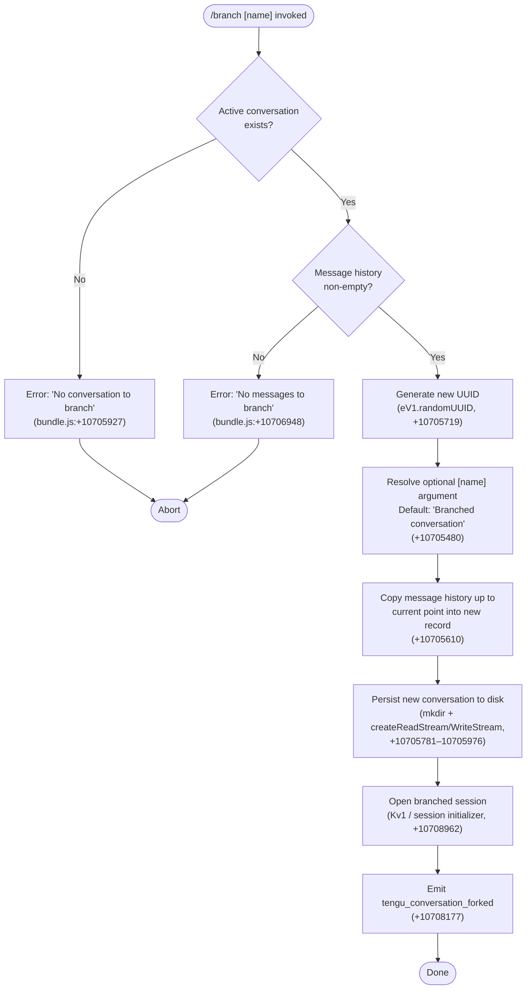

# `/branch`

> Analysis basis: CC v2.1.158 bundle.js (AST extraction + Claude interpretation)
> Minimum version: v2.1.158

---

## Overview

The `/branch` command (also aliased as `/fork`) creates a divergent copy of the current conversation at its current state, allowing the user to explore an alternative dialogue path without losing the original. Internally, the handler copies the message history up to the current point into a new conversation record, assigns it a new UUID, and opens the branched session. The telemetry event `tengu_conversation_forked` is emitted on successful completion.

---

## Registration

| Field | Value |
|---|---|
| type | `local-jsx` |
| name | `branch` |
| description | Create a branch of the current conversation at this point |
| argumentHint | `[name]` |
| aliases | `["fork"]` |
| module_id | `$o_` |
| load_inline | `true` |
| loc_byte | `12204159` |
| loc_byte_end | `12204353` |
| loc_line | `8114` |
| arbor_handler.name | `slL` |
| arbor_handler.fqn | `claude-2.1.158::slL` |
| arbor_handler.kind | `AsyncFunction` |
| arbor_handler.resolution_path | `module_id` |
| arbor_handler.n_hits | `0` |

Analysis basis: CC v2.1.158 bundle.js:+12204159

---

## Input Branching

There are four distinct paths depending on the presence of an active conversation and messages:



---

## Behavioral Spec

### Top-level handler — `branchCommandHandler` (`slL`)

`slL` is an `AsyncFunction` resolved via `module_id` → `$o_`. It is the authoritative entry point for `/branch` and `/fork`.

Analysis basis: CC v2.1.158 bundle.js:+10708962 (Arbor resolution via `module_id`)

```
async function branchCommandHandler(args, appContext):
    # 1. Validate active conversation
    conversation = appContext.currentConversation
    if conversation is null or undefined:
        display error "No conversation to branch"   # +10705927
        return

    # 2. Validate message history
    messages = conversation.messages
    if messages is empty:
        display error "No messages to branch"       # +10706948
        return

    # 3. Resolve branch name
    branchName = args.trim() if args else "Branched conversation"  # +10705480

    # 4. Generate new session identity
    newId = crypto.randomUUID()                     # eV1.randomUUID, +10705719

    # 5. Build snapshot of current message list
    snapshot = buildMessageSnapshot(messages)       # Av1 / _.find + A.replace, +10705532

    # 6. Persist branched conversation to disk
    persistBranchedConversation(newId, branchName, snapshot)
    # internals: mkdir (+10705781), createReadStream (+10705830),
    #            createWriteStream (+10705976), utf8 encoding (+10705863)

    # 7. Open the branched session
    openBranchedSession(newId, branchName)          # Kv1, +10708962

    # 8. Emit telemetry
    emit("tengu_conversation_forked")               # +10708177
```

---

### Snapshot builder — `messageSnapshotBuilder` (`Av1`)

Walks the existing message list and normalises each entry before it is written into the branch record.

Analysis basis: CC v2.1.158 bundle.js:+10705532

```
function buildMessageSnapshot(messages):
    # Find the message to branch at (default: last message)
    pivotMessage = messages.find(pivotPredicate)        # _.find, +10705532

    # Normalise the message content type to "text"      # +10705553
    normalised = pivotMessage.replace(contentNormaliser) # A.replace, +10705610

    # Trim history to at most 100 entries               # +10705647
    trimmed = normalised.slice(0, 100)

    return trimmed
```

---

### Session initialiser — `sessionInitialiser` (`Kv1`)

Opens the new conversation context, wires up logging and telemetry hooks, and schedules the first render cycle.

Analysis basis: CC v2.1.158 bundle.js:+10707873

```
async function sessionInitialiser(sessionId, branchName, context):
    # 1. Obtain shared config / identity store
    configStore = getConfigStore()                  # I6, +10707873

    # 2. Resolve or create the conversation file
    conversationFile = resolveOrCreateFile(sessionId)  # k$, +10707880

    # 3. Start background session subprocess
    bgProcess = startBackgroundSession(sessionId)   # qv1, +10707981

    # 4. Find message to resume from
    resumeMessage = messages.find(resumePredicate)  # $.find, +10708044

    # 5. Register command history / completion provider
    registerCompletionProvider()                    # alL, +10708113

    # 6. Attach logging hooks (custom-title, agent-name)
    attachLoggingHooks()                            # eh / s5H, +10708144

    # 7. Populate conversation metadata
    setConversationTitle(branchName)                # d, +10708175

    # 8. Parse fork point from message list
    forkIndex = parseForkIndex(messages)            # L9, +10708264

    # 9. Record ISO timestamp of branch creation
    timestamp = new Date().toISOString()            # z.toISOString, +10708267

    # 10. Resume message stream
    resumeStream()                                  # H.resume, +10708685

    # 11. Set branch mode label to "fork"            # +10708698
    mode = "fork"

    return newSessionHandle
```

---

### Background process launcher — `backgroundSessionLauncher` (`qv1`)

Spawns the background worker process that hosts the branched conversation and manages I/O piping.

Analysis basis: CC v2.1.158 bundle.js:+10705719

```
async function backgroundSessionLauncher(sessionId, options):
    # Generate unique worker identity
    workerId = crypto.randomUUID()                  # eV1.randomUUID, +10705719

    # Resolve config and paths
    configPaths = resolveConfigPaths()              # I6 (+10705738), CO (+10705745), O_ (+10705748)

    # Determine conversation directory path
    conversationDir = buildConversationPath()       # hv, +10705756; AM, +10705770

    # Create directory (recursive)
    await fs.mkdir(conversationDir, {recursive: true})  # YV8.mkdir, +10705781

    # Open read stream on snapshot (448-byte header block)
    reader = fs.createReadStream(snapshotPath, {start: 0, highWaterMark: 448})
              # zV8.createReadStream, +10705830; literal 448 at +10705812

    # Listen for 'open' event before piping           # +10705889
    reader.once("open", handler)                    # Mo_.once, +10705878

    # Error guard: no conversation data
    if not reader:
        throw new Error("No conversation to branch") # +10705927

    # Serialize messages to wire format
    serialised = serialiseMessages(messages)        # SH, +10705962

    # Open write stream (384-byte buffer)
    writer = fs.createWriteStream(destPath, {highWaterMark: 384})
              # zV8.createWriteStream, +10705976; literal 384 at +10706022

    # Wire I/O and drain events                    # O.on (+10706035), O.write (+10706259)
    writer.on("drain", onDrain)                    # "drain" literal +10706287

    # Parse incoming messages (JSON)
    parsedMessages = parseMessages(rawBytes)        # p6 / JSON.parse, +10706374

    # Apply content-replacement pass               # "content-replacement" +10706407
    transformed = applyContentReplacement(parsedMessages)

    # Push processed entries into job queue
    jobQueue.push(transformedEntry)                 # j.push, +10706447

    # Register progress tracker                    # "progress" +10706866
    progressTracker.register(workerId)

    # Close streams when done
    writer.end()                                   # O.end, +10707344
    await stream.finished(writer)                  # _v1.finished, +10707358

    return {workerId, processHandle}
```

---

### Completion / history provider — `completionProvider` (`alL`)

Registers tab-completion and history entries for the branched session.

Analysis basis: CC v2.1.158 bundle.js:+10707550

```
function registerCompletionProvider(context):
    # Build initial completion list
    completions = buildCompletionList()             # ll, +10707550

    # Escape special characters in names
    escapedName = escapeName(rawName)               # ON / H.replace, +10707651

    # Add to tracked completion set
    completionSet.add(escapedName)                  # K.add, +10707745

    # Parse any numeric suffixes
    numericSuffix = parseInt(suffix, 10)            # parseInt, +10707751

    # Guard against duplicates
    if completionSet.has(escapedName):              # K.has, +10707798
        return
```

---

### Logging hook — `sessionLogger` (`eh`)

Attaches per-session structured logging, fires `tengu_session_renamed` when a custom title is set.

Analysis basis: CC v2.1.158 bundle.js:+12906940

```
function attachLoggingHooks(sessionHandle, title):
    # Read conversation path config
    conversationPath = getConversationPath()        # hv, +12906940

    # Append to log file (creating dir if absent)
    logEntry = formatLogEntry(title)                # cfH, +12906949
    fs.appendFileSync(logPath, logEntry)
    fs.mkdirSync(path.dirname(logPath), {recursive: true})

    # Persist updated config                        # I6, +12907008; U4, +12907013
    persistConfig(configStore)

    # Emit session-rename event
    emitEvent("tengu_session_renamed", {title})     # xy6.emit, +12907040

    # Record telemetry key "custom-title"           # +12906961
    telemetryKey = "custom-title"
```

---

## State & Side Effects

| Item | Detail |
|---|---|
| Telemetry — primary | `tengu_conversation_forked` (bundle.js:+10708177) — fired once on successful branch |
| Telemetry — session | `tengu_session_renamed` (bundle.js:+12907053) — fired if a custom branch name is applied |
| Telemetry — agent name | `tengu_agent_name_set` (bundle.js:+12910082) — fired if agent-name metadata is stored |
| Telemetry — background infra | `tengu_bg_dispatch_sigkill_escalate`, `tengu_daemon_control`, `tengu_bg_low_mem_mb`, `tengu_bg_dispatch_low_mem`, `tengu_bg_spare_enable`, `tengu_bg_sendclaim_failed`, `tengu_bg_spare_claim`, `tengu_bg_spare_spawn`, `tengu_bg_spare_claim_fail`, and related daemon/attach events — emitted by the background session infrastructure reused by the branch handler |
| Telemetry — worktree | `tengu_worktree_detection` (bundle.js:+11904612) — emitted if a Git worktree is detected for the branch location |
| File system writes | New conversation directory created via `fs.mkdir` (+10705781); conversation snapshot written via `createWriteStream` (+10705976) |
| File system reads | Source conversation read via `createReadStream` (+10705830); `pins.json` read if pinned-session metadata is needed (+4091035) |
| Error states | `"No conversation to branch"` (+10705927); `"No messages to branch"` (+10706948); `"Unknown error occurred"` (+10708846) |
| Session mode label | Set to `"fork"` after successful branch (+10708698) |
| Completion set | Branch name registered in the tab-completion/history set (+10707745) |
| Branch title default | `"Branched conversation"` when no `[name]` argument is supplied (+10705480) |

---

## Version History

| Version | Change |
|---|---|
| v2.1.158 | Initial analysis |

---

## Common Mistakes

1. **Invoking `/branch` before any messages exist.** The command will abort with `"No messages to branch"` (+10706948). Send at least one message first.
2. **Expecting `/branch` to work without an active conversation.** If no session is loaded, the handler emits `"No conversation to branch"` (+10705927) and exits immediately.
3. **Assuming the branch name persists automatically.** When no `[name]` argument is given the default title `"Branched conversation"` is used; supply an explicit name to distinguish branches.
4. **Confusing `/branch` with `/fork`.** Both names invoke the same handler — `fork` is registered as an alias (+registration aliases field). Either form is valid.
5. **Expecting synchronous completion.** The handler is an `AsyncFunction` (`slL`) that awaits file I/O and background process startup; UI confirmation appears only after all async steps resolve.

---

## Appendix — Identifier Mapping

> For bundle debugging only. Identifiers change across versions.

| Identifier | Role |
|---|---|
| `slL` | Main handler for `/branch` (`AsyncFunction`, Arbor-resolved via `module_id`) |
| `Kv1` | Session initialiser — sets up new branched session context |
| `qv1` | Background session launcher — spawns worker process, manages I/O streams |
| `Av1` | Message snapshot builder — filters and normalises history for the branch |
| `alL` | Completion/history provider — registers tab-completion entries |
| `ll` | Completion list builder — constructs sorted candidate list |
| `ACH` | Worktree resolver — detects Git worktree for the branch path |
| `Y_K` | Directory walker used during completion candidate collection |
| `uCH` | Buffer-based path encoder used in completion list building |
| `eh` | Session logger — attaches log hooks, fires `tengu_session_renamed` |
| `s5H` | Agent-name logger — stores agent-name metadata, fires `tengu_agent_name_set` |
| `cfH` | Log file writer — `appendFileSync` + `mkdirSync` helper |
| `mQ` | Conversation metadata read/write helper |
| `rM6` | Low-level config file read/write utility |
| `L9` | Fork-index parser — extracts slice position from message list |
| `ON` | Name escaper — applies `H.replace` to sanitise branch names |
| `I6` | Config/identity store accessor |
| `O_` | Path resolver for conversation root |
| `hv` | Conversation directory path builder |
| `AM` | Secondary path builder (joins config segments) |
| `P8` | Promise error-guard / rejection handler |
| `J8` | Structured error constructor |
| `SH` | Message serialiser — converts history to wire format |
| `F_` | Error code classifier |
| `CH` | String coercion utility |
| `L1` | Traffic-level resolver (essential-traffic / no-telemetry) |
| `G_4` | Telemetry ring-buffer manager (shift/push) |
| `qN` | Config persistence primitive |
| `CS` | Config section accessor |
| `CO` | Config option reader |
| `k$` | Conversation file resolver/creator |
| `U4` | Config store updater |
| `q9` | Worker registration helper |
| `z$` | Completion cache utility |
| `g6` | Log path resolver |

---

Note: index built via Arbor fallback; some signals (telemetry, literals) may be missing — see arbor-fallback.js.