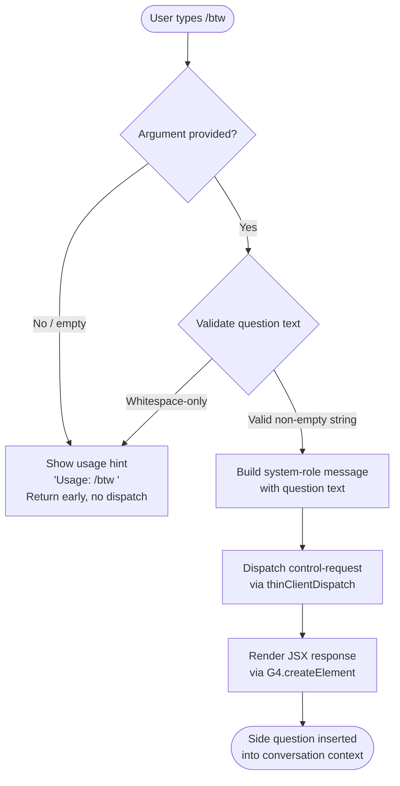

# `/btw`

> Analysis basis: CC v2.1.158 bundle.js (AST extraction + Claude interpretation)
> Minimum version: v2.1.158

---

## Overview

The `/btw` ("by the way") command allows the user to ask a quick side question or inject a brief clarifying remark into the agent loop without displacing or disrupting the current primary conversation context. It is typed as a `local-jsx` command that dispatches a `control-request` to the thin-client layer and executes immediately upon submission (`immediate: true`), inserting a system-role message into the conversation rather than a user-role turn.

---

## Registration

| Field | Value |
|---|---|
| type | `local-jsx` |
| name | `btw` |
| description | Ask a quick side question without interrupting the main conversation |
| argumentHint | `<question>` |
| immediate | `true` |
| thinClientDispatch | `control-request` |
| module_id | `Mv1` |
| load_inline | `true` |
| loc_byte | `10714758` |
| loc_byte_end | `10714997` |
| loc_line | `6610` |
| arbor_handler.name | `fnL` |
| arbor_handler.fqn | `claude-2.1.158::fnL` |
| arbor_handler.kind | `AsyncFunction` |
| arbor_handler.resolution_path | `module_id` |
| arbor_handler.n_hits | `0` |

Analysis basis: CC v2.1.158 bundle.js:+10714758

---

## Input Branching

Three distinct branches exist based on argument presence and validation:



Analysis basis: CC v2.1.158 bundle.js:+10714353, +10714355, +10714394, +10714463

---

## Behavioral Spec

### Handler Entry Point (`fnL`)

The Arbor-resolved handler `fnL` is an `AsyncFunction` reached via `module_id → Mv1`. It is the primary entry point for `/btw` command execution.

```
async function handleBtwCommand(args, context):
    question = args.trim()

    if question is empty:
        display("Usage: /btw <your question>")
        return early_exit

    // Inject as a system-level side message, not a user turn
    message = buildSystemMessage(question)

    // Dispatch the side question to the agent control layer
    dispatchControlRequest(message, context)

    // Render the JSX output element for the UI
    return createElement(responseComponent, { message })
```

Analysis basis: CC v2.1.158 bundle.js:+10714353, +10714355, +10714394, +10714417, +10714463

---

### Usage Guard (`H` — jitter/delay helper)

The call from `fnL` to `H` (at `+10714353`) leads to a helper that uses `Math.random` and `setTimeout` with jitter values `2` and `1` to produce a small randomised delay before dispatching. This prevents thundering-herd effects when multiple `/btw` injections happen in rapid succession.

```
function jitteredDelay(baseMs, jitterFactor):
    // jitterFactor drawn from Math.random()
    // constants: 2 (multiplier), 1 (minimum)
    delay = baseMs * (1 + jitterFactor * 2)
    setTimeout(callback, delay)
```

Analysis basis: CC v2.1.158 bundle.js:+13423759, +13423761, +13423775, +13423798

---

### Configuration Access and Lock Subsystem (`z8` → `LY_`)

`fnL` calls `z8` (at `+10714417`), which orchestrates configuration read/write access for the session. `z8` itself invokes `LY_`, the configuration lock-acquisition routine. This ensures the global config state (`~/.claude.json`) is stable before the side question context is injected.

```
async function acquireConfigWithLock(configPath):
    dirPath = path.dirname(configPath)
    ensureDirectory(dirPath)           // L.mkdirSync
    timestamp = Date.now()

    try:
        stat = L.statSync(lockFile)
        if lock held too long:
            emit_telemetry("tengu_config_lock_contention")
            log("error", "Lock acquisition took longer than expected…")
    except ENOENT:
        // No lock file — safe to proceed
        pass

    configData = readAndParseConfig(configPath)  // szH
    return configData
```

Analysis basis: CC v2.1.158 bundle.js:+3205246, +3205250, +3205302, +3208013, +3208040, +3208085, +3208313

---

### Configuration Read (`szH`)

`szH` handles the actual filesystem read and JSON parse of the config file, including backup rotation logic and stale-write protection.

```
function readConfigFile(configPath):
    if configPath not accessible:
        raise Error("Config accessed before allowed.")   // literal at +3210257

    rawBytes = fs.readFileSync(configPath, "utf-8")       // encoding at +3210340
    parsed   = JSON.parse(rawBytes)                        // via p6

    // Backup rotation
    backupDir = path.join(configDir, "backups")           // literal at +3209825
    rotateBackups(configPath, backupDir, maxBackups=5)

    // Validate auth fields are not lost before writing back
    if cachedAuthPresent and re-readAuthMissing:
        emit_telemetry("tengu_config_auth_loss_prevented")
        log("saveConfigWithLock: re-read config is missing auth…")
        // Refuse to overwrite to protect credentials

    return parsed
```

Analysis basis: CC v2.1.158 bundle.js:+3210251, +3210257, +3210313, +3210340, +3208640, +3208792, +3209825

---

### Message Construction (`N`)

`N` constructs the message object that is injected into the conversation turn list. The role is fixed to `"system"` (literal at `+10714394`), ensuring the `/btw` question surfaces as a system-level side note rather than a user-visible turn. Sensitive values are redacted in the outgoing payload (literal `"[REDACTED]"` at `+196276`).

```
function buildSystemMessage(questionText):
    role    = "system"                    // literal: +10714394
    content = questionText.trim()         // N → H.trim at +204300
    id      = generateUUID()              // N → v4 at +204297

    if content includes restricted marker:
        content = "[REDACTED]"            // literal: +196276

    payload = {
        role:    role,
        content: content,
        id:      id
    }

    serialised = JSON.stringify(payload)  // RH at +183568
    return payload
```

Analysis basis: CC v2.1.158 bundle.js:+10714394, +204175, +204233, +204277, +204297, +204300, +196276, +183568

---

### Atomic File Write Helper (`hL6`)

Used transitively by the config subsystem when persisting state changes triggered by the `/btw` command's session context update. Performs an atomic write via a temp file, random-bytes-suffixed name, permission preservation, and atomic rename.

```
function atomicWriteFile(targetPath, data):
    tempName = path.join(dir, randomBytes(6).toString("hex"))  // 6 bytes → +1012273, "hex" → +1012301
    fd       = fs.openSync(tempName, flags)

    if target exists:
        originalStat = fs.statSync(targetPath)
        // Preserve original permissions on temp file
        fs.fchmodSync(fd, originalStat.mode)           // log: "Applied original permissions…" +1012788

    fs.writeFileSync(tempName, data)
    fs.fsyncSync(fd)
    fs.closeSync(fd)

    // Atomic replace
    try:
        fs.renameSync(tempName, targetPath)
    except:
        fs.unlinkSync(tempName)
        raise
```

Analysis basis: CC v2.1.158 bundle.js:+1012273, +1012289, +1012301, +1012440, +1012709, +1012767, +1012788, +1012833, +1012961, +1013118

---

### JSX Rendering (`G4.createElement`)

After dispatch, `fnL` calls `G4.createElement` (at `+10714463`) to produce the React/JSX element that represents the UI feedback shown to the user in the terminal, confirming the side question was inserted.

```
function renderBtwConfirmation(question):
    element = G4.createElement(
        ResponseComponent,
        { role: "system", content: question }
    )
    return element
```

Analysis basis: CC v2.1.158 bundle.js:+10714463

---

## State & Side Effects

| Item | Detail |
|---|---|
| Telemetry — `tengu_config_lock_contention` | Fired when config file lock is held longer than expected during session setup (bundle.js:+3208313) |
| Telemetry — `tengu_config_stale_write` | Fired when a stale config write is detected and skipped (bundle.js:+3208449) |
| Telemetry — `tengu_config_parse_error` | Fired when the config JSON fails to parse (bundle.js:+3210888) |
| Telemetry — `tengu_config_auth_loss_prevented` | Fired when a write that would have wiped auth credentials is refused (bundle.js:+3208792) |
| Telemetry — `tengu_bg_dispatch_sigkill_escalate` | Fired by the background session manager when SIGKILL escalation occurs (bundle.js:+15467649) |
| Telemetry — `tengu_bg_dispatch_low_mem` | Fired when available memory drops below threshold during background dispatch (bundle.js:+15468228) |
| Telemetry — `tengu_bg_spare_enable` | Fired when a spare background session is enabled (bundle.js:+15468923) |
| Telemetry — `tengu_bg_spare_claim` | Fired when a spare background session is successfully claimed (bundle.js:+15469044) |
| Telemetry — `tengu_bg_spare_claim_fail` | Fired when spare session claim fails (bundle.js:+15469307) |
| Config file side effect | Acquires file lock on `~/.claude.json`; reads current config; may write backup to `backups/` subdirectory |
| Backup rotation | Up to 5 config backups kept in `backups/` directory; `.backup.` prefix used for backup file names |
| Auth-loss guard | Refuses to write config if cached auth would be silently deleted (see GH #3117) |
| Conversation state | Injects a `"system"`-role message into the current session turn list — does not create a new user-visible turn |
| thinClientDispatch | Sends a `control-request` event to the thin client layer; `immediate: true` means no buffering |
| Jitter delay | Randomised delay applied before dispatch to avoid contention (`Math.random`, constants 1 and 2, `setTimeout`) |
| JSX render | `G4.createElement` called to produce terminal UI confirmation element |

---

## Version History

| Version | Change |
|---|---|
| v2.1.158 | Initial analysis |

---

## Common Mistakes

1. **Omitting the argument**: Calling `/btw` with no text produces the usage hint `"Usage: /btw <your question>"` and no dispatch occurs. Always provide a non-empty question string.
2. **Expecting a user-turn reply**: `/btw` injects a `"system"`-role message, not a `"user"`-role message. The model will process it as a system-level note; it does not appear as a regular conversational turn in the history.
3. **Confusing `immediate` with synchronous**: `immediate: true` means the command is dispatched without waiting for the user to confirm; it does not mean the underlying config lock and async operations resolve synchronously. A jitter delay via `setTimeout` is still applied.
4. **Assuming whitespace input is accepted**: Input that is non-empty but whitespace-only is trimmed to an empty string and treated as missing, triggering the usage-hint guard.
5. **Expecting the question to appear in sensitive contexts**: Content matching internal restriction markers is replaced with `"[REDACTED]"` before dispatch.

---

## Appendix — Identifier Mapping

> For bundle debugging only. Identifiers change across versions.

| Identifier | Role |
|---|---|
| `fnL` | Primary async handler for `/btw` command (Arbor-resolved via `module_id → Mv1`) |
| `H` | Jitter/delay helper — applies randomised `setTimeout` before dispatch |
| `z8` | Config orchestrator — coordinates config read/write for session context |
| `LY_` | Config lock-acquisition and file-management routine |
| `_` | Filesystem abstraction layer (e.g. `readdirStringSync`, `statSync`) |
| `g6` | Path/file utility helper |
| `L` | Primary filesystem module reference (e.g. `mkdirSync`, `statSync`, `copyFileSync`) |
| `q` | Secondary filesystem module reference (e.g. `readFileSync`, `unlinkSync`) |
| `f` | Promise / async resource (e.g. `f.finally`, `f.toLowerCase`) |
| `nOq` | Config object constructor/merger — uses `Object.assign` |
| `fK_` | Config field initialiser called by `nOq` |
| `N` | Message construction function — assembles system-role message payload |
| `lCK` | Sub-routine within message construction (calls `dk`, `cCK`, `LOA`) |
| `RH` | JSON serialisation helper — wraps `JSON.stringify` |
| `v4` | UUID / identifier generator for message objects |
| `EuH` | Message field formatter — calls `NYA` |
| `rCK` | File-backed message persistence handler (Buffer-aware, 1000/100 ms timeouts) |
| `d` | Generic utility / state accessor |
| `J8` | Error classification / throw helper |
| `szH` | Config file read, parse, and backup-rotation function |
| `p6` | JSON parse wrapper — wraps `JSON.parse` |
| `Qb` | String prefix-strip utility (`startsWith` + `slice`) |
| `RFq` | Config backup enumeration and cleanup routine |
| `fY_` | Backup path constructor — uses `MD.join` and `F8` |
| `w` | Background session / process manager |
| `qY6` | Config cache/queue manager |
| `A` | Case-normalisation helper (`f.toLowerCase`) |
| `V` | Path/string filter (uses `startsWith`) |
| `P` | MCP / SDK connection manager (HTTP, SSE, dynamic transport modes) |
| `Ox8` | Connection initialisation routine |
| `SH` | Connection state machine — handles connected/failed transitions |
| `F_` | Error factory — wraps `Error` and `String` |
| `E` | Array slice operator context |
| `hL6` | Atomic file-write utility (random temp name, fchmod, fsync, rename) |
| `O` | Filesystem stat result object (symbolic-link check via `I8`) |
| `P8` | Error-rethrow wrapper (calls `J8`) |
| `UQH` | Session/context loader called early in `z8` |
| `SFq` | Config entry enumerator — uses `Object.entries` |
| `BQH` | Timestamp recorder — uses `Date.now` |
| `KY_` | Symlink-aware config path resolver (calls `hL6`) |

---

Note: index built via Arbor fallback; some signals (telemetry, literals) may be missing — see arbor-fallback.js.