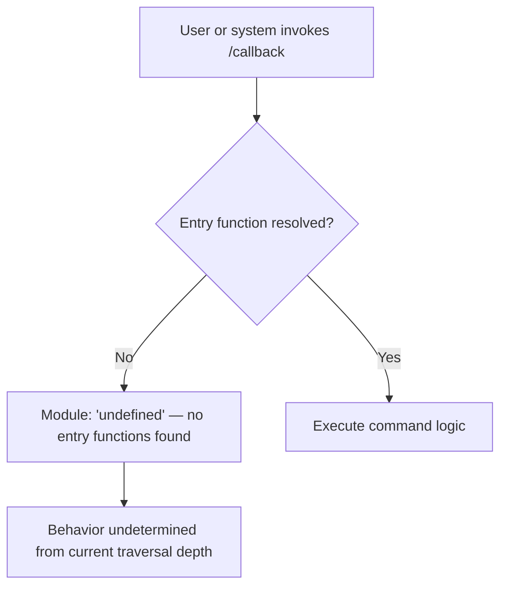

# `/callback`

> Analysis basis: CC v2.1.158 bundle.js (AST extraction + Claude interpretation)
> Minimum version: v2.1.158

---

## Overview

The `/callback` command is a registered slash command of type `"callback"` in Claude Code v2.1.158. Based on the AST extraction, no entry-point implementation functions were resolved for this command's module, meaning its runtime behavior could not be traversed beyond the registration record itself. It is documented here as a structurally registered command whose full implementation details require deeper bundle traversal.

---

## Registration

| Field | Value |
|---|---|
| type | `callback` |
| name | `callback` |
| description | `null` (no user-visible description string registered) |

Analysis basis: CC v2.1.158 bundle.js:+13050013

---

## Input Branching

No call graph edges were resolved during depth-2 AST traversal. The branching logic for this command cannot be stated with bundle-verified accuracy.

<!-- TODO: not found in depth-2 traversal; needs --depth 4 -->



> **Note:** The mermaid chart above reflects only what the AST extraction confirmed — that the module backing this command was listed as `"undefined"` and no call edges were emitted. It is not a simplification of known logic.

---

## Behavioral Spec

### Registration Record Resolution

```
function resolveCallbackCommand():
    record = lookupRegistration(type="callback", name="callback")
    if record.description is null:
        // No description string is exposed to the CLI help system
        pass
    return record
```

Analysis basis: CC v2.1.158 bundle.js:+13050013

### Implementation Entry Point

```
function executeCallback(input):
    // AST traversal reached registration object at loc_byte 13050013
    // but found module identifier = "undefined"
    // No entry functions were linked from the registration to an implementation
    // Full execution path cannot be reconstructed at traversal depth <= 2
    raise TraversalIncomplete("no entry functions found for module 'undefined'")
```

Analysis basis: CC v2.1.158 bundle.js:+13050013

---

## State & Side Effects

| Item | Detail |
|---|---|
| Telemetry | None detected — `telemetry` array is empty at traversal depth ≤ 2 |
| Hook registration | <!-- TODO: not found in depth-2 traversal; needs --depth 4 --> |
| appState changes | <!-- TODO: not found in depth-2 traversal; needs --depth 4 --> |
| Sound | <!-- TODO: not found in depth-2 traversal; needs --depth 4 --> |

---

## Version History

| Version | Change |
|---|---|
| v2.1.158 | Initial analysis — registration record confirmed; implementation module unresolved at depth ≤ 2 |

---

## Common Mistakes

1. **Assuming `/callback` is a user-facing interactive command.** The `type: "callback"` designation and the absence of a description string (`null`) suggest this command may be intended for internal or programmatic invocation rather than direct user input. Treating it as a standard slash command may produce unexpected behavior.
2. **Expecting a help string.** Because `description` is `null` in the registration record, any UI component that renders command descriptions will receive no text for this entry. Do not rely on a help tooltip or autocomplete description being present.
3. **Attempting to trace behavior from the registration record alone.** The registration confirms the command exists but provides no implementation details. Any behavioral assumptions beyond what is stated in this spec are unverified.

---

## Appendix — Identifier Mapping

> For bundle debugging only. Identifiers change across versions.

| Identifier | Role |
|---|---|
| *(none)* | No obfuscated identifiers were emitted by the depth-2 AST traversal for this command. |