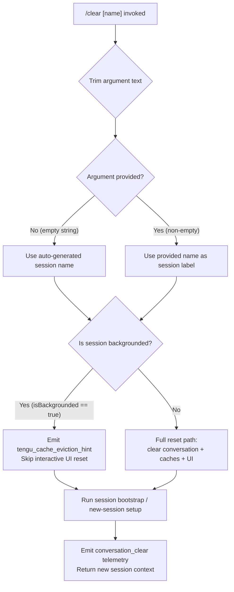

# `/clear`

> Analysis basis: CC v2.1.158 bundle.js (AST extraction + Claude interpretation)
> Minimum version: v2.1.158

---

## Overview

`/clear` starts a new, empty conversation session in Claude Code while preserving the previous session on disk for future resumption via `/resume`. It accepts an optional `[name]` argument for naming the new session, triggers a full in-memory state reset across multiple subsystems (conversation history, cache, tool state, plugin state), and emits a `conversation_clear` telemetry event before handing control to the session bootstrap path.

---

## Registration

| Field | Value |
|---|---|
| type | `local` |
| name | `clear` |
| description | `Start a new session with empty context; previous session stays on disk (resumable with /resume)` |
| argumentHint | `[name]` |
| supportsNonInteractive | `true` |
| thinClientDispatch | `post-text` |
| aliases | `reset`, `new` |
| module_id | `nv1` |
| load_inline | `true` |
| loc_byte | `10756391` |
| loc_byte_end | `10756682` |
| loc_line | `6631` |
| arbor_handler.name | `cnL` |
| arbor_handler.fqn | `claude-2.1.158::cnL` |
| arbor_handler.kind | `AsyncFunction` |
| arbor_handler.resolution_path | `module_id` |
| arbor_handler.n_hits | `0` |

Analysis basis: CC v2.1.158 bundle.js:+10756391

---

## Input Branching

The command has three distinct paths based on the optional name argument and background session state:



Analysis basis: CC v2.1.158 bundle.js:+10756217 (argument trim), +10754503 (isBackgrounded check), +10754435 (conversation_clear event)

---

## Behavioral Spec

### Top-level Handler — `clearCommandHandler` (`cnL`)

The handler is an `AsyncFunction` resolved via `module_id` → `nv1`.

```
async function clearCommandHandler(args, context):
    rawArg = args.trim()                         // bundle.js:+10756217
    sessionName = rawArg.length > 0 ? rawArg : undefined

    await runClearSession(sessionName, context)  // calls jN6
    return { type: "success" }
```

Analysis basis: CC v2.1.158 bundle.js:+10756217, +10756253

---

### Session Clear Orchestrator — `runClearSession` (`jN6`)

This is the primary orchestration function. It coordinates state teardown across all subsystems.

```
async function runClearSession(sessionName, context):
    // 1. Compute current token budget / context window state
    currentContextState = computeContextWindow()   // XN6 path

    // 2. Stop all active background workers and running tool processes
    abortRunningProcesses(context)                 // wRH path
    context.abortController = new AbortController()

    // 3. Emit cache eviction hint to daemon
    emitTelemetry("tengu_cache_eviction_hint")     // +10754400

    // 4. Reset in-memory state
    resetAllCaches()                               // uo_ path (see below)

    // 5. Clear running-task registry and abort-signal set
    _.clear()                                      // +10754716
    clearTimeout(pendingTimers)                    // +10755016

    // 6. Generate new session UUID
    newSessionId = crypto.randomUUID()             // dv1.randomUUID, +10755557

    // 7. Re-register session start hooks, emit conversation_clear
    emitSessionEvent("conversation_clear", {       // +10754435
        sessionId: newSessionId,
        name: sessionName ?? undefined
    })

    // 8. If background session flag is set, skip interactive reset
    if context.isBackgrounded:                     // +10754503
        return earlyResult(newSessionId)

    // 9. Bootstrap the new session (hook setup, worktree, logging)
    await bootstrapNewSession(newSessionId, sessionName, context)

    // 10. Emit conversation_reset metric
    emitTelemetry("conversation_reset")            // +10755518

    return newSessionResult(newSessionId)
```

Analysis basis: CC v2.1.158 bundle.js:+10754308, +10754356, +10754398, +10754503, +10754566, +10754635, +10754688, +10754716, +10754741, +10754855, +10755016, +10755111, +10755448, +10755557, +10755808, +10755817, +10755854, +10755859, +10755891, +10755904, +10755906, +10755940, +10755950, +10755970, +10755997

---

### Context-Window State Snapshot — `computeContextWindow` (`XN6`)

Before clearing, the handler snapshots the current context-window metrics for logging/telemetry.

```
function computeContextWindow():
    rawTokens = parseInt(getRawTokenCount(), 10)   // +13001565, radix 10
    if not Number.isFinite(rawTokens):
        return defaultContextState()

    clampedTokens = Math.max(0, Math.min(rawTokens, TOKEN_LIMIT_1000))
    // TOKEN_LIMIT_1000 = 1000 (bundle.js:+13001752)

    sessionInfo = getSessionInfo()                  // $D → y8
    clearCacheMaps()                                // TU → vz
    updateSessionWindow()                           // TU → VY_
    return { tokens: clampedTokens, ...sessionInfo }
```

Analysis basis: CC v2.1.158 bundle.js:+13001565, +13001576, +13001587, +13001630, +13001638, +13001665, +13001752, +13001783, +13001796

---

### Process Abort — `abortActiveProcesses` (`wRH`)

Terminates the currently-running agent loop and its associated processes before the new session is initialized.

```
async function abortActiveProcesses(context):
    // Signal "SessionEnd" to agent loop
    sendAgentEvent("SessionEnd")                   // +12992123

    // Abort active tool processes (bash subshells, MCP calls, etc.)
    await terminateAgentLoop(context)              // j7 path
    await abortBackgroundDispatch(context)         // H0 path

    // Notify UI of session end
    notifySessionEnd(context)                      // $hH path
```

Analysis basis: CC v2.1.158 bundle.js:+12992096, +12992123, +12992154, +12992351, +12992356

---

### Full State Reset — `resetAllInMemoryCaches` (`uo_`)

This is the broadest side-effect of `/clear`: it walks every known in-memory cache and clears it.

```
function resetAllInMemoryCaches():
    clearSkillIndexCache()           // GC → hu.clearSkillIndexCache, +12866654
    clearSkillRegistry()             // qI9: jB.clear, +6616426
    clearPluginStateMap()            // Ka: multiple .clear() calls
    clearAutonomousLoopState()       // Ka → Dr7.resetAutonomousLoopDelivered, +6664689
    clearTaskRegistry()              // JK1: jhH.clear, _B_.clear
    clearSSHCaches()                 // Pt9: ssH.clear, nG6.clear
    clearShellContextCache()         // sr8: hpH.clear
    clearMemoryGraph()               // gN9: hM8.clear
    clearRemotePermissionCache()     // Fr8: ypH.clear
    clearFlagStateCache()            // $H1: Fa.clear, eJH.clear
    clearPluginGlobalState()         // Aa: JT8.clear
    clearGlobalJSHookCache()         // GJ6
    // ... additional subsystem clears via Object.keys enumeration
    emitResetEvent("conversation_reset")
```

Analysis basis: CC v2.1.158 bundle.js:+10753261, +10753270, +10753278, +10753287, +10753297, +10753310, +10753315, +10753408, +10753560, +10753569, +10753578, +10753584, +10753593, +10753599, +10753606, +10753612, +10753618, +10753624

---

### Session Bootstrap After Clear — `bootstrapNewSession` (`JB`)

After the reset, `/clear` bootstraps the fresh session using the same path as a normal session start.

```
async function bootstrapNewSession(newSessionId, sessionName, context):
    // Re-register MCP hooks and plugin hooks
    registerPluginHooks()            // rEH, BK
    reloadSkillIndex()               // GC, Aa
    emitSessionStart("uc")           // uc.emit, +6629731

    // Notify hook subsystem of new session
    runSessionStartHooks()           // GC path
    loadPluginHooks(sessionName)     // kpH → w8 (file-based logging)

    // Trigger hook_session_start_reload_skills telemetry
    // literal: "hook_session_start_reload_skills" (+6629744)
    
    // Optional: emit additional_context hook if configured
    runAdditionalContextHook()       // Vq path
```

Analysis basis: CC v2.1.158 bundle.js:+6628330, +6628373, +6628379, +6628392, +6628492, +6628520, +6628571, +6629396, +6629441, +6629514, +6629669, +6629721, +6629726, +6629731, +6629741, +6629744, +6629835, +6629863

---

### Working-Directory Validation — `resolveNewCwd` (`GD`)

If the new session is started with a path argument, the working directory is validated before adoption.

```
function resolveNewCwd(pathArg):
    if not path.isAbsolute(pathArg):
        pathArg = path.resolve(process.cwd(), pathArg)

    stat = fs.statSync(pathArg)       // g6 path
    if not stat:
        throw Error("Path not found") // +8191607

    normalizedPath = normalize(pathArg)
    setCurrentWorkingDirectory(normalizedPath)
    emitTelemetry("tengu_shell_set_cwd")  // +8191660
    return normalizedPath
```

Analysis basis: CC v2.1.158 bundle.js:+8191505, +8191525, +8191540, +8191595, +8191607, +8191647, +8191658, +8191660

---

## State & Side Effects

| Item | Detail |
|---|---|
| Telemetry | `tengu_cache_eviction_hint` (+10754400), `tengu_run_hook` (+13040885), `tengu_feature_bad` (+966091), `tengu_feature_ok` (+966033), `tengu_hook_plugin_metrics` (+13019323), `tengu_repl_hook_finished` (+13024772), `tengu_hook_plugin_injected` (+13039225), `tengu_session_renamed` (+12907053), `tengu_shell_set_cwd` (+8191660) |
| Conversation event emitted | `"conversation_clear"` string literal at +10754435; `"conversation_reset"` at +10755518 |
| Session UUID | New UUID generated via `crypto.randomUUID()` at +10755557 |
| In-memory caches cleared | Skill index, skill registry, plugin state map, task registry, SSH caches, shell context cache, memory graph, remote permission cache, flag state cache, plugin global state, JS hook cache (all via `uo_` path) |
| Hook lifecycle events | `SessionEnd` emitted before clear (+12992123); `SessionStart` hooks re-run after bootstrap (+6629731) |
| abortController reset | A fresh `AbortController` is created; old controller is aborted for all in-flight tool calls |
| Background session path | When `isBackgrounded == true` (+10754503), interactive reset steps are skipped; only cache eviction hint and UUID generation are performed |
| Previous session on disk | Preserved — not deleted; resumable via `/resume` |
| `thinClientDispatch` | Set to `"post-text"` — in thin-client mode the clear is dispatched as a post-text operation |
| Aliases | `reset` and `new` are registered as equivalent command names |

---

## Version History

| Version | Change |
|---|---|
| v2.1.158 | Initial analysis |

---

## Common Mistakes

1. **Expecting the old conversation to be gone from disk** — `/clear` only resets the active in-memory session. The previous session remains on disk and is fully resumable with `/resume`. Use OS-level deletion if permanent removal is intended.
2. **Confusing aliases** — `/reset` and `/new` invoke identical behavior to `/clear`; they are not distinct commands.
3. **Assuming `/clear` interrupts a running tool** — The command does abort in-flight tool processes (via `abortActiveProcesses`), but any side effects those tools have already applied to the filesystem are not rolled back.
4. **Passing a path as the name argument** — The `[name]` argument is a session label, not a working-directory change. To switch directories, use the shell or a dedicated CWD command before or after `/clear`.
5. **Using `/clear` in non-interactive (headless) mode without checking `supportsNonInteractive`** — The flag is `true`, so non-interactive usage is supported; however, the background-session short-circuit path (`isBackgrounded`) will skip UI-related reset steps, which may produce surprising behavior if callers expect a full reset signal.

---

## Appendix — Identifier Mapping

> For bundle debugging only. Identifiers change across versions.

| Identifier | Role |
|---|---|
| `cnL` | Top-level async handler for `/clear` (arbor_handler; `module_id` → `nv1`) |
| `jN6` | Session-clear orchestrator — coordinates the full teardown and bootstrap sequence |
| `XN6` | Context-window state snapshot (reads token count, clamps, returns metrics) |
| `$D` | Session info accessor used by context-window snapshot |
| `y8` | Low-level settings/session store reader |
| `Mp` | Quota/token state reader |
| `qN` | Core app-state primitive |
| `TU` | Cache-map clear dispatcher (calls `vz` and `VY_`) |
| `EY_` | Per-session map get/set (uses `Mgq`) |
| `vz` | Clears `yC6` and `uu8` cache maps |
| `VY_` | Updates session-window state via `y8` and `qj` |
| `wRH` | Process abort coordinator — sends `SessionEnd`, terminates agent loop |
| `j7` | Agent-loop terminator |
| `I6` | Shared state reader/logger |
| `mS` | Message-stream helper |
| `PW` | Tool-process abort helper (handles model family checks) |
| `xV` | Tool context teardown |
| `hv` | Agent context serializer |
| `h6` | Log helper |
| `H0` | Background-dispatch abort and new-session setup |
| `CH` | String coercion utility |
| `GU` | Session state getter |
| `N` | Debug/log formatter |
| `lfH` | Log-file helper |
| `V9A` | Hook-registration table builder |
| `IAK` | Hook input accessor |
| `E9A` | Third-party hook filter |
| `yAK` | Hook output accessor |
| `d` | Shared async utility / deferred |
| `RH` | JSON serializer wrapper |
| `SH` | Hook error logger |
| `bH` | Feature-flag reader |
| `XGH` | Hook input stringify error handler |
| `fv` | Abort-signal / timeout utility |
| `J` | Callback registry |
| `B8H` | Worktree-create helper |
| `Av` | App-state updater |
| `Bh8` | Hook block/approve decision helper |
| `W9A` | MCP tool hook executor |
| `Qh8` | Hook output JSON parser |
| `SAH` | Hook metrics aggregator |
| `P9A` | HTTP hook executor |
| `NAK` | Hook output validator for `UserPromptSubmit` |
| `kfH` | Hook execution fence |
| `dh8` | Shell hook spawner and runner |
| `xyH` | Hook cancellation handler |
| `hH` | Feature-flag check (ok path) |
| `$hH` | Session-end UI notification |
| `x96` | Unknown — reached from `jN6`; likely a config accessor |
| `L` | Task/promise lifecycle wrapper (add/delete/finally) |
| `q` | File-unlink registry (cleanup set) |
| `f` | Connection/stream handle |
| `A` | Generic collection (context-dependent) |
| `w` | Background-session worker / daemon dispatcher |
| `S` | Background-session supervisor process handle |
| `nVK` | Realpath + stat resolver for supervisor |
| `Iz` | Unknown — shared with daemon and `S` paths |
| `qF5` | Socket/pipe writer |
| `z` | Daemon write stream |
| `By8` | Memory-check helper (macOS freemem) |
| `G6` | Background-session registry lookup |
| `fw6` | Plugin pins file reader (`pins.json`) |
| `GP_` | Pins file path builder |
| `p6` | JSON parse wrapper |
| `P8` | ENOENT error classifier |
| `HP7` | Plugin directory reader |
| `B` | Background-session filter (checks for `mcp__` prefix) |
| `VH` | Plugin/marketplace file loader |
| `dH` | Orphaned-permission set |
| `jfA` | Background-session claim sender |
| `t9A` | Session manifest writer (`mkdir` + `writeFile`) |
| `RB5` | Claim timeout/retry handler |
| `SB5` | Claim frame builder |
| `QM` | Error code helper |
| `EH` | String coercion (used in claim and hook paths) |
| `DF` | Binary-protocol framer (Buffer encode for IPC) |
| `ZfA` | Background-session spawn and lifecycle manager |
| `K` | Session label padder |
| `gK` | Session directory path builder |
| `t9` | Session state file reader/writer |
| `YD` | Active-session marker |
| `ff` | Session roster entry writer |
| `T86` | Session heartbeat / timing tracker |
| `MfH` | Symlink path builder |
| `dT` | Session log path splitter |
| `GF` | Session log directory initializer |
| `dN6` | Session directory creator |
| `Y` | Daemon session map manager |
| `D` | Background-session dispose and re-spawn |
| `$` | Module-level singleton (`$s1`) |
| `wfA` | Spare-session spawner (Bun.spawn) |
| `J8` | ENOENT sentinel value |
| `nX` | Unknown — registered in `jN6` alongside session set |
| `Ej` | Unknown — called after abort-signal registration |
| `uo_` | Full in-memory state reset coordinator |
| `So_` | Unknown — first call inside `uo_` |
| `GC` | Skill/hook cache invalidator |
| `hu` | Skill-index cache clearer (`clearSkillIndexCache`) |
| `ET8` | Unknown — invoked by `GC` |
| `Kj1` | Unknown — invoked by `GC` |
| `kSH` | Unknown — invoked by `GC` |
| `qI9` | Skill-registry clearer (`jB.clear`) |
| `kIH` | Skill-index file writer |
| `L16` | Unknown — called in reset chain |
| `Ka` | Plugin state map clearer (multiple `.clear()`) |
| `KNH` | Plugin main-module accessor |
| `tM8` | Plugin cache entry eviction (`Tu.delete`, `hI_.delete`) |
| `GJ6` | Global JS hook cache clearer (`LE`) |
| `Q8H` | Plugin hook map clearer (`Sp8`, `Bp8`) |
| `H$8` | Output-group cache clearer (`oG1.clear`) |
| `CI9` | Dependency/import cache clearer (`dP6.clear`, `kI_.clear`) |
| `yI9` | Unknown — reads from `H` in plugin-state path |
| `vjH` | Unknown — reads `H` and `_` in plugin-state path |
| `dw` | `CxH` object-values enumerator |
| `uI_` | Unknown — final call in `Ka` |
| `Aa` | Plugin global state clearer (`JT8.clear`) |
| `JK1` | Task registry clearer (`jhH.clear`, `_B_.clear`) |
| `Pt9` | SSH cache clearer (`ssH.clear`, `nG6.clear`) |
| `sr8` | Shell context cache clearer (`hpH.clear`) |
| `wA9` | Unknown — in reset chain |
| `gN9` | Memory-graph cache clearer (`hM8.clear`) |
| `Ip8` | Unknown — checks `H.has` |
| `Fr8` | Remote-permission cache clearer (`ypH.clear`) |
| `qX1` | Unknown — in reset chain |
| `$H1` | Flag-state cache clearer (`Fa.clear`, `eJH.clear`) |
| `GD` | Working-directory resolver and validator |
| `g6` | Filesystem stat helper |
| `gi8` | Path normalizer with async-local-storage store |
| `P9H` | Path normalize wrapper |
| `O_` | Shared log/output emitter |
| `DvH` | Unknown — enumerated in `jN6` via Object.keys |
| `jE` | Unknown — called in `jN6` cleanup |
| `xO` | Flush pending writes and clear pending-write map (`Nh8`) |
| `kh8` | In-flight promise tracker (`h_K.add`/`delete`) |
| `oiH` | CLI-context event emitter |
| `GP9` | Unknown — target of `oiH` |
| `lv1` | Unknown — calls `cMH` |
| `cMH` | Unknown — reached from `lv1` |
| `k$` | Unknown — calls `I6` and `U4` |
| `U4` | Shared agent event bus / queue |
| `q9` | Agent registration helper (`qOA.register`) |
| `$k` | Unknown — in `jN6` final sequence |
| `AM` | Subagent context writer (`CS`, `CO`, `O_`, `VjH.join`, `I6`) |
| `CS` | Subagent context serializer |
| `JN6` | Unknown — calls `U4` |
| `Fu8` | Session-renamed emitter (`uC6.emit`) |
| `nl` | Unknown — calls `U4` |
| `eh` | Conversation-log writer (`hv`, `cfH`, `I6`, `U4`, `xy6.emit`) |
| `cfH` | Log file appender (`appendFileSync`, `mkdirSync`) |
| `YSH` | Symlink-based session directory setup |
| `D9A` | Task directory creator (`At.mkdir`) |
| `MtH` | Task directory path builder |
| `h$` | Alternative task-path builder |
| `LeH` | Session-log file opener |
| `wE` | Additional subagent context writer |
| `CM` | Unknown — in `jN6` late sequence |
| `Z_` | Module loader / singleton initializer |
| `cR6` | Unknown — bound in `Z_` |
| `W` | Unknown — calls `DL` |
| `DL` | Unknown — target of `W` |
| `G` | REPL key-input handler (Ctrl-C / interrupt) |
| `b` | Input event source |
| `h0` | Working-directory initializer |
| `U_` | Full settings loader (flagSettings, userSettings, projectSettings, localSettings) |
| `HM` | Unknown — in `jN6` final sequence |
| `jm` | Conversation-turn logger (`U4`, `sE8.emit`, `cfH`) |
| `aAH` | Isolation-latch writer (`$_K`) |
| `$_K` | Isolation-latch file appender |
| `JB` | Session-start plugin-hook loader and emitter |
| `BK` | Hook configuration reader |
| `rEH` | Policy-settings hook filter |
| `kpH` | Plugin-load telemetry emitter (`Date.now`, `w8`) |
| `w8` | Log file appender for plugin hooks |
| `BP6` | Agent-loop initializer (calls `j7`, `k$`, `RX`, `lX`) |
| `RX` | Unknown — called by `BP6` |
| `lX` | Full REPL agent-loop runner |
| `M` | Plugin path normalizer (`nS6`) |
| `nS6` | Plugin path validator (staging, relative path checks) |
| `Vq` | Additional-context hook runner (generates UUID via `yw1.randomUUID`) |

---

Note: index built via Arbor fallback; some signals (telemetry, literals) may be missing — see arbor-fallback.js.