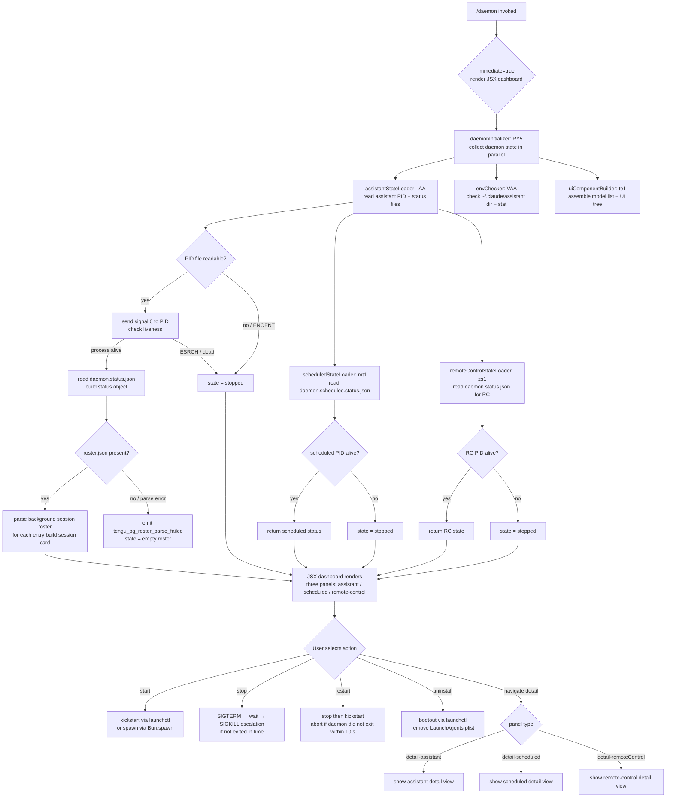

# `/daemon`

> Analysis basis: CC v2.1.158 bundle.js (AST extraction + Claude interpretation)
> Minimum version: v2.1.158

---

## Overview

The `/daemon` command is the management interface for Claude Code's background service infrastructure. It allows users to inspect, control, and configure the three pillars of the daemon subsystem: **assistant** background sessions, **scheduled** tasks, and **remote control** connectivity. The command renders a live JSX dashboard in the terminal and dispatches sub-operations (start, stop, restart, uninstall) against the underlying daemon process via PID files and OS-level signals.

---

## Registration

| Field | Value |
|---|---|
| type | `local-jsx` |
| name | `daemon` |
| description | `Manage background services: assistants, scheduled tasks, and remote control` |
| immediate | `true` |
| module_id | `yAA` |
| load_inline | `true` |
| loc_byte | `12662180` |
| loc_byte_end | `12662384` |
| loc_line | `8787` |
| arbor_handler.name | `RY5` |
| arbor_handler.fqn | `claude-2.1.158::RY5` |
| arbor_handler.kind | `AsyncFunction` |
| arbor_handler.resolution_path | `module_id` |
| arbor_handler.n_hits | `0` |

Analysis basis: CC v2.1.158 bundle.js:+12662180

---

## Input Branching

The command has more than three distinct execution branches across its top-level handler and sub-operations, so a Mermaid flowchart is used.



Analysis basis: CC v2.1.158 bundle.js:+12650930, +12661136, +12651041

---

## Behavioral Spec

### Top-level Handler — `daemonMainHandler` (RY5)

```
async function daemonMainHandler(context):
    [assistantState, envState, uiTree] = await Promise.all([
        collectAllDaemonState(context),   // IAA
        checkEnvironment(context),        // VAA
        buildDaemonUI(context)            // te1
    ])
    return renderDaemonDashboard(assistantState, envState, uiTree)
```

Analysis basis: CC v2.1.158 bundle.js:+12650930

---

### State Collection — `collectAllDaemonState` (IAA)

Runs several async sub-loaders in parallel then assembles the composite daemon state object.

```
async function collectAllDaemonState(context):
    // Parallel resolution of all sub-states
    [bgSessions, assistantStatus, scheduledStatus, rcStatus, rosterData] =
        await Promise.all([
            loadBackgroundSessions(context),    // ne1
            loadAssistantStatus(context),       // Be1
            loadScheduledStatus(context),       // mt1
            loadRemoteControlStatus(context),   // zs1
            loadRosterData(context),            // TF
        ])

    // Merge into unified state for UI
    return buildUnifiedDaemonState(
        bgSessions, assistantStatus, scheduledStatus, rcStatus, rosterData
    )
```

Analysis basis: CC v2.1.158 bundle.js:+12650451

---

### PID-file Liveness Check — `daemonLivenessProbe` (iW)

Used by assistant, scheduled, and remote-control loaders.

```
async function daemonLivenessProbe(pidFilePath):
    rawPid = await fs.readFile(pidFilePath)           // UN6: read + parse PID
    pid    = parseInt(rawPid, 10)

    try:
        process.kill(pid, 0)      // signal 0 = existence probe, no actual signal
        return { alive: true, pid }
    catch (err):
        if err.code == "ESRCH":   // no such process
            return { alive: false, pid }
        raise err
```

Literal: probe signal `0` found at CC v2.1.158 bundle.js:+11229432
Literal: process label `"claude daemon"` at bundle.js:+11228721

Analysis basis: CC v2.1.158 bundle.js:+11228802

---

### Roster Parsing — `rosterFileParser` (TF)

```
async function rosterFileParser(context):
    rosterPath = buildRosterPath(context)     // ffH → h3.join + RRH
    raw        = await fs.readFile(rosterPath)
    parsed     = JSON.parse(raw)             // p6

    if not isValidRosterShape(parsed):       // ytL: Array.isArray + Object.keys
        emit("tengu_bg_roster_parse_failed")
        return emptyRoster()

    // Rotate / archive if needed
    if needsRotation(parsed):               // Os_: Date.now timestamp check
        archiveRoster(rosterPath)           // kh1: G86.rename + ffH

    // Validate each entry format
    for entry in parsed.sessions:
        validateEntry(entry)               // SH
        classifySession(entry)             // d

    return roster
```

File names: `"roster.json"` (bundle.js:+11235351), `"daemon.json"` (bundle.js:+11229295)

Analysis basis: CC v2.1.158 bundle.js:+11238924

---

### Scheduled Task Status Loader — `scheduledStatusLoader` (mt1)

```
async function scheduledStatusLoader(context):
    statusPath = buildScheduledStatusPath()   // ut1: bt1.join + F8
    // File: "daemon.scheduled.status.json"

    raw = await fs.readFile(statusPath)       // Ct1.readFile
    if read failed (ENOENT):
        return { state: "stopped" }

    pid = parseJsonPid(raw)                   // V9
    liveness = probe(pid)                     // process.kill signal 0

    if not liveness.alive:
        return { state: "stopped", pid }

    return { state: "running", pid, ...parseStatus(raw) }
```

File: `"daemon.scheduled.status.json"` (bundle.js:+12538835)

Analysis basis: CC v2.1.158 bundle.js:+12539042

---

### Assistant Status Loader — `assistantStatusLoader` (Be1)

```
async function assistantStatusLoader(context):
    configDir  = buildConfigPath()             // gC: ea_.join + F8
    statusPath = join(configDir, "daemon.status.json")
    // File: "daemon.status.json"

    liveness = await daemonLivenessProbe(statusPath)  // iW

    sessions = liveness.alive
        ? listSessionFiles(configDir)           // _.map + pfH.basename
        : []

    return { liveness, sessions, layout: "same-dir" }
```

File: `"daemon.status.json"` (bundle.js:+12448776)
Layout constant: `"same-dir"` (bundle.js:+12638834)

Analysis basis: CC v2.1.158 bundle.js:+12638667

---

### Remote-Control Status Loader — `remoteControlStatusLoader` (zs1)

```
async function remoteControlStatusLoader(context):
    store     = getAsyncLocalStore()          // s9: YJ7.getStore
    statusPath = buildRcStatusPath()          // pk6: Ms1.join + F8

    raw = await fs.readFile(statusPath)
    if ENOENT:
        return { state: "stopped" }

    pid = parseJsonPid(raw)                   // V9
    try:
        process.kill(pid, 0)
        return { state: "running", pid }
    catch:
        if failed:
            retry via reconnectHelper(pid)   // RP → Py
        return { state: "stopped" }
```

Analysis basis: CC v2.1.158 bundle.js:+12449062

---

### Environment Check — `environmentChecker` (VAA)

```
async function environmentChecker(context):
    homedir    = os.homedir()                   // ue1.homedir
    assitantDir = path.join(homedir, ".claude", "assistant")
    stat        = await fs.stat(assistantDir)   // Hy6.stat

    platformOk = checkPlatformEncoding()        // EH
    envState   = buildEnvState(stat, platformOk)

    return envState
```

Constant: `"assistant"` (bundle.js:+12634838)

Analysis basis: CC v2.1.158 bundle.js:+12634778

---

### Daemon Control Actions — Dispatched from JSX UI

#### Stop / Signal escalation (`daemonStopHelper` referenced via `hH`/`bH`/`Sy`)

```
async function stopDaemon(pid):
    emit("daemon_stop")                // literal at bundle.js:+15503411
    sendSignal(pid, "SIGTERM")
    wait up to configured grace period

    if still alive:
        emit("tengu_bg_dispatch_sigkill_escalate")
        sendSignal(pid, "SIGKILL")    // literal: "SIGKILL" at bundle.js:+15467697

    if stopped:
        emit("daemon_stop")
    else:
        emit("daemon_stop_failed")    // literal at bundle.js:+15503448
```

Analysis basis: CC v2.1.158 bundle.js:+15503411, +15467649

#### Restart (via `launchctlHelper` — `qs_`)

```
async function restartDaemon():
    stop()
    if daemon did not exit within 10 s:
        abort("daemon did not exit within 10s of SIGTERM; restart aborted before kickstart")
        // literal at bundle.js:+11232068
        return

    kickstart()    // launchctl kickstart
```

Literal: `"kickstart"` (bundle.js:+11231746), `"restart"` (bundle.js:+11231811)

Analysis basis: CC v2.1.158 bundle.js:+11231629

#### Uninstall (macOS — `uninstallHelper` — `X86`)

```
async function uninstallDaemon():
    if platform != "darwin":
        throw "service uninstall not available on darwin"
        // literal at bundle.js:+11231515

    launchctlBootout()                    // "bootout" literal at +11231383
    unlinkPlist()                         // LqH.unlink on LaunchAgents plist path
```

Literals: `"Library"` (bundle.js:+11229610), `"LaunchAgents"` (bundle.js:+11229620)

Analysis basis: CC v2.1.158 bundle.js:+11231355

---

### Spare Background Session Pool — `spareSessionManager` (wfA / ZfA)

The daemon maintains a pool of pre-spawned background PTY processes to reduce latency for new assistant sessions.

```
async function spareSessionManager():
    if spareNeeded():
        emit("daemon_bg_spare_refill")          // literal at +15446579
        randomToken = crypto.randomBytes(n).hex // PVK.randomBytes
        spawnArgs   = [
            "--bg-pty-host", "200", "50", "--", "--bg-spare"
            // literals at +15446885, +15446903, +15446909, +15446914, +15446926
        ]
        proc = Bun.spawn(spawnArgs, { stdio: "ignore" })
        proc.unref()                            // do not block process exit

    // Claim a spare for an incoming session
    async function claimSpare(sessionId):
        emit("tengu_bg_spare_claim")            // at +15469044
        spare = pool.get(sessionId)
        if not spare:
            emit("tengu_bg_spare_claim_fail")   // at +15469307
            spawnDirect()
        return spare

    // Enable spare pool
    emit("tengu_bg_spare_enable")               // at +15468923
```

Analysis basis: CC v2.1.158 bundle.js:+15446540, +15469023

---

### Background Session Dispatch — `bgSessionDispatcher` (w)

```
async function bgSessionDispatcher(sessionMap):
    for session in sessionMap.values():
        session.retireIfSettled()          // B.retireIfSettled

    if lowMemory():
        memMb = os.freemem() / 1024 / 1024
        emit("tengu_bg_low_mem_mb", { mb: memMb })     // +12729562
        emit("tengu_bg_dispatch_low_mem")              // +15468228

    for session in pendingSessions:
        claimedSpare = claimSpare(session)
        if not claimedSpare:
            emit("tengu_bg_dispatch_sigkill_escalate")
        else:
            emit("tengu_bg_spare_enable")
            sendClaim(session, claimedSpare)           // jfA: Gx8.connect + DF framing

    Date.now() // timestamp every dispatch cycle
```

Analysis basis: CC v2.1.158 bundle.js:+15467531

---

### Claim Framing Protocol — `claimFrameEncoder` (DF)

```
function encodeClaimFrame(payload):
    body    = JSON.stringify(payload)         // RH
    bodyBuf = Buffer.from(body)
    header  = Buffer.allocUnsafe(5)
    header.writeUInt32BE(bodyBuf.length, 0)  // 4-byte big-endian length prefix
    header.writeUInt8(messageType, 4)        // 1-byte message type
    combined = concat(header, bodyBuf)
    return combined
```

Analysis basis: CC v2.1.158 bundle.js:+10769498

---

### Daemon Config Reload — `daemonConfigReloader` (Y)

```
async function daemonConfigReloader(sessionId):
    emit("tengu_daemon_config_reload")     // at +15482137

    session = sessionMap.get(sessionId)   // f.get
    if session running:
        session.stop()                    // E.stop
        session.updateConfig(newConfig)   // E.updateConfig
        session.start()                   // E.start
    else:
        spawnNew()                        // V.start
```

Analysis basis: CC v2.1.158 bundle.js:+15481319

---

### UI Model List Builder — `modelListBuilder` (K86 / ZrL)

Assembles the list of selectable Claude models for the daemon's configuration panel, including all variants:

```
function buildModelList(context):
    gatewayModels = loadGatewayModels("gateway-models.json")
    // literal at bundle.js:+10826036

    builtins = [
        { id: "sonnet",      label: "Sonnet",          description: "Sonnet 4.6 - best for everyday tasks..." },
        { id: "opus",        label: "Opus",             description: "Opus 4.8 - most capable for complex work" },
        { id: "haiku",       label: "Haiku",            description: "Haiku 4.5 - fastest for quick answers..." },
        { id: "sonnet[1m]",  label: "Sonnet (1M context)", ... },
        { id: "opus[1m]",    label: "Opus (1M context)",   ... },
        { id: "opusplan",    label: "Opus Plan Mode",   description: "Use Opus in plan mode, Sonnet otherwise" },
        // ... legacy variants: opus-4-1, opus-4-6, opus-4-7, etc.
    ]

    customModels = filterCustomModels(context)   // anthropic. prefix check at +10835257

    return merge(builtins, gatewayModels, customModels)
```

Literal: `"opusplan"` (bundle.js:+10835510), `"Opus Plan Mode"` (bundle.js:+10833192)

Analysis basis: CC v2.1.158 bundle.js:+10834767

---

### Daemon UI Component — `daemonUIComponent` (kAA)

The primary JSX React component rendered in the terminal.

```
function daemonUIComponent(props):
    [state, setState]   = useState(initialState)
    clock               = useContext(ClockContext)   // oA: paq.useContext
    startTime           = Date.now()                 // kAA: +12651190
    inputRef            = useRef()

    // Subscribe to session map changes
    sessionStore        = useSyncExternalStore(RK)
    agentMap            = useRef()

    // Sections
    assistantPanel  = renderAssistantPanel(state)    // IAA → J
    scheduledPanel  = renderScheduledPanel(state)    // buildScheduledPanel → E
    rcPanel         = renderRemoteControlPanel(state)// G

    // Navigation views
    views = {
        "hub":                  mainHubView,
        "detail-assistant":     assistantDetailView,
        "detail-scheduled":     scheduledDetailView,
        "detail-remoteControl": remoteControlDetailView,
        "new":                  newSessionView,
        "uninstall":            uninstallConfirmView,
        "system":               systemView,
    }
    // Literals at +12651268, +12651761, +12651919, +12652040,
    //             +12651859, +12651572, +12652292

    currentView = views[state.activeView] ?? mainHubView

    return renderFrame(currentView)
```

Analysis basis: CC v2.1.158 bundle.js:+12651141

---

### Scheduled Task Entry — `scheduledSessionEntry` (o_6)

```
async function scheduledSessionEntry(context):
    config = await readScheduledConfig()      // R_A: ak8.readFile → JSON.parse → Qb
    if not Array.isArray(config):
        throw Error("invalid scheduled config")   // R_A: Array.isArray check

    validEntries = filterValidEntries(config) // KAA: Array.isArray validation

    for entry in validEntries:
        classifyEntry(entry)                 // AAA
        taskQueue.push(entry)                // q.push

    // Cleanup stale scheduled entries
    on task completion:
        WVK.unlinkSync(staleFile)            // at +15445703
```

Literal: `"scheduled"` (bundle.js:+12540340)

Analysis basis: CC v2.1.158 bundle.js:+12540328

---

## State & Side Effects

| Item | Detail |
|---|---|
| Telemetry: `tengu_daemon_control` | Fired when daemon start/stop/restart control action is dispatched (bundle.js:+15503486) |
| Telemetry: `tengu_bg_roster_parse_failed` | Fired when `roster.json` cannot be parsed (bundle.js:+11239014) |
| Telemetry: `tengu_bg_dispatch_sigkill_escalate` | Fired when SIGTERM is insufficient and SIGKILL is sent (bundle.js:+15467649) |
| Telemetry: `tengu_bg_low_mem_mb` | Fired when free memory drops below threshold; includes MB value (bundle.js:+12729562) |
| Telemetry: `tengu_bg_dispatch_low_mem` | Fired on low-memory dispatch path (bundle.js:+15468228) |
| Telemetry: `tengu_bg_spare_enable` | Fired when spare pool is activated (bundle.js:+15468923) |
| Telemetry: `tengu_bg_spare_claim` | Fired on each spare session claim (bundle.js:+15469044) |
| Telemetry: `tengu_bg_spare_claim_fail` | Fired when no spare is available and a direct spawn is needed (bundle.js:+15469307) |
| Telemetry: `tengu_bg_spare_spawn` | Fired when a new spare process is spawned (bundle.js:+15467342) |
| Telemetry: `tengu_bg_sendclaim_failed` | Fired when the claim frame delivery to a spare fails (bundle.js:+15448378) |
| Telemetry: `tengu_daemon_config_reload` | Fired on every daemon config hot-reload (bundle.js:+15482137) |
| Telemetry: `tengu_config_parse_error` | Fired when the daemon config JSON cannot be parsed (bundle.js:+3210888) |
| Telemetry: `tengu_feature_ok` / `tengu_feature_bad` / `tengu_feature_sad` | Feature-flag probe outcomes (bundle.js:+966033, +966091, +966168) |
| Telemetry: `tengu_bg_session_create` | Fired on new background session creation (literal at bundle.js:+15467959) |
| Signal files | `daemon.json`, `daemon.status.json`, `daemon.scheduled.status.json`, `roster.json` under `~/.claude/` |
| Process signals | `SIGTERM` (graceful stop), `SIGKILL` (escalation), signal `0` (liveness probe) |
| Platform integration | macOS: `launchctl kickstart / bootout`, LaunchAgents plist in `~/Library/LaunchAgents/` |
| Spare pool | Pre-spawned background PTY processes under `--bg-pty-host 200 50 -- --bg-spare`; idle timeout 300 000 ms (bundle.js:+15474413) |
| Hook registration | `q9` → `qOA.register` for shutdown hook (bundle.js:+58858) |
| UI mount/unmount | `M.render` / `M.unmount` (Ink JSX) called from `BY5` (bundle.js:+12661553, +12661767) |
| Session states | `active`, `idle`, `working`, `blocked`, `bg`, `crashed`, `done`, `killed`, `failed`, `resuming`, `stopped`, `spare`, `exec` |
| Platform string | `"darwin"` for macOS-specific code paths; `"windows"` handled separately (bundle.js:+11232394, +15473987) |

---

## Version History

| Version | Change |
|---|---|
| v2.1.158 | Initial analysis |

---

## Common Mistakes

1. **Invoking `/daemon stop` on a process not started by Claude Code** — The liveness check uses signal `0`, which probes any PID; if a stale PID file references a recycled OS PID the daemon may believe it is running. Delete the stale `daemon.status.json` manually.

2. **Expecting `/daemon uninstall` to work on non-macOS** — The uninstall path is gated to `"darwin"` and explicitly throws `"service uninstall not available on darwin"` (confusingly worded — it means it is *only* available on darwin). On Linux, manual service removal is required.

3. **Restarting immediately after stop** — The restart guard waits up to 10 seconds for SIGTERM; calling restart too quickly after a manual stop may trigger the abort message `"daemon did not exit within 10s of SIGTERM; restart aborted before kickstart"`.

4. **Misinterpreting empty roster as an error** — A missing or empty `roster.json` is a normal condition when no background sessions are running; the `tengu_bg_roster_parse_failed` telemetry event is only emitted when the file exists but cannot be parsed.

5. **Assuming spare pool is always active** — The spare background PTY pool (`--bg-spare` processes) is only enabled when the feature flag gate passes; `tengu_bg_spare_enable` confirms activation. Absence of spares causes direct spawning with `tengu_bg_spare_claim_fail`.

6. **Ignoring the 300 000 ms idle timeout** — Background sessions automatically transition from `idle` to a retired state after 300 000 ms (5 minutes) of inactivity (bundle.js:+15474413).

---

## Appendix — Identifier Mapping

> For bundle debugging only. Identifiers change across versions.

| Identifier | Role |
|---|---|
| `RY5` | Main async handler for `/daemon` (arbor_handler; module_id resolution) |
| `BY5` | JSX render wrapper / Ink mount orchestrator for daemon UI |
| `IAA` | `collectAllDaemonState` — parallel state aggregator |
| `kAA` | `daemonUIComponent` — primary React/Ink JSX component |
| `ne1` | Background session parallel loader |
| `o_6` | Scheduled task entry processor |
| `R_A` | Scheduled config file reader (JSON parse + validation) |
| `KAA` | Scheduled config entry validator (Array.isArray check) |
| `SH` | Session entry validator / error queue |
| `F_` | Error string formatter |
| `CH` | String coercion helper |
| `L1` | Traffic class setter (`"essential-traffic"`) |
| `G_4` | Queue shift/push helper |
| `iW` | Daemon liveness probe (PID file read + signal 0) |
| `UN6` | PID file reader + parser |
| `ta_` | Process table line parser (split + slice) |
| `RP` | Reconnect helper |
| `Be1` | Assistant status loader |
| `u2H` | Daemon status object builder |
| `s9` | Async-local-storage store getter |
| `J8` | Error classifier / errno check |
| `EAA` | Status JSON assembler |
| `EH` | String coercion (platform encoding check) |
| `K` | Column padding formatter (padEnd) |
| `gC` | Config directory path builder |
| `zs1` | Remote control status loader |
| `pk6` | RC status file path builder |
| `mt1` | Scheduled status loader |
| `ut1` | Scheduled status file path builder |
| `TF` | Roster file parser / rotator |
| `p6` | JSON.parse wrapper |
| `ffH` | Roster file path builder |
| `RRH` | Roster base path builder |
| `P8` | Promise rejection / error normalizer |
| `Os_` | Timestamp comparator (Date.now) |
| `d` | Session classifier |
| `QM` | Error type checker |
| `_$H` | Roster validation helper |
| `kh1` | Roster archiver (rename + timestamp) |
| `ytL` | Roster shape validator (Array.isArray + Object.keys) |
| `sl` | launchctl probe initiator |
| `v8` | launchctl command runner |
| `G_` | launchctl output parser |
| `h6` | launchctl response handler |
| `Xv8` | launchctl service path builder |
| `Ph1` | UID getter (process.getuid) |
| `VAA` | Environment checker (homedir + stat) |
| `O_` | Platform normalizer |
| `qN` | Platform string resolver |
| `zF6` | Config path resolver |
| `g6` | Global config path getter |
| `N` | HTTP/IPC request dispatcher |
| `lCK` | Request builder |
| `LOA` | Header builder |
| `H` | Retry / backoff helper (Math.random + setTimeout) |
| `RH` | JSON.stringify wrapper |
| `v4` | URL builder |
| `pYA` | UUID path mapper |
| `A` | Lowercase string helper |
| `EuH` | Write dispatcher |
| `NYA` | Handle writer |
| `rCK` | Log file writer / rotator |
| `rxH` | Buffered write / flush scheduler |
| `M$H` | Log path builder |
| `KK6` | Error code checker |
| `lYA` | Log file path builder |
| `cYA` | Log rotation helper (stat + rename + unlink) |
| `iCK` | Append-file log writer |
| `q9` | Shutdown hook registrar |
| `M` | Ink render/unmount controller |
| `nS6` | Plugin path resolver |
| `iS6` | Plugin synced path builder |
| `L` | Active-task tracker (add/delete/finally) |
| `f` | Task finalizer (close + delete) |
| `te1` | UI component tree builder |
| `K86` | Model list + UI orchestrator |
| `ZrL` | Model list constructor (all model entries) |
| `GA` | Model entry creator |
| `AHH` | Max-plan model entry |
| `FOH` | Team model entry |
| `MFH` | Enterprise model entry |
| `pV8` | Default model option builder |
| `yP` | First-party model builder |
| `Da` | Model option with PS9 variant |
| `fa_` | Model activation helper |
| `kI1` | Opus[1m] model option builder |
| `XLH` | Model option with PS9 variant (XLH) |
| `II1` | Sonnet[1m] model option builder |
| `RI1` | Opus[1m] + r1H variant builder |
| `SI1` | Opus model option builder |
| `iM` | Model base constructor |
| `EI1` | Model option with Oa_ variant |
| `vI1` | vI1 model option (Opus 4.8 long-session) |
| `TI1` | TI1 model option with Oa_ |
| `ZI1` | ZI1 model option (Sonnet base) |
| `VI1` | VI1 model option (Sonnet long-session) |
| `NI1` | Haiku model option (NI1 → Oa_) |
| `hI1` | Haiku model builder |
| `YrL` | Opus legacy model entry |
| `jrL` | Opus 4.7 model entry |
| `te` | Opus 4.7 (claude-opus-4-7) model entry |
| `w5` | Model metadata assembler |
| `wrL` | wrL model entry |
| `XrL` | XrL model entry |
| `DrL` | DrL model entry |
| `JrL` | JrL model entry |
| `WrL` | WrL model entry (PrL + hI1 compound) |
| `S6` | Config watch + sync helper |
| `HY_` | Config hash helper |
| `szH` | Config file reader/writer with backup |
| `m17` | File watcher (watchFile / unwatchFile) |
| `WI1` | Gateway model loader |
| `JI1` | Gateway model entry builder |
| `PI1` | Gateway model file path builder |
| `$` | Session/task set manager |
| `$s1` | Session record writer |
| `se` | Model selection UI |
| `KN` | Model selector state |
| `G9H` | Model display formatter |
| `bQ` | Settings parser / model picker |
| `q86` | Custom model filter |
| `TrL` | OpusPlan model entry builder |
| `cG` | Context/model UI component |
| `WA` | CH-backed string renderer |
| `ErL` | Model filter / selection logic |
| `sw` | Model lowercase + f9 router |
| `f9` | Inference profile checker |
| `UN` | UN model UI component |
| `LFH` | LFH layout component |
| `oA` | ClockContext consumer |
| `RK` | useSyncExternalStore subscription hook |
| `z` | Session store observer |
| `hH` | `daemon_stop` event emitter |
| `bH` | `daemon_stop_failed` event emitter |
| `Sy` | Daemon control event dispatcher |
| `Zx` | NR-based control emitter |
| `FEH` | Shutdown event handler |
| `pz_` | Session event UUID emitter |
| `Fm` | Graceful exit orchestrator (Promise.race + process.exit) |
| `Md` | MCP shutdown caller |
| `Yd` | Shutdown timeout clearer |
| `g8` | Abort-on-timeout helper |
| `O` | I8-backed observable |
| `I8` | Internal observable store |
| `T` | Xv6/Ox8 UI state |
| `Xv6` | Xv6 UI token |
| `Ox8` | Ox8 UI token |
| `J` | Session map wrapper |
| `w` | `bgSessionDispatcher` — main background session loop |
| `S` | Supervisor process handler |
| `nVK` | Realpath + stat resolver |
| `Iz` | Session identifier helper |
| `qF5` | aW8-based socket path resolver |
| `By8` | Low-memory detector (macos + 1024 divisor) |
| `G6` | Session pool getter |
| `fw6` | `pins.json` reader |
| `GP_` | Pins file path builder |
| `HP7` | Plugin directory scanner |
| `B` | Session filter (mcp__ prefix + orphaned-permission check) |
| `VH` | Marketplace plugin loader |
| `dH` | Orphaned permission tracker |
| `jfA` | Claim-send IPC helper |
| `t9A` | Session directory + write helper |
| `RB5` | Claim send-timeout handler |
| `SB5` | Claim frame builder |
| `DF` | `claimFrameEncoder` — 4-byte length + 1-byte type prefix |
| `ZfA` | `spareSessionManager` — spare pool lifecycle |
| `gK` | Session working dir path builder |
| `t9` | Session state file reader/writer |
| `YD` | bV-based active state setter |
| `ff` | Session record formatter |
| `T86` | Scheduled task executor (TF-based) |
| `MfH` | MfH file path builder |
| `dT` | dT log line splitter |
| `GF` | GF log path builder |
| `dN6` | dN6 session dir builder |
| `Y` | `daemonConfigReloader` — session map hot-reload |
| `D` | Session disposal + By8 memory check |
| `wfA` | Spare process spawner (Bun.spawn) |
| `R` | Session disposer (R.dispose) |
| `P` | Connection state machine (connected / failed) |
| `X86` | macOS uninstall helper (bootout + unlink) |
| `As_` | LaunchAgents plist path builder |
| `QN6` | macOS restart orchestrator |
| `qs_` | launchctl kickstart sequence |
| `E` | Scheduled session controller (stop/updateConfig/start) |
| `G` | Remote-control keyboard handler |
| `b` | Key event object |
| `h0` | Remote-control UI action dispatcher |
| `U_` | Settings loader / project config |
| `ZO` | Settings merge helper |
| `Va8` | Settings file parser |
| `$Q` | Settings object builder (policy / flag / user / project / local) |
| `jP` | Ni-based config path resolver |
| `Go8` | Config access timestamp recorder |
| `iGH` | Settings reload trigger |
| `hL6` | Atomic file writer (temp + rename + fchmod + fsync) |
| `vz` | Settings cache clearer |
| `uF6` | Git-tracked settings appender |
| `lb` | `.claude/settings.json` path builder |
| `t6` | Feature flag probe |
| `Cp` | Settings composite loader |
| `V` | New background session launcher (V.start) |

---

Note: index built via Arbor fallback; some signals (telemetry, literals) may be missing — see arbor-fallback.js.