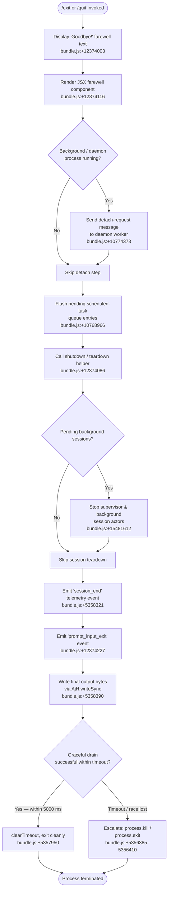

# `/exit`

> Analysis basis: CC v2.1.158 bundle.js (AST extraction + Claude interpretation)
> Minimum version: v2.1.158

---

## Overview

`/exit` (aliased as `/quit`) terminates the Claude Code CLI session immediately. When invoked, it triggers an orderly shutdown sequence: it displays a farewell message ("Goodbye!"), tears down background workers and daemon connections, flushes pending I/O, fires a `session_end` telemetry event, and finally calls `process.exit`. The command is classified as `immediate`, meaning it executes without entering the normal agent turn pipeline.

---

## Registration

| Field | Value |
|---|---|
| type | `local-jsx` |
| name | `exit` |
| description | `null` |
| aliases | `["quit"]` |
| immediate | `true` |
| module_id | `Do1` |
| load_inline | `true` |
| loc_byte | `12374790` |
| loc_byte_end | `12374986` |
| loc_line | `8261` |
| arbor_handler.name | `z$5` |
| arbor_handler.fqn | `claude-2.1.158::z$5` |
| arbor_handler.kind | `AsyncFunction` |
| arbor_handler.resolution_path | `module_id` |
| arbor_handler.n_hits | `1` |

Analysis basis: CC v2.1.158 bundle.js:+12374790

---

## Input Branching

The shutdown sequence has more than three distinct execution branches (UI teardown, background-daemon disconnect, detach-request messaging, process-kill/exit). A Mermaid flowchart is used.



---

## Behavioral Spec

### Top-level handler (`exitCommandHandler` / `z$5`)

Analysis basis: CC v2.1.158 bundle.js:+12374039

```
async function exitCommandHandler(context):
    // 1. Check process role (bg / daemon / daemon-worker)
    processRole = getProcessRole()   // v9 → QOH  [+12374039, +2201979]
    // Roles checked: "bg", "daemon", "daemon-worker"

    // 2. Display farewell
    print("Goodbye!")                // literal [+12374003]
    renderFarewellComponent()        // r8A.createElement [+12374116]

    // 3. Notify daemon of detach if applicable
    sendDetachRequest()              // HfH [+12374055]
        // internally writes "detach-request" message [+10774373]
        // over IPC channel (ks → Is.write [+10602526])
        // serialised via JSON.stringify (RH [+10602535, +183568])

    // 4. Flush state / scheduled tasks
    flushState()                     // HM [+12374072]
    shutdownScheduler()              // NV8 [+12374086]
        // clears "scheduled task" queue entries [+10767835]

    // 5. Render exit JSX and begin async shutdown
    exitComponent = buildExitComponent()    // O$5 → J2 [+12374209]
    await performShutdown()                 // H9 [+12374222]
```

### Farewell / UI teardown (`performShutdown` / `H9`)

Analysis basis: CC v2.1.158 bundle.js:+5357853

```
async function performShutdown():
    // a. Resolve any outstanding promise chain
    await Promise.resolve()              // [+5357853]

    // b. Unmount Ink/React UI
    unmountUI()                          // zIH → H.unmount [+5355785]
    writeRawBytes()                      // AjH.writeSync [+5355707]

    // c. Restore terminal state (save/restore cursor, handle tmux/iTerm)
    restoreTerminalState()               // Fq8 [+5355867]
        // writes ESC-7 / ESC-8 sequences [+3716519, +3716530]
        // applies tmux/screen replacements [+3369405, +3369478]
        // checks ghostty ≥ 1.2.0 / iTerm2 ≥ 3.6.6 [+3446869, +3446938]

    // d. Produce scroll summary for stats
    buildScrollSummary()                 // zv_ [+5357927]
        // emits telemetry: tengu_scroll_summary [+5357253]
        // writes dim-styled footer via j6.dim [+5356193]

    // e. Stop supervisor / background session actors
    stopSupervisorAndSessions()          // Y [+5358124]
        // "supervisor" literal [+15481344]
        // calls G.stop, E.stop, E.updateConfig, E.start
        // emits tengu_daemon_config_reload [+15482137]

    // f. Race: drain output vs. abort timeout
    timeoutMs = Math.max(5000, 3500)     // [+5357950, +5357957]
    winner = await Promise.race([
        drainOutput(),                   // oxH → qOA.drain [+58901]
        abortAfterTimeout(timeoutMs),
    ])                                   // [+5358070]

    // g. Telemetry flush before exit
    flushTelemetry()                     // EK6 [+5358248]
        // tengu_startup_perf, tengu_cache_eviction_hint [+5358273, +5358286]

    // h. Emit session_end event
    emit("session_end")                  // literal [+5358321]

    // i. Final byte write
    AjH.writeSync(...)                   // [+5358390]

    // j. Hard exit
    forceExit()                          // Yv_ [+5357933]
        // clearTimeout [+5356304]
        // process.exit  [+5356385]
        // process.kill  [+5356410]  — fallback if exit does not complete
        // throws Error("unreachable") [+5356452, +5356458]
```

### Background daemon shutdown helpers (`shutdownScheduler` / `NV8`)

Analysis basis: CC v2.1.158 bundle.js:+10767816

```
function shutdownScheduler():
    // Reads "scheduled task" entries from queue [+10767835]
    // Calls time-formatting helper ($iL) [+10767862]
    //   which computes relative durations via oq (Math.floor/Math.round) [+208980, +209107]
    // Pushes updated entries (H.push) [+10767821]
    // Calls string-truncation helper (R9) [+10767877]
    //   uses Bun.stringWidth for display width [+206938]
```

### Detach-request IPC (`sendDetachRequest` / `HfH`)

Analysis basis: CC v2.1.158 bundle.js:+10774339

```
function sendDetachRequest():
    lo6()                              // pre-send guard [+10774339]
    ZN1()                              // channel state check [+10774358]
        // calls EPH [+10768909], I8 [+10768961]
        // task type literal: "task" [+10768966], value 0 [+10768922]
    ks()                               // write to IPC channel [+10774364]
        // Is.write(serialisedMessage) [+10602526]
        // RH → JSON.stringify [+10602535]
    tAH()                              // post-send bookkeeping [+10774419]
    // message type written: "detach-request" [+10774373]
```

### Background spare-worker lifecycle (reachable during exit)

Analysis basis: CC v2.1.158 bundle.js:+15467342

```
// These helpers are called indirectly through the supervisor teardown path (Y → dVK)
// and are not user-visible, but they do fire telemetry.

onSigkillEscalate():
    emit telemetry: tengu_bg_dispatch_sigkill_escalate   // [+15467649]
    S.kill("SIGKILL")                                    // [+15467697]
    setTimeout(..., 100)                                 // [+15467721]

onLowMemory():
    emit telemetry: tengu_bg_dispatch_low_mem            // [+15468228]
    check os.freemem() / 1024                            // [+15468058, +15468122]

onSpareEnable():
    emit telemetry: tengu_bg_spare_enable                // [+15468923]

onSpareClaim():
    emit telemetry: tengu_bg_spare_claim                 // [+15469044]

onSpareClaimFail():
    emit telemetry: tengu_bg_spare_claim_fail            // [+15469307]

onSpareSpawn():
    emit telemetry: tengu_bg_spare_spawn                 // [+15467342]
    cF.spawn(...)                                        // [+15469366]
```

---

## State & Side Effects

| Item | Detail |
|---|---|
| Telemetry — `tengu_bg_dispatch_sigkill_escalate` | Fired when a background worker does not respond and a SIGKILL is sent (bundle.js:+15467649) |
| Telemetry — `tengu_bg_dispatch_low_mem` | Fired when free memory is below threshold during shutdown (bundle.js:+15468228) |
| Telemetry — `tengu_bg_spare_enable` | Fired when a spare worker slot is enabled (bundle.js:+15468923) |
| Telemetry — `tengu_bg_spare_claim` | Fired when a spare worker is successfully claimed (bundle.js:+15469044) |
| Telemetry — `tengu_bg_spare_claim_fail` | Fired when spare-worker claim fails (bundle.js:+15469307) |
| Telemetry — `tengu_bg_spare_spawn` | Fired when a new spare worker process is spawned (bundle.js:+15467342) |
| Telemetry — `tengu_daemon_config_reload` | Fired during supervisor teardown / config reconciliation (bundle.js:+15482137) |
| Telemetry — `tengu_startup_perf` | Flushed as part of final telemetry drain (bundle.js:+215155) |
| Telemetry — `tengu_scroll_summary` | Scroll-position summary emitted just before terminal restore (bundle.js:+5357253) |
| Telemetry — `tengu_amber_creek` | Fired during fullscreen-mode detection path (bundle.js:+3377806) |
| Telemetry — `tengu_pewter_brook` | Fired during local-agent detection path (bundle.js:+3377714) |
| Telemetry — `tengu_cache_eviction_hint` | Emitted as part of final telemetry flush (bundle.js:+5358286) |
| Event emitted | `session_end` string event (bundle.js:+5358321) |
| Event emitted | `prompt_input_exit` string event (bundle.js:+12374227) |
| IPC message sent | `"detach-request"` written over daemon IPC channel (bundle.js:+10774373) |
| Terminal state | ESC-7 / ESC-8 cursor save/restore sequences written; tmux/screen escape replacements applied (bundle.js:+3716519) |
| UI unmount | Ink/React component tree unmounted via `H.unmount` (bundle.js:+5355785) |
| Process signals | `process.exit` called; if stalled, `process.kill` escalation (bundle.js:+5356385, +5356410) |
| Background workers | SIGTERM → SIGKILL escalation path for background session processes (bundle.js:+15469542, +15467697) |
| Drain timeout | `Math.max(5000, 3500)` ms race before forced exit (bundle.js:+5357950) |
| Sound | <!-- TODO: not found in depth-2 traversal; needs --depth 4 --> |

---

## Version History

| Version | Change |
|---|---|
| v2.1.158 | Initial analysis |

---

## Common Mistakes

1. **Typing `/exit` mid-conversation without saving work** — the command is `immediate` and bypasses the normal turn pipeline, so any in-progress agent task is abandoned without a confirmation prompt.
2. **Expecting `/exit` and `/quit` to behave differently** — they are exact aliases sharing the same registration entry and handler (`z$5`).
3. **Assuming the process exits synchronously** — the shutdown is `async`; there is a `Promise.race` drain with up to 5 000 ms before the hard `process.exit` / `process.kill` escalation fires.
4. **Confusing "Goodbye!" with a user-configurable message** — the farewell string is a compile-time literal (bundle.js:+12374003), not a configurable setting.
5. **Expecting daemon background sessions to be preserved** — `/exit` sends a `"detach-request"` and then tears down all spare workers and supervisor actors; background sessions are stopped, not suspended.

---

## Appendix — Identifier Mapping

> For bundle debugging only. Identifiers change across versions.

| Identifier | Role |
|---|---|
| `z$5` | Top-level exit command handler (AsyncFunction, Arbor-resolved) |
| `v9` | Process-role resolver (reads "bg" / "daemon" / "daemon-worker") |
| `QOH` | Role-string dispatcher called by process-role resolver |
| `H` | Random-delay / setTimeout utility used during farewell animation |
| `HfH` | Detach-request IPC sender |
| `lo6` | Pre-send guard inside detach-request sender |
| `ZN1` | Channel state checker inside detach-request sender |
| `EPH` | Sub-check called by channel state checker |
| `I8` | Sub-check called by channel state checker |
| `ks` | IPC channel writer (wraps Is.write) |
| `RH` | JSON serialiser wrapper (wraps JSON.stringify) |
| `tAH` | Post-send bookkeeping after detach-request |
| `HM` | State flush helper |
| `NV8` | Scheduler shutdown helper (clears "scheduled task" queue) |
| `yG` | Queue-read helper called by scheduler shutdown |
| `qN` | Low-level queue/store primitive |
| `$iL` | Time/duration formatting helper |
| `QV` | Cron/schedule string parser |
| `K` | Padding/map utility; also used as a set/map in other contexts |
| `w` | Background worker process manager |
| `L` | Async task set manager (add/finally/delete) |
| `j` | Worker kill helper (SIGTERM path) |
| `D` | Daemon connection/disposal manager |
| `$` | Background session state object |
| `J` | Date object used for UTC schedule calculation |
| `XI` | Schedule string tokeniser |
| `Rv7` | Schedule range parser (splits, matches, parseInt, Array.from) |
| `A` | Push/lowercase utility array helper |
| `znH` | Time-of-day schedule matcher (getMinutes/setMinutes etc.) |
| `_` | Generic parameter/string variable |
| `O` | Background-session state object (I8-based) |
| `f` | Connection close / set utility |
| `q` | File-system / abort utility (unlinkSync, statSync, AbortSignal) |
| `oq` | Duration formatter (Math.floor / Math.round) |
| `R9` | String truncation helper (uses Bun.stringWidth) |
| `H8` | Terminal string-width measurer (wraps Bun.stringWidth) |
| `zq` | Display-width computation helper |
| `DY` | Sub-helper of display-width computation |
| `O$5` | Exit JSX component builder |
| `H9` | Async shutdown orchestrator (main teardown function) |
| `zIH` | UI unmount + raw-byte writer |
| `SR` | Sub-step of UI unmount |
| `Fq8` | Terminal state restore (ESC-7/8, tmux/screen handling) |
| `NVH` | Terminal type version checker (ghostty, iTerm2) |
| `GVH` | Sub-helper of terminal restore |
| `YW` | Escape-sequence rewriter for tmux/screen |
| `CH` | String coercion utility (wraps String()) |
| `zv_` | Scroll summary builder + dim-footer writer |
| `JZ` | Sub-helper of scroll summary |
| `Eb` | Sub-helper of scroll summary |
| `I6` | Low-level store accessor (wraps qN) |
| `OP6` | Path/stat helper used in scroll summary |
| `CS` | Store getter used by OP6 |
| `O_` | Store getter used by OP6 |
| `g6` | File existence check helper |
| `k$` | Alternate path resolver |
| `U4` | Sub-helper of alternate path resolver |
| `mX9` | Metrics/summary formatter |
| `Yv_` | Hard-exit executor (clearTimeout → process.exit → process.kill) |
| `oxH` | Output drain wrapper (wraps qOA.drain) |
| `Y` | Supervisor / background-session stop orchestrator |
| `u2H` | Background session writer/reporter |
| `s9` | Async-local-storage store reader |
| `J8` | Job/task handle |
| `EAA` | Session aggregation helper |
| `EH` | String coercion helper (wraps String) |
| `xe1` | Session stats formatter (Object.keys, Math.max, sY) |
| `G` | Keyboard/input event stop handler |
| `b` | Event object (preventDefault) |
| `h0` | User-settings accessor |
| `E` | Metrics/stats collector (stop/updateConfig/start) |
| `dVK` | Heartbeat dispatcher |
| `oHH` | Heartbeat inner helper |
| `V` | Secondary metrics collector |
| `d` | Generic disposal/teardown primitive |
| `EK6` | Telemetry flush orchestrator |
| `RB8` | Telemetry batch writer |
| `YDA` | Telemetry record serialiser |
| `fDA` | Telemetry file writer |
| `ODA` | Startup-perf report formatter |
| `K$H` | Sync file write helper (openSync/writeFileSync/fsyncSync/closeSync) |
| `ADA` | Telemetry entry builder |
| `Ib` | `perf_hooks` require wrapper |
| `zDA` | Secondary path/file writer |
| `N` | Log/event emitter formatter |
| `Cf8` | Session metrics recorder (Date.now, Math.max, Object.assign) |
| `uX9` | Sub-helper of session metrics recorder |
| `xX9` | Timing calculator (Date.now, Math.max, Math.round, Object.assign) |
| `CX9` | Sub-helper of timing calculator |
| `Aq` | Fullscreen/rendering mode detector |
| `B$H` | Feature-flag checker (FsK.has) |
| `ND_` | Sub-check of fullscreen detector |
| `mr` | Environment variable reader |
| `vD_` | Boolean coercion helper |
| `B_` | Alternate rendering mode setter |
| `G77` | Secondary rendering mode path |
| `G6` | Global event bus / rendering coordinator |
| `x96` | Cache eviction hint emitter |
| `bf8` | Parallel cleanup runner (Promise.all, Promise.race) |
| `g8` | Timeout-with-abort helper (setTimeout/clearTimeout/AbortSignal) |

---

Note: index built via Arbor fallback; some signals (telemetry, literals) may be missing — see arbor-fallback.js.