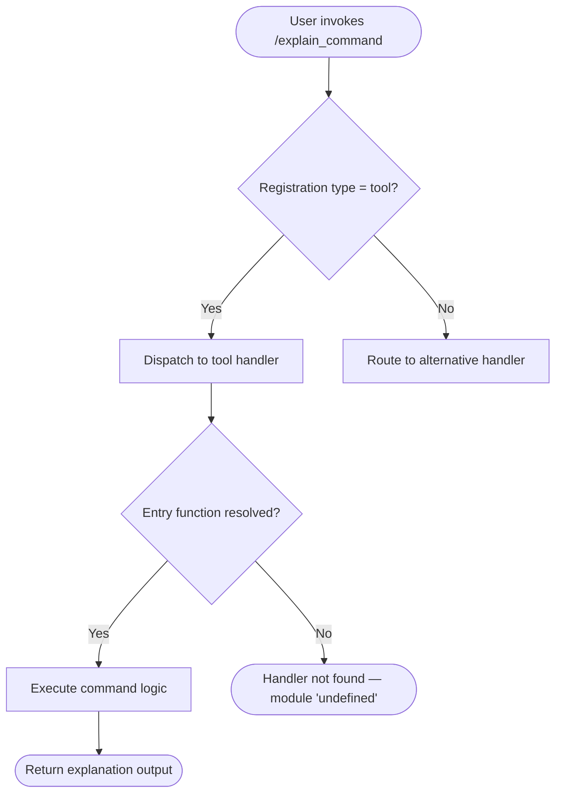

```
---
type: feature-spec
feature: "explain_command"
cc_version: "2.1.158"
updated: "2026-05-31"
tags: ["explain_command", "commands", "slash-commands"]
source: "bundle-analysis"
bundle_verified: true
analysis_basis: "CC v2.1.158 bundle.js (AST extraction + Claude interpretation)"
author: "ryujaeuk <ryujaeuk@gmail.com>"
repository: "https://github.com/MyLittleLuckyDog/cc-gnothi"
license: "AGPL-3.0-only"
---

# `/explain_command`

> Analysis basis: CC v2.1.158 bundle.js (AST extraction + Claude interpretation)
> Minimum version: v2.1.158

---

## Overview

`/explain_command` is a tool-type slash command registered in CC v2.1.158 at bundle byte offset 13913286. Based on its registration record, it is intended to provide explanatory output about a given command or subject within the Claude Code CLI environment. The depth-2 AST traversal recovered no call graph entries, literals, telemetry events, or obfuscated identifiers, indicating that its implementation module was not resolved during extraction.

---

## Registration

| Field | Value |
|---|---|
| type | `tool` |
| name | `explain_command` |
| description | `null` |
| loc\_line | 10597 |

Analysis basis: CC v2.1.158 bundle.js:+13913286

---

## Input Branching

<!-- TODO: not found in depth-2 traversal; needs --depth 4 -->

Because the call graph extracted at depth ≤ 2 is empty (`"callGraph": []`), no branching logic could be verified from bundle data. The flowchart below represents the structural skeleton that can be inferred solely from the registration type (`"tool"`) and the absence of resolved implementation symbols. It must be treated as provisional until a deeper traversal is available.



> **Note:** Nodes E → G reflect the extraction note `"no entry functions found for module 'undefined'"`.
> Analysis basis: CC v2.1.158 bundle.js:+13913286

---

## Behavioral Spec

### Command Dispatch

Because no entry functions were resolved during the depth-2 AST traversal, the behavioral specification below is the maximum that can be stated with bundle evidence.

```
function explainCommandDispatch(invocation):
    # Step 1 — Registration lookup
    record = lookupRegistration(name = "explain_command")
    assert record.type == "tool"

    # Step 2 — Entry function resolution
    entryFn = resolveEntryFunction(record.module)
    if entryFn is UNRESOLVED:
        raise ModuleNotFoundError("no entry functions found for module 'undefined'")

    # Step 3 — Execution (details require depth-4 traversal)
    result = entryFn(invocation.args)
    return result
```

Analysis basis: CC v2.1.158 bundle.js:+13913286

### Description Field

The `description` field for this command is explicitly `null` in the registration record. This means the command may rely on a dynamically generated or runtime-injected description rather than a static string baked into the bundle at registration time.

<!-- TODO: not found in depth-2 traversal; needs --depth 4 -->

Analysis basis: CC v2.1.158 bundle.js:+13913286

---

## State & Side Effects

| Item | Detail |
|---|---|
| Telemetry | None detected — `"telemetry": []` in extraction data |
| Hook registration | <!-- TODO: not found in depth-2 traversal; needs --depth 4 --> |
| appState changes | <!-- TODO: not found in depth-2 traversal; needs --depth 4 --> |
| Sound | <!-- TODO: not found in depth-2 traversal; needs --depth 4 --> |

> The complete absence of telemetry events (`"telemetry": []`) means either (a) this command emits no `tengu_*` events, or (b) the telemetry call sites reside in the unresolved module and were not reachable at depth ≤ 2.

Analysis basis: CC v2.1.158 bundle.js:+13913286

---

## Version History

| Version | Change |
|---|---|
| v2.1.158 | Initial analysis — registration confirmed at bundle byte +13913286, line 10597; implementation module unresolved at depth-2 traversal |

---

## Common Mistakes

1. **Assuming the description is static.** The `description` field is `null` at registration time. Do not rely on a fixed help string being available for this command; it may be injected at runtime or absent entirely.
2. **Invoking the command and expecting guaranteed output.** Because the entry function module resolved to `'undefined'` during AST extraction, there is a risk that the command handler is conditionally registered or dynamically loaded. Verify the command is available in your specific runtime environment before scripting around it.
3. **Relying on this spec for telemetry auditing.** Zero telemetry events were found at depth ≤ 2. If you are auditing data-emission behavior, a deeper traversal (`--depth 4` or higher) is required before concluding that the command is telemetry-free.
4. **Confusing registration type `"tool"` with a user-facing slash-command type.** The `type: "tool"` designation indicates this command is dispatched through the tool-handler pipeline, which may have different argument parsing, permission, and output-formatting behavior compared to commands registered under other types.

---

## Appendix — Identifier Mapping

> For bundle debugging only. Identifiers change across versions.

| Identifier | Role |
|---|---|
| *(none)* | No obfuscated identifiers were recovered during the depth-2 AST traversal (`"identifiers": []`). A `--depth 4` re-extraction is recommended to populate this table. |
```