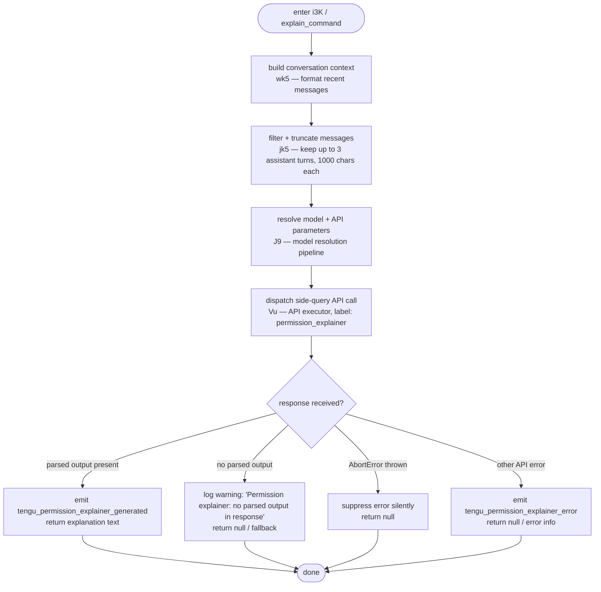

# `/explain_command`

> Analysis basis: CC v2.1.158 bundle.js (AST extraction + Claude interpretation)
> Minimum version: v2.1.158

---

## Overview

`/explain_command` is an internal tool-type slash command that generates natural-language explanations for why a particular tool or permission requires the access it does. It invokes a dedicated side-query API call (tagged `"permission_explainer"`) and emits telemetry for success and error outcomes. The command is not exposed as a user-facing interactive prompt but as a programmatic tool callable from the agent loop.

---

## Registration

| Field | Value |
|---|---|
| type | `tool` |
| name | `explain_command` |
| description | `null` |
| loc_byte | `13913286` |
| loc_byte_end | `13913322` |
| loc_line | `10597` |
| arbor_handler.name | `i3K` |
| arbor_handler.fqn | `claude-2.1.158::i3K` |
| arbor_handler.kind | `AsyncFunction` |
| arbor_handler.resolution_path | `direct` |
| arbor_handler.n_hits | `1` |

Analysis basis: CC v2.1.158 bundle.js:+13913286

---

## Input Branching

The handler has four distinct execution paths based on the API response: a successful parse path, a missing-output path, an abort/cancellation path, and a generic API error path.



Analysis basis: CC v2.1.158 bundle.js:+13913191, +13913819, +13914063, +13914320, +13914439, +13914510

---

## Behavioral Spec

### 1. Handler Entry — `permissionExplainerHandler` (`i3K`)

```
async function permissionExplainerHandler(toolName, toolInput, context):
    startTime = Date.now()                       // timestamp for latency telemetry

    # Step 1: Build conversation snippet
    conversationSnippet = buildConversationContext(context)   // wk5

    # Step 2: Filter and truncate to recent assistant turns
    truncatedMessages = filterAndTruncateMessages(conversationSnippet)  // jk5

    # Step 3: Resolve model and request parameters
    requestParams = resolveModelAndParams(context)   // J9

    # Step 4: Execute side-query API call
    try:
        response = await dispatchSideQuery(
            label = "permission_explainer",         // literal at +13913344
            messages = truncatedMessages,
            params = requestParams,
            apiExecutor = Vu
        )
        if response has parsed text output:
            emit telemetry("tengu_permission_explainer_generated")   // +13913769
            return extractedExplanation(response)
        else:
            log warning("Permission explainer: no parsed output in response")  // +13914116
            return null
    catch AbortError:                              // +13914439
        return null
    catch other error:
        emit telemetry("tengu_permission_explainer_error")  // +13913981
        return null
```

Analysis basis: CC v2.1.158 bundle.js:+13912981, +13913005, +13913026, +13913044, +13913191, +13913204

---

### 2. Conversation Context Builder — `buildConversationContext` (`wk5`)

```
function buildConversationContext(context):
    # Serializes recent message history for the explainer prompt
    raw = serializeToJSON(context.messages)   // RH -> JSON.stringify at +183568
    return String(raw).slice(0, 2 * 1000)     // limit ~2000 chars; literals: 2 at +13912501, 1000 at +13912545
```

Analysis basis: CC v2.1.158 bundle.js:+13912491, +13912517

---

### 3. Message Filter and Truncator — `filterAndTruncateMessages` (`jk5`)

```
function filterAndTruncateMessages(messages):
    # Keep only assistant-role messages
    assistantOnly = messages.filter(m => m.role == "assistant")  // literal "assistant" at +13912580

    # Reverse to get most-recent-first, take up to 3
    recent = assistantOnly.reverse().slice(0, 3)     // literal 3 at +13912600; +13912625, +13912768

    # Extract text content blocks, truncate each
    result = []
    for msg in recent:
        textBlocks = msg.content.filter(b => b.type == "text")  // literal "text" at +13912683
        snippet = textBlocks[0].text.slice(0, 1000)  // 1000 char limit per block
        result.unshift(snippet)                       // prepend to restore chronological order +13912789

    return result.join("...")                         // literal "..." at +13912781; +13912822
```

Analysis basis: CC v2.1.158 bundle.js:+13912557, +13912600, +13912625, +13912768, +13912789, +13912822

---

### 4. Side-Query API Dispatch — `dispatchSideQuery` (`Vu`)

`Vu` is the general-purpose side-query executor used throughout CC. When invoked for `explain_command`:

```
async function dispatchSideQuery(label, messages, params, context):
    # Adds label "permission_explainer" to the API request context
    # Uses "side_query" tagging (literal at +13164773)
    # Calls the underlying API client (OU) which handles:
    #   - Auth header injection (OAuth / API key)
    #   - Model selection (cIH, G6, S6 pipeline)
    #   - Streaming / non-streaming response handling
    #   - Token watchdog (NH7) with 15000ms/120000ms thresholds
    response = await apiClient(OU)(buildRequest(label, messages, params))
    return response
```

Analysis basis: CC v2.1.158 bundle.js:+13164741, +13164773, +13164822

---

### 5. Config Read Pipeline — `configReader` (`szH`)

Called transitively during model/auth resolution:

```
function configReader(configPath):
    if configAccessedBeforeAllowed:
        throw Error("Config accessed before allowed.")  // literal at +3210257

    raw = fs.readFileSync(configPath, "utf-8")          // literal "utf-8" at +3210340
    parsed = JSON.parse(raw)                            // p6 at +3210360

    if ENOENT error:                                    // literal "ENOENT" at +3210487
        return defaultConfig()

    return parsed
```

Analysis basis: CC v2.1.158 bundle.js:+3210251, +3210313, +3210340, +3210360, +3210487

---

### 6. Tool-Type Check — `checkMcpToolPrefix` (`g9`)

Used inside `i3K` to classify whether the target tool is an MCP tool:

```
function checkMcpToolPrefix(toolName):
    if Object.hasOwn(toolName):
        return toolName.startsWith(prefix)   // checks for mcp_tool category
    return false
```

Literal `"mcp_tool"` at +3160168; `"permission_explainer"` at +13913344.

Analysis basis: CC v2.1.158 bundle.js:+13913819, +3160088, +3160140

---

## State & Side Effects

| Item | Detail |
|---|---|
| Telemetry — success | `tengu_permission_explainer_generated` (bundle.js:+13913769) |
| Telemetry — error | `tengu_permission_explainer_error` (bundle.js:+13913981) |
| Telemetry — config parse error | `tengu_config_parse_error` (bundle.js:+3210888) — fires on malformed config during resolution |
| Telemetry — API success (shared) | `tengu_api_success` (bundle.js:+13166224) — fires in the Vu executor on successful API response |
| Telemetry — OAuth refresh (shared) | Various `tengu_oauth_token_refresh_*` events via the auth chain |
| API side-query label | `"permission_explainer"` injected as request context label |
| appState changes | None observed at depth-2 traversal |
| Hook registration | None directly; `q9` → `qOA.register` may fire during config watch setup (transitively via `m17`) |
| File I/O | Config file read via `fs.readFileSync` (transitively via `szH`); backup directory created if absent via `fs.mkdirSync` |
| Sound | None observed |
| No-output warning | Logs `"Permission explainer: no parsed output in response"` to internal log when the model returns no usable text block |
| AbortError handling | Silently swallowed — returns `null` without emitting telemetry |

---

## Version History

| Version | Change |
|---|---|
| v2.1.158 | Initial analysis |

---

## Common Mistakes

1. **Expecting a user-visible slash command**: `/explain_command` is registered as `type: "tool"`, not `type: "prompt"`. It is invoked programmatically by the agent loop (e.g., when the permission system requests an explanation), not by typing `/explain_command` in the chat UI.
2. **Assuming the command has a description**: `description` is `null` in the registration. Callers relying on metadata-driven help text will see nothing.
3. **Ignoring the `null` return on abort**: The handler silently returns `null` on `AbortError`. Callers must guard for `null` rather than treating a missing return as an error.
4. **Assuming all messages are included**: Only up to 3 most-recent assistant-role turns are forwarded, each capped at approximately 1000 characters, joined with `"..."`. Tool-use blocks and user messages are excluded.
5. **Confusing `permission_explainer` with `permission_explainer_generate`**: The telemetry event for the generation attempt is `tengu_permission_explainer_generated` (success) / `tengu_permission_explainer_error` (failure). The literal `"permission_explainer_generate"` at +13913871 is a sub-event label distinct from the final success/error events.

---

## Appendix — Identifier Mapping

> For bundle debugging only. Identifiers change across versions.

| Identifier | Role |
|---|---|
| `i3K` | Main async handler for `explain_command` (arbor_handler, AsyncFunction) |
| `M7A` | Intermediate dispatch wrapper called by `i3K` |
| `S6` | Config/session initializer; sets up file watches |
| `g6` | Logging utility (debug logger) |
| `HY_` | Session/context helper |
| `szH` | Config file reader (readFileSync + JSON.parse) |
| `p6` | JSON parse wrapper |
| `Qb` | String prefix/slice utility |
| `J8` | Error/result classifier |
| `RFq` | Directory resolver (basename, readdir, stat) |
| `N` | Logging/notification helper (debug, error levels) |
| `d` | Low-level logger or error emitter |
| `fY_` | Backup path builder (path.join + subdirectory) |
| `w` | Background daemon session manager |
| `m17` | File watcher / config watch registrar |
| `Vr` | Version or validation helper |
| `q9` | Hook/event registrar → `qOA.register` |
| `wk5` | Conversation context serializer |
| `RH` | JSON stringifier wrapper |
| `jk5` | Message filter and truncator (assistant turns, text blocks) |
| `H` | Generic collection / utility (Math.random, setTimeout) |
| `A` | Array utility (toLowerCase comparator) |
| `f` | Stream/connection close helper |
| `L` | Promise/resource tracker (add, finally, delete) |
| `J9` | Model and request parameter resolver |
| `se` | Sub-resolver in model pipeline |
| `KN` | Model name normalizer |
| `G9H` | Model capability checker |
| `bQ` | Model selection logic (tier/plan matching) |
| `M` | File cleanup helper (rm, has) |
| `K` | Padding / map utility |
| `Hr6` | Object entries / capability enumerator |
| `KFH` | Tier inclusion checker |
| `_Oq` | Model index finder |
| `Lm4` | Model include/alias resolver |
| `i1H` | Internal model list checker |
| `_1` | Model name normalizer (trim, toLowerCase, replace) |
| `fm4` | Model alias / prefix handler |
| `PX` | Request parameter builder |
| `E0` | API request object assembler |
| `GA` | Provider selector (EY, DR, Bq) |
| `AHH` | Max-plan handler |
| `FOH` | Team-plan handler |
| `MFH` | Enterprise-plan handler |
| `cG` | Provider context builder (iM, w5, WA) |
| `yP` | Provider fallback resolver |
| `iM` | WA-based provider instance |
| `WA` | Core provider/client factory |
| `w5` | Provider option builder (pxH, IC4, a1q, ei6) |
| `UN` | Unified provider builder (iM + w5) |
| `Vu` | Side-query API executor (main API call dispatcher) |
| `OU` | API client core (auth, headers, streaming, model) |
| `Mw` | Async-local-storage store getter |
| `ZH7` | URL/path split + trim + slice utility |
| `v9` | Rate-limit / quota checker (QOH) |
| `QOH` | Quota object handler |
| `Jr` | OAuth store resolver |
| `uo6` | OAuth async-local-storage getter |
| `I6` | Queue/batch processor |
| `qN` | Queue node |
| `b1_` | URL encoder (replace + encodeURIComponent) |
| `CH` | String coercion utility |
| `IO` | Token refresh / auth orchestrator |
| `w3_` | OAuth token refresh implementation (lock, retry, mkdir) |
| `$Oq` | Boolean coercion helper |
| `EY` | Auth profile resolver |
| `BK` | Auth string builder |
| `pP` | Profile credential resolver |
| `NO` | WA accessor |
| `qX` | Credential object |
| `F3` | Full auth flow orchestrator |
| `eO6` | ogH wrapper |
| `ogH` | Auth object builder (CH, F$H) |
| `u3` | Timestamp / utility helper |
| `GH7` | Header builder (qX, dgH) |
| `dgH` | Request timing/metadata (nN, Date.now) |
| `R_` | Request retry helper |
| `ic6` | Proxy auth helper (WTH, BrA, trust check) |
| `WTH` | Proxy config reader |
| `BrA` | Proxy config builder |
| `bW4` | Integer parser (parseInt, Number.isNaN) |
| `Yy` | Proxy URL validator |
| `XP` | Proxy resolution (RGH) |
| `kH7` | HTTP request executor (streaming, watchdog, headers) |
| `u5` | UUID/request-id generator |
| `cC6` | Request context builder |
| `Vzq` | Session validator (S6) |
| `yH7` | Header iterator/filter (authorization, anthropic-beta) |
| `IH7` | Response phase handler (y1, CH, G6) |
| `vH7` | Numeric/finite param validator |
| `NH7` | Byte-stream watchdog (performance.now, setTimeout, clearTimeout) |
| `Lw` | Language/locale resolver (si6, vC4, ai6, WA) |
| `si6` | Locale builder (WA, CH) |
| `vC4` | Prefix-based locale filter |
| `ai6` | Case-insensitive locale matcher |
| `Cz` | Proxy configuration resolver (CH, Yy, vQ, HUH) |
| `vQ` | URL parser/validator (split, includes, startsWith, substring) |
| `HUH` | Proxy auth reader (AR, up) |
| `FrA` | Proxy fallback |
| `u6_` | IP/host validator |
| `U6_` | URL utility |
| `TH7` | Model/token-limit resolver (mH8, fN, txH, $0H, kq) |
| `mH8` | Token budget builder (hP, J9, f9, fN) |
| `fN` | Token limit fetcher |
| `txH` | Context window helper |
| `$0H` | Command lookup (ihK.find, startsWith, Jb6) |
| `kq` | OAuth endpoint validator (HEA, z84, replace) |
| `nOH` | Gateway JWT refresher (bP.post, Pzq, Xzq, Wzq) |
| `Hp8` | Gateway helper |
| `Kp4` | Gateway refresh executor |
| `Hb6` | Gateway state helper |
| `em8` | Timestamp emitter |
| `cO6` | Header case-normalizer (Object.entries, toLowerCase) |
| `uzH` | SDK error logger (console.error) |
| `S` | Supervisor / daemon I/O handler |
| `nVK` | File real-path resolver (realpath, stat) |
| `Iz` | Supervisor state |
| `SH` | Error/feature reporter (F_, CH, L1, G_4, Vi.logError) |
| `qF5` | aW8 wrapper |
| `z` | Daemon write stream (hH, bH, Sy, Fm) |
| `h` | Away-summary scheduler (Xd, Date.now, Math.min, I, V, iXK) |
| `Xd` | Away-summary trigger |
| `I` | Away-summary generator (P08, Ax5, iXK, V, Bf8, bH, wZ1) |
| `V` | Away-summary state |
| `iXK` | Away-summary cache checker |
| `E` | Background event handler |
| `qW` | F3 wrapper |
| `GFH` | Federated-identity (WIF) credential fetcher (ja6, hH, bH, Dp4) |
| `ja6` | WIF token exchange (fetch, AbortSignal.timeout, Da6, Yp4, EH) |
| `hH` | Info-level logger (d) |
| `bH` | Warning-level logger (d) |
| `Dp4` | WIF include-list checker |
| `G` | Input event dispatcher (h0, Y, H) |
| `b` | Input stream reference |
| `h0` | User-settings loader (U6_) |
| `Y` | Terminal I/O controller (u2H, xe1, dVK, V.start, E.start/stop/updateConfig) |
| `X` | IPC / socket frame reader (Buffer.concat, J.indexOf, Qf, FB5) |
| `J` | Stream bridge (w) |
| `Qf` | Frame finalizer (H.end, RH) |
| `FB5` | Main IPC message dispatcher (large handler switch) |
| `gB5` | IPC sub-handler |
| `$` | Write-stream wrapper ($s1) |
| `tO` | Background service reference (rzH) |
| `PfA` | Packet formatter |
| `VVK` | Rate-limit / throttle controller (Date.now, Math.min, Qf, tO) |
| `g8` | Async queue/timeout manager (setTimeout, clearTimeout, L.unref) |
| `P` | Repaint/render scheduler (Ox8, ih, $m, QAH, Lc, SH, F_) |
| `P0` | Path join helper (PpH.join, JN, hz) |
| `c$` | Real-path normalizer (Vp.realpath, H.normalize) |
| `s$H` | Session file reader (Vp.open, readline, createReadStream) |
| `UB5` | Stall-detector (G6, Math.max) |
| `p` | Throttled writer (clearTimeout, $.write) |
| `tAH` | Terminal attachment helper |
| `gK` | Socket path builder (aP.join, DT) |
| `BB5` | Worker lifecycle manager (t9, gK, P0, c$, s$H, H.kill) |
| `o` | Voice/recording toggle timer (W.current, Q.setTimeout, N, a) |
| `x` | Idle-exit timer (R, clearTimeout, setTimeout, z.write, Math.round) |
| `r` | Voice focus-silence timer (T.current, Q.setTimeout, N, a) |
| `W` | Push-notification queue (DL) |
| `B` | MCP tool filter (VH.filter, dH.has) |
| `g` | MCP tool pair (B, $) |
| `l` | Filter helper (t.filter) |
| `a` | Stream mux (w, c) |
| `c` | yS8 wrapper |
| `_R6` | IPC write helper (H.destroy, H.write, RH) |
| `T` | Terminal render pair (Xv6, Ox8) |
| `EH` | String coercion (String) |
| `GEH` | Model/provider capability aggregator (f9, Lw, YR) |
| `f9` | Model feature checker (Hr6, fw, mp8, tw) |
| `fw` | Model name normalizer (toLowerCase, includes, replace) |
| `mp8` | Model feature flag |
| `tw` | Text replace utility (H.replace) |
| `YR` | WA accessor for provider check |
| `Y25` | Side-query model selector (H.find, A.find) |
| `Q9A` | SHA-256 hasher (oAK.createHash) |
| `po6` | OAuth cache-control builder (y1, WA, uo6, N) |
| `y1` | String utility (String) |
| `T_8` | WA token builder |
| `cIH` | Prompt-cache / model context assembler (CH, WA, GA, Cp8, G6) |
| `Cp8` | Cache-control builder |
| `G6` | Model request sender (sz6, tz6, Ex, q_8, S6) |
| `sz6` | Request serializer |
| `tz6` | Response deserializer |
| `Ex` | Error extractor (CH, Zx) |
| `q_8` | Request deduplicator (Bz_.has/add, izH.get, Uz_, dz_) |
| `bp8` | Model parameter validator |
| `PV` | Provider wrapper (K3_, WEH) |
| `K3_` | WA-based provider builder |
| `WEH` | Provider config validator (CH, Z1_) |
| `Z1_` | Tier inclusion list checker |
| `vqK` | Version/model key builder |
| `nH8` | Model feature aggregator (Xr, f9) |
| `IP` | Message mapper (H.map) |
| `fDH` | Agent dispatch handler (V9, Array.isArray, N, RH, wU, _7, I6) |
| `wU` | Sub-agent spawner (S6, CFq.randomBytes, z8) |
| `z8` | Agent session initializer (LY_, KT, szH, qY6, d, KY_) |
| `_7` | Agent runner (EY, S6) |
| `QMH` | Metrics/stats collector |
| `xJ6` | Token-budget manager (TM9, UnH, bJ6) |
| `TM9` | Token-budget enforcer (pk7, SH) |
| `pk7` | Builtin-agent set checker (PM9.has, FK, EL8.has) |
| `UnH` | Token-budget helper |
| `bJ6` | Token-budget hash builder (UnH, TL8) |
| `TL8` | SHA hash builder (JM9.createHash) |
| `jc` | Agent-type classifier (mk7, M8H, SH) |
| `mk7` | Agent name parser (startsWith, slice, ZL8, yG_) |
| `ZL8` | Agent name sub-parser (yG_) |
| `yG_` | String index/slice utility |
| `M8H` | Agent role classifier (startsWith) |
| `m96` | Miscellaneous model helper |
| `g9` | MCP tool prefix checker (Object.hasOwn, startsWith) |
| `t6` | Low-level logger wrapper (d) |