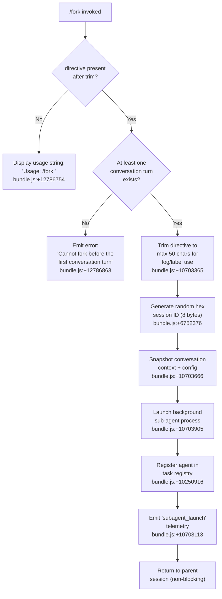

# `/fork`

> Analysis basis: CC v2.1.158 bundle.js (AST extraction + Claude interpretation)
> Minimum version: v2.1.158

---

## Overview

`/fork` spawns a background sub-agent that inherits the full current conversation context. The user supplies a `<directive>` string that becomes the task the forked agent pursues asynchronously, while the parent session continues interactively. The command validates that at least one conversation turn has already occurred before proceeding.

---

## Registration

| Field | Value |
|---|---|
| type | `local-jsx` |
| name | `fork` |
| description | Spawn a background agent that inherits the full conversation |
| argumentHint | `<directive>` |
| module_id | `K8K` |
| load_inline | `true` |
| loc_byte | `12787126` |
| loc_byte_end | `12787322` |
| loc_line | `9020` |
| arbor_handler.name | `Nj5` |
| arbor_handler.kind | `AsyncFunction` |
| arbor_handler.resolution_path | `module_id` |
| arbor_handler.fqn | `claude-2.1.158::Nj5` |
| arbor_handler.n_hits | `0` |

Analysis basis: CC v2.1.158 bundle.js:+12787126

---

## Input Branching

Three distinct branches exist: (1) missing directive, (2) fork called before any conversation turn, and (3) normal execution path with directive present.



---

## Behavioral Spec

### Handler entry — directive validation

Analysis basis: CC v2.1.158 bundle.js:+12786730

```
async function forkCommandHandler(directive, context):
    trimmedDirective = directive.trim()
    if trimmedDirective is empty:
        display "Usage: /fork <directive>"   // bundle.js:+12786754
        return

    if no conversation turns exist yet:
        display "Cannot fork before the first conversation turn"  // bundle.js:+12786863
        return

    proceed to sub-agent launch (see below)
```

### Directive trimming and label preparation

Analysis basis: CC v2.1.158 bundle.js:+10703365

The directive string is sliced to a maximum of 50 characters (literal `50` at bundle.js:+10703365) for use in log labels and UI display. The full directive is still passed to the sub-agent.

```
function prepareDirectiveLabel(directive):
    label = directive.slice(0, 50)   // constant 50 at bundle.js:+10703365
    return label
```

### Conversation context snapshot

Analysis basis: CC v2.1.158 bundle.js:+10703666

The handler calls the conversation-state reader (`V_`) to extract the most recent assistant message and its associated settings. Key fields copied into the fork context include:

| Field captured | Literal key | loc_byte |
|---|---|---|
| Working directory | `"working_directory"` | 10679953 |
| Allowed tools | `"allowed_tools"` | 10680008 |
| Disallowed tools | `"disallowed_tools"` | 10680063 |
| Avoid prompts | `"avoid_prompts"` | 10680124 |
| Session identifier | `"session"` | 10680423 |
| Effort level | `"effort"` | 10680448 |
| Model | `"model"` | 10680461 |
| Flag settings | `"flag_settings"` | 10680473 |

Analysis basis: CC v2.1.158 bundle.js:+10679848 (conversation state reader)

```
function snapshotForkContext(appState):
    lastAssistantMsg = appState.messages.findLast(isAssistantRole)
    return {
        working_directory: lastAssistantMsg?.working_directory,
        allowed_tools:     lastAssistantMsg?.allowed_tools,
        disallowed_tools:  lastAssistantMsg?.disallowed_tools,
        avoid_prompts:     lastAssistantMsg?.avoid_prompts,
        session:           lastAssistantMsg?.session,
        effort:            lastAssistantMsg?.effort,
        model:             lastAssistantMsg?.model,
        flag_settings:     lastAssistantMsg?.flag_settings,
    }
```

### Session ID generation

Analysis basis: CC v2.1.158 bundle.js:+6752360

A cryptographically random 8-byte buffer is generated and encoded as a hexadecimal string (constant `8` at bundle.js:+6752376, encoding `"hex"` at bundle.js:+6752388) to produce the sub-agent's session identifier.

```
function generateForkSessionId():
    randomBytes = crypto.randomBytes(8)   // 8 bytes → 16 hex chars
    return randomBytes.toString("hex")
```

### System prompt construction for the forked agent

Analysis basis: CC v2.1.158 bundle.js:+9354495

The fork launches a full agent loop (`bh` → system-prompt builder `zm`). The system prompt passed to the sub-agent is retrieved via `getSystemPrompt` and serialised with role `"system"` (literal at bundle.js:+12786794). The conversation history is sliced to the last 49 messages (constant `49` at bundle.js:+10703378) after trimming to ensure the fork starts with manageable context.

```
function buildForkSystemPrompt(appState, directive):
    systemPromptText = appState.getSystemPrompt()
    historySlice = conversationMessages.slice(-49)   // constant 49 at +10703378
    return { role: "system", content: systemPromptText }
```

### Sub-agent launch

Analysis basis: CC v2.1.158 bundle.js:+10703435

The core launch routine (`jH6`) orchestrates file-system setup, process spawning, and registration:

1. **Worktree / transcript directory** — creates the sub-agent working directory via `At.mkdir` (bundle.js:+12961242). Error codes `EEXIST` (bundle.js:+12963596), `ENOSPC` (bundle.js:+12963691), and `EDQUOT` (bundle.js:+12963705) are handled.
2. **Symlink** — a symlink is created (`At.symlink`, bundle.js:+12963560) and cleaned up on exit (`At.unlink`, bundle.js:+12963619).
3. **AbortController** — a dedicated abort controller is wired up for the forked process (bundle.js:+4711001). Abort event `"abort"` (bundle.js:+4711370) is registered.
4. **Timestamp** — `Date.now()` records the fork start time (bundle.js:+10703422).
5. **Process spawn** — the sub-agent is spawned as a `"local_agent"` type (literal at bundle.js:+10250605) with status `"running"` (bundle.js:+10250650) and purpose `"general-purpose"` (bundle.js:+10250724).
6. **Registry entry** — the task is registered under the `"fork"` source key (literal at bundle.js:+10703180) and type `"subagent"` (bundle.js:+10703840) / `"spawn"` (bundle.js:+10703905).

```
async function launchForkSubAgent(context, directive, sessionId):
    timestamp = Date.now()
    abortController = createAbortController()

    try:
        createWorkingDirectory()         // At.mkdir
        createSymlink()                  // At.symlink
        registerAbortHandler()           // 'abort' event
    catch EEXIST: ignore
    catch ENOSPC, EDQUOT: throw

    taskEntry = {
        type:    "local_agent",          // +10250605
        status:  "running",              // +10250650
        purpose: "general-purpose",      // +10250724
        source:  "fork",                 // +10703180
        label:   prepareDirectiveLabel(directive),
        startedAt: timestamp,
        sessionId: sessionId,
        abortController: abortController,
    }
    taskRegistry.register(taskEntry)     // K.register at +10250916
    emitTelemetry("subagent_launch")     // +10703113

    spawnAgentProcess(context, directive, taskEntry)
```

### Missing-directive telemetry

Analysis basis: CC v2.1.158 bundle.js:+10703131

When the directive is absent (empty string after trim), the event `"subagent_fork_prompt_missing"` is emitted before showing the usage string.

```
function onMissingDirective():
    telemetry.emit("subagent_fork_prompt_missing")  // +10703131
    display "Usage: /fork <directive>"
```

### Stall watchdog

Analysis basis: CC v2.1.158 bundle.js:+6842082

The sub-agent process is monitored by a stall watchdog. The watchdog fires after 600,000 ms (10 minutes, literal at bundle.js:+6842082). When triggered, event `"subagent_stall_timeout"` (bundle.js:+6843230) is recorded and telemetry event `tengu_async_agent_stall_timeout` is emitted (bundle.js:+6842973).

Maximum retry attempts before escalation: 10 (constant at bundle.js:+6842077).

### Sub-agent completion and result handling

Analysis basis: CC v2.1.158 bundle.js:+6843210

Upon sub-agent completion, event `"subagent_complete"` (bundle.js:+6843210) is dispatched. The result is surfaced to the parent session via the task registry notification path (`"task-notification"`, bundle.js:+10248728).

If the sub-agent is killed by the user, event `"user_kill_async"` (bundle.js:+6845071) is emitted. If it errors asynchronously, event `"subagent_async_errored"` (bundle.js:+6845342) is emitted. The agent result object carries `"subagent_completed"` (bundle.js:+6839353) on success.

---

## State & Side Effects

| Item | Detail |
|---|---|
| Telemetry — launch | `subagent_launch` (bundle.js:+10703113) |
| Telemetry — missing directive | `subagent_fork_prompt_missing` (bundle.js:+10703131) |
| Telemetry — stall timeout | `tengu_async_agent_stall_timeout` (bundle.js:+6842973) |
| Telemetry — sub-agent complete | `subagent_complete` / `subagent_completed` (bundle.js:+6843210, +6839353) |
| Telemetry — user kill | `user_kill_async` (bundle.js:+6845071) |
| Telemetry — async error | `subagent_async_errored` (bundle.js:+6845342) |
| Telemetry — stall sub-event | `subagent_stall_timeout` (bundle.js:+6843230) |
| Telemetry — sub-agent end | `subagent_end` (bundle.js:+6839650) |
| Telemetry — forked-agent turns exceeded | `tengu_forked_agent_default_turns_exceeded` (bundle.js:+10678726) |
| Telemetry — slim subagent claudemd | `tengu_slim_subagent_claudemd` (bundle.js:+9342398) |
| Telemetry — OTEL span | `claude_code.subagent.spawn` (bundle.js:+6750552) |
| File-system | Creates sub-agent working directory, symlink, transcript JSONL file |
| Task registry | Registers a new `local_agent` / `fork` entry; deregisters on completion |
| AbortController | A per-fork abort controller is created and stored for `Ctrl-C` propagation |
| Stall watchdog | `setTimeout` 600 000 ms, cleared on clean completion |
| appState changes | Fork task appended to the running-agents set; parent session state is not mutated |
| Sound | <!-- TODO: not found in depth-2 traversal; needs --depth 4 --> |

---

## Version History

| Version | Change |
|---|---|
| v2.1.158 | Initial analysis |

---

## Common Mistakes

1. **Invoking `/fork` before the first turn** — the command hard-blocks with "Cannot fork before the first conversation turn" (bundle.js:+12786863). Start the conversation with at least one user/assistant exchange first.
2. **Omitting the directive** — running `/fork` with no argument produces the usage message and does not launch any agent. The `<directive>` argument is mandatory.
3. **Expecting synchronous output** — `/fork` returns immediately to the parent session. The forked agent runs in the background; its results appear via task notifications, not inline.
4. **Assuming the fork inherits live state** — the fork receives a snapshot of the conversation at call time (last 49 messages). Changes made after `/fork` is issued are not visible to the sub-agent.
5. **Confusing `/fork` with `/resume`** — the literal `"resume"` (bundle.js:+10703299) is a different launch mode. `/fork` always creates a new agent from the current context; `/resume` reconnects to an existing session.

---

## Appendix — Identifier Mapping

> For bundle debugging only. Identifiers change across versions.

| Identifier | Role |
|---|---|
| `Nj5` | Fork command async handler (arbor_handler) |
| `Lo_` | Sub-agent launch orchestrator |
| `olL` | Conversation context collector |
| `V_` | Last-assistant-message state reader |
| `LV8` | Allowed-tools extractor |
| `fV8` | Disallowed-tools extractor |
| `xT` | System-prompt assembly pipeline |
| `m9A` | System-prompt component builder |
| `GT8` | Plugin/tool-list builder |
| `WY6` | Memory prompt builder |
| `ZP5` | Environment info (static) builder |
| `TP5` | Environment info (simple) builder |
| `VP5` | Background-session output-style builder |
| `vP5` | Scratchpad section builder |
| `IP5` | Brief-mode section builder |
| `hP5` | Focus section builder |
| `PP5` | Tone-and-style section builder |
| `LP5` | Language section builder |
| `EI9` | Agent-memory loader |
| `OP5` | Context-management section builder |
| `zP5` | Verified-vs-assumed section builder |
| `YP5` | Doing-tasks section builder |
| `DP5` | Using-tools section builder |
| `JP5` | Session-guidance section builder |
| `Rgq` | Memory-dir reader helper |
| `UzH` | API provider resolver |
| `zm` | System-prompt serialiser |
| `KC` | System-prompt formatter |
| `Z_` | ESModule default export binder |
| `M` | File-cleanup helper |
| `bH` | Debug/log helper |
| `hG8` | Message-filter helper |
| `akL` | Assistant-message filter |
| `skL` | User-message filter |
| `okL` | Tool-use-result filter |
| `tkL` | Error-result filter |
| `sV1` | History trim helper |
| `Jh` | Random-bytes generator |
| `jH6` | Sub-agent process launcher |
| `YSH` | Worktree directory setup |
| `kh8` | Active-set add/delete wrapper |
| `D9A` | Directory creator |
| `h$` | Path joiner helper |
| `SH` | Error logger helper |
| `LeH` | Transcript-file opener |
| `wE` | Subagent environment builder |
| `Ah` | AbortController factory |
| `x1` | AbortSignal max-listeners setter |
| `vV7` | WeakRef deref for abort signal |
| `NV7` | WeakRef deref for abort controller |
| `Z2` | Pending-status initialiser |
| `K` | Task-table renderer |
| `Ma` | Model resolver |
| `RZ` | Model-alias lookup |
| `_1` | Model-string normaliser |
| `HoH` | Sub-agent supervisor / event loop |
| `w26` | Task-state updater (running) |
| `xO` | Output flusher |
| `DLH` | Task state speculation aborter |
| `erH` | Message text filter |
| `jK` | Text-block filter |
| `iIH` | Cache-invalidation helper |
| `ZK` | Cache-key resolver |
| `j26` | Sub-agent turn runner |
| `lg_` | Tool-use set accumulator |
| `d0` | Turn state constructor |
| `E8` | UUID generator wrapper |
| `x$1` | State updater |
| `X` | Pipe line-reader |
| `Y` | Background-session renderer |
| `u2H` | Session-file writer |
| `xe1` | Session metrics formatter |
| `G` | Key-event handler |
| `dVK` | Heartbeat emitter |
| `O38` | Message boundary finder |
| `ljH` | REPL tool completion notifier |
| `gSH` | Tool-call classifier |
| `X26` | State update helper |
| `wLH` | Turn counter helper |
| `K38` | Sub-agent result packager |
| `DE` | Last-assistant-message finder |
| `T$` | Error string helper |
| `GI` | Tool-name case normaliser |
| `D4` | OTel event emitter |
| `E7H` | Tool-name lowercase normaliser |
| `Na7` | Cache-eviction hint checker |
| `M38` | Output classifier caller |
| `Lh9` | Classifier request builder |
| `O26` | Auto-mode classifier engine |
| `njH` | State updater (notification) |
| `EH` | String coercer |
| `bh` | Full sub-agent REPL session runner |
| `G6` | React-style update dispatcher |
| `JI9` | Stream-context setter |
| `g$8` | Span / telemetry helper |
| `Ky9` | Span cache getter/setter |
| `qy9` | Span abs-time helper |
| `mo7` | Trace push helper |
| `t08` | Session options reader |
| `P7H` | YAML loader/dumper |
| `HoH` | (See above — sub-agent supervisor) |
| `Q` | File-event reader |
| `UN6` | File read task |
| `wh1` | File unlink task |
| `fH` | Interactive REPL UI component |
| `tCH` | REPL key-event mapper |
| `Dh6` | Shortcut handler |
| `wH` | Input stream ref |
| `HH` | Focus-scroll helper |
| `p` | Buffered-write helper |
| `t` | Voice-mode handler |
| `_6` | MCP server list |
| `e` | Notification adder |
| `OH` | Event-queue enqueuer |
| `mH` | MCP tool-state mapper |
| `_H` | MCP server state mapper |
| `UIL` | System-prompt loader for sub-agent |
| `WE6` | GP5 (global-prompt section) loader |
| `CH` | String coercer (alternate) |
| `GE6` | Sub-agent session initialiser |
| `j7` | Agent runner bootstrap |
| `lX` | Main query/tool-execution loop |
| `Vq` | UUID generator (yw1) |
| `qj` | Hook schema validator |
| `y8` | Hook caller |
| `eKH` | VK7 has-check wrapper |
| `sk9` | Tool-allow-set builder |
| `UK` | qN (base) helper |
| `BIL` | System-prompt injector |
| `MH6` | mj (tool-search) helper |
| `L9` | Message-part slicer |
| `_SH` | Tool-sort helper |
| `mj` | Tool-search executor |
| `DL` | Sort comparator |
| `B6` | React SVG element helper |
| `tH` | Plugin-load timeout wrapper |
| `s6` | Command registry |
| `F6` | Full interactive session runner |
| `k6` | Stall-watchdog manager |
| `N2` | Performance marker |
| `aT` | Math.round wrapper |
| `tr1` | First-message latency tracker |
| `KZK` | parseInt wrapper |
| `g8` | Timeout/promise helper |
| `B5A` | Event-emitter wrapper |
| `VZK` | parseInt wrapper (VZK) |
| `Qc` | Config-flag resolver |
| `C6` | Working-directory context builder |
| `gH` | Plugin-list getter |
| `NU5` | Keep-alive enqueueer |
| `xH` | Error-output helper |
| `VEK` | vU5 wrapper |
| `L6` | MCP stream-event list |
| `EEK` | Event-batch joiner |
| `_fA` | Remote-baku handler |
| `AfA` | Flat-map helper |
| `LH` | Elicitation handler |
| `e5A` | Channel-notification handler |
| `NH` | Tool-filter helper |
| `f8` | Byte-scanner helper |
| `iv6` | User-input query receiver |
| `mo6` | AsyncLocalStorage runner |
| `d$8` | Context `enterWith` helper |
| `rZK` | SDK message submitter |
| `ZnH` | Dump-state helper |
| `WH` | G6 dispatch wrapper |
| `EU5` | Elicitation-response handler |
| `uH` | Message-batch writer |
| `bK` | Flush session state |
| `Wy` | CZ wrapper |
| `go6` | Object-values iterator |
| `IyH` | Background-filter helper |
| `BG6` | Teammate-mailbox mark-read |
| `kC` | Plugin-list fetcher |
| `ChH` | Teammate-remove helper |
| `ewH` | Termination-status reporter |
| `B1_` | Object-values iterator (B1_) |
| `F1_` | Object-entries iterator |
| `vd_` | Agent-teardown helper |
| `In_` | MCP cleanup helper |
| `mIL` | MCP config loader |
| `BK` | CH wrapper (BK) |
| `d_` | Config-dump helper |
| `PB` | Enterprise MCP config loader |
| `WL8` | Config-file reader (T8H/cHH) |
| `gc` | Local MCP entry builder |
| `s7H` | Tool-search feature loader |
| `yI` | Standard tool-search handler |
| `i7H` | Provider tool-search disabler |
| `jSH` | Tool-match checker |
| `Fd_` | Deferred-tools pool manager |
| `s08` | App-state initialiser |
| `_DH` | State-diff helper |
| `Bf9` | State-diff applier |
| `EE8` | State-merge helper |
| `o08` | MCP-server connection manager |
| `Zb` | MCP server base |
| `zV6` | Zb wrapper |
| `Zl` | MCP tool-filter helper |
| `b8H` | F8K tool-source checker |
| `Ng` | MCP-server connector |
| `cw1` | JT8 connection-cache helper |
| `XV` | Context-count resolver |
| `M0` | Max-context resolver |
| `SV_` | Tool-set builder |
| `jIH` | Exponential-backoff helper |
| `lG` | Tool language resolver |
| `J` | w (process-map) wrapper |
| `rg_` | U4 fork-context-ref builder |
| `U4` | q9 session store |
| `VAH` | U4 + RSH fork-metadata reader |
| `RSH` | Fork transcript filter |
| `zH6` | Transcript JSONL writer |
| `t8K` | wE sub-agent env builder |
| `RH` | JSON.stringify helper |
| `sH` | Session connection manager |
| `a1A` | Event-stream worker |
| `ok6` | Session-path sanitiser |
| `nH` | Connection event handler |
| `Y6` | Scheduler helper |
| `O6` | Write-batch helper |
| `yy9` | Tracing span manager |
| `MLH` | Span-context helper |
| `jh` | fLH.active reader |
| `gIH` | GNH span helper |
| `Lv` | Span name builder |
| `BjH` | Span enterWith helper |
| `Om` | Sub-agent turn manager |
| `WlL` | Full query execution engine |
| `tM8` | Sub-agent exit handler |
| `ig_` | Post-fork cleanup |
| `e7H` | Event-source filter |
| `Vj` | Event helper |
| `Jr7` | H.find wrapper |
| `BW` | jQL attachment lookup |
| `jQL` | Bv6 attachment mapper |
| `Bv6` | Attachment type checker |
| `JQL` | mv6 attachment iterator |
| `a08` | K/q tool-use containers |
| `$H6` | Progress event emitter |
| `tE6` | _.trim wrapper |
| `C$1` | _.get / QSH helper |
| `nX` | State-key reader |
| `QSH` | Timestamp helper |
| `h5H` | Sub-agent display renderer |
| `Tv` | TU/$D/Mp/Vb UI component |
| `OAK` | Tool-output formatter |
| `zAK` | yG/H.map aggregator |
| `BH` | mU_ JSON renderer |
| `mU_` | RH JSON helper |
| `xc` | CH + rN9 helper |
| `rN9` | Config-path resolver |
| `AI9` | jB.delete / kIH helper |
| `kIH` | Config-file writer |
| `ng_` | JT8.delete cleanup |
| `UIH` | B$8/wk_ cleanup |
| `hy9` | Span end helper |
| `FIH` | Span status setter |
| `FjH` | Span enterWith helper (FjH) |
| `XI9` | ZI_.delete cleanup |
| `ak9` | Tool-state sync |
| `jE` | Tool-state entry |
| `pIH` | Tool-state updater |
| `KJ6` | <!-- TODO: not found in depth-2 traversal; needs --depth 4 --> |
| `jjH` | <!-- TODO: not found in depth-2 traversal; needs --depth 4 --> |
| `Xd` | Focus/blur event type |
| `iXK` | Away-summary helper |
| `un_` | Task-completion timestamp helper |
| `YL` | HTML-entity replacer |
| `T5` | <!-- TODO: not found in depth-2 traversal; needs --depth 4 --> |
| `nIH` | <!-- TODO: not found in depth-2 traversal; needs --depth 4 --> |
| `gIL` | <!-- TODO: not found in depth-2 traversal; needs --depth 4 --> |

---

Note: index built via Arbor fallback; some signals (telemetry, literals) may be missing — see arbor-fallback.js.