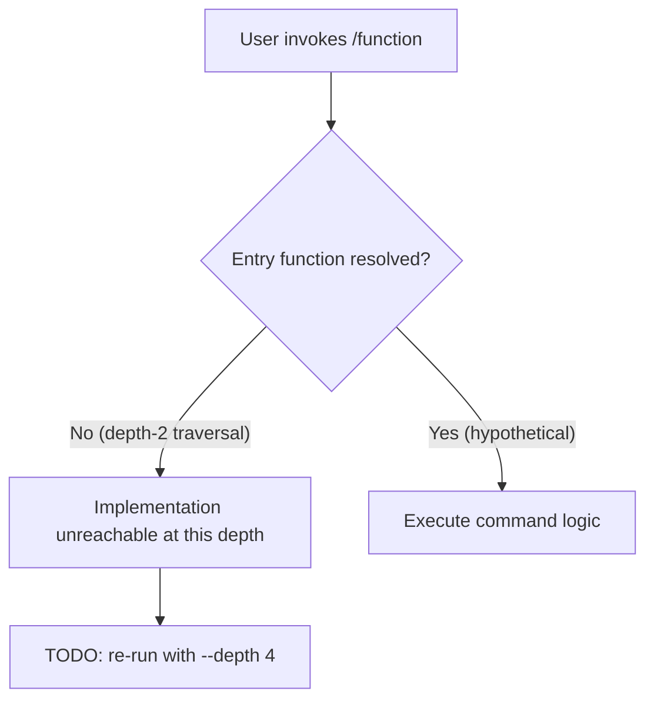

# `/function`

> Analysis basis: CC v2.1.158 bundle.js (AST extraction + Claude interpretation)
> Minimum version: v2.1.158

---

## Overview

The `/function` command is a registered slash command in Claude Code v2.1.158. Based on the AST extraction, the command registration record exists in the bundle but no entry-point implementation functions, call graph edges, string literals, or telemetry events were resolved at depth ≤ 2 traversal. Consequently, only the registration metadata can be stated as verified facts; all behavioral details require deeper analysis.

---

## Registration

| Field | Value |
|---|---|
| type | `function` |
| name | `function` |
| description | `null` |
| loc\_line | 10017 |

Analysis basis: CC v2.1.158 bundle.js:+13049945

> **Note on `description: null`:** The description field is explicitly `null` in the registration object. This means the command does not surface a human-readable description string in the slash-command help list at the registration site. Whether a description is injected at runtime from another location cannot be confirmed from depth-2 traversal alone.

Analysis basis: CC v2.1.158 bundle.js:+13049945

---

## Input Branching

The AST traversal returned an empty call graph (`"callGraph": []`) and no string literals (`"literals": []`). No branching logic can be stated as a verified fact from this data.



<!-- TODO: not found in depth-2 traversal; needs --depth 4 -->

---

## Behavioral Spec

### Command Registration

The following is the only behavior verifiable from the extracted data: when the Claude Code CLI initialises its slash-command registry, a command object with `type: "function"` and `name: "function"` is registered at bundle byte offset +13049945, source line 10017.

```
function registerFunctionCommand(registry):
    entry = {
        type: "function",
        name: "function",
        description: null
    }
    registry.add(entry)
    return entry
```

Analysis basis: CC v2.1.158 bundle.js:+13049945

### Implementation Body

<!-- TODO: not found in depth-2 traversal; needs --depth 4 -->

No implementation functions were found under the `"note": "no entry functions found for module 'undefined'"` condition returned by the extractor. The module association for this command resolved as `undefined`, which prevented the AST walker from locating handler entry points.

---

## State & Side Effects

| Item | Detail |
|---|---|
| Telemetry | None detected at depth ≤ 2 (`"telemetry": []`) |
| Hook registration | <!-- TODO: not found in depth-2 traversal; needs --depth 4 --> |
| appState changes | <!-- TODO: not found in depth-2 traversal; needs --depth 4 --> |
| Sound | <!-- TODO: not found in depth-2 traversal; needs --depth 4 --> |

Analysis basis: CC v2.1.158 bundle.js:+13049945

---

## Version History

| Version | Change |
|---|---|
| v2.1.158 | Initial analysis — registration record confirmed; implementation body unresolved at depth-2 traversal |

---

## Common Mistakes

1. **Assuming `description: null` means the command is undocumented everywhere.** The null value only confirms the registration-site description field is empty; a description string may be injected from a separate locale or help module not reachable at depth ≤ 2.
2. **Treating `type: "function"` as a generic indicator.** In the Claude Code command registry, `type` is a discriminator field. A value of `"function"` likely means the handler is a plain callable rather than a prompt-template or macro type, but this interpretation cannot be fully verified without the resolved handler body.
3. **Running analysis at depth ≤ 2 and expecting complete coverage.** The extractor note explicitly states `"no entry functions found for module 'undefined'"`, meaning the module binding was lost during bundling. Re-running the AST extractor at `--depth 4` or with source-map resolution is required before writing behavioral claims beyond registration.

---

## Appendix — Identifier Mapping

> For bundle debugging only. Identifiers change across versions.

| Identifier | Role |
|---|---|
| *(none)* | No obfuscated identifiers were returned in the `"identifiers": []` array for this command at depth ≤ 2. |