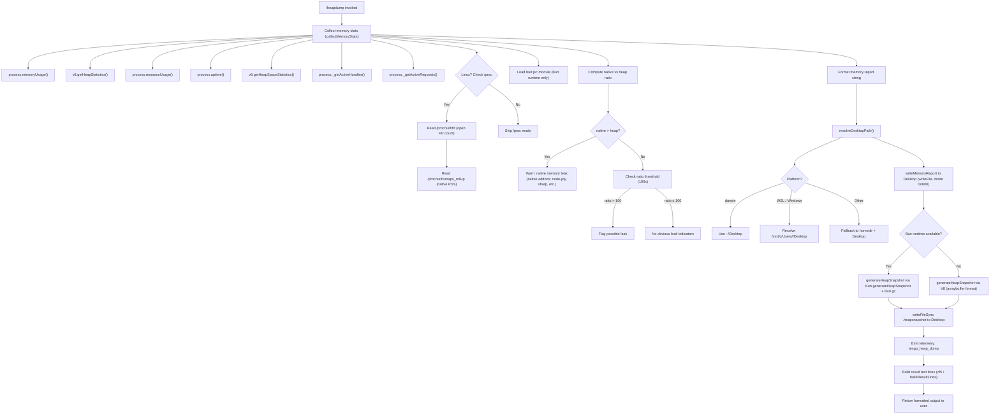

# `/heapdump`

> Analysis basis: CC v2.1.158 bundle.js (AST extraction + Claude interpretation)
> Minimum version: v2.1.158

---

## Overview

`/heapdump` is a hidden diagnostic slash command that captures a V8/Bun heap snapshot and a rich memory-statistics report, writing both to the user's Desktop directory. It is intended for internal debugging of Claude Code's own JavaScript process memory — particularly for identifying memory leaks in heap or native layers.

---

## Registration

| Field | Value |
|---|---|
| type | `local` |
| name | `heapdump` |
| description | `Dump the JS heap to ~/Desktop` |
| supportsNonInteractive | `true` |
| isHidden | `true` |
| module_id | `Ci1` |
| load_inline | `true` |
| loc_byte | `12303276` |
| loc_byte_end | `12303704` |
| loc_line | `8236` |
| arbor_handler.name | `df5` |
| arbor_handler.fqn | `claude-2.1.158::df5` |
| arbor_handler.kind | `AsyncFunction` |
| arbor_handler.resolution_path | `module_id` |
| arbor_handler.n_hits | `0` |

Analysis basis: CC v2.1.158 bundle.js:+12303276

---

## Input Branching

The command execution involves 4+ distinct branches depending on platform detection, memory ratio analysis, heap snapshot engine selection (V8 vs. Bun), and Linux `/proc` availability. A Mermaid flowchart is used.



---

## Behavioral Spec

### Handler Entry — `heapDumpHandler` (df5)

Analysis basis: CC v2.1.158 bundle.js:+12302145

```
async function heapDumpHandler(context):
    stats = await collectAndWriteMemoryReport(context)  // W8A
    lines = buildResultLines(stats)                      // cf5
    lines.push(...)
    return lines.join("\n")
```

The handler is an `AsyncFunction` resolved via `module_id` → `Ci1`. It delegates immediately to `collectAndWriteMemoryReport` and then formats the result.

Analysis basis: CC v2.1.158 bundle.js:+12302145, +12302264, +12302291, +12302413

---

### Memory Collection — `collectAndWriteMemoryReport` (W8A)

Analysis basis: CC v2.1.158 bundle.js:+12300807

```
async function collectAndWriteMemoryReport(context):
    stats = await gatherMemoryStats()           // Si1
    report = formatStatsAsText(stats)           // N, RH
    desktopPath = resolveDesktopPath()          // MvA
    outPath = path.join(desktopPath, filename)  // P8A.join
    writeFile(outPath, report, mode=0o600)      // b_6.writeFile (mode 384 decimal)
    snapshotPath = takeHeapSnapshot(outPath)    // Qf5
    emitTelemetry("tengu_heap_dump")            // d
    return { stats, desktopPath, snapshotPath }
```

File permissions are set to `0o600` (octal 384 decimal) — owner read/write only.
Analysis basis: CC v2.1.158 bundle.js:+12301255, +12301290

---

### Memory Statistics Gathering — `gatherMemoryStats` (Si1)

Analysis basis: CC v2.1.158 bundle.js:+12298308

```
async function gatherMemoryStats():
    mem     = process.memoryUsage()
    heap    = v8.getHeapStatistics()
    res     = process.resourceUsage()
    uptime  = process.uptime()
    spaces  = v8.getHeapSpaceStatistics()
    handles = process._getActiveHandles().length
    reqs    = process._getActiveRequests().length

    // Linux-only: open FD count
    try:
        fds = fs.readdir("/proc/self/fd")   // literal: "/proc/self/fd"
        fdCount = fds.length
    catch:
        fdCount = null

    // Linux-only: native RSS from smaps
    try:
        smaps = fs.readFile("/proc/self/smaps_rollup", "utf8")
        nativeRss = parseSmaps(smaps)
    catch:
        nativeRss = null

    // Bun-specific JSC stats
    try:
        jsc = require("bun:jsc")            // literal: "bun:jsc"
        jscStats = jsc.heapStats()
    catch:
        jscStats = null

    // Aged log lines: retain up to 3600 entries, each up to 1048576 bytes
    logSnapshot = captureRecentLogs(maxEntries=3600, maxBytes=1048576)

    nativeVsHeapRatio = mem.rss / heap.used_heap_size * 100
    nativeWarning = (nativeVsHeapRatio > 100)
        ? "Native memory > heap - leak may be in native addons (node-pty, sharp, etc.)"
        : null

    return { mem, heap, res, uptime, spaces, handles, reqs,
             fdCount, nativeRss, jscStats, logSnapshot,
             nativeVsHeapRatio, nativeWarning }
```

Key thresholds:
- Log ring buffer: 3600 entries max, 1 048 576 bytes per entry (bundle.js:+12298840, +12298845)
- Native/heap ratio warning threshold: 100 (bundle.js:+12298992)
- Warning text: "Native memory > heap - leak may be in native addons (node-pty, sharp, etc.)" (bundle.js:+12299078)

---

### Desktop Path Resolution — `resolveDesktopPath` (MvA)

Analysis basis: CC v2.1.158 bundle.js:+1015838

```
function resolveDesktopPath():
    home = os.homedir()                        // ai8.homedir
    desktop = path.join(home, "Desktop")       // literal "Desktop"

    // WSL detection: scan /mnt/c/Users for Windows Desktop
    if platform is WSL:
        windowsUsers = "/mnt/c/Users"          // literal
        candidates = readdir(windowsUsers)
        skip = ["Public", "Default", "Default User", "All Users"]
        for user in candidates:
            if user not in skip:
                return path.join(windowsUsers, user, "Desktop")

    return desktop
```

Skipped Windows system accounts: `Public`, `Default`, `Default User`, `All Users`
(bundle.js:+1016157, +1016176, +1016196, +1016221)

---

### Heap Snapshot Generation — `takeHeapSnapshot` (Qf5)

Analysis basis: CC v2.1.158 bundle.js:+12301825

```
function takeHeapSnapshot(reportPath):
    snapshotPath = reportPath.replace(".txt", ".heapsnapshot")

    if Bun is available:
        // Bun path: generate snapshot, force GC, write synchronously
        snapshot = Bun.generateHeapSnapshot("v8", "arraybuffer")
        Bun.gc(synchronous=true)
        fs.writeFileSync(snapshotPath, snapshot)
    else:
        // V8 path (Node.js): use v8 writeHeapSnapshot or equivalent
        writeHeapSnapshotV8(snapshotPath)

    return snapshotPath
```

Bun snapshot format constants: `"v8"`, `"arraybuffer"` (bundle.js:+12301870, +12301875)
Analysis basis: CC v2.1.158 bundle.js:+12301845, +12301902

---

### Result Line Builder — `buildResultLines` (cf5)

Analysis basis: CC v2.1.158 bundle.js:+12302520

```
function buildResultLines(stats):
    lines = []

    // Memory sizes in MB (toFixed precision, Math.max for display)
    rss_mb       = (stats.mem.rss       / 1048576).toFixed(1)
    heapUsed_mb  = (stats.mem.heapUsed  / 1048576).toFixed(1)
    heapTotal_mb = (stats.mem.heapTotal / 1048576).toFixed(1)
    external_mb  = (stats.mem.external  / 1048576).toFixed(1)

    lines.push("RSS: " + rss_mb + " MB")
    lines.push("Heap used: " + heapUsed_mb + " MB / " + heapTotal_mb + " MB")
    lines.push("External: " + external_mb + " MB")

    // Memory composition hint
    if heapUsed dominates rss:
        lines.push("— most memory is JS heap (inspect the .heapsnapshot)")
                   // literal bundle.js:+12302588
    else:
        lines.push("— most memory is native (NOT in the .heapsnapshot)")
                   // literal bundle.js:+12302648

    // Leak indicator
    if stats.nativeWarning:
        lines.push(stats.nativeWarning)
    else:
        lines.push("  (no obvious leak indicators)")  // bundle.js:+12302785

    lines.push("")
    lines.push("Open the .heapsnapshot in Chrome DevTools → Memory → Load to inspect retainers.")
              // literal bundle.js:+12302301

    // Platform annotation
    if platform == "darwin":
        lines.push("macos")              // bundle.js:+12299932

    // Threshold: 1 GB (1073741824 bytes) used for display bucketing
    if stats.mem.rss > 1073741824:
        lines.push("Warning: RSS exceeds 1 GB")

    return lines
```

Key literals:
- `"— most memory is JS heap (inspect the .heapsnapshot)"` (bundle.js:+12302588)
- `"— most memory is native (NOT in the .heapsnapshot)"` (bundle.js:+12302648)
- `"  (no obvious leak indicators)"` (bundle.js:+12302785)
- `"Open the .heapsnapshot in Chrome DevTools → Memory → Load to inspect retainers."` (bundle.js:+12302301)
- 1 GB threshold: `1073741824` (bundle.js:+12303194)
- Max precision digits: `8` (bundle.js:+12302920)

---

### Formatting Helpers

`formatLogLines` (K): maps log entries, padding each line to a fixed width using `"  "` (two-space indent literal at bundle.js:+15491413).

`formatErrorString` (F_): wraps `Error` and `String` constructors for consistent error message formatting (bundle.js:+173534, +173540).

`logTransport` (N): sends log output at `"debug"` level (literal bundle.js:+204151) using the `"manual"` trigger (literal bundle.js:+12300783) with initial verbosity `0` (bundle.js:+12300794).

---

## State & Side Effects

| Item | Detail |
|---|---|
| Telemetry | `tengu_heap_dump` (bundle.js:+12301397); background-session telemetry also in scope: `tengu_bg_dispatch_sigkill_escalate`, `tengu_bg_dispatch_low_mem`, `tengu_bg_spare_enable`, `tengu_bg_spare_claim`, `tengu_bg_spare_claim_fail`, `tengu_bg_proto_mismatch`, `tengu_bg_dispatch_stale_drop`, `tengu_bg_attach_legacy_autorespawn`, `tengu_bg_attach`, `tengu_bg_attach_stall_gave_up`, `tengu_bg_attach_stall_respawn`, `tengu_bg_attach_kick` |
| File I/O — report | Writes a `.txt` memory report to `~/Desktop` (or Windows Desktop under WSL) with permissions `0o600` (bundle.js:+12301255, +12301290) |
| File I/O — snapshot | Writes a `.heapsnapshot` file to the same Desktop directory synchronously via `writeFileSync` (bundle.js:+12301825) |
| Bun GC | When running under Bun, triggers a synchronous GC pass (`Bun.gc`) immediately after snapshot generation (bundle.js:+12301902) |
| `/proc` access | On Linux, attempts to read `/proc/self/fd` and `/proc/self/smaps_rollup`; failures are silently suppressed (bundle.js:+12298539, +12298601) |
| Hook registration | Logger transport `q9` registers via `qOA.register` (bundle.js:+58858) — this is the log ring-buffer hook, not specific to heapdump |
| appState changes | None observed within depth-2 traversal |
| Sound | None |
| Visibility | `isHidden: true` — not shown in the `/help` command listing |

---

## Version History

| Version | Change |
|---|---|
| v2.1.158 | Initial analysis |

---

## Common Mistakes

1. **Expecting output in the current working directory** — the command always writes to `~/Desktop` (or the resolved Windows Desktop under WSL), never to the CWD or a custom path.
2. **Running on a non-Desktop system** — headless servers typically lack a `~/Desktop` directory; the write may fail unless the directory is created manually beforehand.
3. **Forgetting the command is hidden** — `/heapdump` does not appear in `/help` output (`isHidden: true`). Users must type it exactly.
4. **Opening the `.heapsnapshot` in a text editor** — the file is a V8/Bun heap snapshot in a binary-adjacent JSON format; it should be loaded in Chrome DevTools (Memory panel → Load profile) as the in-output hint states.
5. **Interpreting "no obvious leak indicators" as clean** — the message `"  (no obvious leak indicators)"` only means the native-vs-heap heuristic did not fire; a retained-object leak invisible to that ratio check may still exist. Always inspect the `.heapsnapshot` retainer tree.
6. **Expecting Bun-specific stats on Node.js** — `bun:jsc` stats and `Bun.generateHeapSnapshot` are only available when CC is running under the Bun runtime. On standard Node.js the fallback V8 path is used.

---

## Appendix — Identifier Mapping

> For bundle debugging only. Identifiers change across versions.

| Identifier | Role |
|---|---|
| `df5` | `heapDumpHandler` — async top-level handler for `/heapdump` (arbor_handler) |
| `W8A` | `collectAndWriteMemoryReport` — orchestrates stat collection, file writes, snapshot |
| `Si1` | `gatherMemoryStats` — collects all process/V8/Bun/proc memory metrics |
| `Qf5` | `takeHeapSnapshot` — generates and writes the `.heapsnapshot` file (Bun or V8 path) |
| `cf5` | `buildResultLines` — formats human-readable memory summary lines |
| `MvA` | `resolveDesktopPath` — resolves Desktop path cross-platform (macOS / Linux / WSL) |
| `I6` | `logLineFormatter` — formats individual log lines |
| `qN` | `logLineHelper` — helper called by log formatter |
| `T` | `textNodeBuilder` — text node construction utility |
| `Xv6` | `textNodeHelperA` — helper for text node builder |
| `Ox8` | `textNodeHelperB` — helper for text node builder |
| `P` | `mcpConnectionManager` — MCP connection handling |
| `SH` | `serverConnectionHandler` — handles individual server connections |
| `F_` | `errorStringFormatter` — wraps Error/String for consistent messages |
| `X` | `childProcessRunner` — runs child processes and collects output |
| `J` | `outputBufferManager` — manages process output buffers |
| `w` | `daemonSessionManager` — manages background daemon sessions |
| `Qf` | `streamEndHandler` — handles stream end events |
| `FB5` | `daemonProtocolHandler` — implements daemon IPC protocol |
| `EH` | `stringCoercer` — coerces values to strings |
| `N` | `logTransport` — debug-level log transport (`"manual"` trigger) |
| `lCK` | `logTransportInit` — initialises log transport |
| `LOA` | `logTransportHelper` — helper for log transport init |
| `H` | `randomRetryHelper` — provides random jitter for retry logic |
| `RH` | `jsonStringifyWrapper` — wraps `JSON.stringify` |
| `v4` | `pathSegmentResolver` — resolves path segments |
| `pYA` | `byteArrayMapper` — maps byte arrays for path encoding |
| `q` | `unlinkSyncWrapper` — synchronous file unlink wrapper |
| `A` | `fileNameNormalizer` — normalises file names (toLowerCase) |
| `EuH` | `writeStreamManager` — manages write streams |
| `NYA` | `writeStreamHelper` — helper for write stream creation |
| `rCK` | `logFileWriter` — writes log entries to rotating log files |
| `rxH` | `batchedLogFlusher` — batches and flushes log entries with timeouts |
| `M$H` | `logFileRotator` — rotates log files when size limits are reached |
| `g6` | `mkdirWrapper` — creates directories recursively |
| `KK6` | `fileDescriptorChecker` — checks file descriptor state |
| `lYA` | `logFilePathResolver` — resolves log file paths |
| `cYA` | `logFileRenamer` — renames/rotates log files |
| `iCK` | `logFileAppender` — appends to log files with rotation |
| `q9` | `logHookRegistrar` — registers log transport hook via `qOA.register` |
| `K` | `logEntryFormatter` — formats log entries with padding |
| `L` | `promiseTracker` — tracks in-flight promises |
| `f` | `connectionCloser` — closes connections and resolves tracked promises |
| `d` | `telemetryEmitter` — fires telemetry events (including `tengu_heap_dump`) |
| `Iz` | `outputRenderer` — renders output to the terminal/UI |
| `x_6` | `leakHeuristicHelper` — helper for leak indicator heuristics |