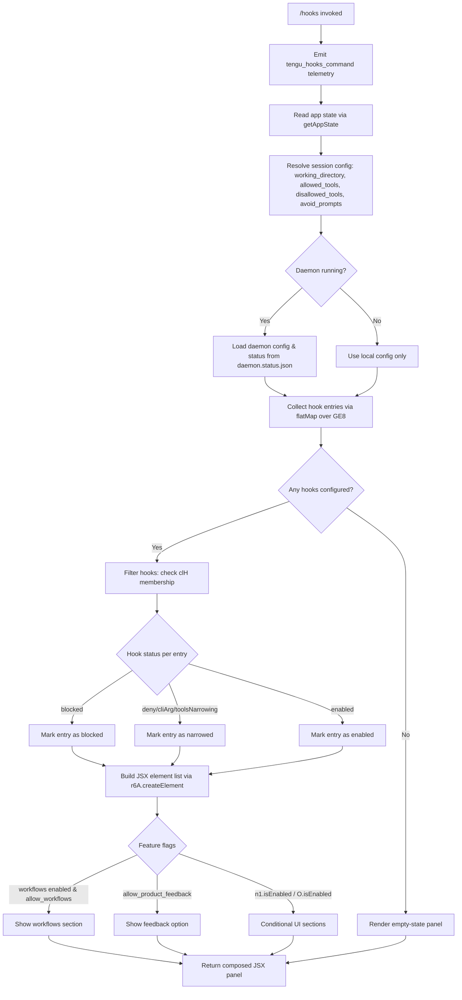

# `/hooks`

> Analysis basis: CC v2.1.157 bundle.js (AST extraction + Claude interpretation)
> Minimum version: v2.1.157

---

## Overview

The `/hooks` command renders an interactive JSX panel that displays all hook configurations registered for tool events in the current Claude Code session. It is an `immediate`-type local-jsx command, meaning it executes and renders its UI synchronously without delegating to the agent. The command reads app state, resolves the active daemon configuration, and presents hook rules grouped by event type alongside their current status (enabled/blocked/narrowed).

---

## Registration

| Field | Value |
|---|---|
| type | `local-jsx` |
| name | `hooks` |
| description | `View hook configurations for tool events` |
| immediate | `true` |
| module_id | `Pl1` |
| load_inline | `true` |
| loc_byte | `12193944` |
| loc_byte_end | `12194094` |
| loc_line | `8114` |
| arbor_handler.name | `$55` |
| arbor_handler.fqn | `claude-2.1.157::$55` |
| arbor_handler.kind | `AsyncFunction` |
| arbor_handler.resolution_path | `module_id` |
| arbor_handler.n_hits | `0` |

Analysis basis: CC v2.1.157 bundle.js:+12193944

---

## Input Branching

The command involves multiple distinct branches across hook presence, daemon state, tool-narrowing modes, feature flags, and supervisor/workflow states. A Mermaid flowchart is used.



---

## Behavioral Spec

### Handler Entry Point

The async handler (Arbor name: `$55`) is the top-level entry resolved via `module_id` → `Pl1` → export lookup.

```
async function hooksCommandHandler(context):
    emitTelemetry("tengu_hooks_command")         // loc_byte 12193744
    appState = readAppState()                    // via getAppState, loc_byte 12193776
    hookViewData = buildHookView(appState)       // via Zv, loc_byte 12193784
    return r6A.createElement(hookViewPanel, hookViewData)  // loc_byte 12193814
```

Analysis basis: CC v2.1.157 bundle.js:+12193742

---

### App State Resolution

The state-reading function (mapped from `V_`) looks up the current session's configuration object, then extracts four key string fields used throughout hook evaluation.

```
function readAppState():
    state = H.getAppState()                      // loc_byte 10679373
    lastEntry = A.findLast(state.entries)        // loc_byte 10679453
    workingDir   = lastEntry["working_directory"]  // loc_byte 10679478
    allowedTools = lastEntry["allowed_tools"]      // loc_byte 10679533
    disallowedTools = lastEntry["disallowed_tools"]// loc_byte 10679588
    avoidPrompts = lastEntry["avoid_prompts"]      // loc_byte 10679649

    allowedToolSet   = resolveToolSet(allowedTools,   mode="_V8")  // loc_byte 10679551
    disallowedToolSet= resolveToolSet(disallowedTools, mode="AV8") // loc_byte 10679609
    return { workingDir, allowedToolSet, disallowedToolSet, avoidPrompts }
```

Analysis basis: CC v2.1.157 bundle.js:+10679373

---

### Hook View Construction

The primary composition function (mapped from `Zv`) orchestrates all sub-renders and is called by the handler.

```
function buildHookView(appState):
    configLoader  = loadConfig()              // x0, loc_byte 9616037
    configLoader resolves "cli" or "remote"  // loc_byte 4708207, 4708218
    emitTelemetry("tengu_slate_harbor")      // loc_byte 4708237

    sessionMeta = resolveSessionMeta()       // session, effort, model, flag_settings
                                             // loc_bytes 10679948–10679998

    hookEntries = collectHookEntries(appState) // NAH → dE6 → n5H flatMap GE8
                                               // loc_byte 9616160
    filteredEntries = hookEntries.filter(e => !clH.has(e))  // loc_byte 9616507
    mappedEntries   = filteredEntries.map(buildHookRow)      // loc_byte 9616535

    supervisorSection = buildSupervisorSection()  // js, loc_byte 9616347
    daemonSection     = buildDaemonSection()      // Y, loc_byte 9616247

    featureSections = []
    if A.has(allowedFeatures):               // loc_byte 9616365
        featureSections.push(workflowSection)
    if K.some(hookEntries):                  // loc_byte 9616393
        featureSections.push(extraSection)
    if n1.isEnabled():                       // loc_byte 9616416
        featureSections.push(conditionalSection1)
    if O.isEnabled():                        // loc_byte 9616546
        featureSections.push(conditionalSection2)
    if $.includes(something):               // loc_byte 9616633
        featureSections.push(inclusionSection)

    return compose(mappedEntries, supervisorSection, daemonSection, featureSections)
```

Analysis basis: CC v2.1.157 bundle.js:+9615998

---

### Hook Entry Collection

```
function collectHookEntries(appState):
    rawList = GE8.flatMap(expandHookDefs)       // n5H, loc_byte 10392419
    annotated = rawList.map(entry =>
        attachOrigin(entry, aO)                 // loc_byte 10392513
    )
    viFiltered = filterViaVi_(annotated)        // vi_, loc_byte 10393162
        // vi_ checks Qo8 (loc_byte 10392756), O56 (loc_byte 10392806), HR (loc_byte 10392861)
    with LT1 applied as post-filter             // loc_byte 10393186
    return viFiltered
```

The `"deny"` literal (loc_byte 10392496) and source tags `"cliArg"` (loc_byte 10393082) and `"toolsNarrowing"` (loc_byte 10393103) are used during annotation to classify hook restrictions.

Analysis basis: CC v2.1.157 bundle.js:+10392419

---

### Hook Row Status Classification

Each hook entry is classified before rendering. The `"blocked"` status string (loc_byte 9615413) is matched against a filter set checked at loc_byte 9616507.

```
function buildHookRow(entry):
    if entry.status == "blocked":              // loc_byte 9615413
        return renderBlockedRow(entry)
    elif entry.source in ["cliArg", "toolsNarrowing", "deny"]:
        return renderNarrowedRow(entry)
    else:
        return renderEnabledRow(entry)
```

Analysis basis: CC v2.1.157 bundle.js:+9615413

---

### Daemon Section

The daemon section (mapped from `Y`) handles display and interaction with the background daemon process. It reads `supervisor` context (loc_byte 15480646), writes output (`q.write`, loc_byte 15480638), and manages daemon lifecycle.

```
function buildDaemonSection(appState):
    supervisorInfo = getSupervisorInfo("supervisor")  // loc_byte 15480646
    daemonWriter   = buildWriter(u2H)                 // loc_byte 15480621
        // u2H reads daemon.status.json               // loc_byte 12448301
        // handles ENOENT gracefully                  // loc_byte 12632759

    displayTable   = buildStatusTable(Re1)            // loc_byte 15480840
        // Re1 uses Object.keys + Math.max for column sizing
        // loc_bytes 12633772, 12633817

    stopHandler    = G.stop(daemonWriter)             // loc_byte 15480914
        // G checks "remoteControlAtStartup"          // loc_byte 13607891
        // G uses "userSettings" key                  // loc_byte 3364828

    if daemonRunning:
        stopDaemon()  → emitTelemetry("tengu_daemon_config_reload") // loc_byte 15481439
        updateConfig(E.updateConfig)                  // loc_byte 15481043
        restartDaemon(E.start)                        // loc_byte 15481061
        heartbeatReinit(FVK → oHH, "heartbeat")      // loc_bytes 15481163, 15479867
    return daemonDisplay
```

Analysis basis: CC v2.1.157 bundle.js:+15480621

---

### Supervisor / Worker Control Section

```
function buildSupervisorSection():
    featureContext = resolveFeatureContext(Ik)        // loc_byte 9615308
        // Ik → Al_: checks "standard" (loc_byte 9986143),
        //           "tst" (loc_byte 9986222, max 100, loc_byte 9986235),
        //           "tst-auto" (loc_byte 9986272)
        // Ik → N:  checks "debug" (loc_byte 204151)
        // Ik → TA: checks "bedrock","foundry","anthropicAws","mantle","vertex"
        //          loc_bytes 2046248–2046456, api.anthropic.com loc_byte 2047139

    sdkType = resolveSDKType(xX)                     // loc_byte 9614744
        // xX maps "sdk-ts","sdk-py","sdk-cli","local-agent"
        // loc_bytes 5262880–5262923

    agentTeamsFlag = checkAgentTeams(b9)             // loc_byte 9615089
        // b9 checks "--agent-teams" flag             // loc_byte 5390280
        // emits "tengu_amber_flint"                  // loc_byte 5390392

    workflowEnabled = checkWorkflows(JW)             // loc_byte 9616138
        // JW → r89 → N9: checks "allow_workflows"   // loc_byte 4108888
        // JW → RP_ → zP7: checks "pro" tier         // loc_byte 4109334
        // emits "tengu_workflows_enabled"            // loc_byte 4109089

    productFeedback = N9.check("allow_product_feedback") // loc_byte 4107652

    platformCheck = checkPlatform(_C)                // loc_byte 9615925
        // _C checks "windows"                       // loc_byte 4826463
        // emits "tengu_cobalt_ridge"                // loc_byte 4826557

    return buildSupervisorUI(featureContext, sdkType, workflowEnabled, platformCheck)
```

Analysis basis: CC v2.1.157 bundle.js:+9615308

---

### Daemon Lifecycle Management (Stop/Start/Shutdown)

The `z` array accumulates daemon control operations, each emitting specific telemetry.

```
function manageDaemonLifecycle():
    operations = []

    stopOp = buildStopOperation(hH)           // loc_byte 15502710
        // emits "tengu_feature_ok"           // loc_byte 966033
        // event tag "daemon_stop"            // loc_byte 15502713

    failedStopOp = buildFailedStopOp(bH)      // loc_byte 15502733
        // emits "tengu_feature_bad"          // loc_byte 966091
        // event tag "daemon_stop_failed"     // loc_byte 15502750

    daemonControlOp = buildDaemonControl(hy)  // loc_byte 15502785
        // emits "tengu_daemon_control"       // loc_byte 15502788
        // uses "firstParty" tag             // loc_byte 3180527
        // hy → xz_: generates UUID via Cz_.randomUUID  // loc_byte 3180062
        // hy → FEH → yy cleanup             // loc_byte 3179075

    shutdownOp = buildShutdownRace(Fm)        // loc_byte 15502839
        // Fm uses Promise.race + Promise.all  // loc_bytes 15497884, 15497898
        // Md → cKH.shutdown                  // loc_byte 3179908
        // Yd → clearTimeout                  // loc_byte 3216669
        // g8 timeout: 500 ms                 // loc_byte 15497926
        // on abort: process.exit             // loc_byte 15497965
        // uses status "stopped"              // loc_byte 15502622
        // uses label "background session"    // loc_byte 15502665

    operations.push(stopOp, failedStopOp, daemonControlOp, shutdownOp)
    return operations
```

Analysis basis: CC v2.1.157 bundle.js:+15502710

---

### Config Loading Sub-System

The config loader (mapped from `x0`) resolves the active hook configuration source, distinguishing between `"cli"` and `"remote"` origins and normalizing boolean-like strings.

```
function loadConfig():
    source = determineSource()           // "cli" loc_byte 4708207, "remote" loc_byte 4708218
    emitTelemetry("tengu_slate_harbor")  // loc_byte 4708237

    normalized = normalizeBooleans(value):
        if value in ["yes", "on"]:  return true   // loc_bytes 26948, 26954
        if value in ["no", "off"]:  return false  // loc_bytes 27099, 27104

    formatAs = "code"                    // loc_byte 173654

    return resolvedConfig
```

Analysis basis: CC v2.1.157 bundle.js:+4708055

---

### Status Table Rendering

```
function buildStatusTable(entries):
    keys     = Object.keys(entries)               // loc_byte 12633772
    maxWidth = Math.max(...keys.map(k => k.length)) // loc_byte 12633817
    rows     = entries.map(e => padRow(e, maxWidth)) // sY, loc_byte 12634016
    // Column padding constant: 40 chars          // loc_byte 15492686
    // Separator: two spaces "  "                 // loc_byte 15490715
    return formattedTable
```

Analysis basis: CC v2.1.157 bundle.js:+12633772

---

## State & Side Effects

| Item | Detail |
|---|---|
| Telemetry: `tengu_hooks_command` | Fired immediately on command invocation (loc_byte 12193744) |
| Telemetry: `tengu_slate_harbor` | Fired during config source resolution (loc_byte 4708237) |
| Telemetry: `tengu_daemon_config_reload` | Fired when daemon config is reloaded/restarted (loc_byte 15481439) |
| Telemetry: `tengu_workflows_enabled` | Fired when workflow feature flag is evaluated (loc_byte 4109089) |
| Telemetry: `tengu_cobalt_ridge` | Fired during platform/OS check (loc_byte 4826557) |
| Telemetry: `tengu_feature_ok` | Fired on successful daemon stop (loc_byte 966033) |
| Telemetry: `tengu_feature_bad` | Fired on failed daemon stop (loc_byte 966091) |
| Telemetry: `tengu_daemon_control` | Fired on daemon control operation (loc_byte 15502788) |
| Telemetry: `tengu_amber_flint` | Fired during `--agent-teams` flag check (loc_byte 5390392) |
| App state reads | `getAppState()` → session config fields: `working_directory`, `allowed_tools`, `disallowed_tools`, `avoid_prompts`, `session`, `effort`, `model`, `flag_settings` |
| Daemon status file | Reads `daemon.status.json` at runtime; handles `ENOENT` gracefully (loc_byte 12632759) |
| Daemon lifecycle | May call `E.stop`, `E.updateConfig`, `E.start`; shutdown race uses 500 ms timeout (loc_byte 15497926); calls `process.exit` on abort (loc_byte 15497965) |
| File system | Daemon stop may call `JVK.unlinkSync` for cleanup (loc_byte 15445005); temp files tracked via `q.add`/`q.delete` (loc_bytes 15472012, 15472035) |
| UUID generation | `Cz_.randomUUID()` used for daemon control op tracking (loc_byte 3180062) |
| Heartbeat | Re-initialised via `oHH` using key `"heartbeat"` after config reload (loc_byte 15479867) |
| Hook registration | `sfA.set` used to register async store bindings (loc_byte 1692) |
| Sound | <!-- TODO: not found in depth-2 traversal; needs --depth 4 --> |

---

## Version History

| Version | Change |
|---|---|
| v2.1.157 | Initial analysis |

---

## Common Mistakes

1. **Assuming `/hooks` modifies hook config**: The command is read-only and display-only by default; it renders the current hook configuration but does not provide an inline editor. Daemon restart is a side-effect of the display only when a config reload is explicitly triggered.
2. **Confusing `blocked` vs `deny` vs `toolsNarrowing`**: These are three distinct hook-entry status classifications. `"blocked"` (loc_byte 9615413) disables the entry entirely; `"deny"` and `"toolsNarrowing"` (loc_bytes 10392496, 10393103) indicate narrowing constraints, not full disablement.
3. **Expecting output on missing daemon**: If the daemon is not running, `/hooks` gracefully falls back to local config; it does not error out. `ENOENT` on `daemon.status.json` is handled silently.
4. **Treating the column width as fixed**: The status table computes max column width dynamically using `Math.max` over all key lengths, padded to at most 40 characters (loc_byte 15492686).
5. **Overlooking platform-specific branches**: The `"windows"` platform check (loc_byte 4826463) may suppress or alter certain hook display sections; behaviour differs on Windows hosts.
6. **Ignoring `"pro"` tier gating**: Workflow-related hook sections are gated behind `"allow_workflows"` and `"pro"` tier checks (loc_bytes 4108888, 4109334); users on non-pro plans will see a reduced view.

---

## Appendix — Identifier Mapping

> For bundle debugging only. Identifiers change across versions.

| Identifier | Role |
|---|---|
| `$55` | Top-level async handler for `/hooks` command (Arbor-resolved, AsyncFunction) |
| `d` | Telemetry emit helper |
| `V_` | App-state reader; extracts session config fields and tool sets |
| `H` | App-state store / event emitter; also used for random/timeout scheduling |
| `A` | Entry array with `findLast` / `has` operations on hook/config collections |
| `f` | File descriptor / stream handle used in daemon I/O |
| `q` | Temp-file / open-handle set (add/delete/close/write) |
| `L` | Async lifecycle wrapper (add/finally/delete) |
| `_V8` | Resolves `allowed_tools` set from session config |
| `aA` | Shared tool-set builder used by both `_V8` and `AV8` |
| `AV8` | Resolves `disallowed_tools` set from session config |
| `Zv` | Primary hook-view composition function |
| `CH` | String-conversion / coercion utility |
| `x0` | Config-source loader; distinguishes `"cli"` vs `"remote"` |
| `Ad` | Config parsing helper inside `x0` |
| `y1` | Boolean-string normalizer (`"yes"`/`"no"`/`"on"`/`"off"`) |
| `G6` | Feature-flag resolution coordinator |
| `az6` | Feature-flag sub-resolver A |
| `sz6` | Feature-flag sub-resolver B |
| `Ex` | Feature-flag entry formatter |
| `e88` | Flag-cache lookup and population (uses `mz_`, `izH` maps) |
| `S6` | Flag scheduler with `Date.now` and `b17` recorder |
| `Y` | Daemon section builder (supervisor, writer, stop/start/config) |
| `u2H` | Daemon status writer / status-file reader |
| `s9` | Async-local-storage store accessor (`$J7.getStore`) |
| `j8` | ENOENT-tolerant file read helper |
| `TAA` | Error code matcher using `GAA` |
| `EH` | String conversion wrapper (error codes) |
| `K` | Hook-entry collection with `has`/`some`/`filter`/`map` |
| `Re1` | Status table builder (Object.keys + Math.max + sY) |
| `G` | Stop-handler builder; checks `remoteControlAtStartup` |
| `b` | Event object with `preventDefault` |
| `h0` | User-settings key resolver (`"userSettings"`) |
| `E` | Daemon process controller (stop/updateConfig/start) |
| `FVK` | Heartbeat reinitialiser after config reload |
| `oHH` | Heartbeat initialisation function |
| `V` | Alternative daemon process start handle |
| `eQ_` | React effect / subscription setup helper |
| `Z_` | Module-export initializer (`__esModule`, `sfA.set`) |
| `QR6` | Bound callback factory |
| `JW` | Workflow availability checker |
| `F18` | Workflow inner renderer helper |
| `YZ` | JSX/UI component wrapper |
| `r89` | Workflow flag resolver |
| `N9` | Feature-flag gate: `allow_product_feedback`, `allow_workflows` |
| `RP_` | Pro-tier workflow resolver |
| `zP7` | Workflow pro-tier check using `G6` and `y1` |
| `OP7` | Workflow UI section builder |
| `NAH` | Hook-list filter/collector coordinator |
| `dE6` | Hook-definition expander; calls `n5H` and `vi_` |
| `n5H` | `GE8.flatMap` hook expander with `aO` annotation |
| `vi_` | Hook-entry filter using `Qo8`, `O56`, `HR` checks |
| `LT1` | Post-filter step after `vi_` |
| `Hd_` | Platform/OS section builder; calls `_C` and `EeH` |
| `_C` | Platform check (`"windows"`); emits `tengu_cobalt_ridge` |
| `q4` | Shared UI building block used in platform and supervisor sections |
| `z` | Array accumulating daemon lifecycle operation objects |
| `hH` | Daemon stop success operation builder (emits `tengu_feature_ok`) |
| `bH` | Daemon stop failure operation builder (emits `tengu_feature_bad`) |
| `hy` | Daemon control operation builder (emits `tengu_daemon_control`) |
| `Zx` | Hook-definition registry lookup |
| `FEH` | Hook cleanup function (calls `yy`) |
| `xz_` | Daemon control op builder with UUID generation and `H.emit` |
| `Fm` | Daemon shutdown race coordinator (Promise.race + Promise.all) |
| `Md` | Shutdown initiator (`cKH.shutdown`) |
| `Yd` | Timeout cleaner (`clearTimeout`, `$Y_`) |
| `g8` | Timed abort helper (500 ms timeout, `process.exit`) |
| `js` | Supervisor section builder |
| `xX` | SDK-type resolver (`sdk-ts`, `sdk-py`, `sdk-cli`, `local-agent`) |
| `Jw` | SDK-type string normalizer |
| `IH6` | Supervisor UI sub-section helper |
| `b9` | Agent-teams flag checker (`--agent-teams`); emits `tengu_amber_flint` |
| `Vm7` | Agent-teams inner resolver |
| `ohL` | Supervisor on-stop callback builder |
| `ahL` | Supervisor on-resume callback builder |
| `Ik` | Feature-context resolver (standard/tst/tst-auto/debug/provider) |
| `Al_` | Effort-tier resolver (`standard`, `tst`, `tst-auto`) |
| `N` | Log-level / debug-mode resolver |
| `TA` | Provider-type checker (bedrock/foundry/anthropicAws/mantle/vertex) |
| `u5` | Additional feature-context helper |
| `y4` | Miscellaneous boolean flag helper |
| `O` | Feature-flag object with `isEnabled` method |
| `k8` | Inner enablement check for `O` |
| `$` | Inclusion-list object with `includes` method |
| `Ls1` | Daemon status file reader (reads `daemon.status.json`) |
| `ii` | Status entry parser (`s1H`) |
| `uI6` | Status file path builder (`Ks1.join`, `F8`) |
| `RH` | JSON stringification wrapper |