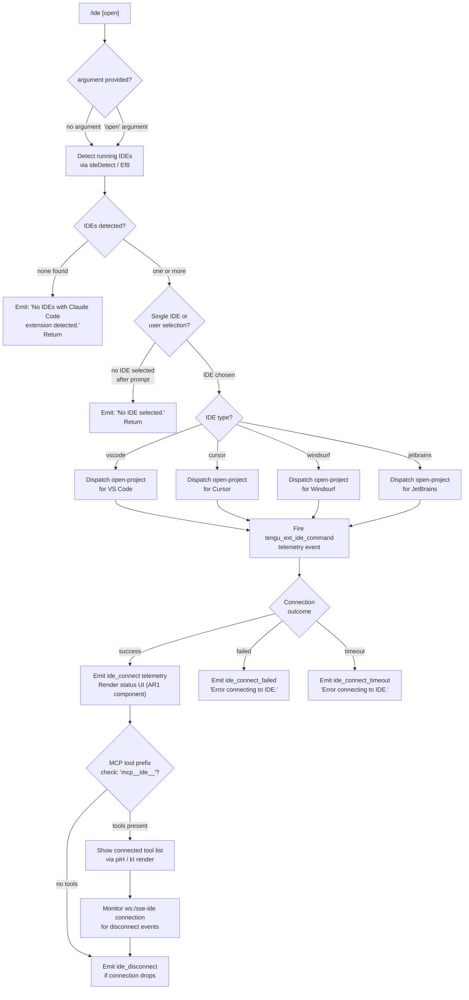

# `/ide`

> Analysis basis: CC v2.1.158 bundle.js (AST extraction + Claude interpretation)
> Minimum version: v2.1.158

---

## Overview

`/ide` manages IDE integrations for Claude Code, detecting running IDE instances that have the Claude Code extension installed, allowing the user to select an IDE (or open a project within one), and displaying live connection status. Internally it is an async command (`local-jsx` type) whose handler (`teL`) performs IDE detection, connection negotiation, and UI rendering in a JSX component.

---

## Registration

| Field | Value |
|---|---|
| type | `local-jsx` |
| name | `ide` |
| description | `Manage IDE integrations and show status` |
| argumentHint | `[open]` |
| module_id | `qR1` |
| load_inline | `true` |
| loc_byte | `11311634` |
| loc_byte_end | `11311790` |
| loc_line | `6867` |
| arbor_handler.name | `teL` |
| arbor_handler.fqn | `claude-2.1.158::teL` |
| arbor_handler.kind | `AsyncFunction` |
| arbor_handler.resolution_path | `module_id` |
| arbor_handler.n_hits | `0` |

Analysis basis: CC v2.1.158 bundle.js:+11311634

---

## Input Branching

The handler has six or more distinct branches (no IDEs detected, no IDE selected, open-by-name with IDE type dispatch, connection success/failure/timeout, and disconnect), so a Mermaid flowchart is used.



Analysis basis: CC v2.1.158 bundle.js:+11307748 (teL entry), +11307965 (no-IDE string), +11308103 (no-selection string), +11308163–11308245 (IDE type strings), +11309853 (ide_connect), +11310047 (ide_connect_timeout), +11310165 (error string)

---

## Behavioral Spec

### 1. Handler Entry (`teL`)

The main handler is the async function `teL` (resolved via Arbor module_id path).

```
async function ideCommandHandler(commandContext):
    emit telemetry("tengu_ext_ide_command")          // +11307750
    get currentState via stateAccessor(d)            // +11307748

    ideList = await ideDetect(commandContext)         // calls Ef8 (+11307908)

    if ideList is empty:
        display "No IDEs with Claude Code extension detected."  // +11307965
        return

    selectedIDE = await promptIDESelection(ideList)  // via HM (+11307870)

    if selectedIDE is null:
        display "No IDE selected."                   // +11308103
        return

    open project in selectedIDE                      // dispatch per IDE type
    render connectionStatusComponent(AR1)            // JSX local render
```

Analysis basis: CC v2.1.158 bundle.js:+11307748

---

### 2. IDE Detection (`Ef8` — ideDetect)

```
async function ideDetect(context):
    port = parseInt(context.port ?? defaultPort)     // +5327857
    processes = await scanRunningProcesses()         // via Zf8 (+5327906)
    // On Linux: runs ps aux | grep for IDE process names (+5332733)
    // Resolves home dir via iJ9.homedir (+5325727)
    // Checks .claude directory for IDE registration files (+5325741)

    results = await Promise.all(processes.map(proc =>
        resolveIDEInstance(proc)                     // Cu7 per process
    ))

    for each result:
        normalizeIDEName(result)                     // mX (+5328838)
        // Recognizes: "vscode", "cursor", "windsurf", "jetbrains" (+11308163–11308245)
        // Also detects "appcode" (+5333107) on macOS

    emit telemetry("ide_detect") on success          // +5329200
    emit telemetry("ide_detect_failed") on error     // +5329264

    return filteredIDEList
```

Analysis basis: CC v2.1.158 bundle.js:+5327857

---

### 3. IDE Instance Resolution (`Cu7` — resolveIDEInstance)

```
function resolveIDEInstance(processEntry):
    basePaths = [homedir, ...IDE-specific paths]     // +5325727
    // On WSL: also checks /mnt/c/Users (+5325948)
    // Skips system accounts: "Public", "Default", "Default User", "All Users"
    //   (+5326042, +5326061, +5326081, +5326106)

    for each candidate path:
        stat = fs.realpathSync(candidate)
        if stat.isDirectory() and not stat.isSymbolicLink():
            if path contains ".claude" subdir:
                if not already visited (dedup set):
                    add to results
    return resolvedIDEEntries
```

Analysis basis: CC v2.1.158 bundle.js:+5325650

---

### 4. IDE Name Normalization (`mX` — normalizeIDEName)

```
function normalizeIDEName(rawName):
    lower = rawName.toLowerCase()                    // +5333608
    // Extract base from path via II.basename        // +5333666

    if lower contains "cursor"  → return "cursor"
    if lower contains "windsurf" → return "windsurf"
    if lower contains "code"    → return "vscode"
    if lower matches jetbrains pattern → return "jetbrains"
    if lower contains "appcode" → return "appcode"  // +5333107

    return normalized string
```

Analysis basis: CC v2.1.158 bundle.js:+5333608

---

### 5. Open-Project Dispatch (`teL` branch for `open` argument)

```
function dispatchOpenProject(ideType, projectPath):
    telemetryPayload = {
        type: idType,
        scope: "worktree" or "project"    // +11308337, +11308348
    }
    emit telemetry("ide_open_project")    // +11308303

    call _.onInstallIDEExtension(ideType) // +11308877
    // Advise user to "restart your IDE" if extension not active (+11308968)

    on failure:
        emit telemetry("ide_open_project_failed")   // +11308410
        log "Exited without opening IDE"            // +11308700
```

Analysis basis: CC v2.1.158 bundle.js:+11308303

---

### 6. Connection Status Component (`AR1` — ideStatusComponent, JSX)

```
function ideStatusComponent(props):
    [connectionState, setConnectionState] = useState("pending")   // +11309809
    ideStoreSnapshot = useIDEStore()           // J6 via wf.useState (+11309636)
    ideRef = useRef()                          // +11309714
    
    useEffect(() => {
        attempt connection to IDE via WebSocket or SSE
        // Protocol endpoints: "sse-ide" (+11305735), "ws-ide" (+11305755)
        // WS prefix check: "ws:" (+11310663)

        on connect:
            setConnectionState("connected")
            emit telemetry("ide_connect")      // +11309853
        on failure:
            setConnectionState("failed")
            emit telemetry("ide_connect_failed")  // +11309940
            display "Error connecting to IDE."    // +11310165
        on timeout:
            setConnectionState("timeout")
            emit telemetry("ide_connect_timeout") // +11310047
            display "Error connecting to IDE."    // +11310165
    }, [ideRef])

    useCallback for disconnect:
        emit telemetry("ide_disconnect")       // +11310546

    // Filter MCP tools with prefix "mcp__ide__" (+11310443)
    ideTools = allTools.filter(t => t.name.startsWith("mcp__ide__"))

    // Render mode based on connection state:
    if connectionState == "pending":
        display "Connecting to <IDE name>…"    // +11310883
    else if connectionState == "failed":
        display error message
    else:
        display tool list via kI / piH render
        show "dynamic" label if applicable    // +11310780

    on unmount or user cancels:
        display "IDE selection cancelled"      // +11311016

    return JSX status view
```

Analysis basis: CC v2.1.158 bundle.js:+11309636

---

### 7. IDE Instance List Formatting (`us_` — formatIDEList)

```
function formatIDEList(ideInstances, windowWidth):
    // Truncate list display at 100 items (+11311092)
    // Start offset 0 (+11311111)
    // Slice last 3 entries for abbreviated display (+11311165)
    // Normalize display names with Unicode NFC (+11311233)

    paths = ideInstances.map(inst => inst.normalize("NFC"))
    if paths.length > 3:
        abbreviated = paths.slice(0, 3).join(", ") + ", …"  // +11311390, +11311404
    else:
        abbreviated = paths.join(", ")

    return formatted string
```

Analysis basis: CC v2.1.158 bundle.js:+11311092

---

### 8. Connection Transport Helpers

The handler negotiates IDE connections via two transports:

- **SSE** (`sse-ide`, +11305735): Server-Sent Events transport, used as fallback.
- **WebSocket** (`ws-ide`, +11305755; prefix `ws:`, +11310663): primary real-time transport.

Connection lifecycle uses `jfA` (claimConnection), `ZfA` (sessionLifecycle), and `wfA` (spawnDaemon background worker) — the full daemon infrastructure is engaged when establishing an IDE session.

Analysis basis: CC v2.1.158 bundle.js:+11305735, +11305755

---

## State & Side Effects

| Item | Detail |
|---|---|
| Telemetry: `tengu_ext_ide_command` | Fired at handler entry (bundle.js:+11307750) |
| Telemetry: `ide_detect` | Fired after successful IDE scan (bundle.js:+5329200) |
| Telemetry: `ide_detect_failed` | Fired on scan error (bundle.js:+5329264) |
| Telemetry: `ide_open_project` | Fired when opening a project in the IDE (bundle.js:+11308303) |
| Telemetry: `ide_open_project_failed` | Fired on project-open failure (bundle.js:+11308410) |
| Telemetry: `ide_connect` | Fired on successful IDE connection (bundle.js:+11309853) |
| Telemetry: `ide_connect_failed` | Fired on connection failure (bundle.js:+11309940) |
| Telemetry: `ide_connect_timeout` | Fired on connection timeout (bundle.js:+11310047) |
| Telemetry: `ide_disconnect` | Fired when IDE connection drops (bundle.js:+11310546) |
| Telemetry (infra): `tengu_bg_spare_claim`, `tengu_bg_spare_claim_fail` | Background daemon spare-worker tracking (bundle.js:+15469044, +15469307) |
| Telemetry (infra): `tengu_bg_dispatch_sigkill_escalate` | SIGKILL escalation in dispatch layer (bundle.js:+15467649) |
| Telemetry (infra): `tengu_daemon_control` | Daemon lifecycle control events (bundle.js:+15503486) |
| Telemetry (infra): `tengu_daemon_yield` | Daemon yielding to foreground (bundle.js:+15486331) |
| Telemetry (infra): `tengu_config_parse_error` | Config parse errors within IDE config layer (bundle.js:+3210888) |
| appState changes | IDE connection state written via `useSetAppState` (AR1 component); connection status transitions: `"pending"` → `"connected"` / `"failed"` / `"timeout"` |
| Hook registration | `useEffect` hook in AR1 registers connect/disconnect listeners; cleaned up on component unmount |
| MCP tool filtering | Tools with prefix `mcp__ide__` are filtered and displayed in the status view (bundle.js:+11310443) |
| Transport | WebSocket (`ws-ide`) and SSE (`sse-ide`) sockets opened; sockets released on disconnect |
| OS process scan (Linux) | Runs shell command via `ps aux | grep` for IDE process names (bundle.js:+5332733) |
| Sound | <!-- TODO: not found in depth-2 traversal; needs --depth 4 --> |

---

## Version History

| Version | Change |
|---|---|
| v2.1.158 | Initial analysis |

---

## Common Mistakes

1. **Running `/ide` without the Claude Code extension installed in the IDE** — detection will succeed at the process level but the extension handshake will fail, producing `ide_connect_failed`. Install and enable the extension, then retry.
2. **Using `/ide open` when no IDE process is running** — the IDE scan returns an empty list and the command exits with "No IDEs with Claude Code extension detected." Start the IDE first.
3. **Expecting `/ide` to work in a headless / non-interactive environment** — the connection-status component is JSX-rendered and requires an interactive terminal. In non-interactive mode the command may silently return.
4. **WSL users ignoring `/mnt/c/Users` path resolution** — IDE instances installed on the Windows host are discovered via the `/mnt/c/Users` prefix; if WSL filesystem mounts are non-standard the detection may miss the IDE.
5. **Assuming a single MCP tool is enough** — the UI filters tools by the `mcp__ide__` prefix; if the extension registers tools under a different prefix they will not appear in the `/ide` status panel.

---

## Appendix — Identifier Mapping

> For bundle debugging only. Identifiers change across versions.

| Identifier | Role |
|---|---|
| `teL` | Main async handler for `/ide` command (Arbor-resolved) |
| `us_` | IDE instance list formatter / display truncation helper |
| `AR1` | JSX connection-status component rendered by `/ide` |
| `Ef8` | IDE detection orchestrator (async) |
| `Zf8` | Process-scan aggregator; maps raw process entries to IDE candidates |
| `Cu7` | Per-process IDE instance resolver (path walking, dedup) |
| `mX` | IDE name normalizer (vscode / cursor / windsurf / jetbrains) |
| `Bu7` | IDE extension capability checker |
| `aV_` | IDE extension install/open helper |
| `Su7` | IDE sub-process resolver helper |
| `x1_` | Shell command executor for IDE detection |
| `G_` | Generic shell command runner with timeout |
| `rJ9` | Process kill helper (process.kill) |
| `HH9` | Process output matcher (H.match) |
| `h6` | App-state store accessor |
| `iB6` | AsyncLocalStorage store getter helper |
| `dn` | Default state initializer |
| `O_` | State observable / subscription helper |
| `qN` | Notification queue helper |
| `H` | Random delay / setTimeout wrapper (used in detection retry) |
| `A` | Path normalizer / Unicode NFC normalizer |
| `f` | Socket / file-handle close manager |
| `q` | File-system unlink / sync FS operations module |
| `L` | Promise lifecycle (add/finally/delete) wrapper |
| `D` | Daemon session normalize/dispose coordinator |
| `G6` | IDE config store accessor / MCP config normalizer |
| `sz6` | Config schema validator A |
| `tz6` | Config schema validator B |
| `Ex` | Config entry formatter |
| `CH` | Config string coercer |
| `Zx` | Config serializer |
| `q_8` | Config dedup / cache set helper |
| `Uz_` | Experiment event emitter |
| `dz_` | Config batch-write helper |
| `S6` | IDE config reader / file watcher coordinator |
| `szH` | IDE config file reader (readFileSync, statSync) |
| `m17` | IDE config file watcher (watchFile / unwatchFile) |
| `$s1` | Daemon status file writer |
| `ii` | Daemon status helper |
| `s9` | AsyncLocalStorage store getter (YJ7) |
| `pk6` | Daemon status path builder |
| `RH` | JSON.stringify serializer helper |
| `By8` | Background memory/platform checker (macOS/1024 MB threshold) |
| `wfA` | Background daemon PTY-host spawner |
| `X1` | Platform feature flag helper |
| `hH` | Platform feature "ok" emitter |
| `bH` | Platform feature "bad" emitter |
| `Vh1` | Spare PTY socket path builder |
| `tl` | Claude config directory path helper |
| `vh1` | Alternate spare path builder |
| `bB5` | Array validator helper |
| `l$` | Array.isArray wrapper |
| `dT` | PTY pid file path builder |
| `bRH` | PTY subdirectory path builder |
| `hB5` | Daemon process environment builder |
| `M` | Plugin/extension path resolver |
| `nS6` | Plugin name sanitizer / path resolver |
| `z` | Daemon stop / daemon-stop-failed controller |
| `Sy` | Session event emitter helper |
| `Fm` | Promise.race / Promise.all shutdown coordinator |
| `N` | Log message formatter / debug logger |
| `lCK` | Log formatter detail builder |
| `v4` | Log path formatter |
| `EuH` | Log entry normalizer |
| `rCK` | Log file writer / buffer-length tracker |
| `d` | Shared state / context object |
| `Iz` | Error formatter |
| `J8` | Error code extractor |
| `SH` | Queue-based async runner |
| `F_` | Error/String coercer |
| `L1` | Queue processing trigger |
| `$VA` | Queue item executor |
| `G_4` | Queue shift/push manager |
| `w` | IDE connection / dispatch manager |
| `S` | PTY supervisor spawn helper |
| `nVK` | Realpath / stat resolver |
| `P8` | Error code checker (J8 wrapper) |
| `qF5` | Workspace path array builder |
| `aW8` | Workspace path joiner |
| `fw6` | Pinned-jobs / MCP jobs config reader |
| `GP_` | Jobs config path builder |
| `DT` | Config directory builder |
| `p6` | JSON.parse wrapper |
| `HP7` | Jobs directory reader |
| `K` | IDE tool list renderer (map + padEnd) |
| `U89` | Jobs config writer |
| `B` | MCP tool filter / retireIfSettled manager |
| `VH` | Plugin marketplace / MCP config loader |
| `LB` | File extension checker (.mcpb / .dxt) |
| `GH` | Plugin detail resolver |
| `l6` | Plugin list helper |
| `v6` | MCP server config builder (stdio/sse/http/sdk) |
| `dH` | Orphaned-permission tracker |
| `E` | Permission entry |
| `jfA` | IDE claim/connection negotiator |
| `t9A` | Auth token file writer |
| `dN6` | Auth directory path builder |
| `$s_` | Auth config path builder |
| `EH` | String coercer (String wrapper) |
| `RB5` | Send-claim with timeout helper |
| `CB5` | Low-level socket connect helper |
| `g8` | Abort-aware timer / promise helper |
| `SB5` | Claim frame builder caller |
| `QM` | Error message formatter (J8) |
| `DF` | Binary frame encoder (Buffer.allocUnsafe, writeUInt32BE) |
| `ZfA` | Session lifecycle manager (create/kill/roster) |
| `gK` | Job config path builder |
| `t9` | Job state file reader/writer |
| `YD` | Active-session checker |
| `bV` | Session activity helper |
| `ff` | Atomic config file writer (B3 + RH) |
| `B3` | Atomic file write (randomBytes + writeFile + rename) |
| `Oj` | Cache-delete helper |
| `T86` | Roster file watcher / parser |
| `TF` | Roster file reader |
| `htL` | Roster file writer |
| `MfH` | PTY socket path builder |
| `GF` | PTY socket file manager |
| `Ls_` | PTY instance tracker |
| `W86` | PTY config path builder |
| `Y` | Session map manager (get/set/delete/start/stop) |
| `u2H` | Session config builder |
| `xe1` | Session display formatter |
| `G` | Remote-control startup handler |
| `dVK` | Heartbeat emitter |
| `V` | Session instance |
| `R` | Idle exit timer |
| `HM` | IDE selection prompt helper |
| `v8` | Platform-aware command builder |
| `piH` | IDE tool list display renderer |
| `kI` | Tool/capability renderer |
| `to` | IDE open dispatch helper |
| `neL` | IDE status sub-component |
| `J6` | IDE store subscriber |
| `hJ_` | App-state context accessor |
| `fA` | App-state context read helper |
| `m5` | Shared context / memo hook helper |
| `Mk` | Telemetry hash / cleanup manager |
| `T66` | Telemetry event hasher |
| `prH` | Hash builder (createHash sha256) |
| `O` | Fallback render helper |
| `I8` | Render output helper |
| `j` | Active connection map iterator |
| `y` | Background session writer |
| `XP` | Extension capability query |
| `RGH` | RPC client factory |
| `W` | OS-detection / uppercase helper |
| `DL` | Platform discriminator |
| `X` | Socket reader / frame splitter |
| `J` | Connection reference |
| `Qf` | Socket end/reply helper |
| `FB5` | Full daemon protocol handler |
| `gB5` | Frame builder helper |
| `tO` | Background-service error tagger |
| `PfA` | Protocol frame acknowledgement |
| `VVK` | Frame dispatch with timeout |
| `P` | Repaint coordinator |
| `P0` | PTY path resolver |
| `c$` | PTY realpath normalizer |
| `s$H` | PTY log tail reader |
| `UB5` | Attach-stall tracker |
| `p` | Write-flush helper |
| `b` | Session stall watchdog |
| `tAH` | Terminal resize helper |
| `BB5` | Session re-adopt helper |
| `I` | Away-summary generator |
| `o` | Voice toggle silence timeout |
| `x` | Idle exit timer updater |
| `r` | Voice focus silence timeout |
| `g` | JSX render pair (B + $) |
| `l` | Filter helper for terminal output |
| `a` | Terminal stream writer |
| `c` | Terminal passthrough stream |
| `_R6` | Raw socket write/destroy helper |
| `T` | Terminal renderer pair |