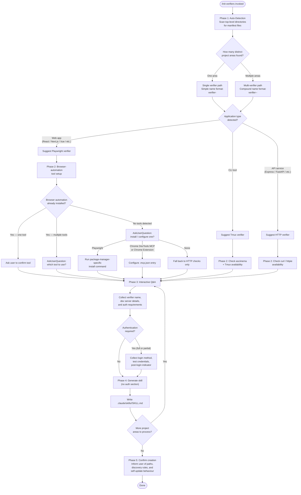

# `/init-verifiers`

> Analysis basis: CC v2.1.158 bundle.js (AST extraction + Claude interpretation)
> Minimum version: v2.1.158

---

## Overview

`/init-verifiers` is a `prompt`-type slash command that drives the agent through a structured five-phase workflow to create one or more verifier skill files under `.claude/skills/`. It auto-detects the project's application type(s), optionally installs or configures browser-automation tooling, collects project-specific parameters interactively, and finally writes a `SKILL.md` file for each verifier so that the Verify agent can discover and execute them automatically. The command explicitly excludes unit-test and type-check verification, focusing only on functional verification via Playwright (web UI), Tmux (CLI), and HTTP (API).

---

## Registration

| Field | Value |
|---|---|
| type | `prompt` |
| name | `init-verifiers` |
| description | Create verifier skill(s) for automated verification of code changes |
| prompt body length | 9,757 characters |
| prompt body trace | inline template |

Analysis basis: CC v2.1.158 bundle.js:+11335343

---

## Input Branching

Because `/init-verifiers` is a `prompt`-type command, the agent receives the full prompt body at invocation and proceeds through five sequential phases. Branching is determined by what is detected in the project and by user answers collected via `AskUserQuestion`.



Analysis basis: CC v2.1.158 bundle.js:+11335343

---

## Behavioral Spec

### Phase 1 — Project Auto-Detection

The agent scans the working directory to identify distinct sub-projects before any user interaction takes place.

```
function detectProjectAreas(workingDir):
    areas = []
    topLevelEntries = listDirectory(workingDir)

    for entry in topLevelEntries:
        if isDirectory(entry):
            manifests = findManifests(entry, [
                "package.json", "Cargo.toml",
                "pyproject.toml", "go.mod"
            ])
            if manifests is not empty:
                area = buildAreaDescriptor(entry, manifests)
                areas.append(area)

    if areas is empty:
        // No subdirectory manifests; treat working directory as one area
        areas.append(buildAreaDescriptor(workingDir, findManifests(workingDir, ...)))

    return areas

function classifyApplicationType(area):
    if area has web-framework indicators (React, Next.js, Vue, Svelte, ...):
        return APPLICATION_TYPE.WEB
    if area has API-framework indicators (Express, FastAPI, Flask, Gin, ...):
        return APPLICATION_TYPE.API
    if area has binary/CLI entry-point indicators:
        return APPLICATION_TYPE.CLI
    return APPLICATION_TYPE.UNKNOWN
```

Analysis basis: CC v2.1.158 bundle.js:+11335343

---

### Phase 2 — Verification Tool Setup

Tool selection varies by application type. The agent checks what is already available before prompting.

```
function setupVerificationTools(area):
    appType = classifyApplicationType(area)

    if appType == APPLICATION_TYPE.WEB:
        installedTools = detectBrowserAutomationTools(area)
        // Check package.json deps for @playwright/test
        // Check .mcp.json for playwright MCP, Chrome DevTools MCP,
        //   or Claude Chrome Extension MCP entries

        if count(installedTools) == 0:
            choice = AskUserQuestion(
                "No browser automation tools detected. " +
                "Install/configure one for UI verification?",
                options=["Playwright (Recommended)", "Chrome DevTools MCP",
                         "Claude Chrome Extension", "None"]
            )
            return installOrConfigureTool(choice, area)

        if count(installedTools) == 1:
            confirmTool(installedTools[0])
        else:
            choice = AskUserQuestion(
                "Multiple tools detected: " + join(installedTools) +
                ". Which to use for verification?",
                options=installedTools
            )
            return choice

    if appType == APPLICATION_TYPE.CLI:
        checkCommandAvailable("asciinema")   // optional; warn if missing
        checkCommandAvailable("tmux")        // required

    if appType == APPLICATION_TYPE.API:
        checkCommandAvailable("curl")        // system-installed; no action if present
        checkCommandAvailable("http")        // httpie; optional

function installPlaywright(packageManager):
    commands = {
        "npm":  "npm install -D @playwright/test && npx playwright install",
        "yarn": "yarn add -D @playwright/test && yarn playwright install",
        "pnpm": "pnpm add -D @playwright/test && pnpm exec playwright install",
        "bun":  "bun add -D @playwright/test && bun playwright install"
    }
    runShell(commands[packageManager])
```

Analysis basis: CC v2.1.158 bundle.js:+11335343

---

### Phase 3 — Interactive Q&A

The agent collects the specific parameters needed to populate the skill template for each area.

```
function collectVerifierParameters(area, projectAreaCount):
    // --- Name ---
    if projectAreaCount == 1:
        suggestedName = "verifier-" + mapTypeToSuffix(area.appType)
        // e.g. "verifier-playwright", "verifier-cli", "verifier-api"
    else:
        suggestedName = "verifier-" + area.shortId + "-" + mapTypeToSuffix(area.appType)
        // e.g. "verifier-frontend-playwright"

    name = AskUserQuestion("Verifier name?", default=suggestedName)
    assert "verifier" in name.lower(),
        "Name MUST contain 'verifier' for automatic discovery by the Verify agent"

    // --- Type-specific parameters ---
    if area.appType == APPLICATION_TYPE.WEB:
        devServerCmd = AskUserQuestion("Dev server start command?")
        devServerUrl = AskUserQuestion("Dev server URL?")
        readySignal  = AskUserQuestion("Text that signals server is ready?")

    if area.appType == APPLICATION_TYPE.CLI:
        entryPointCmd  = AskUserQuestion("Entry point command?")
        useAsciinema   = AskUserQuestion("Record session with asciinema?")

    if area.appType == APPLICATION_TYPE.API:
        apiServerCmd = AskUserQuestion("API server start command?")
        baseUrl      = AskUserQuestion("API base URL?")

    // --- Authentication ---
    authMode = AskUserQuestion(
        "Does your app require authentication?",
        options=["No authentication needed",
                 "Yes, login required",
                 "Some pages/endpoints require auth"]
    )

    authConfig = null
    if authMode != "No authentication needed":
        loginMethod = AskUserQuestion(
            "Login method?",
            options=["Form-based (username/password)",
                     "API token/key",
                     "OAuth/SSO",
                     "Other"]
        )
        loginUrl    = AskUserQuestion("Login URL?")
        credentials = AskUserQuestion(
            "Test credentials? " +
            "(Recommend env vars: TEST_USER, TEST_PASSWORD)"
        )
        postLoginIndicator = AskUserQuestion(
            "How to confirm login succeeded?",
            options=["URL redirect", "Element appears", "Cookie/token set"]
        )
        authConfig = buildAuthConfig(loginMethod, loginUrl,
                                     credentials, postLoginIndicator)

    return VerifierParams(name, area, authConfig, ...)
```

Analysis basis: CC v2.1.158 bundle.js:+11335343

---

### Phase 4 — Skill File Generation

After all parameters are collected, the agent writes a structured Markdown skill file.

```
function generateSkillFile(params):
    skillDir  = projectRoot + "/.claude/skills/" + params.name + "/"
    skillPath = skillDir + "SKILL.md"

    allowedTools = selectAllowedTools(params.area.appType, params.toolChoice)
    // verifier-playwright: Bash(npm *), Bash(yarn *), Bash(pnpm *), Bash(bun *),
    //                      mcp__playwright__*, Read, Glob, Grep
    // verifier-cli:        Tmux, Bash(asciinema *), Read, Glob, Grep
    // verifier-api:        Bash(curl *), Bash(http *), Bash(npm *),
    //                      Bash(yarn *), Read, Glob, Grep

    frontmatter = buildFrontmatter(
        name        = params.name,
        description = deriveDescription(params),
        allowedTools = allowedTools
    )

    body = composeSections([
        "Project Context"    : params.area.contextSummary,
        "Setup Instructions" : params.setupInstructions,
        "Authentication"     : params.authConfig,   // omitted if null
        "Reporting"          : STANDARD_REPORTING_BLOCK,
        "Cleanup"            : STANDARD_CLEANUP_BLOCK,
        "Self-Update"        : STANDARD_SELF_UPDATE_BLOCK
    ])

    createDirectoryIfAbsent(skillDir)
    writeFile(skillPath, frontmatter + body)
    return skillPath
```

Key structural rules encoded in the template (Analysis basis: CC v2.1.158 bundle.js:+11335343):

| Rule | Detail |
|---|---|
| Output directory | Always `.claude/skills/<verifier-name>/` under the project root |
| Output filename | Always `SKILL.md` |
| Discovery key | Folder name **must** contain the string `verifier` (case-insensitive) |
| Authentication section | Included only when auth is required; omitted entirely otherwise |
| Self-Update section | Always present; instructs the skill to patch itself when its own metadata is stale rather than reporting a test failure |

---

### Phase 5 — Creation Confirmation

After all skill files are written, the agent delivers a structured summary to the user.

```
function confirmCreation(createdSkills):
    for skill in createdSkills:
        inform("Created: " + skill.path)

    inform(
        "Discovery rule: folder name must contain 'verifier' " +
        "(case-insensitive) for the Verify agent to find it automatically."
    )
    inform("You can edit any SKILL.md to customise it.")
    inform("Run /init-verifiers again to add verifiers for additional areas.")
    inform(
        "Each verifier will offer to self-update if its own startup " +
        "instructions become stale."
    )
```

Analysis basis: CC v2.1.158 bundle.js:+11335343

---

## State & Side Effects

| Item | Detail |
|---|---|
| Telemetry | <!-- TODO: not found in depth-2 traversal; needs --depth 4 --> |
| Hook registration | <!-- TODO: not found in depth-2 traversal; needs --depth 4 --> |
| appState changes | <!-- TODO: not found in depth-2 traversal; needs --depth 4 --> |
| Sound | <!-- TODO: not found in depth-2 traversal; needs --depth 4 --> |
| File writes | Creates `.claude/skills/<verifier-name>/SKILL.md` for each verifier; may also write or modify `.mcp.json` if an MCP-based browser tool is selected |
| Package manager side effects | May execute `npm install`, `yarn add`, `pnpm add`, or `bun add` to install `@playwright/test` and run `playwright install` if the user chooses Playwright and it is not already present |
| Interactive prompts | Uses `AskUserQuestion` repeatedly across Phases 2, 3; blocks execution until the user responds |
| Progress tracking | Uses an unresolved tool reference (rendered as `...` in the extracted prompt body) to track multi-step progress; the exact tool name was not resolved in the depth-2 traversal |

---

## Version History

| Version | Change |
|---|---|
| v2.1.158 | Initial analysis |

---

## Common Mistakes

1. **Naming a verifier without the word "verifier"** — The Verify agent performs case-insensitive substring matching on the skill folder name. Any folder that does not contain `verifier` is silently ignored at discovery time, so the skill will never be invoked automatically.

2. **Creating verifiers for unit tests or type checks** — The command prompt explicitly prohibits this. Standard build/test workflows already cover those cases; a redundant verifier skill adds noise and may conflict with existing CI pipelines.

3. **Hardcoding credentials in SKILL.md** — The prompt instructs the agent to recommend environment variables (`TEST_USER`, `TEST_PASSWORD`, etc.) for secrets. Hardcoded values end up committed to version control and may be read by other agents or tools that load the skill.

4. **Placing the skill outside `.claude/skills/`** — Skills stored in other locations are not automatically loaded when Claude runs in the project. The path `.claude/skills/<verifier-name>/SKILL.md` is the only supported location.

5. **Running /init-verifiers once for a multi-area project and assuming one skill suffices** — The command is designed to be run multiple times or to create multiple skills in a single run. A mono-repo with both a web frontend and an API backend needs at least two separate verifier skills.

6. **Selecting an MCP-based browser tool without ensuring the MCP server is actually running** — Chrome DevTools MCP and the Claude Chrome Extension MCP require a live MCP server process and (for the extension) the Chrome browser extension to be installed. The command configures `.mcp.json` but cannot verify that the runtime environment satisfies these prerequisites.

---

## Appendix — Identifier Mapping

> For bundle debugging only. Identifiers change across versions.

| Identifier | Role |
|---|---|
| *(none extracted)* | The depth-2 AST traversal reported an empty `identifiers` array and noted "no entry functions found for module 'undefined'". No obfuscated identifiers are available for this command at the current traversal depth. |

<!-- TODO: not found in depth-2 traversal; needs --depth 4 -->