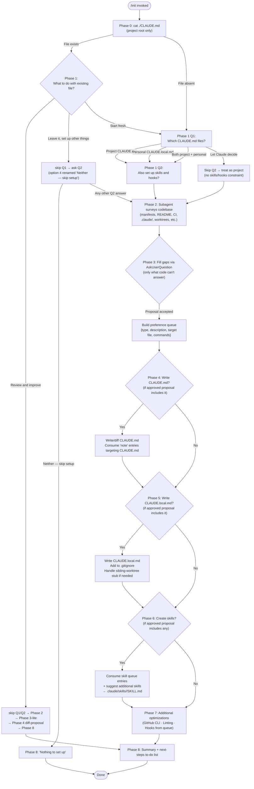

# `/init`

> Analysis basis: CC v2.1.158 bundle.js (AST extraction + Claude interpretation)
> Minimum version: v2.1.158

---

## Overview

The `/init` command bootstraps persistent Claude Code configuration for a repository by guiding the user through an interactive, multi-phase workflow. It creates one or more of the following artifacts: a shared `CLAUDE.md`, a private `CLAUDE.local.md`, project skills under `.claude/skills/`, and lifecycle hooks written to `.claude/settings.json` or `.claude/settings.local.json`. The command operates entirely through a structured agent prompt — it has no native CLI implementation in the bundle beyond the prompt body itself.

---

## Registration

| Field | Value |
|---|---|
| type | `prompt` |
| name | `init` |
| description | Initialize new CLAUDE.md file(s) and optional skills/hooks with codebase documentation \| Initialize a new CLAUDE.md file with codebase documentation |
| prompt body length | 22,449 characters |
| prompt body template variables | `AH5` (20,850-character primary template), `_H5` (1,592-character secondary template) |

Analysis basis: CC v2.1.158 bundle.js:+11334903

---

## Input Branching

The agent executing `/init` follows a strict 8-phase linear workflow with branching at Phases 0, 1, 3, 4, 5, 6, and 7. The high-level control flow is illustrated below.



---

## Behavioral Spec

### Phase 0 — Existing File Check

```
function checkExistingClaudeMd():
    run shell command: cat ./CLAUDE.md
    if file is present at project root:
        return EXISTS
    else:
        return ABSENT
    # Note: subdirectory CLAUDE.md files are ignored at this stage.
    # Tree exploration does NOT happen yet.
```

Analysis basis: CC v2.1.158 bundle.js:+11334903

---

### Phase 1 — User Intent Interview

```
function gatherUserIntent(existenceStatus):
    print primer text explaining CLAUDE.md, Skills, and Hooks

    if existenceStatus == EXISTS:
        answer = AskUserQuestion("I found an existing CLAUDE.md. What would you like to do?",
                                  options=["Review and improve it",
                                           "Leave it, set up other things",
                                           "Start fresh (replace it)"])
        return routeExistingFile(answer)

    # No file, or user chose "Start fresh"
    q1Answer = AskUserQuestion("Which CLAUDE.md files should /init set up?",
                                options=["Project CLAUDE.md",
                                         "Personal CLAUDE.local.md",
                                         "Both project + personal",
                                         "Let Claude decide"])

    if q1Answer == "Let Claude decide":
        return {scope: PROJECT, skillsHooks: UNCONSTRAINED}

    q2Answer = AskUserQuestion("Also set up skills and hooks?",
                                options=["Skills + hooks",
                                         "Skills only",
                                         "Hooks only",
                                         "Neither, just CLAUDE.md"])

    # Q2 is advisory only — Phase 3 may deviate and will explain why.
    return {scope: q1Answer, skillsHooksHint: q2Answer}
```

> **Rule:** Q1 and Q2 are always separate `AskUserQuestion` calls. Q2 is never sent in the same call as Q1.

Analysis basis: CC v2.1.158 bundle.js:+11334903

---

### Phase 2 — Codebase Survey (Subagent)

```
function surveyCodebase():
    launch subagent to read:
        manifest files: package.json, Cargo.toml, pyproject.toml, go.mod, pom.xml, ...
        README
        Makefile / build configs
        CI config files
        existing CLAUDE.md
        .claude/rules/
        AGENTS.md
        .cursor/rules or .cursorrules
        .github/copilot-instructions.md
        .windsurfrules
        .clinerules
        .mcp.json

    detect:
        - build, test, and lint commands (especially non-standard ones)
        - languages, frameworks, package manager
        - project structure (monorepo / multi-module / single)
        - code style rules differing from language defaults
        - non-obvious gotchas, required env vars, workflow quirks
        - existing .claude/skills/ and .claude/rules/ directories
        - formatter configuration (prettier, biome, ruff, black, gofmt, rustfmt,
          or a unified format script)

    run: git worktree list
        # only relevant when personal CLAUDE.local.md is in scope

    record: items that could NOT be determined from code alone
        # these become gap-fill interview questions in Phase 3
```

Analysis basis: CC v2.1.158 bundle.js:+11334903

---

### Phase 3 — Gap-Fill Interview and Proposal

```
function fillGapsAndPropose(scope, phase2Findings, unansweredItems):

    # --- Interview ---
    if scope includes PROJECT or "Let Claude decide":
        ask about: non-obvious commands, gotchas, branch/PR conventions,
                   required env setup, testing quirks
        # Skip anything already in README or obvious from manifest files.
        # Do NOT mark any option as "recommended".

    if scope includes PERSONAL:
        ask about: user role, familiarity with codebase, personal sandbox URLs,
                   test accounts, API key paths, communication preferences
        if phase2Findings.multipleWorktrees:
            ask: nested-inside-repo vs. sibling/external worktrees

    if path == REVIEW_AND_IMPROVE:
        ask single question: "Has anything changed since this CLAUDE.md was written?"
        options: ["No, nothing's changed", "Yes — let me describe"]
        if answer == Yes: ask free-text follow-up
        skip ahead to Phase 4

    # --- Proposal ---
    proposal = buildProposal(scope, phase2Findings, gapFillAnswers)
    # First bullets: the CLAUDE.md file(s) to be created/modified.
    # Subsequent bullets: hooks, skills, notes — each with artifact type.
    # If Q2 hint and proposal deviates: state deviation in one line at top.

    print proposal as normal assistant text (one bullet per item):
        "Here's what I'd set up:"
        "• [Artifact type] — [one-line description]"
        ...

    confirmation = AskUserQuestion("Does this look right?",
                                    options=["Looks good — proceed",
                                             "Drop the hook",
                                             "Drop the skill",
                                             ...])
    # Tool auto-adds "Other" option for custom tweaks.
    # Do NOT use the `preview` field — proposal is already visible in scrollback.

    preferenceQueue = buildPreferenceQueue(acceptedProposal)
    # Each entry: {type: hook|skill|note, description, targetFile, commands}

    return preferenceQueue
```

Analysis basis: CC v2.1.158 bundle.js:+11334903

---

### Phase 4 — Write CLAUDE.md

```
function writeProjectClaudeMd(path == REVIEW_AND_IMPROVE, phase2Findings,
                               phase3Answer, preferenceQueue):

    if path == REVIEW_AND_IMPROVE:
        read existing CLAUDE.md
        compare against phase2Findings and phase3Answer
        propose diffs (additions / removals) with one-line reason each
        confirmation = AskUserQuestion("Apply these edits?",
                                        options=["Apply all",
                                                 "Let me pick which",
                                                 "Skip — leave it as is"])
        if confirmation == Skip: return

    teamNotes = filterQueue(preferenceQueue, type=NOTE, target=CLAUDE_MD)

    content = buildClaudeMdContent():
        prefix:
            "# CLAUDE.md"
            ""
            "This file provides guidance to Claude Code (claude.ai/code) when working
             with code in this repository."

        include (only if non-obvious):
            - build/test/lint commands Claude cannot guess
            - code style rules that DIFFER from language defaults
            - testing instructions and quirks
            - repo etiquette (branch naming, PR conventions, commit style)
            - required env vars or setup steps
            - non-obvious gotchas or architectural decisions
            - important parts from existing AI coding tool configs

        for each teamNote in teamNotes:
            append as concise line in most relevant section

        exclude:
            - file-by-file structure or component lists
            - standard language conventions
            - generic advice
            - detailed API docs (use @path/to/import instead)
            - frequently-changing info (use @path/to/import)
            - long tutorials (move to separate file or skill)
            - commands obvious from manifest files

    write content to ./CLAUDE.md

    if project has multiple concerns:
        suggest organizing into .claude/rules/ (code-style.md, testing.md, etc.)
    if project has distinct subdirectories (monorepo/multi-module):
        mention subdirectory CLAUDE.md files; offer to create them
```

Analysis basis: CC v2.1.158 bundle.js:+11334903

---

### Phase 5 — Write CLAUDE.local.md

```
function writePersonalClaudeMd(phase2Findings, preferenceQueue):

    if CLAUDE.local.md already exists:
        read existing file
        propose specific additions; do NOT silently overwrite

    personalNotes = filterQueue(preferenceQueue, type=NOTE, target=CLAUDE_LOCAL_MD)

    if phase2Findings.multipleWorktrees AND userConfirmed == SIBLING_EXTERNAL:
        # Upward file walk cannot find a single CLAUDE.local.md across all worktrees.
        write personal content to: ~/.claude/<project-name>-instructions.md
        content of CLAUDE.local.md = "@~/.claude/<project-name>-instructions.md"
        # NEVER place this import in project CLAUDE.md.
    else:
        content = buildPersonalContent():
            include:
                - user role and codebase familiarity
                - personal sandbox URLs, test accounts, local setup details
                - personal workflow and communication preferences
            for each personalNote in personalNotes:
                append as concise line

    write content to ./CLAUDE.local.md
    add "CLAUDE.local.md" to .gitignore
```

Analysis basis: CC v2.1.158 bundle.js:+11334903

---

### Phase 6 — Create Skills

```
function createSkills(preferenceQueue, phase2Findings):

    skillEntries = filterQueue(preferenceQueue, type=SKILL)

    # --- Queue-sourced skills ---
    for each skillPref in skillEntries:
        name = deriveSkillName(skillPref.description)
        if isUnderspecified(skillPref):
            ask follow-up question (e.g., "Which test command should this skill run?")
        if name matches an existing bundled skill (e.g., /verify):
            write project skill as additive layer; inform user bundled one still exists
        body = buildSkillBody(skillPref.description, phase2Findings)
        writeSkillFile(".claude/skills/" + name + "/SKILL.md", body)

    # --- Additional suggested skills ---
    for each candidate in discoverAdditionalSkills(phase2Findings):
        if not conflictsWith(existingSkillsDir):
            present: name, one-line purpose, reason it fits repo
            writeSkillFile(".claude/skills/" + candidate.name + "/SKILL.md",
                            candidate.body)

    # Skill file format:
    #   ---
    #   name: <skill-name>
    #   description: <what the skill does and when to use it>
    #   ---
    #   <Instructions for Claude>
    #
    # For side-effect workflows (/deploy, /fix-issue):
    #   add: disable-model-invocation: true
    #   use:  $ARGUMENTS for user-supplied input
```

Analysis basis: CC v2.1.158 bundle.js:+11334903

---

### Phase 7 — Additional Optimizations

```
function suggestOptimizations(preferenceQueue, phase2Findings, phase1Scope):

    # --- GitHub CLI ---
    ghPresent = runShell("which gh")   # "where gh" on Windows
    if not ghPresent AND phase2Findings.usesGitHub:
        ask user: install GitHub CLI?
        if yes: act immediately

    # --- Linting ---
    if phase2Findings.noLintConfig:
        ask user: set up linting for this codebase?
        if yes: act immediately

    # --- Hooks from proposal queue ---
    hookEntries = filterQueue(preferenceQueue, type=HOOK)
    if hookEntries is empty AND phase2Findings.formatterFound:
        offer format-on-edit hook as fallback

    if hookEntries is not empty:
        targetFile = resolveHookTargetFile(phase1Scope):
            PROJECT  → .claude/settings.json      (committed, team-shared)
            PERSONAL → .claude/settings.local.json
            BOTH/AMBIGUOUS → ask user once for all hooks

        for each hookPref in hookEntries:
            event, matcher = mapPreferenceToEvent(hookPref.description):
                "after every edit"                → PostToolUse, matcher="Write|Edit"
                "when Claude finishes / before review" → Stop event
                "before running bash"             → PreToolUse, matcher="Bash"
                "before committing" (git gate)    → NOT a hooks.json hook;
                                                     route to git pre-commit hook
                                                     (.git/hooks/pre-commit / husky);
                                                     probe to disambiguate "Stop" case
                ambiguous preference              → probe before proceeding

            # Load hook reference once per /init run (first hook only):
            invoke Skill tool: skill='update-config',
                               args="[hooks-only] <one-line summary of what is being built>"

            # Follow "Constructing a Hook" flow from update-config skill:
            #   dedup check
            #   → construct hook for THIS project
            #   → pipe-test raw command
            #   → wrap in hook JSON structure
            #   → write to targetFile
            #   → validate with: jq -e '...' targetFile
            #   → live-proof (for Pre|PostToolUse on triggerable matchers)
            #   → cleanup
            #   → handoff to user

        act on each user "yes" before moving to the next item
```

Analysis basis: CC v2.1.158 bundle.js:+11334903

---

### Phase 8 — Summary and Next Steps

```
function summarizeAndSuggest(writtenArtifacts, phase2Findings, phase7Gaps):

    print recap:
        for each artifact in writtenArtifacts:
            print: filename + key points it covers
        remind user: these files are a starting point;
                     review and tweak them;
                     /init can be re-run anytime to re-scan

    todoList = buildRelevantTodoList(phase2Findings, phase7Gaps):
        if frontendDetected (React, Vue, Svelte, etc.):
            add: "/plugin install frontend-design@claude-plugins-official"
            add: "/plugin install playwright@claude-plugins-official"
        if phase7Gaps.missingGhCli AND userDeclinedInstall:
            add: install GitHub CLI (one-line reason)
        if phase7Gaps.missingLinting AND userDeclinedSetup:
            add: set up linting (one-line reason)
        if testsAbsentOrSparse:
            add: set up a test framework
        always add:
            "/plugin install skill-creator@claude-plugins-official"
            "Browse official plugins with /plugin"

    print todoList ordered by impact (most impactful first)
```

Analysis basis: CC v2.1.158 bundle.js:+11334903

---

### CLAUDE.md Content Rules (Write-Time Enforcement)

Every candidate line written to `CLAUDE.md` must pass the following test before inclusion:

```
function claudeMdLineTest(line, codebaseContext):
    question = "Would removing this line cause Claude to make mistakes in this repo?"
    if answer == NO:
        discard line
    else:
        include line

# Additionally, each line must NOT be:
#   - a file-by-file structure description discoverable by reading the repo
#   - a standard language convention Claude already knows
#   - generic advice ("write clean code", "handle errors")
#   - information that duplicates another included line (no repetition)
#   - a made-up section (e.g., "Common Development Tasks", "Tips for Development")
#     unless that content was expressly found in a file that was read

# Specificity rule:
#   "Use 2-space indentation in TypeScript"  ← CORRECT
#   "Format code properly."                  ← REJECTED
```

Analysis basis: CC v2.1.158 bundle.js:+11334903

---

### Worktree Handling Logic

```
function resolveWorktreePath(phase2Findings, userConfirmation):
    if NOT phase2Findings.multipleWorktrees:
        return STANDARD   # no special handling

    if userConfirmation == NESTED_INSIDE_REPO:
        # e.g., .claude/worktrees/<name>/
        # Upward file walk locates the main repo's CLAUDE.local.md automatically.
        return STANDARD

    if userConfirmation == SIBLING_OR_EXTERNAL:
        # e.g., ../myrepo-feature/
        # Upward walk will NOT find a single CLAUDE.local.md across worktrees.
        personalFile = "~/.claude/" + projectName + "-instructions.md"
        claudeLocalContent = "@" + personalFile
        # Write personal content to personalFile.
        # Write stub to each worktree's CLAUDE.local.md.
        # NEVER place this @-import in the team-shared CLAUDE.md.
        return SIBLING_STUB
```

Analysis basis: CC v2.1.158 bundle.js:+11334903

---

## State & Side Effects

| Item | Detail |
|---|---|
| Telemetry | <!-- TODO: not found in depth-2 traversal; needs --depth 4 --> |
| Files written | `./CLAUDE.md` (Phase 4), `./CLAUDE.local.md` (Phase 5), `.claude/skills/<name>/SKILL.md` (Phase 6), `.claude/settings.json` or `.claude/settings.local.json` (Phase 7 hooks), `~/.claude/<project-name>-instructions.md` (Phase 5 sibling-worktree path) |
| `.gitignore` mutation | `CLAUDE.local.md` is appended to the project's `.gitignore` during Phase 5 |
| Subagent launch | Phase 2 launches a subagent to survey the codebase; does not modify any files |
| Shell commands executed | `cat ./CLAUDE.md` (Phase 0), `git worktree list` (Phase 2), `which gh` / `where gh` (Phase 7), `jq -e` (Phase 7 hook validation), tool `Skill` invocation with `update-config` (Phase 7 hook reference load) |
| Hook registration | Hooks are written to `.claude/settings.json` (project-scoped) or `.claude/settings.local.json` (personal-scoped) via the `update-config` skill flow |
| appState changes | <!-- TODO: not found in depth-2 traversal; needs --depth 4 --> |
| Sound | <!-- TODO: not found in depth-2 traversal; needs --depth 4 --> |
| Idempotency | Re-running `/init` on a repo that already has a `CLAUDE.md` enters the "existing file" branch in Phase 1 rather than overwriting silently; existing skills are reviewed before any new ones are proposed |

---

## Version History

| Version | Change |
|---|---|
| v2.1.158 | Initial analysis. Command is implemented as a pure `prompt` type with a 22,449-character agent prompt body. No native CLI call graph entries detected at depth ≤ 2. |

---

## Common Mistakes

1. **Running `/init` in a subdirectory instead of the project root.** Phase 0 only checks for `./CLAUDE.md` at the exact working directory. If invoked from a subdirectory, the project-root file will not be found and the agent will proceed as if no file exists.

2. **Expecting Q2 to be a hard filter.** The skills/hooks answer in Q2 is advisory — Phase 3 will propose whichever artifact types actually fit the codebase and will explain any deviation. Answering "Hooks only" does not prevent a skill from being suggested.

3. **Placing the `@~/.claude/<project-name>-instructions.md` import in the team-shared `CLAUDE.md`.** This import is a personal reference and belongs only in `CLAUDE.local.md`. Committing it in `CLAUDE.md` exposes a personal path to all team members.

4. **Using "before committing" to describe a hook and expecting a `hooks.json` entry.** Matchers cannot filter `Bash` commands by content (e.g., they cannot detect only `git commit`). Phase 7 routes literal git-commit gates to a native git pre-commit hook instead. If the user actually means "at the end of Claude's turn", the correct event is `Stop`.

5. **Invoking the `update-config` skill multiple times for multiple hooks in one `/init` run.** The skill should be loaded exactly once per `/init` run (before the first hook); subsequent hooks reuse the already-loaded schema and verification flow.

6. **Expecting `/init` to write subdirectory `CLAUDE.md` files automatically.** Phase 4 only writes to the project root. Subdirectory files for monorepo modules are offered as an optional follow-up, not created by default.

7. **Including standard language conventions or easily discoverable file structure in `CLAUDE.md`.** Every line must pass the "would removing this cause Claude to make a mistake?" test. Generic conventions and browsable structure are explicitly excluded.

---

## Appendix — Identifier Mapping

> For bundle debugging only. Identifiers change across versions.

| Identifier | Role |
|---|---|
| `AH5` | Primary prompt template variable (20,850-character interactive setup prompt body) |
| `_H5` | Secondary prompt template variable (1,592-character legacy/minimal CLAUDE.md creation prompt body) |