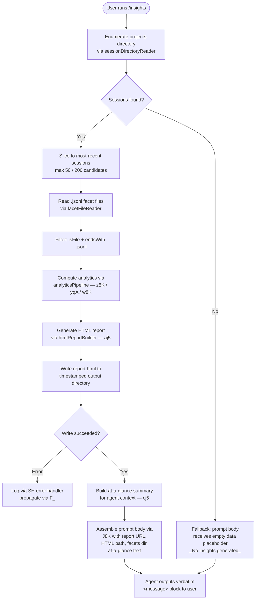

# `/insights`

> Analysis basis: CC v2.1.158 bundle.js (AST extraction + Claude interpretation)
> Minimum version: v2.1.158

---

## Overview

`/insights` generates a shareable HTML usage report analyzing the user's Claude Code session history. It walks on-disk session data, computes behavioral facets (tool usage, response times, time-of-day patterns, error rates, etc.), writes an `report.html` artifact plus a structured facets directory, then instructs the agent to announce the result verbatim from a pre-filled `<message>` template.

---

## Registration

| Field | Value |
|---|---|
| type | `prompt` |
| name | `insights` |
| description | `Generate a report analyzing your Claude Code sessions` |
| loc_byte | `12861683` |
| loc_byte_end | `12862987` |
| loc_line | `9918` |
| handler_method | `getPromptForCommand` |
| handler_method_start | `12861857` |
| handler_method_end | `12862986` |
| prompt_body.length | `513` |
| prompt_body.trace | `call→J8K(...) (1 literals)` |
| arbor_handler.name | `getPromptForCommand` |
| arbor_handler.fqn | `claude-2.1.158::getPromptForCommand` |
| arbor_handler.kind | `Method` |
| arbor_handler.resolution_path | `direct` |
| arbor_handler.n_hits | `1` |

Analysis basis: CC v2.1.158 bundle.js:+12861683

---

## Input Branching

The command has 4+ distinct branches (session data present vs. absent, report generation success vs. error, facets directory availability, at-a-glance summary availability), so a Mermaid flowchart is used.



---

## Behavioral Spec

### 1 — Handler Entry Point (`getPromptForCommand`)

The handler is an inline `ObjectMethod` on the registration object, resolved directly by Arbor (resolution_path: `direct`). It synchronously computes a prompt string and returns it; no streaming occurs.

```
function getPromptForCommand(context):
    reportData = buildInsightsData(context)          // j8K
    promptText = assemblePromptBody(reportData)      // call→J8K (prompt_body.trace)
    return { type: "prompt", text: promptText }
```

Analysis basis: CC v2.1.158 bundle.js:+12861857

---

### 2 — Session Discovery (`sessionDirectoryReader`)

Reads the top-level `projects` directory (string literal `"projects"` at bundle.js:+6630979), lists subdirectories using `DS.readdir`, filters entries where `K.isDirectory` is true, then sorts results via `q.sort` after scheduling enumeration with `setImmediate` (bundle.js:+12848633).

Session batch limits found in literals:
- Candidate pool upper bound: **200** (bundle.js:+12848750)
- Active slice taken: **50** (bundle.js:+12848745)
- Secondary slice size: **10 / 9** pair (bundle.js:+12848603, +12848608)

```
function sessionDirectoryReader(baseDir):
    entries = filesystem.readdir(baseDir)
    dirs = entries.filter(e => e.isDirectory())
    // schedule heavy work off the microtask queue
    await setImmediate()
    dirs.sort(byMtime descending)
    candidates = dirs.slice(0, 200)
    active    = candidates.slice(0, 50)
    return active
```

Analysis basis: CC v2.1.158 bundle.js:+12848334 – +12848657

---

### 3 — Facet File Reader (`facetFileReader` / `PA6`)

For each session directory, reads all `.jsonl` files (extension literal `".jsonl"` at bundle.js:+12932421). Uses `M7.readdir` + `K.isFile` guard, collects basenames via `yD.basename`, then fans out with `Promise.all` + `q.map` to `M7.stat` each file and populate a metadata record via `_.set`.

```
function facetFileReader(sessionDir):
    entries = filesystem.readdir(sessionDir)
    jsonlFiles = entries.filter(e => e.isFile() && e.endsWith(".jsonl"))
    metas = await Promise.all(
        jsonlFiles.map(async f =>
            { name: path.basename(f), stat: await filesystem.stat(f) }
        )
    )
    return metas
```

Analysis basis: CC v2.1.158 bundle.js:+12932315 – +12932556

---

### 4 — Analytics Pipeline (`analyticsPipeline` / `z8K` + `yqA` + `w8K`)

Core data-crunching step. Processes each session's JSONL events to extract:

- **Tool usage** — detects tool names including `"Edit"`, `"Write"`, `"WebSearch"`, `"WebFetch"` (literals at bundle.js:+12788502, +12788514, +12788371, +12788395)
- **Git activity** — matches `"git commit"` and `"git push"` patterns (literals at bundle.js:+12788758, +12788790)
- **Response time buckets** — `"2-10s"`, `"10-30s"`, `"30s-1m"`, `"1-2m"`, `"2-5m"`, `"5-15m"`, `">15m"` (literals at bundle.js:+12804896 – +12804956); secondary thresholds 120 s and 900 s (bundle.js:+12805116, +12805198)
- **Time-of-day facets** — `"Morning (6-12)"`, `"Afternoon (12-18)"`, `"Evening (18-24)"`, `"Night (0-6)"` (literals at bundle.js:+12805744 – +12805897)
- **Error classification** — categories including `"Command Failed"`, `"User Rejected"`, `"Edit Failed"`, `"File Changed"`, `"File Too Large"`, `"File Not Found"` (literals at bundle.js:+12789389 – +12789785)
- **Session-level aggregates** — per-hour rollup (3600 s bucket, bundle.js:+12789175); `Math.round` used for display rounding; `Math.floor` for percentile buckets (bundle.js:+12799516)

```
function analyticsPipeline(sessions):
    for session in sessions:
        events = parseJsonl(session)               // p6 → JSON.parse
        for event in events:
            classifyToolUse(event)                 // z8K tool-name matching
            classifyErrorType(event)               // z8K error-string matching
            recordTimestamp(event)                 // y.getTime / y.getHours
    aggregate = computePercentiles(rawBuckets)     // D8K
    sorted    = sortByFrequency(aggregate)         // q.sort / q.at
    return aggregate
```

Analysis basis: CC v2.1.158 bundle.js:+12788212 – +12790732

---

### 5 — HTML Report Builder (`htmlReportBuilder` / `aj5`)

Produces the self-contained HTML report. Uses HTML-escape helpers (`"&amp;"`, `"&lt;"`, `"&gt;"`, `"&quot;"`, `"&apos;"` — bundle.js:+4705875 – +4705998), inline `<strong>$1</strong>` markdown-to-HTML conversion (bundle.js:+12806602), and bullet-point rendering with `"• "` prefix (bundle.js:+12806645). Section color palette is fixed:

| Palette slot | Hex value | loc_byte |
|---|---|---|
| Primary blue | `#2563eb` | +12842561 |
| Cyan | `#0891b2` | +12842699 |
| Green | `#10b981` | +12842871 |
| Purple | `#8b5cf6` | +12843014 |
| Red (errors) | `#dc2626` | +12846277 |
| Green (success) | `#16a34a` | +12846526 |
| Yellow (warning) | `#eab308` | +12847019 |

Empty-state placeholders: `"<p class=\"empty\">No data</p>"` (bundle.js:+12804387), `"<p class=\"empty\">No response time data</p>"` (bundle.js:+12804844), `"<p class=\"empty\">No time data</p>"` (bundle.js:+12805694), `"<p class=\"empty\">No tool errors</p>"` (bundle.js:+12846288).

Output filename is always `report.html` (literal at bundle.js:+12850983). The directory is named from a timestamp assembled from `S.getFullYear / S.getMonth / S.getDate / S.getHours / S.getMinutes / S.getSeconds` (bundle.js:+12850815 – +12850913), written via `DS.writeFile` (bundle.js:+12851011).

A "Add to CLAUDE.md" affordance string is embedded in the report (literal at bundle.js:+12810240).

```
function htmlReportBuilder(analytics, outputDir):
    html = buildHtmlSkeleton(analytics)   // aj5 → ey8, dfH, ij5, rj5, oj5
    html = applyEscaping(html)            // YL → H.replaceAll
    filesystem.mkdir(outputDir, {recursive: true})
    filesystem.writeFile(path.join(outputDir, "report.html"), html)
    return { reportPath: outputDir + "/report.html" }
```

Analysis basis: CC v2.1.158 bundle.js:+12806530 – +12851011

---

### 6 — At-a-Glance Summary Builder (`atAGlanceSummaryBuilder` / `cj5`)

Produces a compact plain-text summary keyed `"at_a_glance"` (literal at bundle.js:+12801923) for injection into the agent-visible prompt context. Uses `Math.round` (bundle.js:+12800842), `Array.from` + `_.values` (bundle.js:+12800377), and `Promise.all` over per-session facet computations. Falls back to the string `"None captured"` (bundle.js:+12801257) when no data is available.

```
function atAGlanceSummaryBuilder(analytics):
    if analytics is empty:
        return "None captured"
    bullets = []
    for key, value in Object.entries(analytics):
        bullets.push(formatBullet(key, Math.round(value)))
    return { at_a_glance: bullets.join("\n") }
```

Analysis basis: CC v2.1.158 bundle.js:+12800377 – +12801307

---

### 7 — Prompt Assembly (`getPromptForCommand` body, via `J8K`)

The `getPromptForCommand` method calls `J8K` (prompt_body.trace: `call→J8K(...) (1 literals)`) to interpolate runtime values into the 513-character prompt template (bundle.js:+12861956). The assembled prompt:

1. Declares the context ("user just ran /insights")
2. Embeds the full insights data blob
3. Embeds the Report URL, HTML file path, and facets directory path
4. Embeds the at-a-glance summary (agent-only context)
5. Issues a strict output instruction: reproduce the `<message>…</message>` block verbatim
6. The `<message>` block contains the shareable report URL and an invitation to dig into sections

The separator `" · "` (literal at bundle.js:+12862315) is used to join display segments. The fallback when no insights were generated is `"_No insights generated_"` (literal at bundle.js:+12862754).

Handler also calls `Math.round` (bundle.js:+12862244), `RH` (JSON-stringify helper, bundle.js:+12862907), and `Hh8` (path resolver for session-meta, bundle.js:+12862953).

```
function assemblePromptBody(reportData):
    if reportData is null or empty:
        fallbackText = "_No insights generated_"
        return buildPrompt(fallbackText, separator=" · ")
    segments = [
        reportData.reportUrl,
        reportData.htmlFilePath,
        reportData.facetsDir,
        reportData.atAGlance
    ]
    return interpolateTemplate(segments, separator=" · ")
```

Analysis basis: CC v2.1.158 bundle.js:+12861863 – +12862986

---

### 8 — Report Persistence (`reportWriter` / `gj5` + `Bj5`)

Two write helpers are used:
- `gj5` — writes the JSON facets summary: creates directory with `DS.mkdir`, resolves path via `IqA` + `QF.join`, serialises via `RH` (JSON.stringify), writes with `DS.writeFile` (bundle.js:+12794326 – +12794473)
- `Bj5` — writes the session-level metadata JSON file: same mkdir + path pattern via `Hh8` + `QF.join`, serialises via `RH`, writes with `DS.writeFile` (bundle.js:+12793569 – +12793672)

```
function reportWriter(outputDir, facetsData, sessionMeta):
    filesystem.mkdir(outputDir, { recursive: true })
    facetsPath = path.join(outputDir, "facets", ...)
    filesystem.writeFile(facetsPath, JSON.stringify(facetsData))
    metaPath   = path.join(outputDir, "session-meta", ...)
    filesystem.writeFile(metaPath, JSON.stringify(sessionMeta))
```

Analysis basis: CC v2.1.158 bundle.js:+12793569, +12794326

---

### 9 — JSONL / Session File Parsing (`jsonlParser` / `QJ5` + `gJ5`)

Low-level binary readers used for JSONL session files. `QJ5` uses synchronous `wS.openSync` / `wS.readSync` / `wS.closeSync` with `Buffer.allocUnsafe` (1 MiB chunk: `1048576` at bundle.js:+12915996) and `65536`-byte secondary buffer (bundle.js:+12917309). Searches for newline byte `34` / `36` separators (bundle.js:+12915939, +12917069). `gJ5` handles an alternate read path using `Buffer.concat` (bundle.js:+12915612).

Maximum token limit for context injection: **4096** tokens (literal at bundle.js:+12795627).

Analysis basis: CC v2.1.158 bundle.js:+12915659 – +12918578

---

## State & Side Effects

| Item | Detail |
|---|---|
| Telemetry | No `tengu_*` events fire directly inside the insights command path; daemon/voice/chain events in the traversal belong to shared infrastructure (see Appendix) |
| File writes | `report.html` written to a timestamped directory under the CC data root (bundle.js:+12851011) |
| File writes | Facets JSON written via `gj5` (bundle.js:+12794407) |
| File writes | Session-meta JSON written via `Bj5` (bundle.js:+12793657) |
| Directory creation | `DS.mkdir` called with `recursive: true` before each write |
| Filesystem reads | `DS.readdir` on projects dir; `M7.readdir` per session; `M7.stat` per `.jsonl` file |
| Prompt side-effect | Agent is instructed to output the `<message>` block verbatim — no tool calls are expected from the agent |
| appState changes | None identified in depth-2 traversal |
| Sound | None identified |
| Hook registration | None identified |
| Warmup | Literal `"warmup_minimal"` (bundle.js:+12850541) suggests a reduced warm-up profile is selected for this command |

---

## Version History

| Version | Change |
|---|---|
| v2.1.158 | Initial analysis |

---

## Common Mistakes

1. **Running `/insights` with no prior sessions** — the command degrades gracefully to `"_No insights generated_"` (bundle.js:+12862754), but the user may expect data; at least one completed session is required.
2. **Expecting streaming output** — `getPromptForCommand` returns a static prompt string; the report content is pre-built before the agent responds.
3. **Editing `report.html` in place** — the output path is re-created on each invocation with a new timestamp directory; edits to a previous run's file will not appear in the next report.
4. **Confusing the at-a-glance summary with the full report** — the at-a-glance text injected into the prompt is for the agent's context only; the user has not seen it until the agent's response is printed.
5. **Assuming real-time data** — insights are computed from on-disk `.jsonl` facet files; sessions that have not yet been flushed to disk will not appear in the report.
6. **Token limit for report context** — only 4096 tokens (bundle.js:+12795627) of report data are injected into the prompt; very long session histories are truncated before the agent sees them.

---

## Appendix — Identifier Mapping

> For bundle debugging only. Identifiers change across versions.

| Identifier | Role |
|---|---|
| `__handler_insights` | Synthetic BFS entry node for the insights command handler |
| `j8K` | Primary insights data builder — orchestrates session reading, analytics, and report generation |
| `tj5` | Session directory reader — enumerates and sorts project directories |
| `mc` | Projects base-path resolver (joins `"projects"` segment) |
| `PA6` | Facet file reader — lists `.jsonl` files per session, collects stat metadata |
| `$a` | JSONL extension filter (regex test via `Fo7.test`) |
| `N` | String normalisation utility (trim / toUpperCase / UUID helpers) |
| `Fj5` | Usage-data file reader (reads session usage JSON) |
| `IqA` | Facets directory path resolver |
| `Ny6` | Base output path builder for `"usage-data"` / `"facets"` sub-dirs |
| `Y8K` | Usage data JSON post-processor |
| `_h8` | Insights aggregator — collects per-session results into final structure |
| `wAH` | Transcript / session-state manager (large shared subsystem, traversed at depth-2) |
| `j5H` | Session chain builder — orders events by timestamp |
| `SJ5` | Chain timestamp validator (NaN guard) |
| `RJ5` | Session chain deduplicator and sorter |
| `yJ5` | Session chain segment queue manager |
| `f_K` | Per-session metrics accumulator |
| `JeH` | Message-array mapper for session entries |
| `oqA` | Prompt text extractor / "No prompt" fallback |
| `Hk6` | HTML text node builder (handles `Array.isArray` content) |
| `sqA` | Content-type filter for images/documents |
| `CJ5` | Image content-type checker |
| `bJ5` | Document content-type checker |
| `Yh8` | Session metadata getter/setter |
| `Dh8` | Session value bulk exporter (`Array.from` + `H.values`) |
| `Cj5` | NaN guard for numeric analytics values |
| `yqA` | Analytics value normaliser (Math.round, $.trim, Array.isArray) |
| `z8K` | Per-event classifier — tool names, error strings, git patterns, time buckets |
| `vy6` | <!-- TODO: not found in depth-2 traversal; needs --depth 4 --> |
| `Rj5` | File-extension extractor (`QF.extname`) |
| `HjH` | Diff utility wrapper (`JX9.diff`) |
| `H7` | String index-of helper |
| `z$` | <!-- TODO: not found in depth-2 traversal; needs --depth 4 --> |
| `kqA` | <!-- TODO: not found in depth-2 traversal; needs --depth 4 --> |
| `gj5` | Facets JSON file writer (mkdir + writeFile) |
| `RH` | JSON.stringify wrapper |
| `Uj5` | Session-meta JSON reader / unlink handler |
| `Hh8` | Session-meta directory path builder |
| `X8K` | <!-- TODO: not found in depth-2 traversal; needs --depth 4 --> |
| `Qj5` | Full report generation orchestrator (calls rXH, EK, O8K, jK, cG) |
| `pj5` | Per-session report section builder |
| `xj5` | Section content formatter (slicing, joining) |
| `rXH` | Report section renderer (calls EK, JZ8, E8, jCH, MT) |
| `EK` | <!-- TODO: not found in depth-2 traversal; needs --depth 4 --> |
| `JZ8` | Hash + UUID generation, file read/write for report cache |
| `E8` | Report entry builder (randomUUID) |
| `jCH` | Report section validator / error guard |
| `MT` | <!-- TODO: not found in depth-2 traversal; needs --depth 4 --> |
| `O8K` | Insights-type dispatcher (literal `"insights"`) |
| `cG` | First-party plugin / report renderer (`"firstParty"`) |
| `jK` | Output filter (`H.filter`) |
| `F_` | Error propagator (wraps Error + String) |
| `Bj5` | Session-meta JSON file writer (mkdir + writeFile) |
| `ej5` | Object-keys analytics enumerator |
| `w8K` | Aggregate statistics builder (percentiles, medians, Math.floor) |
| `XA6` | Object.entries wrapper for analytics records |
| `L9` | Substring extractor (indexOf + slice) |
| `D8K` | Percentile / distribution calculator |
| `cj5` | At-a-glance summary builder |
| `$8K` | Per-facet report chunk generator (calls rXH, EK, kj5) |
| `kj5` | First-party renderer invoker (`cG`) |
| `aj5` | HTML report page builder (full DOM construction) |
| `U5` | HTML-escape utility (`YL` → `H.replaceAll`) |
| `YL` | Raw HTML character replacer |
| `ey8` | Report sub-section builder (calls U5) |
| `oj5` | JSON serialiser for report data (calls RH) |
| `dfH` | Tool-usage table builder (Object.entries, Math.max, f.replaceAll) |
| `ij5` | Summary stats renderer (Math.max, Object.values, Object.entries) |
| `rj5` | Time-series chart data builder (_.map, Math.max, q.map) |
| `J8K` | Prompt template interpolator (called from getPromptForCommand) |
| `p6` | JSON.parse wrapper |
| `SH` | Structured error logger (Vi.logError) |
| `CH` | String coercion helper |
| `BGH` | <!-- TODO: not found in depth-2 traversal; needs --depth 4 --> |
| `rq` | J8 (log) relay |
| `bC` | <!-- TODO: not found in depth-2 traversal; needs --depth 4 --> |
| `SYA` | Array-push / Object.keys walker |
| `Vj` | <!-- TODO: not found in depth-2 traversal; needs --depth 4 --> |
| `XJ5` | <!-- TODO: not found in depth-2 traversal; needs --depth 4 --> |
| `QJ5` | Synchronous JSONL binary reader (openSync/readSync/closeSync) |
| `dJ5` | Alternate synchronous file reader (openSync/readSync/closeSync) |
| `d8K` | Transcript relink walker |
| `gJ5` | Alternate JSONL reader (Buffer.concat path) |

---

Note: index built via Arbor fallback; some signals (telemetry, literals) may be missing — see arbor-fallback.js.