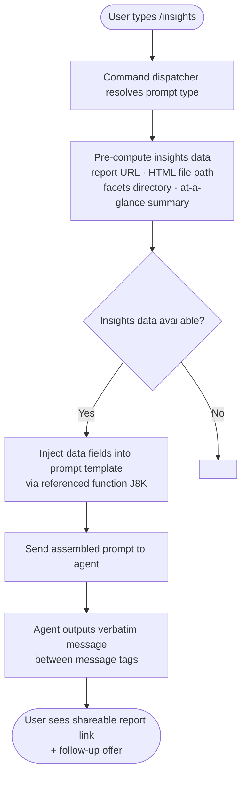

# `/insights`

> Analysis basis: CC v2.1.158 bundle.js (AST extraction + Claude interpretation)
> Minimum version: v2.1.158

---

## Overview

The `/insights` command generates and presents a usage report that analyzes the user's Claude Code sessions. It operates as a `prompt`-type command: when invoked, Claude Code pre-populates a structured prompt containing pre-computed insights data (report URL, HTML file path, facets directory, and an at-a-glance summary), then instructs the agent to output a fixed confirmation message verbatim. The user receives a shareable report link along with an offer to explore specific sections.

---

## Registration

| Field | Value |
|---|---|
| type | `prompt` |
| name | `insights` |
| description | `Generate a report analyzing your Claude Code sessions` |
| prompt body length | 513 characters |
| prompt construction | Resolved via one referenced function call with 1 literal substitution |

Analysis basis: CC v2.1.158 bundle.js:+12861683

---

## Input Branching

Because the AST depth-2 traversal returned an empty call graph and no additional literals, the branching logic visible from static analysis is limited to what can be inferred from the prompt body structure. The command appears to follow a single, linear execution path at the slash-command dispatch layer.



Analysis basis: CC v2.1.158 bundle.js:+12861683

---

## Behavioral Spec

### Prompt Assembly

The command is of type `prompt`, meaning its entire behavior at the CLI layer consists of constructing a text prompt and forwarding it to the agent. No tool calls or file writes are performed by the command handler itself.

```
function assembleInsightsPrompt(insightsPayload):
    reportURL      = insightsPayload.reportURL
    htmlFilePath   = insightsPayload.htmlFilePath
    facetsDirectory = insightsPayload.facetsDirectory
    atAGlanceSummary = insightsPayload.atAGlanceSummary

    prompt = buildPromptTemplate(
        reportURL,
        htmlFilePath,
        facetsDirectory,
        atAGlanceSummary
    )
    // Resulting prompt is approximately 513 characters
    return prompt
```

Analysis basis: CC v2.1.158 bundle.js:+12861683

### Agent Instruction Contract

The assembled prompt instructs the agent with two binding constraints:

1. **Context injection (agent-only):** The at-a-glance summary is passed to the agent for context. The prompt explicitly states the user has not yet seen any output at the time the agent receives this data.
2. **Verbatim output enforcement:** The agent is instructed to output the text enclosed in `<message>` tags exactly as provided, omitting no lines. The fixed message confirms the report is ready, supplies the shareable URL, and asks whether the user wants to explore any section or act on a suggestion.

```
function agentResponsePolicy(prompt):
    // Agent must not paraphrase or summarize the <message> block
    // Agent must not omit any line within the <message> block
    // Agent may use injected summary data for follow-up reasoning
    //   but must not surface it before the verbatim message
    outputVerbatim(prompt.messageBlock)
```

Analysis basis: CC v2.1.158 bundle.js:+12861683

### Prompt Template Structure

The prompt body (513 characters) follows this logical layout:

```
section CONTEXT:
    "User just ran /insights to generate a usage report"

section DATA_INJECTION:
    insightsData    = <runtime value>
    reportURL       = <runtime value>
    htmlFilePath    = <runtime value>
    facetsDirectory = <runtime value>

section AGENT_CONTEXT (not shown to user):
    atAGlanceSummary = <runtime value>

section OUTPUT_INSTRUCTION:
    directive = "Output the text between <message> tags verbatim
                 as your entire response. Do not omit any line."

section MESSAGE_BLOCK (verbatim output):
    line 1: "Your shareable insights report is ready:"
    line 2: <reportURL>
    line 3: (blank)
    line 4: "Want to dig into any section or try one of the suggestions?"
```

Analysis basis: CC v2.1.158 bundle.js:+12861683

---

## State & Side Effects

| Item | Detail |
|---|---|
| Telemetry | <!-- TODO: not found in depth-2 traversal; needs --depth 4 --> |
| Hook registration | <!-- TODO: not found in depth-2 traversal; needs --depth 4 --> |
| appState changes | <!-- TODO: not found in depth-2 traversal; needs --depth 4 --> |
| Sound | <!-- TODO: not found in depth-2 traversal; needs --depth 4 --> |
| File output | HTML report file written to path provided in `htmlFilePath`; facets data written to `facetsDirectory` — exact write logic not found in depth-2 traversal |
| Report URL | A shareable URL is generated and embedded in both the prompt and the verbatim message block; generation mechanism not found in depth-2 traversal |
| Agent interaction | Prompt forwarded to agent; agent response is constrained to verbatim output of `<message>` block |

---

## Version History

| Version | Change |
|---|---|
| v2.1.158 | Initial analysis — `prompt`-type command, 513-character template, verbatim message enforcement confirmed |

---

## Common Mistakes

1. **Expecting interactive input:** `/insights` takes no arguments. Passing any text after the command has no defined effect based on available data; the prompt template does not reference user-supplied arguments.
2. **Assuming the agent summarizes output:** The prompt explicitly enforces verbatim reproduction of the `<message>` block. Any agent behavior that paraphrases or shortens the message is a deviation from the command contract.
3. **Confusing the at-a-glance summary visibility:** The summary is injected into the prompt for the agent's context only. The user does not see it directly; the only user-facing output is the verbatim `<message>` block.
4. **Expecting real-time session analysis:** The insights data is pre-computed before the prompt is assembled. The command presents existing data rather than performing live analysis during the conversation turn.
5. **Treating the HTML file and report URL as identical:** The prompt distinguishes `HTML file` (a local file path) from `Report URL` (a shareable link). These are separate artifacts with separate fields in the prompt template.

---

## Appendix — Identifier Mapping

> For bundle debugging only. Identifiers change across versions.

| Identifier | Role |
|---|---|
| `J8K` | Prompt template builder function — called during prompt construction with 1 literal substitution to produce the 513-character prompt body |