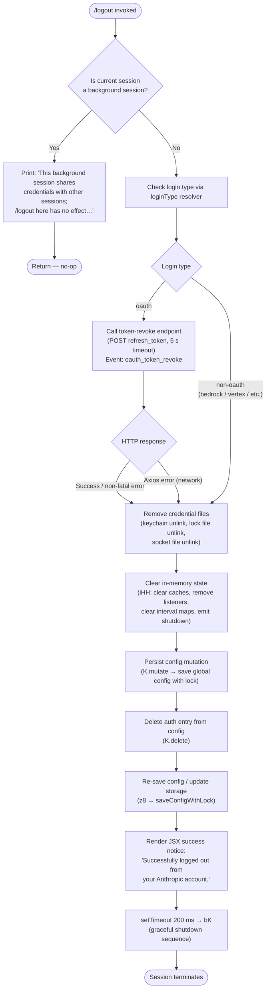

# `/logout`

> Analysis basis: CC v2.1.158 bundle.js (AST extraction + Claude interpretation)
> Minimum version: v2.1.158

---

## Overview

The `/logout` command signs the user out of their Anthropic account by revoking the OAuth token server-side, removing local credential files from the keychain and filesystem, clearing in-memory auth state, and then terminating the CLI session. Background ("bg") sessions detect they share credentials with a parent session and refuse to perform the sign-out, printing an informational message instead.

---

## Registration

| Field | Value |
|---|---|
| type | `local-jsx` |
| name | `logout` |
| description | Sign out from your Anthropic account |
| loc_byte | `11347116` |
| loc_byte_end | `11347413` |
| loc_line | `7351` |
| module_id | `mb_` |
| load_inline | `true` |
| arbor_handler.name | `AzL` |
| arbor_handler.fqn | `claude-2.1.158::AzL` |
| arbor_handler.kind | `AsyncFunction` |
| arbor_handler.resolution_path | `module_id` |
| arbor_handler.n_hits | `0` |

Analysis basis: CC v2.1.158 bundle.js:+11347116

---

## Input Branching

Four distinct top-level paths exist, making a flowchart the appropriate representation.



Analysis basis: CC v2.1.158 bundle.js:+7824984 (handler entry `AzL`), +7823849 (logout body `AsH`), +7825057 (branch dispatch)

---

## Behavioral Spec

### 1. Background-session guard

```
async function logoutHandler(context):
    sessionType = resolveSessionType()          // v9 → QOH
    if sessionType in ["bg", "daemon", "daemon-worker"]:
        print("This background session shares credentials …")
        return                                  // no-op
```

If the current process is identified as a background worker, the command prints the hardcoded guard message and exits immediately without touching credentials.

Analysis basis: CC v2.1.158 bundle.js:+7823900 (`v9` call), +7825094 (guard string), +2201979 (`"bg"` literal), +2201989 (`"daemon"` literal), +2202003 (`"daemon-worker"` literal)

---

### 2. OAuth token revocation

```
async function revokeOAuthToken():
    loginType = resolveLoginType()              // WA → checks "bedrock", "vertex", etc.
    if loginType != "oauth":
        return                                  // skip revocation for non-oauth

    payload = { grant_type: "refresh_token", token: storedRefreshToken }
    try:
        POST oauthRevokeEndpoint,
             headers: { "Content-Type": "application/json" },
             timeout: 5000 ms
        emit telemetry "oauth_token_revoke" (success)
    except AxiosError:
        emit telemetry "oauth_token_revoke" (network error "network")
        // non-fatal; proceed with local cleanup
```

The revocation endpoint call (`Wq_`) posts the refresh token. A 5000 ms timeout (`5000` literal) is applied. Axios errors are caught and classified as `"network"` but do not abort the logout flow.

Analysis basis: CC v2.1.158 bundle.js:+7824058 (`Wq_`), +2057829 (POST call), +2057889 (`"refresh_token"`), +2057987 (`5000` timeout), +2057997 (`"oauth_token_revoke"`), +2058034 (Axios error check), +2058121 (`"network"`)

---

### 3. Credential file removal

```
async function removeCredentialFiles():
    // Remove primary credential store (keychain / secure storage)
    credentialStoreUnlink()                     // hR9 → KkH.unlink

    // Remove OAuth socket / lock file
    oauthSocketUnlink()                         // fy_ → k26.unlink

    // Remove legacy plaintext credential file (if present)
    legacyCredentialUnlink()                    // q → WVK.unlinkSync
```

Three separate file-removal helpers run sequentially. `hR9` unlinks the keychain entry (with the Arbor-resolved service name `"claude-code-user"` for keychain lookup). `fy_` removes the OAuth lock/socket artefact. `q` performs a synchronous unlink of any residual plaintext credential file.

Analysis basis: CC v2.1.158 bundle.js:+7823879 (`xb_`/`q` cred unlink), +7823904 (`v9`), +7824938 (`hR9`), +6924352 (`KkH.unlink`), +7824950 (`fy_`), +6884422 (`k26.unlink`), +15445703 (`WVK.unlinkSync`), +2069397 (`"claude-code-user"` keychain service name)

---

### 4. In-memory state teardown

```
function teardownInMemoryState():
    // iHH orchestrates full shutdown of runtime subsystems
    shutdownEventEmitter()                      // hQH.emit
    clearAllListenerRegistrations()             // RQH → process.off, clearInterval
    clearRegistryMaps()                         // izH.clear, __8.clear, oz6.clear,
                                                //   Bz_.clear, PU.clear
    flushPendingLogs()                          // SH → log queue drain
    clearSecureStorageCache()                   // oH8 → _yq.clear
```

`iHH` is the central shutdown coordinator. It removes process-level `"exit"` and `"beforeExit"` listeners, clears five internal registry Maps, emits a shutdown event, and flushes the log queue.

Analysis basis: CC v2.1.158 bundle.js:+7823916 (`B06`), +7824885 (`iHH`), +3188204 (`Ex`), +3188226 (`hQH.emit`), +3188354 (`process.off`), +3188473–3188521 (five `.clear()` calls), +3189011 (`clearInterval`), +3189046 (`process.removeListener`), +3189069 (`"beforeExit"`), +3188412 (`"exit"`)

---

### 5. Config persistence — auth removal

```
async function removeAuthFromConfig():
    // Mutate in-memory config to remove auth fields
    configStore.mutate(entry => delete entry.auth)     // K.mutate → saveConfigWithLock

    // Delete auth key explicitly
    configStore.delete("auth")                          // K.delete

    // Persist to disk with file lock (z8 → LY_ → saveConfigWithLock)
    await saveConfigWithLock()
```

The config write path uses a file lock with a 60 000 ms acquisition timeout. If the lock detects that the on-disk config is missing auth data that the cache still has, it emits `tengu_config_auth_loss_prevented` and refuses to write (GH #3117 guard).

Analysis basis: CC v2.1.158 bundle.js:+7824181 (`K.mutate`), +7824355 (`K.delete`), +7824388 (`z8`), +3208994 (`60000` lock timeout), +3208640 (GH #3117 guard string), +3208792 (`tengu_config_auth_loss_prevented`)

---

### 6. Success display and graceful shutdown

```
async function displaySuccessAndExit():
    // Render JSX success notice (system role message)
    renderSystemMessage("Successfully logged out from your Anthropic account.")

    // Short delay to allow render to flush
    await sleep(200)                            // setTimeout 200 ms

    // Invoke graceful shutdown (bK → H9 → Yv_ / zIH)
    gracefulShutdown()
```

After the 200 ms render delay (literal `200` at +7825388), `bK` → `H9` coordinates the final shutdown: it drains the write queue (`oxH → qOA.drain`), races a `AbortSignal.timeout` against cleanup, emits `"session_end"` telemetry, and ultimately calls `process.exit` or `process.kill("SIGKILL")` if the graceful path times out.

Analysis basis: CC v2.1.158 bundle.js:+7825268 (`ub_.createElement` — JSX render), +7825293 (success string), +7825246 (`"system"` message role), +7825356 (`setTimeout`), +7825388 (`200`), +7825372 (`bK`), +5356525 (`H9`), +5358212 (`AbortSignal.timeout`), +5358321 (`"session_end"`), +5356385 (`process.exit`), +5356410 (`process.kill`), +5356435 (`"SIGKILL"`)

---

## State & Side Effects

| Item | Detail |
|---|---|
| Telemetry — `oauth_token_revoke` | Fired on OAuth token revocation attempt (success or network error); literal at +2057997 |
| Telemetry — `oauth_logout` | Fired during logout flow; literal at +7824765 |
| Telemetry — `subscription-switch` | May fire when auth type transitions during logout; literal at +7824610 |
| Telemetry — `tengu_feature_ok` | General feature-success tracking (+966033) |
| Telemetry — `tengu_feature_sad` | General feature-degraded tracking (+966168) |
| Telemetry — `tengu_feature_bad` | General feature-error tracking (+966091) |
| Telemetry — `tengu_config_lock_contention` | Fired when config file lock takes unexpectedly long (+3208313) |
| Telemetry — `tengu_config_stale_write` | Fired when a stale config write is detected (+3208449) |
| Telemetry — `tengu_config_auth_loss_prevented` | Fired when GH #3117 guard refuses a write that would erase auth (+3208792) |
| Telemetry — `tengu_config_parse_error` | Fired if config JSON cannot be parsed during save (+3210888) |
| Telemetry — `tengu_startup_perf` | Startup profiling emitted as part of session-end path (+215155) |
| Telemetry — `tengu_scroll_summary` | Emitted at session end by the scroll/render subsystem (+5357253) |
| Telemetry — `tengu_cache_eviction_hint` | Cache eviction telemetry on shutdown (+5358286) |
| Telemetry — `tengu_pewter_brook` | Terminal capability/fullscreen detection telemetry (+3377714) |
| Telemetry — `tengu_daemon_config_reload` | Fired if daemon detects config change on reload (+15482137) |
| Keychain / filesystem | `KkH.unlink` removes keychain entry; `k26.unlink` removes OAuth socket; `WVK.unlinkSync` removes plaintext fallback file |
| Config file (`~/.claude.json`) | Auth fields deleted; file rewritten under lock with backup rotation (up to 5 backups at `"backups/"` subdirectory) |
| In-memory Maps cleared | `izH`, `__8`, `oz6`, `Bz_`, `PU` — five registry maps cleared by `RQH` |
| Process listeners removed | `"exit"` and `"beforeExit"` listeners removed; intervals cleared |
| Session termination | Process calls `process.exit` after graceful drain; falls back to `process.kill("SIGKILL")` on timeout |
| Background-session guard | No state changes when running in `"bg"` / `"daemon"` / `"daemon-worker"` mode |
| Sound | None observed in traversal |

---

## Version History

| Version | Change |
|---|---|
| v2.1.158 | Initial analysis |

---

## Common Mistakes

1. **Running `/logout` inside a background/headless session** — the command detects `"bg"`, `"daemon"`, or `"daemon-worker"` session types and prints a no-op message. Sign out from the primary interactive terminal instead.
2. **Expecting immediate re-login** — the CLI process terminates after logout. A fresh invocation of the `claude` binary is required to log back in.
3. **Assuming network connectivity is required** — the OAuth token revocation HTTP call is best-effort with a 5 s timeout. Local credential files are deleted regardless of whether the server-side revocation succeeds.
4. **Interrupted logout leaving partial state** — if the process is killed between file removal and config persistence, some credential artefacts (keychain entry vs. config `auth` field) may be inconsistent. Re-running `/logout` on next launch should be safe because each removal step is individually guarded against `ENOENT`.
5. **Config backup confusion** — the save path rotates up to 5 backup files under a `"backups/"` directory adjacent to `~/.claude.json`. These backups are not credentials and can be ignored.

---

## Appendix — Identifier Mapping

> For bundle debugging only. Identifiers change across versions.

| Identifier | Role |
|---|---|
| `AzL` | Main logout handler (`AsyncFunction`, Arbor-resolved via `module_id`) |
| `AsH` | Core logout execution body (performs all sign-out steps) |
| `qzL` | Logout UI / "Signing out…" render component |
| `q` | Synchronous unlink of plaintext credential file (`WVK.unlinkSync`) |
| `v9` | Session-type resolver (detects `"bg"` / `"daemon"` etc. via `QOH`) |
| `QOH` | Session type enum / resolver helper |
| `B06` | In-memory state teardown orchestrator |
| `C26` | Sub-step of state teardown |
| `ngH` | Sub-step of state teardown |
| `oH8` | Secure storage cache clear (`_yq.clear`) |
| `QzH` | Sub-step of state teardown |
| `iHH` | Central shutdown coordinator (removes listeners, clears maps, emits event) |
| `Ex` | Config/environment string helper |
| `CH` | String construction utility |
| `Zx` | Auxiliary config helper (`NR`) |
| `RQH` | Process-listener and interval cleanup |
| `lz_` | Interval clear + `process.removeListener` |
| `SH` | Log-queue flush / error logger |
| `F_` | Error construction helper |
| `L1` | Essential-traffic queue helper |
| `G_4` | Log ring-buffer shift/push |
| `hR9` | Keychain entry unlink (`KkH.unlink`) |
| `RR9` | Keychain helper sub-routine |
| `Ry_` | Keychain path resolver |
| `_hA` | Keychain path sub-helper |
| `D1H` | File-path join helper |
| `j56` | Path join + filesystem helper |
| `fy_` | OAuth socket / lock-file removal |
| `Ky_` | OAuth socket cleanup with `clearTimeout` |
| `My_` | OAuth socket sub-helper |
| `c4H` | Socket-cleanup condition checker |
| `rcH` | Path-join helper for socket file |
| `WA` | Login-type resolver (detects `"bedrock"`, `"vertex"`, `"firstParty"`, etc.) |
| `aK` | Secure-storage credential reader |
| `eOq` | Credential storage read/write/delete interface |
| `oTH` | Credential store async read helper |
| `am4` | Storage async context / mutex manager |
| `hH` | Telemetry feature-ok helper (`tengu_feature_ok`) |
| `d` | Telemetry event dispatcher |
| `t6` | Telemetry feature-sad helper (`tengu_feature_sad`) |
| `bH` | Telemetry feature-bad helper (`tengu_feature_bad`) |
| `L` | Async file-read helper |
| `f` | Async file handle / connection wrapper |
| `A` | String/lowercase utility |
| `Wq_` | OAuth token revocation HTTP caller |
| `kq` | OAuth endpoint URL builder |
| `HEA` | OAuth URL sub-helper |
| `z84` | OAuth URL sub-helper |
| `N` | HTTP request wrapper / logger |
| `lCK` | Log writer helper |
| `LOA` | Log output formatter |
| `RH` | JSON-stringify helper |
| `v4` | HTTP request path/header builder |
| `pYA` | Header map builder |
| `EuH` | Log/write helper |
| `NYA` | Write-stream helper |
| `rCK` | File-based log writer / appender |
| `rxH` | Log-line formatter / output buffer |
| `M$H` | Log file path builder |
| `g6` | File existence / error-code check (`ENOENT`, `EEXIST`, etc.) |
| `KK6` | `EISDIR` error guard |
| `lYA` | Log file path joiner |
| `cYA` | Log file rotation helper (`.txt`, rename, unlink) |
| `iCK` | Log file append / mkdir helper |
| `q9` | `qOA.register` — log-queue registration |
| `Qt` | Auxiliary logout step (<!-- TODO: not found in depth-2 traversal; needs --depth 4 -->) |
| `h3_` | Config path / working-directory resolver |
| `wyq` | Config path builder (NFC normalisation, SHA-256) |
| `XKq` | Config path computation |
| `uN` | Path normalise + hash helper |
| `XP` | Config path sub-helper |
| `DV` | User-info / username helper (`Xr6.userInfo`) |
| `EH` | String coercion helper |
| `z8` | Global config save with lock (`saveGlobalConfig`) |
| `LY_` | `saveConfigWithLock` — locks file, writes, rotates backups |
| `nOq` | Config object factory |
| `J8` | JSON parse helper |
| `szH` | Config file read helper |
| `qY6` | Config schema validator |
| `fY_` | Backup file path builder |
| `V` | <!-- TODO: not found in depth-2 traversal; needs --depth 4 --> |
| `P` | MCP / SDK connection manager |
| `E` | Renderer / output stream |
| `hL6` | Atomic file write helper (temp + rename + fchmod + fsync) |
| `UQH` | Config lock token |
| `SFq` | Config entries iterator (`Object.entries`) |
| `BQH` | Config write timestamp helper (`Date.now`) |
| `KY_` | Config write path helper |
| `za6` | Auxiliary config resolver |
| `K` | In-memory config store (`.mutate`, `.delete`, `.has`) |
| `A0H` | Auth-removal helper |
| `TNH` | JSX text/string formatter |
| `LX` | Inline text renderer |
| `D4` | Telemetry event emitter (OTEL attribute builder) |
| `ym8` | OTEL attribute helper |
| `GNH` | OTEL metrics initialiser |
| `wU` | Session-ID generator (random bytes + `z8`) |
| `I6` | Node `qN` / path helper |
| `IL8` | OTEL attribute string helper |
| `B$H` | Feature-flag / `FsK.has` guard |
| `_7` | OTEL span helper |
| `EM9` | OTEL metric instrument helpers |
| `NL8` | OTEL resource builder (`Object.freeze`) |
| `M16` | OTEL event sequence helper |
| `bK` | Graceful-shutdown entry point |
| `H9` | Graceful-shutdown sequencer (drain, race, exit) |
| `zIH` | Terminal unmount / write-sync at shutdown |
| `SR` | Shutdown render helper |
| `Fq8` | Terminal write helper (ANSI save/restore cursor) |
| `zv_` | Shutdown path formatter (backslash/quote escaping) |
| `JZ` | Shutdown state accessor |
| `Eb` | Shutdown error helper |
| `OP6` | Stat-check helper at shutdown |
| `k$` | Path + `U4` helper |
| `mX9` | Terminal dim-text helper |
| `Yv_` | Force-kill fallback (`process.exit` / `process.kill SIGKILL`) |
| `oxH` | Log-queue drain (`qOA.drain`) |
| `Y` | Renderer start/stop/update lifecycle |
| `u2H` | Renderer state builder |
| `xe1` | Renderer column-width calculator |
| `G` | Input event handler (`preventDefault`, `remoteControlAtStartup`) |
| `dVK` | Heartbeat helper |
| `EK6` | Startup-profiling writer |
| `RB8` | Profiling data helper |
| `fDA` | Profiling file writer (JSON, `utf8`, `mark`) |
| `Cf8` | Scroll/session metrics recorder (`tengu_scroll_summary`) |
| `uX9` | Scroll metrics sub-helper |
| `xX9` | Scroll metrics calculator (`Date.now`, `Math.max`, `Math.round`) |
| `Aq` | Terminal capability / fullscreen detector (`tengu_pewter_brook`) |
| `x96` | Cache eviction hint emitter |
| `bf8` | Session-end cleanup (Promise race, drain) |
| `g8` | Abort-signal / timeout promise helper |