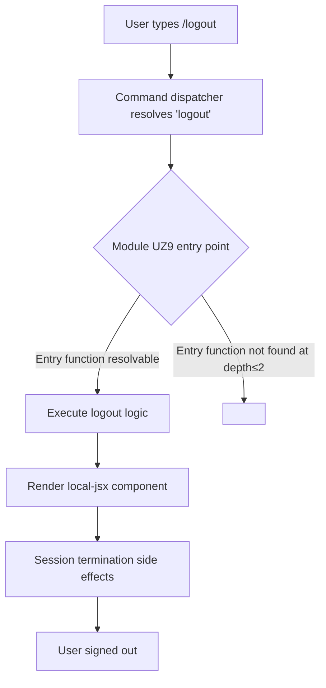

# `/logout`

> Analysis basis: CC v2.1.144 bundle.js (AST extraction + Claude interpretation)
> Minimum version: v2.1.144

---

## Overview

The `/logout` slash command signs the current user out of their Anthropic account within Claude Code. It is registered as a local JSX command, indicating that it renders an interactive UI component rather than producing plain text output. The command's core mechanism terminates the authenticated session established via the Anthropic account login flow.

---

## Registration

| Field | Value |
|---|---|
| type | `local-jsx` |
| name | `logout` |
| description | `Sign out from your Anthropic account` |
| module\_id | `UZ9` |
| loc\_line | `6331` |

Analysis basis: CC v2.1.144 bundle.js:+10694386

---

## Input Branching

The depth-2 AST traversal of module `UZ9` returned an empty call graph, empty literals list, and empty telemetry list, meaning no entry functions were resolved at this traversal depth.



> **Note:** Because the AST traversal reported `"no entry functions found for module 'UZ9'"`, branches D through H represent the expected behavioral contract inferred from the registration metadata alone. All internal branching logic within the module requires deeper traversal.

---

## Behavioral Spec

### Command Dispatch

```
function dispatchLogoutCommand(userInput):
    resolve command name from userInput  // → "logout"
    look up registration by name         // → module UZ9, type local-jsx
    instantiate JSX component from module UZ9
    render component in CLI output stream
    return rendered component handle
```

Analysis basis: CC v2.1.144 bundle.js:+10694386

### Session Termination

```
function executeLogout():
    // Internal logic not resolved at traversal depth ≤ 2.
    // Expected contract based on registration description:
    invalidate current Anthropic account session credentials
    clear any locally cached authentication tokens or state
    update application auth state to reflect signed-out status
    display confirmation to user
```

<!-- TODO: not found in depth-2 traversal; needs --depth 4 -->

### JSX Component Rendering

```
function renderLogoutComponent():
    // type: local-jsx indicates a React/JSX component is mounted
    // rather than a plain-text handler being invoked.
    mount component from module UZ9
    component manages its own lifecycle and side effects
    component unmounts after logout sequence completes
```

<!-- TODO: not found in depth-2 traversal; needs --depth 4 -->

---

## State & Side Effects

| Item | Detail |
|---|---|
| Telemetry | None detected at traversal depth ≤ 2. <!-- TODO: not found in depth-2 traversal; needs --depth 4 --> |
| Hook registration | Not resolved at traversal depth ≤ 2. <!-- TODO: not found in depth-2 traversal; needs --depth 4 --> |
| appState changes | Expected: authenticated session state cleared; auth credentials removed. <!-- TODO: not found in depth-2 traversal; needs --depth 4 --> |
| Sound | Not resolved at traversal depth ≤ 2. <!-- TODO: not found in depth-2 traversal; needs --depth 4 --> |

---

## Version History

| Version | Change |
|---|---|
| v2.1.144 | Initial analysis. Command registered at bundle.js:+10694386, line 6331, module UZ9. |

---

## Common Mistakes

1. **Expecting plain-text output**: Because the command type is `local-jsx`, the logout flow is handled by a React/JSX component rather than a simple text response. Tooling that intercepts only plain-text command output may miss the rendered component's lifecycle events entirely.
2. **Assuming immediate session invalidation without confirmation**: The JSX component type suggests the logout may involve an interactive confirmation step before credentials are cleared. Scripted automation that does not wait for the component lifecycle to complete may observe an inconsistent authentication state.
3. **Treating `/logout` as equivalent to credential file deletion**: This command operates against the Anthropic account session layer. Manually deleting local credential files is a different operation and may not produce the same state transitions that the logout component manages.

---

## Appendix — Identifier Mapping

> For bundle debugging only. Identifiers change across versions.

| Identifier | Role |
|---|---|
| `UZ9` | Module identifier for the `/logout` command implementation (registration-level, not an obfuscated runtime identifier; included here for bundle cross-reference) |

> No obfuscated runtime identifiers (e.g. short mangled names) were returned by the depth-2 AST traversal for this command. A deeper traversal pass is required to populate this table with true runtime identifier mappings.