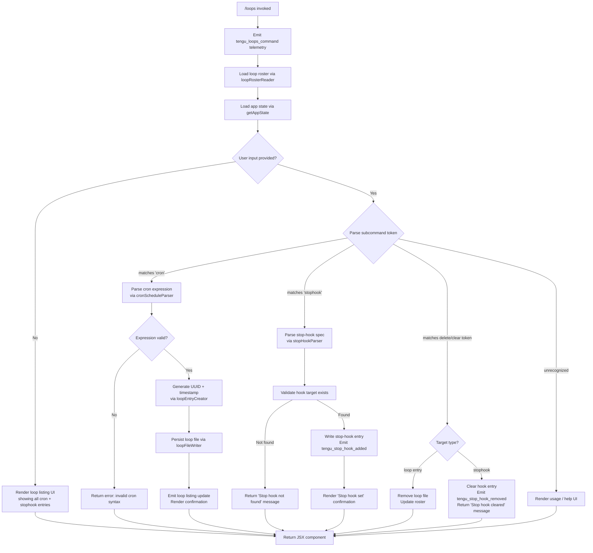

# `/loops`

> Analysis basis: CC v2.1.158 bundle.js (AST extraction + Claude interpretation)
> Minimum version: v2.1.158

---

## Overview

The `/loops` command is the primary management interface for Claude Code's recurring-loop and stop-hook subsystems. It lets users list all active loops, create new cron-scheduled or stop-hook-triggered loops, and delete existing ones. The command renders as a local JSX component and immediately activates on invocation, dispatching into async handler `P55` which reads the current loop roster, parses user input, and performs the requested operation.

---

## Registration

| Field | Value |
|---|---|
| type | `local-jsx` |
| name | `loops` |
| description | `List, create, and delete recurring loops and stop-hooks` |
| loc_byte | `12203935` |
| loc_byte_end | `12204117` |
| loc_line | `8114` |
| immediate | `true` |
| module_id | `yl1` |
| load_inline | `true` |
| arbor_handler.name | `P55` |
| arbor_handler.fqn | `claude-2.1.158::P55` |
| arbor_handler.kind | `AsyncFunction` |
| arbor_handler.resolution_path | `module_id` |
| arbor_handler.n_hits | `0` |

Analysis basis: CC v2.1.158 bundle.js:+12203935

---

## Input Branching

The command distinguishes at least five distinct operation paths (list, create-cron, create-stophook, delete-loop, delete-stophook), plus a no-argument listing path. A Mermaid flowchart is therefore used.



---

## Behavioral Spec

### 1. Handler Entry — `loopsCommandHandler` (`P55`)

```
async function loopsCommandHandler(context):
    emit telemetry("tengu_loops_command")          // bundle.js:+12202892
    roster  = await loopRosterReader(context)      // O8H, bundle.js:+12202930
    appState = context.getAppState()               // bundle.js:+12202942
    loopList = buildLoopList(appState)             // B66, bundle.js:+12202938
    hookList = roster.stophooks                    // I6, bundle.js:+12202958

    mappedLoops = loopList.map(...)                // bundle.js:+12202970
    parsedInput = cronInputParser(context.input)   // QV, bundle.js:+12203021
    mappedHooks = roster.hooks.map(...)            // bundle.js:+12203054

    if subcommand == "stophook":                   // literal "stophook", bundle.js:+12203074
        result = stopHookHandler(...)              // $8H, bundle.js:+12203177
    else if subcommand == "cron":                  // literal "cron", bundle.js:+12202988
        scheduleEntry = scheduleParse(context)     // X55, bundle.js:+12203442
        result = loopEntryCreator(scheduleEntry)   // jnH, bundle.js:+12203540
    else if delete operation detected:
        result = deleteLoopHandler(context)        // F66, bundle.js:+12203628

    return renderLoopsJSX(result, ...)             // t6A.createElement, bundle.js:+12203695
```

Analysis basis: CC v2.1.158 bundle.js:+12202890

---

### 2. Loop Roster Reader — `loopRosterReader` (`O8H`)

```
async function loopRosterReader(context):
    entries = await persistedLoopLoader(context)   // LNH, bundle.js:+4790177
    result  = transformLoopEntries(entries)        // yG, bundle.js:+4790213
    return result
```

Internally, `persistedLoopLoader` (`LNH`) performs the following:

```
async function persistedLoopLoader(context):
    configDir = resolveConfigDir(context)          // g6, bundle.js:+4788170
    raw       = await fs.readFile(configDir, "utf-8")  // literal "utf-8", bundle.js:+4788217
    path      = pathResolver(configDir)            // Y7H, bundle.js:+4788200
    parsed    = jsonParser(raw)                    // rq → J8, bundle.js:+4788239
    validated = schemaValidator(parsed)            // SH, bundle.js:+4788261
    filtered  = filterValidEntries(validated)      // V9, bundle.js:+4788276

    if Array.isArray(filtered):
        normalized = normalizeEntries(filtered)    // N, bundle.js:+4788512
    else:
        normalized = []

    serialized = serialize(normalized)             // RH, bundle.js:+4788559
    result     = formatOutput(serialized)          // XI, bundle.js:+4788581
    roster.push(result)                            // bundle.js:+4788676
    return roster
```

Analysis basis: CC v2.1.158 bundle.js:+4790177

---

### 3. Loop List Builder — `buildLoopList` (`B66`)

```
function buildLoopList(appState):
    headers = formatTableHeader()                  // TXH → K.set, bundle.js:+8811690
    columns = buildColumnMap()                     // _K1 → H.map, bundle.js:+8811459
    entries = []
    for each loop in appState.loops:
        row = formatRow(loop, columns)             // bundle.js:+10541704
        entries.push(row)
    return entries
```

The table formatter right-pads columns with two spaces (literal `"  "`, bundle.js:+15491413) and applies a pad width of 40 characters (literal `40`, bundle.js:+15493384).

Analysis basis: CC v2.1.158 bundle.js:+10541580

---

### 4. Cron Input Parser — `cronInputParser` (`QV`)

```
function cronInputParser(rawInput):
    trimmed = rawInput.trim()                      // bundle.js:+4785961

    if trimmed matches "Every minute" pattern:     // literal, bundle.js:+4786081
        return { schedule: "* * * * *", label: "Every minute" }

    if trimmed matches numeric/range pattern:
        minutes = parseInt(match)                  // bundle.js:+4786137
        clamped = clampToRange(minutes, max=59)    // literals 59,60, bundle.js:+12202657,+12202623
        return { schedule: buildCronExpr(clamped) }

    if trimmed matches "Every hour" pattern:       // literal, bundle.js:+4786298
        return { schedule: "0 * * * *", label: "Every hour" }

    // Day-of-week variant
    if trimmed matches weekday pattern:
        day     = J.getUTCDay()                    // bundle.js:+4786838
        date    = J.setUTCDate() / J.getUTCDate()  // bundle.js:+4786857,+4786870
        hours   = J.setUTCHours()                  // bundle.js:+4786888
        localDay = J.getDay()                      // bundle.js:+4786917
        return buildWeeklySchedule(day, hours)

    // Range notation e.g. "1-5"
    if trimmed matches "1-5" pattern:              // literal, bundle.js:+4787005
        return buildRangeSchedule(trimmed)

    return null  // unrecognized format
```

Validation bounds: minute field max = 59 (bundle.js:+12202657), hour field max = 23 (bundle.js:+12202728), day-of-month max = 31 (bundle.js:+12202781).

Analysis basis: CC v2.1.158 bundle.js:+4785961

---

### 5. Schedule Entry Parser — `scheduleParse` (`X55`)

```
function scheduleParse(rawInput):
    match   = rawInput.match(cronRegex)            // bundle.js:+12202478
    minutes = parseInt(match[1])                   // bundle.js:+12202515
    adj     = Math.max(0, minutes)                 // bundle.js:+12202600
    ceiled  = Math.ceil(adj / divisor)             // bundle.js:+12202611
    rounded = Math.round(ceiled)                   // bundle.js:+12202684
    tokens  = scheduleTokenizer(rounded)           // XI, bundle.js:+12202848
    return tokens
```

Analysis basis: CC v2.1.158 bundle.js:+12202478

---

### 6. Loop Entry Creator — `loopEntryCreator` (`jnH`)

```
async function loopEntryCreator(schedule, context):
    id        = NL9.randomUUID()                   // bundle.js:+4789517
    createdAt = Date.now()                         // bundle.js:+4789579
    entry     = buildEntry(id, schedule, createdAt)// K0H, bundle.js:+4789625
    roster    = await persistedLoopLoader(context) // LNH, bundle.js:+4789669
    roster.push(entry)                             // bundle.js:+4789682
    hookId    = fetchHookId(context)               // I6, bundle.js:+4789714
    formatted = formatEntry(entry)                 // ii, bundle.js:+4789763
    await loopFileWriter(roster, context)          // wnH, bundle.js:+4789776
    return entry
```

Each new loop receives an 8-character random suffix (literal `8`, bundle.js:+4789542) written into the `.claude` directory (literal `".claude"`, bundle.js:+4789358).

Analysis basis: CC v2.1.158 bundle.js:+4789517

---

### 7. Loop File Writer — `loopFileWriter` (`wnH`)

```
async function loopFileWriter(roster, context):
    configRoot = resolveConfigKey()                // UK, bundle.js:+4789326
    await fs.mkdir(configRoot, { recursive: true })// S78.mkdir, bundle.js:+4789337
    filePath   = path.join(configRoot, ...)        // R78.join, bundle.js:+4789347
    serialized = roster.map(serializeEntry)        // bundle.js:+4789398
    await fs.writeFile(filePath, serialized)       // S78.writeFile, bundle.js:+4789434
    pathRef    = buildPathRef(filePath)            // Y7H, bundle.js:+4789448
    payload    = serialize(pathRef)                // RH, bundle.js:+4789455
    return payload
```

Analysis basis: CC v2.1.158 bundle.js:+4789326

---

### 8. Stop-Hook Handler — `stopHookHandler` (`$8H`)

```
async function stopHookHandler(subcommand, context):
    exists = checkHookExists(subcommand)           // ct, bundle.js:+4789847
    roster = await persistedLoopLoader(context)    // LNH, bundle.js:+4789896
    hooks  = roster.filter(isHook)                 // bundle.js:+4789905

    if not hooks.has(subcommand):                  // bundle.js:+4789920
        return "Stop hook not found"               // literal, bundle.js:+12203334

    updated = updateHookSet(hooks, subcommand)     // wnH, bundle.js:+4789969
    return updated
```

Analysis basis: CC v2.1.158 bundle.js:+4789847

---

### 9. Delete / Clear Handler — `deleteLoopHandler` (`F66`)

```
async function deleteLoopHandler(target, context):
    renderer = buildRenderer()                     // Xr_, bundle.js:+10541880
    trustGate = checkTrustGate()                   // literal "trust_gate", bundle.js:+10541830
    hooksGate = checkHooksGate()                   // literal "hooks_gate", bundle.js:+10541776

    hookId   = fetchHookId(context)                // I6, bundle.js:+10541943
    loopList = buildLoopList(context)              // B66, bundle.js:+10541961
    state    = context.getAppState()               // bundle.js:+10541965
    ts       = Date.now()                          // bundle.js:+10542129

    if target.type == "stophook":
        existing = getExistingHooks(state)         // dw, bundle.js:+10542154
        state    = context.setAppState(newState)   // bundle.js:+10542167
        op       = context.applyMessageOp(         // bundle.js:+10542209
                       { type: "append",           // literal "append", bundle.js:+10542600
                         kind: "goal_status" })    // literal "goal_status", bundle.js:+10542793
        hookUUID = generateUUID()                  // cZ1, bundle.js:+10542251
        emit telemetry("tengu_stop_hook_removed")  // bundle.js:+10542634
        display("Stop hook cleared")               // literal, bundle.js:+12203356
    else if target.type == "loop":
        state = context.setAppState(newState)      // bundle.js:+10542508
        op    = context.applyMessageOp(            // bundle.js:+10542577
                    { type: "goal",                // literal "goal", bundle.js:+10542665
                      kind: "attachment" })        // literal "attachment", bundle.js:+10542706
        emit telemetry("tengu_stop_hook_removed")
    return renderResult(renderer, context)         // d, bundle.js:+10542632
```

The "Stop" sentinel string (literal `"Stop"`, bundle.js:+10541588) and "prompt" type (literal `"prompt"`, bundle.js:+10541695) gate which operation branch executes.

Analysis basis: CC v2.1.158 bundle.js:+10541880

---

### 10. Stop-Hook Add Flow — `stopHookAddHandler` (`g66`)

```
async function stopHookAddHandler(hookSpec, context):
    hookId   = fetchHookId(context)                // I6, bundle.js:+10542368
    loopList = buildLoopList(context)              // B66, bundle.js:+10542375
    state    = context.getAppState()               // bundle.js:+10542379
    updated  = context.setAppState({ ...state,
                   hooks: [...state.hooks, hookSpec] }) // bundle.js:+10542508
    op       = context.applyMessageOp(             // bundle.js:+10542577
                   { type: "append",
                     kind: "goal_status",          // literal, bundle.js:+10542793
                     goalKind: "goal" })            // literal "goal", bundle.js:+10542665
    uuid     = generateUUID()                      // cZ1 → gZ1.randomUUID, bundle.js:+10542724
    emit telemetry("tengu_stop_hook_added")        // bundle.js:+10542266
    display("Stop hook set")                       // literal, bundle.js:+12203652
    return renderResult(context)                   // d, bundle.js:+10542632
```

Analysis basis: CC v2.1.158 bundle.js:+10542368

---

### 11. Background Daemon Interaction (during loop dispatch)

Loops that trigger background sessions rely on the daemon dispatch subsystem (`w` / `ZfA`). Key behaviours observed in the call graph:

- **SIGKILL escalation**: if a background worker exceeds the grace period (30 s / 15 s thresholds at bundle.js:+15467604, +15467615), the dispatcher sends `SIGKILL` (literal, bundle.js:+15467697) and emits `tengu_bg_dispatch_sigkill_escalate`.
- **Low-memory guard**: free memory is sampled via `EfA.freemem`; if below threshold (1024 MB, bundle.js:+12729584) on macOS (literal `"macos"`, bundle.js:+12729535), `tengu_bg_dispatch_low_mem` is emitted and dispatch is deferred.
- **Spare-pool refill**: when a spare worker is consumed the pool is refilled; events `tengu_bg_spare_claim`, `tengu_bg_spare_spawn`, `tengu_bg_spare_enable` are emitted at the corresponding steps.
- **Timeout**: background session claim has a 5000 ms timeout (literal `5000`, bundle.js:+15448799) with error text `"send-claim timeout"` (bundle.js:+15448855); retry back-off is 500 ms (literal `500`, bundle.js:+15449003).
- **Roster entry**: on successful dispatch, `_.rosterEntry` is updated (bundle.js:+15474155); 300 000 ms idle timeout applies (literal `300000`, bundle.js:+15474413).
- **Daemon states**: worker lifecycle states used are `"active"`, `"crashed"`, `"blocked"`, `"working"`, `"bg"`, `"idle"`, `"daemon"`, `"done"`, `"killed"`, `"stopped"`, `"failed"`, `"resuming"` (various literals, bundle.js:+4096575 – +15474627).

Analysis basis: CC v2.1.158 bundle.js:+15467649

---

## State & Side Effects

| Item | Detail |
|---|---|
| Telemetry: `tengu_loops_command` | Emitted at the top of every `/loops` invocation (bundle.js:+12202892) |
| Telemetry: `tengu_stop_hook_added` | Emitted when a stop-hook is successfully registered (bundle.js:+10542266) |
| Telemetry: `tengu_stop_hook_removed` | Emitted when a stop-hook or loop entry is deleted (bundle.js:+10542634) |
| Telemetry: `tengu_bg_dispatch_sigkill_escalate` | Emitted when a background worker is force-killed (bundle.js:+15467649) |
| Telemetry: `tengu_daemon_control` | Emitted on daemon start/stop operations (bundle.js:+15503486) |
| Telemetry: `tengu_feature_bad` / `tengu_feature_ok` / `tengu_feature_sad` | Feature health events from sub-handlers (bundle.js:+966091, +966033, +966168) |
| Telemetry: `tengu_bg_low_mem_mb` | Emitted when available memory is below threshold (bundle.js:+12729562) |
| Telemetry: `tengu_bg_dispatch_low_mem` | Emitted when dispatch is deferred due to low memory (bundle.js:+15468228) |
| Telemetry: `tengu_bg_spare_enable` | Emitted when the spare-pool is activated (bundle.js:+15468923) |
| Telemetry: `tengu_bg_sendclaim_failed` | Emitted when a claim message to a background worker fails (bundle.js:+15448378) |
| Telemetry: `tengu_daemon_config_reload` | Emitted when the daemon config is reloaded (bundle.js:+15482137) |
| Telemetry: `tengu_bg_spare_claim` | Emitted when a spare session is claimed (bundle.js:+15469044) |
| Telemetry: `tengu_bg_spare_spawn` | Emitted when a new spare session is spawned (bundle.js:+15467342) |
| Telemetry: `tengu_bg_spare_claim_fail` | Emitted when spare claim fails (bundle.js:+15469307) |
| Telemetry: `tengu_daemon_yield` | Emitted when daemon yields to foreground (bundle.js:+15486331) |
| Telemetry: `tengu_bg_spare_refill` | Emitted during spare pool refill (literal `"daemon_bg_spare_refill"`, bundle.js:+15446579) |
| appState changes | `setAppState` and `applyMessageOp` called to append goal/goal_status entries and hook lists |
| File system | Loop entries written to `.claude` directory; files created/deleted on create/remove operations |
| Hook registration | Stop-hook entries written via `loopFileWriter`; cleared via `deleteLoopHandler` |
| Background sessions | Daemon spare-pool may be claimed/spawned as part of loop dispatch |
| Sound | Not observed in depth-2 traversal |

---

## Version History

| Version | Change |
|---|---|
| v2.1.158 | Initial analysis |

---

## Common Mistakes

1. **Providing an invalid cron expression**: The parser (`cronInputParser`) accepts natural-language shortcuts ("Every minute", "Every hour"), integer minute counts, day-of-week expressions, and range notation (`"1-5"`). An arbitrary cron string that matches none of these patterns returns `null` and produces a usage error rather than a stored schedule.
2. **Attempting to delete a stop-hook by loop ID**: Stop-hooks and cron loops are stored separately. Using a loop UUID as a stop-hook target reaches the `"Stop hook not found"` branch (bundle.js:+12203334) without any modification.
3. **Running `/loops` before daemon initialisation**: Because loop dispatch relies on the background spare-pool, invoking the command when the daemon has not yet started results in `tengu_bg_spare_claim_fail` and the operation may silently not execute the loop.
4. **Expecting immediate execution after creation**: Newly created loops are persisted to the `.claude` directory and scheduled via cron logic; they are not run immediately upon the `/loops` create call.
5. **Confusing `stophook` with a cron loop**: The `"stophook"` subcommand token (bundle.js:+12203074) selects an entirely different code path from `"cron"` (bundle.js:+12202988); mixing up the subcommand keyword results in the wrong handler being invoked.

---

## Appendix — Identifier Mapping

> For bundle debugging only. Identifiers change across versions.

| Identifier | Role |
|---|---|
| `P55` | Main async handler for `/loops` command (`loopsCommandHandler`) |
| `O8H` | Loop roster reader top-level function (`loopRosterReader`) |
| `LNH` | Persisted loop file loader (`persistedLoopLoader`) |
| `g6` | Config directory resolver |
| `Y7H` | Path reference builder |
| `UK` | Config key resolver |
| `rq` | Raw JSON reader wrapper |
| `J8` | JSON parse utility |
| `SH` | Schema/entry validator |
| `F_` | Error code handler |
| `CH` | String coercion helper |
| `L1` | Essential-traffic classifier |
| `G_4` | Queue rotation helper (shift/push) |
| `N` | Entry normalizer |
| `lCK` | Normalizer sub-step |
| `RH` | JSON serializer (`JSON.stringify` wrapper) |
| `v4` | UUID / identifier formatter |
| `EuH` | Entry enrichment helper |
| `rCK` | File read/write coordinator |
| `XI` | Output formatter / whitespace processor |
| `Rv7` | Token splitter / range parser |
| `yG` | Entry transformer |
| `qN` | Low-level utility (used by `I6`, `yG`) |
| `B66` | Loop list builder for app state |
| `TXH` | Table header setter |
| `_K1` | Column map builder |
| `I6` | Hook ID fetcher |
| `QV` | Cron input parser (`cronInputParser`) |
| `w` | Background worker / session manager |
| `S` | Background session supervisor |
| `nVK` | Filesystem stat / realpath resolver for sessions |
| `Iz` | Session isolation helper |
| `qF5` | Session auxiliary writer |
| `z` | Daemon write stream |
| `bH` | Feature-bad event emitter |
| `hH` | Feature-ok event emitter |
| `By8` | Memory-check dispatcher |
| `G6` | Background resource group manager |
| `fw6` | Pins/config JSON file loader |
| `GP_` | Pins file path builder |
| `p6` | JSON parse wrapper |
| `P8` | File-not-found error handler |
| `HP7` | Directory-based config loader |
| `B` | Retired-session filter |
| `VH` | MCP plugin/tool filter |
| `dH` | Orphaned-permission checker |
| `jfA` | Spare-session claim sender |
| `t9A` | Session directory initializer |
| `RB5` | Claim timeout / retry handler |
| `SB5` | Claim frame builder |
| `QM` | Claim error logger |
| `EH` | String error formatter |
| `DF` | Binary message frame encoder |
| `ZfA` | Background worker lifecycle manager |
| `gK` | Session path builder |
| `t9` | Session state file reader/writer |
| `YD` | Session activation helper |
| `ff` | Session metadata serializer |
| `T86` | Loop trigger / then-chain executor |
| `MfH` | Session journal path builder |
| `dT` | Session config split handler |
| `GF` | Session goal-file writer |
| `dN6` | Session directory creator |
| `Y` | Active session registry manager |
| `D` | Background dispatch orchestrator |
| `$` | Disposable resource holder |
| `wfA` | Spare worker spawner (via `Bun.spawn`) |
| `R` | Disposable session wrapper |
| `j` | Worker kill iterator |
| `y` | Foreground-yield write handler |
| `J` | Date calculation helper (UTC day/hour) |
| `$8H` | Stop-hook subcommand handler (`stopHookHandler`) |
| `ct` | Hook existence checker |
| `wnH` | Loop file writer (`loopFileWriter`) |
| `g66` | Stop-hook add handler (`stopHookAddHandler`) |
| `cZ1` | UUID generator wrapper (`gZ1.randomUUID`) |
| `X55` | Schedule entry parser (`scheduleParse`) |
| `jnH` | Loop entry creator (`loopEntryCreator`) |
| `K0H` | Loop entry struct builder |
| `M` | Staged-file cleanup handler |
| `nS6` | Plugin name resolver / path validator |
| `iS6` | Plugin path join helper |
| `ii` | Entry formatter entry point |
| `s1H` | Text trimmer / formatter |
| `Pe` | Pipe/buffer size helper |
| `F66` | Delete / clear loop handler (`deleteLoopHandler`) |
| `Xr_` | Delete renderer builder |
| `GU` | Policy settings renderer (`policySettings`) |
| `y8` | UI component constructor |
| `$D` | Alternate policy component |
| `R_` | Renderer reset helper |
| `uL` | Renderer layout helper |
| `R17` | Column layout resolver |
| `t6` | Feature-sad event emitter wrapper |
| `dw` | App-state object-values extractor |

---

Note: index built via Arbor fallback; some signals (telemetry, literals) may be missing — see arbor-fallback.js.