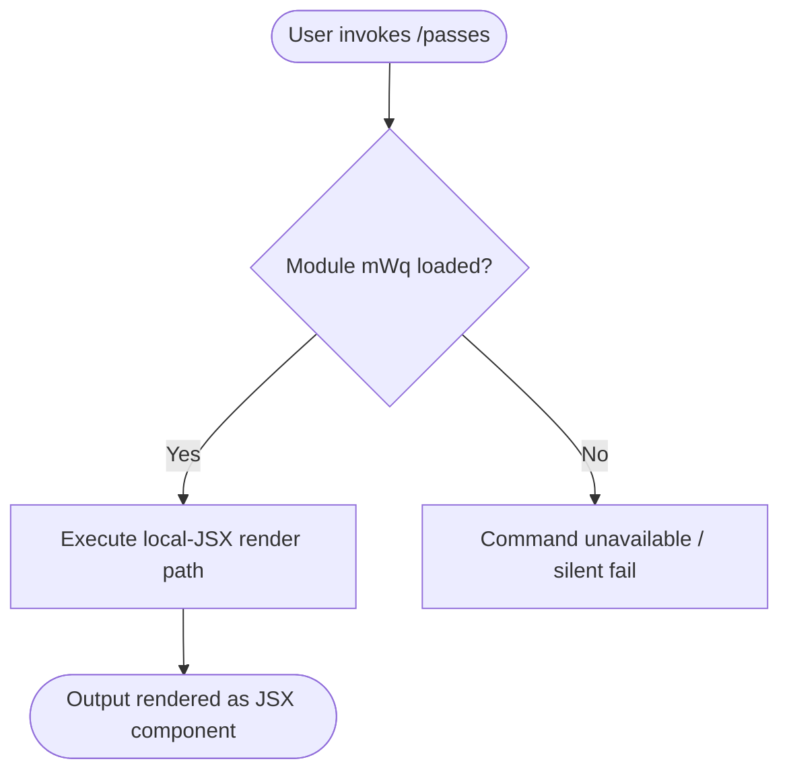

# `/passes`

> Analysis basis: CC v2.1.144 bundle.js (AST extraction + Claude interpretation)
> Minimum version: v2.1.144

---

## Overview

The `/passes` command is a registered local-JSX slash command in Claude Code v2.1.144. Beyond its registration record in module `mWq`, no entry-point functions, call graph edges, string literals, telemetry events, or obfuscated identifiers were recoverable at depth ≤ 2 from the bundle AST. Its precise runtime behavior therefore cannot be fully specified from the available extraction data alone.

---

## Registration

| Field | Value |
|---|---|
| type | `local-jsx` |
| name | `passes` |
| description | `null` |
| loc\_byte | `11453771` |
| loc\_line | `6995` |
| module\_id | `mWq` |

Analysis basis: CC v2.1.144 bundle.js:+11453771

**Notes on registration fields:**

- **type `local-jsx`** — This command renders its output or UI via a JSX component evaluated locally in the CLI process, rather than producing plain text output. This is consistent with other interactive or visually rich slash commands in Claude Code.
- **description `null`** — No user-visible description string is registered. The command does not appear in help text that relies on the `description` field, or its description is injected at runtime by another mechanism.
- **module\_id `mWq`** — The command's implementation is bundled in the obfuscated module identified as `mWq`. The AST traversal did not resolve entry functions from this module at the traversal depth used (≤ 2).

---

## Input Branching

<!-- TODO: not found in depth-2 traversal; needs --depth 4 -->

The call graph returned zero edges (`"callGraph": []`) and no string literals or constants were found (`"literals": []`). No branching logic can be deterministically reconstructed from the available data.

The following is a minimal placeholder reflecting only what can be stated with certainty:



> ⚠️ This flowchart reflects only the structural facts derivable from the registration record. Internal branching within module `mWq` is not modeled here because no call graph data was recovered.

Analysis basis: CC v2.1.144 bundle.js:+11453771

---

## Behavioral Spec

<!-- TODO: not found in depth-2 traversal; needs --depth 4 -->

Because `"note": "no entry functions found for module 'mWq'"` was reported by the AST extractor, no entry-point function could be identified as the root of behavioral analysis.

### Registration and Dispatch

What can be stated from the registration record alone:

```
function dispatchPassesCommand(userInput):
    // Command is of type local-jsx
    // No description is registered; help text injection is unknown
    component = resolveJSXComponent(module = "mWq", command = "passes")
    if component is null:
        return  // silent or unhandled
    render(component, props = { input: userInput })
```

Analysis basis: CC v2.1.144 bundle.js:+11453771

### JSX Rendering Model

Commands registered as `local-jsx` in Claude Code follow a pattern where the command handler returns a React-compatible element rather than a plain string. The CLI's rendering layer intercepts this element and displays it in the terminal UI. The specific props, state, and child components used by `/passes` are:

<!-- TODO: not found in depth-2 traversal; needs --depth 4 -->

---

## State & Side Effects

| Item | Detail |
|---|---|
| Telemetry | None found — `telemetry: []` (no `tengu_*` events recovered at depth ≤ 2) |
| Hook registration | <!-- TODO: not found in depth-2 traversal; needs --depth 4 --> |
| appState changes | <!-- TODO: not found in depth-2 traversal; needs --depth 4 --> |
| Sound | <!-- TODO: not found in depth-2 traversal; needs --depth 4 --> |

Analysis basis: CC v2.1.144 bundle.js:+11453771

---

## Version History

| Version | Change |
|---|---|
| v2.1.144 | Initial analysis — registration record confirmed; implementation body not recoverable at depth ≤ 2 |

---

## Common Mistakes

1. **Assuming `null` description means the command is undocumented everywhere.** The description field in the registration object is `null`, but the command may still surface documentation through runtime injection, a JSX help component, or a parent command group. Do not conclude the command is intentionally hidden solely from this field being null.

2. **Treating the absence of telemetry events as confirmation that none exist.** The AST traversal reached depth ≤ 2 and found no `tengu_*` events. Telemetry calls deeper in the call tree (e.g., inside the JSX component tree) would not appear in this data set.

3. **Assuming `local-jsx` commands accept no arguments.** The `local-jsx` type governs the output rendering method, not the input parsing model. Whether `/passes` accepts subcommands, flags, or free-form text arguments is unknown from this data and should not be assumed either way.

4. **Expecting `/passes` to appear in `/help` output.** Because `description` is `null`, standard help-listing logic that relies on this field to populate command listings will skip this command. Users relying on `/help` to discover `/passes` may not see it listed.

5. **Conflating module ID `mWq` across bundle versions.** Obfuscated module identifiers are not stable across Claude Code releases. `mWq` refers to the passes command module only in v2.1.144 and must be re-verified for any other version.

---

## Appendix — Identifier Mapping

> For bundle debugging only. Identifiers change across versions.

| Identifier | Role |
|---|---|
| `mWq` | Module containing the `/passes` command registration and implementation |

> No additional obfuscated function or variable identifiers were recovered from the depth-≤ 2 AST traversal (`"identifiers": []`). A deeper traversal (`--depth 4` or greater) targeting module `mWq` is required to populate this table fully.

Analysis basis: CC v2.1.144 bundle.js:+11453771