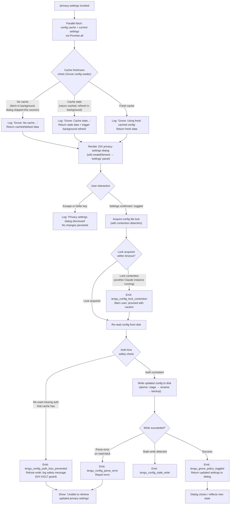

# `/privacy-settings`

> Analysis basis: CC v2.1.157 bundle.js (AST extraction + Claude interpretation)
> Minimum version: v2.1.157

---

## Overview

`/privacy-settings` opens an interactive JSX dialog that displays the user's current privacy configuration and allows them to toggle Grove (telemetry/policy) settings. The command resolves the current configuration from a cache-aware config reader, renders a settings panel, and persists any changes back to the global config file under a file lock. It fires a `tengu_grove_policy_toggled` telemetry event when the user commits a change.

---

## Registration

| Field | Value |
|---|---|
| type | `local-jsx` |
| name | `privacy-settings` |
| description | `View and update your privacy settings` |
| loc_byte | `12163401` |
| loc_byte_end | `12163593` |
| loc_line | `8026` |
| module_id | `cc1` |
| load_inline | `true` |
| arbor_handler.name | `sL5` |
| arbor_handler.fqn | `claude-2.1.157::sL5` |
| arbor_handler.kind | `AsyncFunction` |
| arbor_handler.resolution_path | `module_id` |
| arbor_handler.n_hits | `0` |

Analysis basis: CC v2.1.157 bundle.js:+12163401

---

## Input Branching

The command involves 4+ distinct paths depending on config cache freshness, user interaction (escape/defer vs. confirm), and the outcome of the config write. A Mermaid flowchart is used.



---

## Behavioral Spec

### 1. Command Entry Point — `privacySettingsHandler` (sL5)

The async handler `sL5` is the main entry point resolved by Arbor via the `module_id` path.

```
async function privacySettingsHandler(context):
    # Step 1: parallel initialization
    [configData, currentSettings] = await Promise.all([
        fetchGroveConfig(),      # Ja → sjH
        fetchCurrentSettings()   # (inline)
    ])

    # Step 2: register escape/defer key bindings
    registerKeyBinding("escape", onDismiss)
    registerKeyBinding("defer",  onDismiss)

    # Step 3: handle dismissal
    function onDismiss():
        log("Privacy settings dialog dismissed")
        return

    # Step 4: render JSX settings panel
    element = createElement("settings", {
        config: configData,
        onSave: savePrivacySettings
    })
    return element
```

Analysis basis: CC v2.1.157 bundle.js:+12162405, +12162445, +12162458, +12162568, +12162582, +12162593, +12163048

---

### 2. Grove Config Reader — `groveConfigReader` (OoH)

Implements a cache-aware config fetch with three freshness branches:

```
function groveConfigReader():
    # Branch A: no cache present
    if not cacheExists():
        log("Grove: No cache, fetching config in background (dialog skipped this session)")
        triggerBackgroundFetch()
        return defaultConfig()

    # Branch B: cache is stale
    if isCacheStale():
        log("Grove: Cache stale, returning cached data and refreshing in background")
        triggerBackgroundFetch()
        return cachedConfig()

    # Branch C: fresh cache
    log("Grove: Using fresh cached config")
    return cachedConfig()
```

Analysis basis: CC v2.1.157 bundle.js:+6890015, +6890017, +6890097, +6890137, +6890243

---

### 3. Config File Reader with Parse Safety — `configFileReader` (szH)

Reads the on-disk config file with guarded access:

```
function configFileReader(configPath):
    if not accessAllowed():
        throw Error("Config accessed before allowed.")   # guard at +3209922

    try:
        raw = fs.readFileSync(configPath, "utf-8")       # encoding: "utf-8" at +3210005
        return JSON.parse(raw)
    catch err:
        if err.code == "ENOENT":                         # +3210152
            return defaultConfig()
        if err.code == "error":                          # +3210473
            emit("tengu_config_parse_error")
            return null
```

Analysis basis: CC v2.1.157 bundle.js:+3209916, +3209922, +3209978, +3210005, +3210025, +3210152, +3210553

---

### 4. Config Write with Lock and Auth-Loss Guard — `saveConfigWithLock` (AY_)

```
async function saveConfigWithLock(updates):
    ensureParentDirExists(configPath)   # mkdirSync

    lockAcquired = acquireLock(timeout=60000)             # 60 s limit at +3208659
    if not lockAcquired within expected time:
        log("Lock acquisition took longer than expected - another Claude instance may be running")
        emit("tengu_config_lock_contention")              # +3207978

    try:
        reread = configFileReader(configPath)
        cachedHasAuth = cacheHasAuthField()

        # Auth-loss safety guard (GH #3117)
        if cachedHasAuth and not reread.hasAuth():
            log("saveConfigWithLock: re-read config is missing auth that cache has; refusing to write…")
            emit("tengu_config_auth_loss_prevented")      # +3208457
            return FAILURE

        # Detect stale write
        if isStaleWrite(reread):
            emit("tengu_config_stale_write")              # +3208114

        # Atomic write: stage → rename, with backup rotation (keep 5 backups)
        stagingPath = configPath + ".staging"             # ".staging" at +15190327
        write(stagingPath, merge(reread, updates))
        rotateBakFiles(maxBackups=5)                      # 5 at +3208908
        fs.rename(stagingPath, configPath)

        # Rotate old backups — filenames contain ".backup." marker
        pruneOldBackups(prefix=".backup.", keepCount=5)   # ".backup." at +3208775

    finally:
        releaseLock()
```

Analysis basis: CC v2.1.157 bundle.js:+3207805, +3207889, +3207978, +3208054, +3208114, +3208267, +3208289, +3208305, +3208457, +3208574, +3208659, +3208775, +3208882, +3209026

---

### 5. Policy Toggle and Save — `savePrivacySettings` (mS9)

```
async function savePrivacySettings(newPolicyState):
    # Resolve current settings from Grove cache
    currentConfig = groveConfigReader()

    # Apply updated policy fields
    merged = merge(currentConfig, newPolicyState)

    # Persist
    result = await saveConfigWithLock(merged)

    if result == FAILURE:
        showError("Unable to retrieve updated privacy settings")   # +12162719
        return

    # Emit policy-toggled telemetry
    emit("tengu_grove_policy_toggled")                             # +12162941

    # Rebuild config state for display
    updatedDisplay = buildDisplayState(merged)
    return updatedDisplay
```

Analysis basis: CC v2.1.157 bundle.js:+6890333, +6890389, +6890441, +6890476, +6890587, +12162719, +12162941

---

### 6. Global Config Fallback Guard — `saveGlobalConfigFallback` (z8)

A secondary save path with its own auth-loss guard:

```
function saveGlobalConfigFallback(updates):
    reread = configFileReader(globalConfigPath)

    if cacheHasAuth() and not reread.hasAuth():
        log("saveGlobalConfig fallback: re-read config is missing auth that cache has; refusing to write. See GH #3117.")
        return FAILURE

    # Classify config installation state for telemetry context
    state = classifyInstallState()
    # Possible values: "unknown", "local", "migrated", "native",
    #                  "installed", "disabled", "enabled",
    #                  "no_permissions", "global", "not_configured"

    write(globalConfigPath, merge(reread, updates))
```

Config state values documented at: CC v2.1.157 bundle.js:+3205571, +3205633, +3205646, +3205664, +3205678, +3205697, +3205723, +3205737, +3205758, +3205777

Analysis basis: CC v2.1.157 bundle.js:+3205027, +3205092, +3205118, +3205244, +3205358

---

### 7. API Key Handling in Settings Context — `apiKeyResolver` (EY)

When rendering settings, the API key environment variable is inspected:

```
function apiKeyResolver(settingsContext):
    apiKeyEnv = process.env["ANTHROPIC_API_KEY"]     # literal at +2942627
    helperKey  = settingsContext["apiKeyHelper"]      # literal at +2942652

    if apiKeyEnv is set:
        masked = maskKey(apiKeyEnv)                  # value replaced with "[REDACTED]" at +196276
        return { source: "env", masked }
    elif helperKey is set:
        return { source: "helper", masked: "[REDACTED]" }
    else:
        return { source: null }
```

Account plan tiers visible in this context: `"max"` (at +2964178), `"pro"` (at +2964189).

Analysis basis: CC v2.1.157 bundle.js:+2942347, +2942445, +2942627, +2942652, +2964178, +2964189

---

### 8. Transcript / Log Writer — `transcriptLogWriter` (lCK)

Used by the settings dialog to persist an audit log entry after a policy change:

```
async function transcriptLogWriter(entry):
    logDir = path.dirname(logPath)
    ensureDir(logDir)                                  # gI.mkdir

    if byteSize(entry) > threshold:
        await rotateLogs()                             # QYA: stat → endsWith(".txt") → rename → unlink
        # Rotation: renames current log, slices 4 trailing chars (+203143)
        # Keeps last N entries; ".txt" extension trimmed (+203121, +203143)

    await gI.appendFile(logPath, serialize(entry))

    # Debounced flush
    scheduleFlush(debounceMs=1000, maxBatch=100)       # 1000 ms at +58160, 100 at +58181
    registerCleanupHook(K9 → _OA.register)
```

Analysis basis: CC v2.1.157 bundle.js:+203663, +203696, +203726, +203833, +203865, +203871, +203904, +58160, +58181, +58858, +203017, +203121, +203143, +203173

---

## State & Side Effects

| Item | Detail |
|---|---|
| Telemetry: `tengu_grove_policy_toggled` | Fired when the user successfully saves a privacy/Grove policy change (bundle.js:+12162941) |
| Telemetry: `tengu_config_parse_error` | Fired when the on-disk config JSON fails to parse on read-back (bundle.js:+3210553) |
| Telemetry: `tengu_config_lock_contention` | Fired when the config file lock takes longer than expected, indicating a concurrent Claude instance (bundle.js:+3207978) |
| Telemetry: `tengu_config_stale_write` | Fired when a stale-write condition is detected before persisting (bundle.js:+3208114) |
| Telemetry: `tengu_config_auth_loss_prevented` | Fired when writing is aborted to prevent overwriting auth credentials (bundle.js:+3208457) |
| Hook registration | `K9` registers a cleanup/exit hook via `_OA.register` (bundle.js:+58858) |
| Config file changes | Updated privacy/Grove policy fields are written atomically to the global config (`~/.claude.json`) using a `.staging` intermediate file and backup rotation |
| Backup files | Up to 5 `.backup.*` files are retained beside the config file; older ones are pruned (bundle.js:+3208775, +3208908) |
| Key binding | `escape` and `defer` keys are registered for dialog dismissal; no config change is written on dismiss (bundle.js:+12162568, +12162582) |
| Log / transcript | An audit log entry is appended via `gI.appendFile` with debounced flushing (1 000 ms debounce, 100-entry batch cap) |
| Sound | <!-- TODO: not found in depth-2 traversal; needs --depth 4 --> |
| appState changes | <!-- TODO: not found in depth-2 traversal; needs --depth 4 --> |

---

## Version History

| Version | Change |
|---|---|
| v2.1.157 | Initial analysis |

---

## Common Mistakes

1. **Dismissing with Escape loses changes silently.** Pressing `Escape` or triggering `defer` closes the dialog immediately without writing any state. Users who expect dismissal to save must explicitly confirm the settings panel.

2. **Concurrent Claude instances cause lock contention.** If another Claude process is running and holds the config lock, the write will be delayed and a `tengu_config_lock_contention` event will fire. The write still proceeds after the delay, but the warning should not be ignored — it may indicate data races.

3. **Auth-loss guard may silently refuse to write.** If the in-memory cache contains auth credentials that are absent from the on-disk file at write time, the save is aborted (GH #3117 guard). This is a safety measure, but it means the privacy settings change is discarded. Users should check for the "Unable to retrieve updated privacy settings" message (bundle.js:+12162719).

4. **Config accessed before initialization.** Calling into the config subsystem before the access guard is satisfied raises `"Config accessed before allowed."` (bundle.js:+3209922). This can surface if the command is invoked very early during startup.

5. **Log rotation truncates `.txt` extension by 4 characters.** The log rotation logic uses a hard-coded slice of 4 characters to strip the `.txt` extension (bundle.js:+203143). Custom log filenames that do not end in `.txt` will be incorrectly renamed.

---

## Appendix — Identifier Mapping

> For bundle debugging only. Identifiers change across versions.

| Identifier | Role |
|---|---|
| `sL5` | Main async handler for `/privacy-settings` (Arbor-resolved entry point) |
| `OoH` | Grove config reader — cache freshness dispatcher |
| `SHH` | Settings resolution helper called by Grove config reader |
| `f1` | Inner settings builder (calls API-key resolver and account-plan utilities) |
| `Yq_` | Sub-helper called from settings builder (purpose: config field extraction) |
| `zq_` | Sub-helper called from settings builder (purpose: config field extraction) |
| `EY` | API key / account-plan resolver; references `ANTHROPIC_API_KEY` and `apiKeyHelper` |
| `WA` | Array-based settings validator / include-check helper |
| `YR` | Array inclusion checker (`Array.isArray` + `H.includes`) |
| `wyq` | Auxiliary helper in settings resolution chain |
| `_7` | Secondary dispatcher in OoH call chain |
| `S6` | Config file-watch bootstrapper (sets up `b17` watcher) |
| `g6` | Path / directory utility (used across config read/write) |
| `sz_` | Config serialization / schema helper |
| `szH` | Low-level config file reader (readFileSync, ENOENT/EEXIST handling) |
| `b17` | File watcher registration/deregistration (`z_8.watchFile` / `z_8.unwatchFile`) |
| `N` | Telemetry/logging dispatcher (debug level, UUID generation, redaction) |
| `QCK` | Telemetry channel/queue manager |
| `qOA` | Telemetry sub-dispatcher (`QhK`, `dhK`) |
| `H` | General utility object / string helper (also used for random/timeout in some edges) |
| `RH` | JSON serializer wrapper (`JSON.stringify`) |
| `_` | String utility (toUpperCase, toLowerCase contexts) |
| `v4` | UUID / identifier generator (`uYA` → character map, `H.replace`) |
| `uYA` | UUID character-map builder (`mCK.map`) |
| `q` | Filesystem namespace (various sync fs calls) |
| `A` | Path / string utility (lastIndexOf, slice, toLowerCase) |
| `EuH` | Output writer helper (`VYA` → `H.write`) |
| `VYA` | Terminal / stream write wrapper |
| `lCK` | Transcript / audit-log writer (append, rotate, debounce, cleanup hook) |
| `rxH` | Debounced log flush scheduler (clearTimeout, setTimeout, setImmediate) |
| `M$H` | Log flush commit helper (`BYA`, `N0H.join`, `F8`, `k6`) |
| `qK6` | Log entry serializer (`j8`) |
| `dYA` | Log path resolver (`N0H.join`, `k6`) |
| `QYA` | Log rotation handler (`gI.stat`, endsWith `.txt`, rename, unlink) |
| `cCK` | Log append worker (`gI.mkdir`, `gI.appendFile`, rotate, byte-length check) |
| `K9` | Cleanup / exit-hook registrar (`_OA.register`) |
| `mS9` | Policy-toggle save orchestrator; emits `tengu_grove_policy_toggled` |
| `z8` | Global config save entry point (lock, re-read, auth-loss guard, write) |
| `AY_` | Locked config write implementation (atomic stage→rename, backup rotation) |
| `pQH` | Config merge / patch helper |
| `IFq` | Object-entries iterator helper |
| `UQH` | Timestamp-based staleness checker (`Date.now`) |
| `AY6` | Config schema validator or default-filler |
| `d` | General data/state container or config default object |
| `_Y_` | Fallback config writer (dirname, D0, RH, yL6) |
| `M` | Plugin/temp-directory cleanup helper (`cS6`, `f.has`, `A0.rm`) |
| `cS6` | Plugin path resolver (replace, toLowerCase, `.staging`, reserved-path check) |
| `lS6` | Plugin directory path builder (`RI.join`, `plugins`, `synced`) |
| `L` | Async task/lock set manager (`q.add`, `q.delete`, `f.finally`) |
| `f` | Resource-close finalizer (`A.close`, `q.close`) |

---

Note: index built via Arbor fallback; some signals (telemetry, literals) may be missing — see arbor-fallback.js.