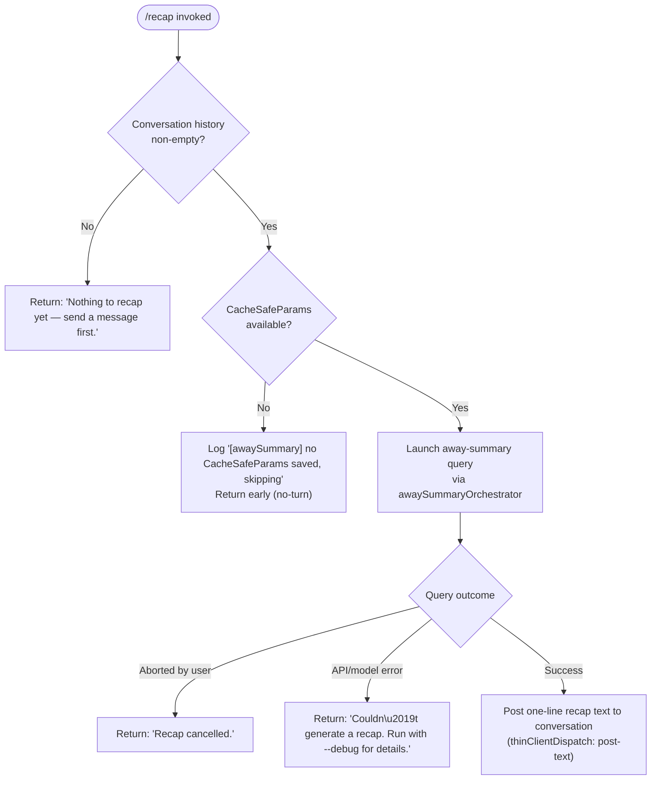

# `/recap`

> Analysis basis: CC v2.1.158 bundle.js (AST extraction + Claude interpretation)
> Minimum version: v2.1.158

---

## Overview

`/recap` triggers an immediate on-demand generation of a single-line session summary ("away summary") using the underlying agent query pipeline. It is intended for users who want a compact recap of what has happened in the current session without waiting for the automatic background summarisation cycle. The command delegates to the same async away-summary infrastructure (`PD5` → `Bf8`) used by the periodic recap mechanism, but fires it explicitly on user request.

---

## Registration

| Field | Value |
|---|---|
| type | `local` |
| name | `recap` |
| description | `Generate a one-line session recap now` |
| loc_byte | `12675287` |
| loc_byte_end | `12675503` |
| loc_line | `8798` |
| supportsNonInteractive | `false` |
| thinClientDispatch | `post-text` |
| load_inline | `true` |
| load_ident | `PD5` |
| arbor_handler.name | `PD5` |
| arbor_handler.kind | `AsyncFunction` |
| arbor_handler.resolution_path | `load_ident` |
| arbor_handler.fqn | `claude-2.1.158::PD5` |
| arbor_handler.n_hits | `0` |

Analysis basis: CC v2.1.158 bundle.js:+12675287

The handler was inlined as a `load:()=>Promise.resolve({call: PD5})` shape. Arbor resolved it via the `load_ident` path. `PD5` is therefore treated as the command's main handler in this spec.

---

## Input Branching

The command produces four distinct outcome branches based on session state and the result of the away-summary call.



Analysis basis: CC v2.1.158 bundle.js:+12675037, +12675129, +12675187, +5389258, +5389316

---

## Behavioral Spec

### Handler Entry Point — `recapCommandHandler` (`PD5`)

```
async function recapCommandHandler(commandArgs, context):
    result = await awaySummaryOrchestrator(context)
    return result
```

Analysis basis: CC v2.1.158 bundle.js:+12674895

`recapCommandHandler` is an `AsyncFunction`. Its sole action is to delegate to the away-summary orchestration layer (`Bf8`). No arguments from the user input are forwarded — the command takes no parameters.

---

### Away-Summary Orchestration — `awaySummaryOrchestrator` (`Bf8`)

```
async function awaySummaryOrchestrator(context):

    // 1. Guard: require existing conversation history
    cacheSafeParams = getCacheSafeParams(context)
    if cacheSafeParams is null:
        log.debug("[awaySummary] no CacheSafeParams saved, skipping")
        return { type: "no-turn" }

    // 2. Set up AbortController for user cancellation
    abortController = new AbortController()
    context.addEventListener("abort", () => abortController.abort())

    // 3. Invoke the agent query pipeline
    queryResult = await agentQueryPipeline(
        params        = cacheSafeParams,
        abortSignal   = abortController.signal,
        toolPolicy    = "deny",           // tools are not permitted
        threadLabel   = "away_summary",
    )

    // 4. Branch on query outcome
    match queryResult.status:
        "aborted":
            return { text: "Recap cancelled." }
        "api-error":
            return { text: "Couldn't generate a recap. Run with --debug for details." }
        "ok":
            return { text: queryResult.summaryLine }
```

Analysis basis: CC v2.1.158 bundle.js:+5389237, +5389258, +5389316, +5389353, +5389372, +5389549, +5389564, +5389632, +5389776, +5389865, +5389926

Key observations:
- The string `"[awaySummary] no CacheSafeParams saved, skipping"` is emitted at debug level when the session has no saved parameters (bundle.js:+5389258).
- The literal `"no-turn"` is the early-exit return value (bundle.js:+5389316).
- The abort listener fires on the `"abort"` event (bundle.js:+5389372).
- Tool use is explicitly denied for this sub-query: `"Away summary cannot use tools"` is the user-visible message if tools are somehow requested (bundle.js:+5389564).
- The thread is labelled `"away_summary"` (bundle.js:+5389632).
- The three user-visible outcome strings are fixed literals (bundle.js:+12675037, +12675129, +12675187).

---

### Guard: No Conversation History

```
function checkConversationReady(context):
    if context.messages is empty:
        return "Nothing to recap yet — send a message first."
    else:
        return null   // proceed
```

Analysis basis: CC v2.1.158 bundle.js:+12675037

This guard runs before any API call is attempted. If the session has produced no turns, the command exits immediately with the user-facing string without consuming any tokens.

---

### Away-Summary Query Pipeline — `agentQueryPipeline` (`d0` / `s08` / `WlL`)

The query pipeline that backs `/recap` is the same general-purpose agent loop used for normal turns. For the recap use-case its notable properties are:

```
async function agentQueryPipeline(params, abortSignal, threadLabel):

    // Record start timestamp
    startTime = Date.now()

    // Initialise session state snapshot
    appState = getAppState()
    sessionId = NV1.randomUUID()

    // Build request, label thread
    request = buildRequest(params, threadLabel="away_summary")

    // Run the core query loop (WlL)
    outcome = await coreQueryLoop(request, abortSignal)

    // Persist updated app state
    setAppState(mergedState)

    return outcome
```

Analysis basis: CC v2.1.158 bundle.js:+10677191, +10677503, +10674705, +10675485, +10675584, +10676586

The core loop (`WlL`) is the main agentic turn engine. For `/recap` it is invoked with tool use denied (no tool registrations are passed in), ensuring the model only returns text.

---

### Conversation Log Persistence — `conversationLogger` (`rCK`)

After the summary text is produced, the away-summary result is persisted via the standard conversation log writer:

```
async function conversationLogger(entry, logDir):
    filePath = path.join(logDir, logFileName)
    byteLength = Buffer.byteLength(entry)

    if logFile does not exist:
        mkdir(logDir, { recursive: true })
        appendFile(filePath, entry)
    else:
        rotateIfNeeded(filePath)   // cYA: rename / unlink old .txt files
        appendFile(filePath, entry)

    registerCleanupHook(filePath)  // q9 → qOA.register
```

Analysis basis: CC v2.1.158 bundle.js:+203663, +203696, +203726, +203816, +203865, +203871, +203904, +203930, +204026

- File rotation checks for `.txt` suffix (bundle.js:+203121) and trims to the last 4 lines on overflow (bundle.js:+203143).
- `Buffer.byteLength` is used to calculate the byte size before append (bundle.js:+203871).
- A cleanup hook is registered via `qOA.register` (bundle.js:+58858) to handle process-exit cleanup.

---

### `thinClientDispatch: "post-text"` Behaviour

Because the registration sets `thinClientDispatch` to `"post-text"`, in thin-client mode the generated recap line is posted directly as a text message into the conversation view rather than being rendered through the full streaming pipeline. This means:
- The recap appears as a discrete assistant message.
- No streaming indicators are shown.
- The text is already fully formed before posting.

---

## State & Side Effects

| Item | Detail |
|---|---|
| Telemetry | See full list below |
| Tool policy | Tools explicitly denied for the recap sub-query (`"deny"` / `"Away summary cannot use tools"`) |
| AbortController | Created per invocation; wired to the parent context `"abort"` event |
| appState changes | `getAppState` / `setAppState` called around the query loop; session state is read and written back |
| Conversation log | Recap result appended to on-disk log via `conversationLogger` (`rCK`); directory created if absent |
| Log rotation | `.txt` files renamed/unlinked when size threshold exceeded (4-line trim) |
| Cleanup hook | `qOA.register` called to register file-handle cleanup on process exit |
| UUID generation | `NV1.randomUUID()` called to assign a session ID for the recap turn |
| supportsNonInteractive | `false` — cannot be used in `--print` / non-interactive mode |

### Telemetry Events (reachable from `/recap` call graph)

| Event | loc_byte |
|---|---|
| `tengu_auto_compact_rapid_refill_breaker` | +10637458 |
| `tengu_auto_compact_succeeded` | +10637919 |
| `tengu_ptl_surfaced_to_user` | +10639886 |
| `tengu_refusal_fallback_triggered` | +10642500 |
| `tengu_orphaned_messages_tombstoned` | +10643055 |
| `tengu_model_fallback_triggered` | +10645766 |
| `tengu_query_error` | +10646430 |
| `tengu_model_response_keyword_detected` | +10647074 |
| `tengu_malformed_tool_use_response` | +10650422 |
| `tengu_stop_hook_block_count` | +10651376 |
| `tengu_loop_dynamic_wakeup_ends_turn` | +10654749 |
| `tengu_post_autocompact_turn` | +10654916 |
| `tengu_query_before_attachments` | +10655030 |
| `tengu_query_after_attachments` | +10657348 |
| `tengu_mcp_tools_refreshed_mid_turn` | +10657651 |
| `tengu_feature_ok` | +966033 |
| `tengu_feature_bad` | +966091 |
| `tengu_forked_agent_default_turns_exceeded` | +10678726 |
| `tengu_fork_agent_query` | +10679169 |

Note: these events are inherited from the shared query pipeline (`WlL` / `d0`). Not all will fire on every `/recap` execution; they depend on the model response and runtime conditions encountered during the single-turn recap query.

---

## Version History

| Version | Change |
|---|---|
| v2.1.158 | Initial analysis |

---

## Common Mistakes

1. **Running `/recap` before sending any message.** The command returns `"Nothing to recap yet — send a message first."` and does nothing. At least one user turn must exist in the session.
2. **Expecting `/recap` in non-interactive (`--print`) mode.** `supportsNonInteractive` is `false`; the command is silently unavailable in that mode.
3. **Expecting tool use during recap.** The sub-query that generates the recap explicitly denies all tool access. Any model attempt to call a tool is blocked with `"Away summary cannot use tools"`.
4. **Assuming recap output is streamed.** The `thinClientDispatch: "post-text"` setting means the recap is posted as a complete text block, not streamed token-by-token.
5. **Confusing `/recap` with automatic session summaries.** The command fires the same infrastructure but is user-triggered and immediate, whereas the automatic away-summary runs on a background schedule. They share the `"away_summary"` thread label and the same persistence path.

---

## Appendix — Identifier Mapping

> For bundle debugging only. Identifiers change across versions.

| Identifier | Role |
|---|---|
| `PD5` | `recapCommandHandler` — async entry point for `/recap`; registered via `load_ident` |
| `Bf8` | `awaySummaryOrchestrator` — orchestrates the away-summary query, guards on CacheSafeParams, branches on outcome |
| `p8H` | `getCacheSafeParams` — retrieves saved cache-safe parameters from session context |
| `N` | `buildAgentRequest` — constructs the agent request object for the query pipeline |
| `lCK` | `requestBuilder` — lower-level request construction helper called by `N` |
| `LOA` | `requestFieldAssembler` — assembles individual request fields |
| `RH` | `jsonStringifyHelper` — wraps `JSON.stringify` |
| `v4` | `uuidGenerator` — generates UUIDs, used for session/turn IDs |
| `pYA` | `uuidByteMapper` — maps byte arrays for UUID construction |
| `EuH` | `streamWriter` — writes to output stream |
| `NYA` | `streamWriteHelper` — wraps `H.write` for stream output |
| `rCK` | `conversationLogger` — handles on-disk conversation log append and rotation |
| `rxH` | `logFlushScheduler` — manages timed log flushing with `setTimeout`/`setImmediate` |
| `M$H` | `logEntryFormatter` — formats log entries before writing |
| `KK6` | `directoryEnsure` — ensures log directory exists |
| `lYA` | `logPathResolver` — resolves the full log file path via `path.join` |
| `cYA` | `logRotator` — renames/unlinks `.txt` log files when rotation threshold is hit |
| `iCK` | `logAppendWithRotation` — mkdir + appendFile + rotation + byte-length check |
| `q9` | `cleanupHookRegistrar` — registers process-exit cleanup hooks via `qOA.register` |
| `d0` | `forkAgentQuery` — top-level forked agent query dispatcher |
| `s08` | `agentSessionSetup` — initialises session state, UUID, and app-state snapshot |
| `Ah` | `abortControllerSetup` — wires abort signals and binds callbacks |
| `P7H` | `sessionDumpLoad` — loads and dumps session parameters |
| `_DH` | `sessionParamsMerger` — merges session parameters |
| `Bf9` | `sessionInitialiser` — secondary session initialisation step |
| `f` | `sessionCloser` — closes A/q handles on session teardown |
| `EE8` | `sessionStateExtended` — extended session state setup |
| `Jh` | `randomBytesHelper` — generates random bytes (8 bytes, hex-encoded) |
| `t08` | `agentTurnSetup` — sets up per-turn state |
| `VAH` | `agentQueryDispatcher` — dispatches the query to the core loop |
| `U4` | `queryCleanupRegistrar` — registers query-level cleanup |
| `RSH` | `anthropicMessageFilter` — filters messages by provider `"ant"` |
| `Om` | `coreQueryEntrypoint` — entry into the main query loop machinery |
| `WlL` | `coreQueryLoop` — the main agentic turn loop (model call, tool execution, compaction) |
| `tM8` | `subagentSessionManager` — manages subagent session lifecycle |
| `hH` | `featureOkReporter` — reports `tengu_feature_ok` telemetry |
| `bH` | `featureBadReporter` — reports `tengu_feature_bad` telemetry |
| `bv6` | `toolUseSummaryChecker` — checks `OQL` set for tool-use summary state |
| `rAH` | `postTurnProcessor` — post-turn processing step |
| `MV8` | `turnMetricsRecorder` — records per-turn metrics |
| `CT1` | `continuationChecker` — checks continuation conditions using `bv6` |
| `D` | `messagePushQueue` — queues messages for dispatch |
| `G6` | `messageQueueWorker` — processes message queue entries |
| `$` | `disposableResource` — a disposable/lifecycle-managed resource |
| `By8` | `lowMemoryLogger` — logs `tengu_bg_low_mem_mb` and invokes `G6` |
| `wfA` | `bgPtyHostSpawner` — spawns background PTY host processes via `Bun.spawn` |
| `d` | `debugLogger` — emits debug-level log messages |
| `Iz` | `internalSerializer` — internal data serialiser |
| `J8` | `fileSystemEnsure` — filesystem ensure-exists helper |
| `SH` | `errorLogHandler` — handles and logs errors via `Vi.logError` |
| `e7H` | `pendingMessageTracker` — tracks pending messages with filter/push |
| `Vj` | `messageValidator` — validates individual messages |
| `Jr7` | `messageFinder` — finds a message matching a predicate |
| `L` | `promiseTracker` — tracks promise lifecycle with `add`/`delete`/`finally` |
| `hlL` | `forkAgentTurnHelper` — helper for forked agent turn setup |
| `E8` | `randomUUIDAssigner` — assigns `Iv.randomUUID()` for turn tracking |
| `X` | `ipcSocketReader` — reads from IPC/socket buffers |
| `J` | `socketDataEmitter` — emits socket data events |
| `w` | `bgSessionWorker` — manages background session worker lifecycle |
| `Qf` | `socketFrameWriter` — writes framed data to socket |
| `FB5` | `bgPtyMessageRouter` — routes PTY/IPC messages to handlers |
| `EH` | `stringCoercer` — coerces values to `String` |
| `MP9` | `messagePostProcessor` — post-processes messages via `flatMap` |
| `g6` | `logContextBuilder` — builds logging context object |

---

Note: index built via Arbor fallback; some signals (telemetry, literals) may be missing — see arbor-fallback.js.