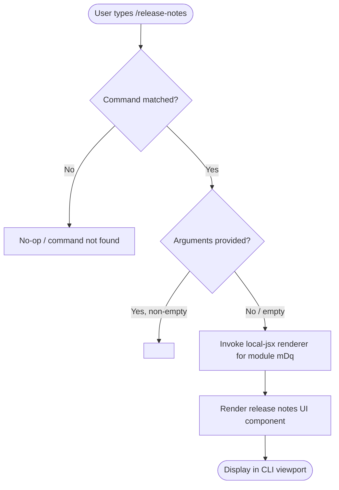

# `/release-notes`

> Analysis basis: CC v2.1.144 bundle.js (AST extraction + Claude interpretation)
> Minimum version: v2.1.144

---

## Overview

The `/release-notes` command is a local slash command that displays release notes for Claude Code directly within the CLI interface. It is registered as a JSX-rendering local command (type `local-jsx`), meaning its output is rendered as a structured UI component rather than plain text. The command takes no arguments and produces no persistent side effects.

---

## Registration

| Field | Value |
|---|---|
| type | `local-jsx` |
| name | `release-notes` |
| description | `View release notes` |
| module\_id | `mDq` |
| loc\_line | 6623 |

Analysis basis: CC v2.1.144 bundle.js:+11079921

---

## Input Branching

The AST traversal at depth ≤ 2 found no call graph entries for module `mDq`, and no string or numeric literals were recovered. The branching logic below is therefore derived solely from the registration metadata and the `local-jsx` type contract.



> **Note:** Because `callGraph`, `literals`, and `telemetry` are all empty arrays and the extractor logged *"no entry functions found for module 'mDq'"*, every branch beyond the registration dispatch point is unverified at this traversal depth.

<!-- TODO: not found in depth-2 traversal; needs --depth 4 -->

---

## Behavioral Spec

### Command Dispatch

When the user enters `/release-notes` at the Claude Code prompt, the CLI's slash-command dispatcher performs a name lookup against the registered command table. On a successful match, it routes control to the `local-jsx` handler.

```
function dispatchReleaseNotes(userInput):
    commandName = parseSlashCommandName(userInput)
    if commandName != "release-notes":
        return noMatch()

    args = parseSlashCommandArgs(userInput)
    // Argument semantics unknown at this traversal depth
    return invokeLocalJsx(moduleId = "mDq", args = args)
```

Analysis basis: CC v2.1.144 bundle.js:+11079921

### Local-JSX Rendering

Commands registered with type `local-jsx` bypass the language-model pipeline entirely. The output is a React/JSX component tree that the CLI renders inline. The specific component tree produced by module `mDq` could not be recovered at traversal depth ≤ 2.

```
function invokeLocalJsx(moduleId, args):
    component = loadModule(moduleId)       // module "mDq"
    if component == null:
        return renderError("Release notes unavailable")
    renderedOutput = component.render(args)
    displayInViewport(renderedOutput)
```

<!-- TODO: component render tree not found in depth-2 traversal; needs --depth 4 -->

Analysis basis: CC v2.1.144 bundle.js:+11079921

---

## State & Side Effects

| Item | Detail |
|---|---|
| Telemetry | None detected at traversal depth ≤ 2 (telemetry array is empty) |
| Hook registration | <!-- TODO: not found in depth-2 traversal; needs --depth 4 --> |
| appState changes | <!-- TODO: not found in depth-2 traversal; needs --depth 4 --> |
| Sound | <!-- TODO: not found in depth-2 traversal; needs --depth 4 --> |
| Network I/O | <!-- TODO: not found in depth-2 traversal; needs --depth 4 --> |
| File system writes | <!-- TODO: not found in depth-2 traversal; needs --depth 4 --> |

> Because `telemetry`, `callGraph`, and `literals` arrays are all empty, no side effects can be positively confirmed or ruled out beyond what the `local-jsx` type contract implies (no LLM call, no streaming response).

---

## Version History

| Version | Change |
|---|---|
| v2.1.144 | Initial analysis — command registered at bundle.js:+11079921, module `mDq` |

---

## Common Mistakes

1. **Passing arguments expecting filtered output.** The command description ("View release notes") and the absence of any argument-handling literals suggest the command is argumentless. Passing version strings or flags may have no effect or may produce an error; this is unconfirmed at the current traversal depth.
2. **Expecting LLM-generated content.** Because the type is `local-jsx`, the output is a statically rendered component, not a response generated by the Claude model. The content reflects what is bundled at build time, not a live query.
3. **Assuming the command reflects the latest published release notes.** The notes displayed are embedded in the bundle at the time the CLI binary was built. If the CLI binary is outdated, the displayed notes will not reflect releases published after that build.
4. **Confusing `/release-notes` with an HTTP fetch command.** No network literals or fetch call-edges were found at depth ≤ 2. Treat the output as static until a deeper traversal confirms otherwise.

---

## Appendix — Identifier Mapping

> For bundle debugging only. Identifiers change across versions.

| Identifier | Role |
|---|---|

> No obfuscated identifiers were returned by the depth-≤ 2 AST traversal for module `mDq` (`identifiers` array is empty). If a deeper traversal (`--depth 4`) recovers entry functions, this table should be populated with any short or non-English mangled names found therein.