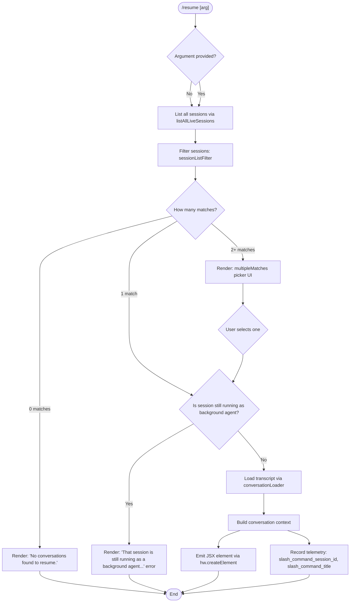

# `/resume`

> Analysis basis: CC v2.1.158 bundle.js (AST extraction + Claude interpretation)
> Minimum version: v2.1.158

---

## Overview

The `/resume` command (aliased as `/continue`) allows a user to re-enter a previous Claude Code conversation by specifying a conversation ID or a fuzzy search term. It queries live session data, validates session state, and either reattaches to an existing running session or loads the historical transcript into the current context.

---

## Registration

| Field | Value |
|---|---|
| type | `local-jsx` |
| name | `resume` |
| description | `Resume a previous conversation` |
| aliases | `["continue"]` |
| argumentHint | `[conversation id or search term]` |
| module_id | `FF1` |
| load_inline | `true` |
| loc_byte | `11908910` |
| loc_byte_end | `11909107` |
| loc_line | `7702` |
| arbor_handler.name | `cK5` |
| arbor_handler.fqn | `claude-2.1.158::cK5` |
| arbor_handler.kind | `AsyncFunction` |
| arbor_handler.resolution_path | `module_id` |
| arbor_handler.n_hits | `0` |

Analysis basis: CC v2.1.158 bundle.js:+11908910

---

## Input Branching

There are 5+ distinct execution paths (no argument, exact ID match, ambiguous search matches, background session running, no conversations found), so a Mermaid flowchart is required.



Analysis basis: CC v2.1.158 bundle.js:+11907398, +11907428, +11907502, +11907512, +11907947

---

## Behavioral Spec

### 1. Session Discovery and Filtering (`sessionListFilter` / `BF1`)

When the command is invoked, a session filter function is applied to the list of all live sessions.

```
function sessionListFilter(sessions, searchTerm):
    filtered = sessions.filter(session => matchesSearchTerm(session, searchTerm))
    return filtered
```

- Calls `H.filter` to narrow the full session list.
- Calls `z$` (a secondary filter/sort utility) on the result.

Analysis basis: CC v2.1.158 bundle.js:+11907398, +11907428

---

### 2. Main Handler (`resumeCommandHandler` / `cK5`)

The primary async handler, resolved via Arbor through `module_id` → `FF1` → `cK5`.

```
async function resumeCommandHandler(args, appState):
    sessions = await sessionStore.listAllLiveSessions()   // D5H
    
    filteredSessions = sessionListFilter(sessions, args.input)
    
    if filteredSessions.length === 0:
        return renderNoConversationsFound()               // literal: "No conversations found to resume."
    
    if filteredSessions.length > 1:
        selectedSession = await renderMultiMatchPicker(filteredSessions)  // multipleMatches UI
    else:
        selectedSession = filteredSessions[0]
    
    if isBackgroundAgentRunning(selectedSession):
        return renderError(BACKGROUND_AGENT_MESSAGE)      // literal: "That session is still running as a background agent..."
    
    conversationData = await conversationLoader(selectedSession.id)   // ACH
    
    contextElement = buildConversationContext(conversationData)       // SI8, ll
    
    jsxElement = hw.createElement(contextElement, {
        sessionId: selectedSession.id,      // telemetry key: slash_command_session_id
        title: selectedSession.title,       // telemetry key: slash_command_title
        timestamp: Date.now()
    })
    
    recordSlashCommandTelemetry("slash_command_session_id", selectedSession.id)
    recordSlashCommandTelemetry("slash_command_title", selectedSession.title)
    
    return jsxElement
```

Analysis basis: CC v2.1.158 bundle.js:+11907502, +11907510, +11907733, +11907762, +11907798, +11907824, +11907869, +11907887, +11908048, +11908066, +11908174, +11908186, +11908202, +11908253, +11908314, +11908333, +11908482

---

### 3. Session Store Query (`sessionStoreQuery` / `D5H`)

```
async function sessionStoreQuery():
    await Promise.resolve()
    sessions = await sessionStorage.listAllLiveSessions()
    // Filter to type: "interactive" sessions only
    return sessions.filter(s => s.type === "interactive")
```

- The string literal `"interactive"` (bundle.js:+8842916) indicates that only interactive-mode sessions are surfaced for resumption (background/daemon sessions are excluded from the candidate list at this layer).

Analysis basis: CC v2.1.158 bundle.js:+8842773, +8842803, +8842825, +8842916

---

### 4. Worktree-Aware Conversation Loader (`conversationLoader` / `ACH`)

Loads and sorts the historical conversation entries for a given session, with awareness of git worktrees.

```
async function conversationLoader(sessionId):
    timestamp = Date.now()
    worktreeInfo = runGit(["worktree", "list", "--porcelain"])   // literals: "worktree", "list", "--porcelain"
    
    // Emit telemetry: tengu_worktree_detection
    
    lines = worktreeInfo.split("\n")
    worktreeEntries = lines
        .filter(line => line.startsWith("worktree "))            // literal: "worktree " (+11904731)
        .map(line => line.slice(9))                              // literal: 9 (+11904762)
        .map(p => p.normalize("NFC"))                           // literal: "NFC" (+11904775)
    
    allEntries = loadRawConversationEntries(sessionId)
    
    exactMatch = allEntries.find(e => e.id.startsWith(sessionId))
    if exactMatch:
        return exactMatch
    
    fuzzyMatches = allEntries.filter(e => searchTermMatches(e, sessionId))
    fuzzyMatches.sort((a, b) => a.title.localeCompare(b.title))
    
    return fuzzyMatches
```

- Uses `localeCompare` for locale-aware sorting of fuzzy results.
- Emits `tengu_worktree_detection` telemetry to record git worktree context.

Analysis basis: CC v2.1.158 bundle.js:+11904468, +11904503, +11904506, +11904610, +11904693, +11904718, +11904754, +11904870, +11904889, +11904916, +11904949

---

### 5. Background-Session Guard (`backgroundAgentCheck` / inline in `cK5`)

```
function isBackgroundAgentRunning(session):
    if session.status === "running" AND session.isBackgroundAgent:
        return true
    return false

// Error message when guard triggers (bundle.js:+11907512):
// "That session is still running as a background agent. Open `claude agents`
//  to attach to it, or stop it there first to resume here."
```

- Checks that the session is not currently active as a background agent before attempting to resume it interactively.
- The message body references `claude agents` as the alternative command.

Analysis basis: CC v2.1.158 bundle.js:+11907510, +11907512

---

### 6. Conversation Context Builder (`conversationContextBuilder` / `ll`)

Builds the full in-context representation from raw transcript entries.

```
function conversationContextBuilder(sessionId, entries):
    metadata = conversationLoader(sessionId)       // ACH
    projectPath = resolveProjectPath()             // O_
    fileTree = buildFileTree()                     // Y_K
    compressedContext = compressMessages(entries)  // uCH
    
    lowercasedId = sessionId.toLowerCase()
    
    relevant = entries.filter(e => isRelevantEntry(e))
    
    if entries.includes(sessionId):
        // exact match path
        ...
    
    // Sort by recency, slice to top entries
    sorted = entries.sort(...)
    sliced = sorted.slice(...)
    
    return buildContextObject(metadata, fileTree, sliced)
```

Analysis basis: CC v2.1.158 bundle.js:+11908333, +12913467, +12913471, +12913485, +12913507, +12913527, +12913552, +12913652, +12913700, +12913718, +12913756, +12913774, +12913785, +12913800, +12913866

---

### 7. Session Picker UI for Multiple Matches (`sessionPickerRenderer` / `J5H`)

When 2 or more sessions match the search term, a JSX picker component is rendered.

```
function sessionPickerRenderer(matches, onSelect):
    // Renders a list of session summaries for user selection
    // Each entry shows: title, last-prompt snippet, timestamp
    // Keys used from session metadata:
    //   "summary", "last-prompt", "custom-title", "ai-title"
    //   "agent-name", "tag"
    
    return <SessionPicker sessions={matches} onSelect={onSelect} />
```

- Literal `"multipleMatches"` (bundle.js:+11905227) is used as a result-type discriminant.
- Literal `"sessionNotFound"` (bundle.js:+11905156) is used as the not-found discriminant.

Analysis basis: CC v2.1.158 bundle.js:+11908186, +11905156, +11905227, +12911735, +12912163

---

### 8. Telemetry Recording (`telemetryRecorder` / `pF1`)

```
function recordSlashCommandTelemetry(key, value):
    // key: "slash_command_session_id" or "slash_command_title"
    // Uses j6.bold for rendering the session title in bold in the UI
    record({ [key]: value })
```

Analysis basis: CC v2.1.158 bundle.js:+11908432, +11908482, +11905191

---

## State & Side Effects

| Item | Detail |
|---|---|
| Telemetry — `tengu_worktree_detection` | Fired during conversation loading when git worktree info is queried (bundle.js:+11904612) |
| Telemetry — `tengu_bg_spare_*` | Fired by background daemon subsystem when spare processes are managed during attach (bundle.js:+15466982, +15467342) |
| Telemetry — `tengu_bg_dispatch_sigkill_escalate` | Fired if a background session requires forceful termination (bundle.js:+15467649) |
| Telemetry — `tengu_transcript_phantom_parent` | Fired during transcript chain walk when a phantom parent reference is detected (bundle.js:+12918194) |
| Telemetry — `tengu_chain_parent_cycle` | Fired if a cycle is detected in the message parent chain (bundle.js:+12899702) |
| Telemetry — `tengu_chain_timestamp_fallback` | Fired when timestamp ordering falls back to insertion order (bundle.js:+12899851) |
| Telemetry — `tengu_chain_parallel_tr_recovered` | Fired when parallel tool-result messages are recovered (bundle.js:+12901717) |
| Telemetry — `tengu_relink_walk_broken` | Fired when transcript relinking walk encounters a broken edge (bundle.js:+12899212) |
| appState changes | Sets `slash_command_session_id` and `slash_command_title` metadata keys on the new session context |
| Session metadata keys written | `"summary"`, `"last-prompt"`, `"custom-title"`, `"ai-title"`, `"agent-name"`, `"tag"`, `"agent-color"`, `"agent-setting"`, `"mode"`, `"permission-mode"` |
| Side effect — background agent guard | If the target session is a live background agent, no state change occurs; an error message is returned instead |
| Side effect — worktree path normalization | Git worktree paths are normalized to NFC Unicode form before matching |
| Sound | None observed |
| Hook registration | None directly in this command; daemon subsystem hooks registered transitively via `ZfA` |

---

## Version History

| Version | Change |
|---|---|
| v2.1.158 | Initial analysis |

---

## Common Mistakes

1. **Attempting to resume a background agent session directly** — If a session is still running as a background agent, `/resume` will refuse and display the background-agent error message. Use `/agents` to attach to it first or stop it there.
2. **Ambiguous search terms** — Supplying a partial term that matches more than one conversation will trigger the multi-match picker UI rather than immediately resuming. Use the full session UUID or a unique title fragment to skip the picker.
3. **Confusing `/resume` with `/continue`** — Both names are equivalent aliases for the same command. There is no behavioral difference between them.
4. **Expecting background or daemon sessions to appear** — Only sessions of type `"interactive"` are returned by the session store query. Background/daemon sessions are filtered out at the data layer, not just the UI layer.
5. **Not accounting for worktree path differences** — If Claude Code is run from a different git worktree than the original session, path matching uses NFC-normalized git worktree output; session IDs remain portable, but project-path display may differ.

---

## Appendix — Identifier Mapping

> For bundle debugging only. Identifiers change across versions.

| Identifier | Role |
|---|---|
| `BF1` | Session list filter function (pre-handler entry point) |
| `cK5` | Main async resume command handler (Arbor-resolved handler for `/resume`) |
| `D5H` | Session store query — calls `listAllLiveSessions`, filters to `"interactive"` type |
| `z$` | Secondary session filter / sort utility |
| `ACH` | Worktree-aware conversation loader |
| `G_` | Subprocess / shell execution orchestrator (used for git worktree detection) |
| `RGH` | Low-level child-process runner |
| `SH` | Structured error formatter / logger |
| `F_` | Error construction helper |
| `CH` | String coercion utility |
| `L1` | Telemetry traffic-level gating helper |
| `$VA` | Telemetry helper (calls `CH`) |
| `G_4` | Queue shift/push manager (telemetry event queue) |
| `EH` | String coercion helper (numeric/string conversion) |
| `n_` | Conversation entry parser |
| `SI8` | Context summary builder (calls `my6`) |
| `my6` | Message formatter — joins messages, calls `Y_K`, `uCH` |
| `Y_K` | File tree builder for conversation context |
| `mc` | Project path resolver (joins `"projects"` directory) |
| `uCH` | Message compressor / token budget enforcer |
| `tJ5` | Low-level transcript serializer |
| `$a` | Regex test helper for session ID format validation |
| `aa` | Session metadata accessor |
| `J5H` | Session picker and conversation metadata manager |
| `wAH` | Full conversation state initializer — sets all metadata map keys |
| `XJ5` | Conversation store open helper |
| `bC` | Session context bootstrap utility |
| `SYA` | JSON/YAML argument parser for session metadata |
| `yYA` | Regex-based metadata value validator |
| `hYA` | Metadata value sanitizer |
| `Vj` | Session state snapshot writer |
| `nS6` | Plugin / path resolver (validates against reserved paths) |
| `zh8` | Timestamp parser (`Date.parse` wrapper) |
| `j5H` | Core conversation chain builder |
| `SJ5` | Chain integrity checker (`Number.isNaN` guard) |
| `RJ5` | Parallel transcript recovery and merge |
| `yJ5` | Queue-based message ordering helper |
| `f_K` | Map-based conversation index updater |
| `JeH` | Conversation entry mapper |
| `oqA` | Compact summary text extractor |
| `Hk6` | Message content normalizer |
| `a1` | Regex-based content parser |
| `sqA` | Schema validator for conversation entries |
| `CJ5` | Array/string trimmer with `some` predicate |
| `bJ5` | Array predicate helper |
| `Yh8` | Conversation metadata getter/setter |
| `Dh8` | Array-from-map converter |
| `VZ6` | Full session state reader — aggregates all metadata getters |
| `z_K` | Session initializer combining `wAH` and `Object.assign` |
| `cJ5` | Conversation directory resolver |
| `CS` | Path construction helper |
| `TZ` | Directory reader for conversation files |
| `UqA` | Top-level session entry aggregator |
| `ZfH` | Session finalization hook |
| `ll` | Conversation context builder (main JSX content assembler) |
| `pF1` | Telemetry recorder for slash command metadata (uses `j6.bold` for title display) |
| `D5H` | Session store — `Promise.resolve` + `listAllLiveSessions` |
| `D` | Background daemon session manager |
| `G6` | Background session registry |
| `By8` | Background memory monitor |
| `wfA` | Background process spawner (Bun.spawn wrapper) |
| `ZfA` | Session lifecycle manager (done/killed/crashed/blocked states) |
| `jfA` | IPC socket connect helper |
| `fw6` | Config file reader |
| `B` | Retired-session checker |
| `hH` | Feature-ok telemetry emitter |
| `bH` | Feature-bad telemetry emitter |
| `Sy` | Daemon control event handler |
| `Fm` | Process exit orchestrator |
| `w` | Background worker dispatch loop |
| `S` | Worker write handler |
| `Q` | Roster read helper |
| `UN6` | Roster file reader |
| `wh1` | Roster file unlink helper |
| `I` | Away-summary generation controller |
| `P08` | App state reader |
| `Ax5` | Away-summary cache validator |
| `Bf8` | Away-summary API caller |
| `wZ1` | UUID generator wrapper |
| `h` | Away-summary window focus tracker |
| `QJ5` | Transcript file parser (binary JSONL reader) |
| `dJ5` | Transcript index reader |
| `d8K` | Conversation walk engine |
| `kJ5` | Conversation link resolver |
| `A_` | Link target resolver |
| `gJ5` | Transcript binary search helper |
| `BGH` | BOM-handling UTF-8 parser |
| `x94` | JSONL line decoder |
| `m94` | JSON object extractor from raw line |
| `u94` | Stream-based JSON line parser |
| `rq` | Error code mapper |
| `O_K` | Byte-offset binary search helper |
| `OH` | Buffer streaming helper |
| `p6` | JSON.parse wrapper |
| `FJ5` | Buffer comparison utility |
| `HH` | Debounced ref-setter (voice/UI) |
| `qH` | Ref-based timeout helper |
| `Jx6` | Secondary JSON.parse wrapper |
| `iXK` | Away-summary flag accessor |
| `ll` | Conversation context builder (JSX assembler) |

---

Note: index built via Arbor fallback; some signals (telemetry, literals) may be missing — see arbor-fallback.js.