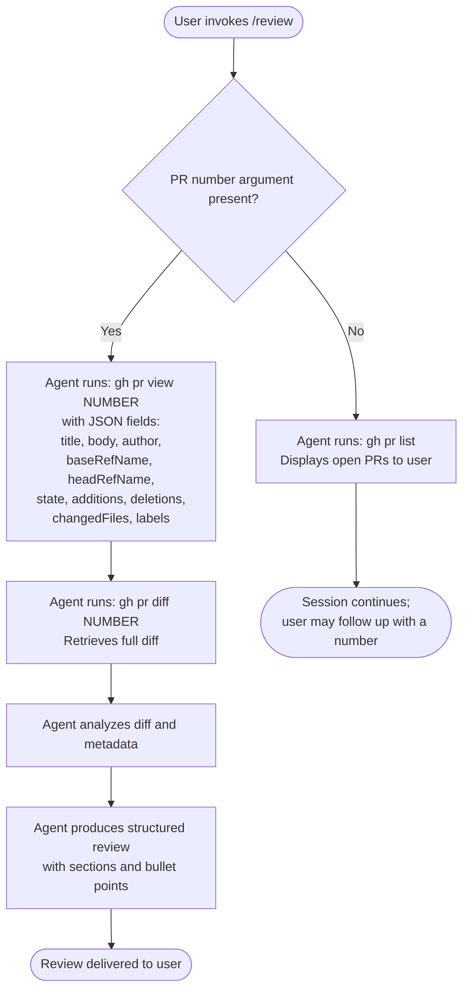

# `/review`

> Analysis basis: CC v2.1.158 bundle.js (AST extraction + Claude interpretation)
> Minimum version: v2.1.158

---

## Overview

The `/review` command is a `prompt`-type slash command that delegates code review work to the agent by injecting a structured prompt containing a PR number (when supplied) and instructions for interacting with the GitHub CLI (`gh`). When no PR number is given, the agent is instructed to list open pull requests first; when a number is provided, the agent fetches full PR metadata and the diff, then produces a structured review covering code quality, correctness, project conventions, performance, test coverage, and security.

---

## Registration

| Field | Value |
|---|---|
| type | `prompt` |
| name | `review` |
| description | `Review a pull request` |
| prompt body length | 926 characters |
| prompt construction | `call→R45(...) (1 literals)` |

Analysis basis: CC v2.1.158 bundle.js:+11952842

---

## Input Branching

The command's runtime behavior branches on whether the user supplies a PR number as an argument. The prompt body embeds the argument value in the placeholder position `PR number: ...` before being forwarded to the agent.



Analysis basis: CC v2.1.158 bundle.js:+11952842

---

## Behavioral Spec

### Prompt Construction and Argument Injection

When `/review` is invoked, the command constructs its prompt by calling a string-assembly helper (one literal argument) that produces the full instruction block. The user-supplied argument — expected to be a PR number — is interpolated into the tail of the prompt at the `PR number:` position.

```
function buildReviewPrompt(userArgument):
    instructionBlock = assembleInstructionTemplate()
    // instructionBlock is a fixed multi-line string (~926 chars)
    // containing numbered steps and focus areas
    finalPrompt = instructionBlock + " " + userArgument
    return finalPrompt
```

Analysis basis: CC v2.1.158 bundle.js:+11952842

---

### Step 1 — PR Discovery (no argument)

When no PR number is given, the injected prompt directs the agent to invoke the GitHub CLI to list all open pull requests in the current repository context. No further automated action is taken; the session pauses for user follow-up.

```
function handleNoPrNumber(agentContext):
    issue shell command: "gh pr list"
    present output to user
    await user input (expected: a PR number for subsequent review)
```

Analysis basis: CC v2.1.158 bundle.js:+11952842

---

### Step 2 — PR Metadata Fetch (argument supplied)

When a PR number is present, the agent issues a `gh pr view` call requesting a specific set of JSON fields. The exact field list is fixed in the prompt body.

```
function fetchPrMetadata(prNumber):
    fields = [
        "title", "body", "author",
        "baseRefName", "headRefName", "state",
        "additions", "deletions", "changedFiles", "labels"
    ]
    fieldString = join(fields, ",")
    issue shell command: "gh pr view " + prNumber + " --json " + fieldString
    return parsedJsonResponse
```

Analysis basis: CC v2.1.158 bundle.js:+11952842

---

### Step 3 — Diff Retrieval

After fetching metadata, the agent retrieves the full textual diff of the pull request.

```
function fetchPrDiff(prNumber):
    issue shell command: "gh pr diff " + prNumber
    return rawDiffText
```

Analysis basis: CC v2.1.158 bundle.js:+11952842

---

### Step 4 — Review Analysis and Formatting

The agent synthesizes the metadata and diff into a structured review. The prompt prescribes both the analysis dimensions and the output format.

```
function produceReview(prMetadata, diffText):
    sections = []

    sections.append(summarizeWhatPrDoes(prMetadata, diffText))
    sections.append(analyzeCodeQualityAndStyle(diffText))
    sections.append(generateImprovementSuggestions(diffText))
    sections.append(identifyRisksAndIssues(diffText))

    // Focus areas applied across all sections:
    focusAreas = [
        "code correctness",
        "project conventions",
        "performance implications",
        "test coverage",
        "security considerations"
    ]

    formattedOutput = renderWithClearSectionsAndBulletPoints(sections, focusAreas)
    return formattedOutput
```

Analysis basis: CC v2.1.158 bundle.js:+11952842

---

## State & Side Effects

| Item | Detail |
|---|---|
| Telemetry | <!-- TODO: not found in depth-2 traversal; needs --depth 4 --> |
| Hook registration | <!-- TODO: not found in depth-2 traversal; needs --depth 4 --> |
| appState changes | <!-- TODO: not found in depth-2 traversal; needs --depth 4 --> |
| Sound | <!-- TODO: not found in depth-2 traversal; needs --depth 4 --> |
| Shell side effects | Executes `gh` CLI subcommands (`pr list`, `pr view`, `pr diff`) in the user's working directory context |
| Network I/O | Indirect — `gh` CLI contacts the GitHub API; no direct HTTP calls from the command layer |
| Prompt body length | 926 characters (fixed template before argument interpolation) |

Analysis basis: CC v2.1.158 bundle.js:+11952842

---

## Version History

| Version | Change |
|---|---|
| v2.1.158 | Initial analysis — `prompt`-type command, 926-char template, `gh`-based PR review flow |

---

## Common Mistakes

1. **Invoking `/review` without the `gh` CLI installed.** The entire workflow depends on `gh` being available and authenticated in the shell environment. If `gh` is absent or unauthenticated, all three shell steps will fail with errors that the agent cannot recover from automatically.

2. **Passing non-numeric or malformed PR identifiers.** The PR number is interpolated directly into `gh` subcommand strings. Passing a branch name, URL, or empty string may produce unexpected `gh` CLI errors rather than a graceful "not found" message.

3. **Running `/review` outside a Git repository context.** The `gh` CLI infers the target repository from the current working directory's Git remote. Running the command in a non-repository directory will cause `gh` to fail to resolve the repository.

4. **Expecting `/review` to push comments back to GitHub.** The command produces a review narrative in the Claude Code session only. It does not automatically post the review as a GitHub PR review or comment. A separate `gh pr review --comment` invocation would be needed for that.

5. **Assuming the field list for `gh pr view` is configurable.** The JSON fields requested from `gh pr view` are hardcoded in the prompt template (`title`, `body`, `author`, `baseRefName`, `headRefName`, `state`, `additions`, `deletions`, `changedFiles`, `labels`). There is no mechanism to extend or reduce this set without modifying the command registration.

---

## Appendix — Identifier Mapping

> For bundle debugging only. Identifiers change across versions.

| Identifier | Role |
|---|---|
| `R45` | Prompt-body string assembly helper; called with one literal argument to construct the 926-character instruction template |

Analysis basis: CC v2.1.158 bundle.js:+11952842