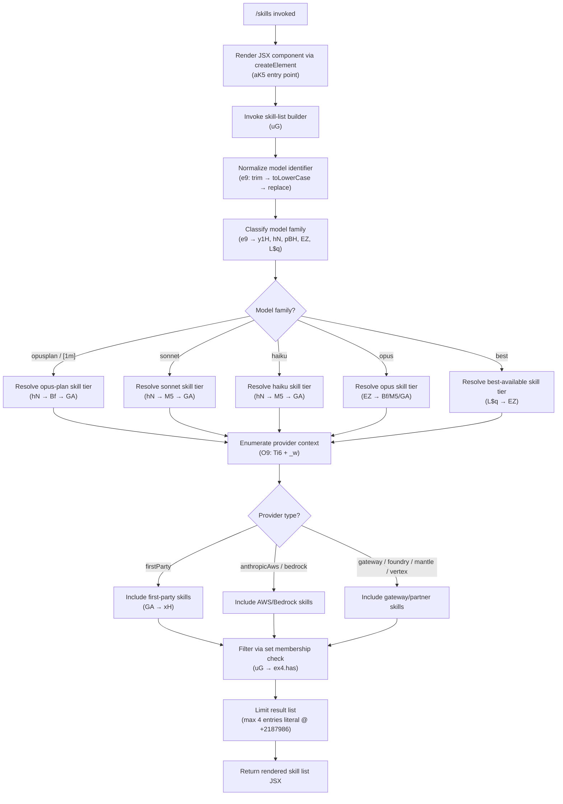

# `/skills`

> Analysis basis: CC v2.1.154 bundle.js (AST extraction + Claude interpretation)
> Minimum version: v2.1.154

---

## Overview

The `/skills` command lists the available model capabilities (skills) accessible to Claude Code in the current environment. It is a `local-jsx` command that executes immediately, rendering a JSX component that enumerates skills resolved from the active model configuration and provider context. No agent round-trip to the LLM is required.

---

## Registration

| Field | Value |
|---|---|
| type | `local-jsx` |
| name | `skills` |
| description | `List available skills` |
| immediate | `true` |
| module_id | `IF1` |
| load_inline | `true` |
| loc_byte | `11958472` |
| loc_byte_end | `11958604` |
| loc_line | `8798` |
| arbor_handler.name | `aK5` |
| arbor_handler.fqn | `claude-2.1.154::aK5` |
| arbor_handler.kind | `AsyncFunction` |
| arbor_handler.resolution_path | `module_id` |
| arbor_handler.n_hits | `0` |

Analysis basis: CC v2.1.154 bundle.js:+11958472

---

## Input Branching

The command resolves skills through several branching paths based on model name normalization, provider classification, and capability lookup. Five or more distinct conditional paths are identifiable from the call graph and literals.



Analysis basis: CC v2.1.154 bundle.js:+11958287 (createElement), +2188002 (O9), +2187986 (limit 4), +2188058 (ex4.has)

---

## Behavioral Spec

### Handler Entry Point (`aK5`)

The Arbor-resolved handler `aK5` is an `AsyncFunction` reached via `module_id → IF1`. On invocation it:

1. Constructs a JSX element (via `YHA.createElement`) to host the skills list display.
2. Calls the skill-list builder (`uG`) to obtain the resolved skill entries.
3. Returns the composed JSX for immediate rendering in the CLI output pane.

```
async function skillsHandler(commandContext):
    skillEntries = buildSkillList(commandContext)
    return createElement(SkillsDisplay, { skills: skillEntries })
```

Analysis basis: CC v2.1.154 bundle.js:+11958287, +11958361

---

### Skill-List Builder (`uG`)

Coordinates the full resolution pipeline:

1. Calls the model-normalizer (`e9`) with the active model identifier to obtain a normalized skill descriptor.
2. Calls the provider-enumerator (`O9`) to obtain provider-classified capability entries.
3. Filters the combined set using a membership check against the `ex4` set (deduplication / allowlist guard).
4. Caps the result at **4 entries** (literal value `4` at bundle.js:+2187986).

```
function buildSkillList(context):
    normalizedSkill = normalizeModelSkill(context.modelId)
    providerSkills   = enumerateProviderSkills(context)
    combined = merge(normalizedSkill, providerSkills)
    filtered = [s for s in combined if membershipSet.has(s)]
    return filtered[0:4]
```

Analysis basis: CC v2.1.154 bundle.js:+2188002, +2188058, +2187986

---

### Model Identifier Normalizer (`e9`)

Accepts the raw model string and applies a multi-step normalization before dispatching to family-specific resolvers:

1. **Trim** whitespace (`H.trim`).
2. **Lowercase** the result (`_.toLowerCase`).
3. **Pattern replace** for alias expansion (`j0` → slug normalizer, then `S1H` → canonical form via `xH`).
4. **String replace** for additional alias cleanup (`A.replace`).
5. Classify into named families using ordered substring / inclusion checks:
   - `opusplan` or `[1m]` → opus-plan tier resolver (`hN` → `Bf` → `GA`).
   - `sonnet` → sonnet tier resolver (`hN` → `M5`).
   - `haiku` → haiku tier resolver (`hN` → `M5`).
   - `opus` → opus resolver (`EZ` → `Bf` / `M5` / `GA`).
   - `best` → best-available resolver (`L$q` → `EZ`).
6. Falls back to a generic replacement pass (`_.replace`) for unrecognised models.

```
function normalizeModelSkill(rawModelId):
    s = rawModelId.trim().toLowerCase()
    s = slugNormalizer(s)          // j0 → S1H → xH
    s = aliasReplace(s)            // A.replace

    if includes(s, "opusplan") or includes(s, "[1m]"):
        return resolveOpusPlan(s)  // hN → Bf → GA
    elif includes(s, "sonnet"):
        return resolveSonnet(s)    // hN → M5 → GA
    elif includes(s, "haiku"):
        return resolveHaiku(s)     // hN → M5 → GA
    elif includes(s, "opus"):
        return resolveOpus(s)      // EZ → Bf/M5/GA
    elif includes(s, "best"):
        return resolveBest(s)      // L$q → EZ
    else:
        return s.replace(pattern, replacement)
```

Analysis basis: CC v2.1.154 bundle.js:+2189788 (trim), +2189799 (toLowerCase), +2189817 (j0), +2189827 (A.replace), +2189863 (y1H), +2189884 ("opusplan"), +2189910 ("[1m]"), +2189925 ("sonnet"), +2189964 ("haiku"), +2190003 ("opus"), +2190040 ("best"), +2190130 (_.replace)

---

### Provider Enumerator (`O9`)

Collects the provider context entries that gate which skills are surfaced:

1. Calls `Ti6` to obtain the raw provider map (uses `Object.entries` iteration and `i_` / `vp` for internal resolution).
2. Calls `_w` to apply a provider-string normalizer:
   - Lowercases the provider string.
   - Checks for inclusion of known provider tokens.
   - Applies replacement rules for aliasing.
3. Checks whether `"application-inference-profile"` is present in the model string (literal at +2187876), branching on AWS inference-profile handling.
4. Calls `Hp8` and `NP` (post-processing helpers; `NP` applies a final `.replace` pass at +2191418).

Known provider identifiers resolved through this path (all from `GA` / `xH` sub-graph):

| Provider Token | bundle.js offset |
|---|---|
| `firstParty` | +2044994 |
| `anthropicAws` | +2045012 |
| `gateway` | +2045032 |
| `bedrock` | +2044343 |
| `foundry` | +2044393 |
| `mantle` | +2044503 |
| `vertex` | +2044551 |

Analysis basis: CC v2.1.154 bundle.js:+2187833, +2187856, +2187865, +2187876, +2187916, +2187920

---

### Model Slug Table

The following concrete model identifiers appear as string constants in the normalizer sub-graph (depth ≤ 2). They represent the canonical slug forms used during skill resolution:

| Canonical Slug | bundle.js offset |
|---|---|
| `claude-opus-4-8` | +2186851 |
| `claude-opus-4-7` | +2186908 |
| `claude-opus-4-6` | +2186965 |
| `claude-opus-4-5` | +2187022 |
| `claude-opus-4-1` | +2187079 |
| `claude-opus-4-0` | +2187168 |
| `claude-sonnet-4-6` | +2187200 |
| `claude-sonnet-4-5` | +2187261 |
| `claude-sonnet-4-0` | +2187356 |
| `claude-haiku-4-5` | +2187390 |
| `claude-3-7-sonnet` | +2187449 |
| `claude-3-5-sonnet` | +2187510 |
| `claude-3-5-haiku` | +2187571 |
| `claude-3-opus` | +2187630 |
| `claude-3-sonnet` | +2187683 |
| `claude-3-haiku` | +2187740 |

Analysis basis: CC v2.1.154 bundle.js:+2186851 – +2187740

---

### Canonical Form Builder (`xH`)

Converts a partially normalized slug into the final canonical model string by calling the built-in `String` constructor for coercion (bundle.js:+26899). Also evaluates boolean-like string values `"yes"` (+26948) and `"on"` (+26954) as truthy flags — likely for feature-flag checks tied to skill availability.

```
function toCanonicalForm(value):
    coerced = String(value)
    if coerced == "yes" or coerced == "on":
        return FLAG_ENABLED
    return coerced
```

Analysis basis: CC v2.1.154 bundle.js:+26899, +26948, +26954

---

### Randomized Back-off Helper (`H`)

Appears in the call graph as a dependency of `e9`. Uses `Math.random` and `setTimeout` with constants `2` (+13408198) and `1` (+13408214), suggesting a jitter-based retry or debounce mechanism used internally during asynchronous model resolution.

```
function randomBackoff(baseFn):
    delay = Math.random() * 2 + 1   // jitter in [1, 3) units
    setTimeout(baseFn, delay)
```

Analysis basis: CC v2.1.154 bundle.js:+13408200, +13408237, +13408198, +13408214

---

### Provider String Normalizer (`_w`)

Normalizes a raw provider string for comparison:

1. Lowercase the string (`H.toLowerCase`).
2. Check inclusion of known provider tokens (`H.includes`).
3. Apply replacement rules for provider alias normalization (`H.replace`).

```
function normalizeProviderString(providerStr):
    lower = providerStr.toLowerCase()
    if lower.includes(knownToken):
        return canonicalProviderName
    return lower.replace(aliasPattern, canonicalForm)
```

Analysis basis: CC v2.1.154 bundle.js:+2186824, +2186840, +2187788

---

### Slug Inclusion Guard (`ar6`)

Performs an inclusion check against the `Hu4` list to validate that a resolved model slug is in the permitted set before it is added to the skills output.

```
function isPermittedSlug(slug):
    return Hu4.includes(slug)
```

Analysis basis: CC v2.1.154 bundle.js:+2190324

---

### Capability Flag Resolver (`UBH`)

Calls `xH` (canonical form builder) to produce a normalised boolean capability flag for a given skill attribute.

```
function resolveCapabilityFlag(rawFlag):
    return toCanonicalForm(rawFlag)
```

Analysis basis: CC v2.1.154 bundle.js:+2190362

---

## State & Side Effects

| Item | Detail |
|---|---|
| Telemetry | None detected in depth-2 traversal (`telemetry: []`) |
| Hook registration | None detected |
| appState changes | None detected; command is read-only / display-only |
| Sound | None detected |
| JSX rendering | Produces an immediate JSX component via `YHA.createElement` (bundle.js:+11958287) |
| Set membership check | Reads from `ex4` set (bundle.js:+2188058) — side-effect-free read |
| Result cap | Hard limit of **4 skill entries** returned (bundle.js:+2187986) |

---

## Version History

| Version | Change |
|---|---|
| v2.1.154 | Initial analysis |

---

## Common Mistakes

1. **Expecting all installed models to appear**: The result list is hard-capped at 4 entries (bundle.js:+2187986). If the active model is not in the normalizer's slug table or the provider is not in the known provider set, skills for that model may not be shown.
2. **Assuming a network call occurs**: `/skills` is `immediate: true` and `local-jsx`; it performs no LLM round-trip. All resolution is synchronous/local against bundled data.
3. **Provider mismatch on non-firstParty deployments**: Skills available under `bedrock`, `vertex`, `foundry`, `mantle`, or `gateway` providers are filtered by the provider-classification sub-graph. A model that works in first-party may show a different (or shorter) skill list in a partner deployment.
4. **Model alias not recognized**: Only the 16 canonical slugs in the slug table (and their alias expansions) are fully handled. A custom or preview model ID that does not match any slug pattern will fall through to the generic replace branch and may produce an incomplete skills list.
5. **Confusing `/skills` with `/help`**: `/skills` is specifically about model capability enumeration, not general command help. It does not list slash commands.

---

## Appendix — Identifier Mapping

> For bundle debugging only. Identifiers change across versions.

| Identifier | Role |
|---|---|
| `aK5` | Main handler (`AsyncFunction`); entry point for `/skills`, resolved via Arbor `module_id` path |
| `uG` | Skill-list builder; orchestrates normalization, provider enumeration, and filtering |
| `e9` | Model identifier normalizer; trims, lowercases, and dispatches to family resolvers |
| `H` | Randomized back-off / jitter helper (uses `Math.random` + `setTimeout`) |
| `_` | String target for `toLowerCase` and `replace` operations during normalization |
| `j0` | Slug normalizer dispatcher; delegates to `S1H` |
| `S1H` | Intermediate slug transformer; calls canonical form builder `xH` |
| `A` | String target for alias `replace` pass; also calls `f.toLowerCase` |
| `f` | Stream/connection object; calls `A.close`, `q.close`, `L` |
| `y1H` | Family classifier entry; checks `I1H.includes` for model family tokens |
| `hN` | Tier resolver dispatcher for sonnet/haiku/opusplan tiers; calls `Bf` and `M5` |
| `Bf` | Tier resolver sub-helper for opus-plan; calls `GA` |
| `M5` | Tier resolver sub-helper for sonnet/haiku/opus; calls `JxH`, `GR4`, `H1q`, `Gi6`, `GA` |
| `pBH` | Skill tier resolver for an additional model family; calls `M5` |
| `EZ` | Opus-family resolver; calls `Bf`, `M5`, `GA` |
| `GA` | Provider capability resolver; calls `xH`; uses `firstParty`, `anthropicAws`, `gateway` literals |
| `L$q` | Best-available resolver; delegates to `EZ` |
| `ar6` | Permitted-slug inclusion guard; checks `Hu4.includes` |
| `UBH` | Capability flag resolver; calls `xH` |
| `xH` | Canonical form builder; uses `String` coercion; checks `"yes"` / `"on"` flags |
| `O9` | Provider enumerator; calls `Ti6`, `_w`, `Hp8`, `NP` |
| `Ti6` | Provider map builder; uses `Object.entries` and `i_` / `vp` |
| `i_` | Internal symbol resolver; calls `vp` |
| `_w` | Provider string normalizer; lowercases, includes-checks, and replaces provider tokens |
| `Hp8` | Post-processing helper for provider entries (depth-2 leaf; internals not traversed) |
| `NP` | Final replacement pass helper; calls `H.replace` |