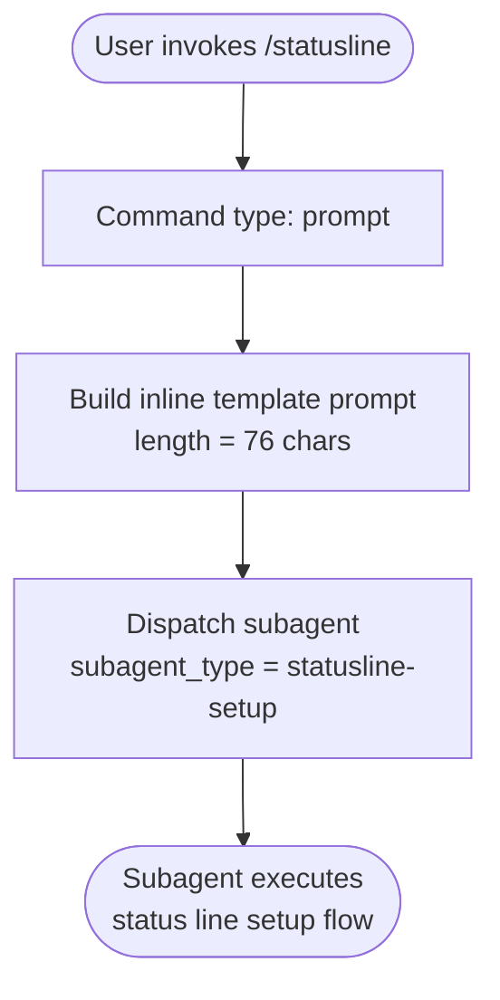

# `/statusline`

> Analysis basis: CC v2.1.158 bundle.js (AST extraction + Claude interpretation)
> Minimum version: v2.1.158

---

## Overview

The `/statusline` command initiates a guided setup flow for Claude Code's terminal status line UI. When invoked, it dispatches a `prompt`-type command that creates a subagent with type `"statusline-setup"`, which is responsible for configuring how status information is rendered in the user's shell environment.

---

## Registration

| Field | Value |
|---|---|
| type | `prompt` |
| name | `statusline` |
| description | `Set up Claude Code's status line UI` |
| aliases | *(none)* |
| prompt body length | 76 characters |
| prompt body format | inline template |

Analysis basis: CC v2.1.158 bundle.js:+12416213

---

## Input Branching

Because the call graph returned no edges and the literals array is empty at depth ≤ 2, the command does not expose conditional branching based on user-supplied arguments at this traversal depth. The command implementation is a single-path `prompt` dispatch.



Analysis basis: CC v2.1.158 bundle.js:+12416213

---

## Behavioral Spec

### Prompt Dispatch

The command is classified as type `prompt`, meaning it does not run imperative logic itself but instead composes a natural-language prompt and hands it to the agent runtime.

```
function executeStatuslineCommand(userInput):
    promptText = buildInlineTemplate(
        subagent_type = "statusline-setup",
        inner_prompt  = <redacted inline content, 76 chars total>
    )
    dispatchPromptCommand(promptText)
    return  // control passes to agent runtime
```

Analysis basis: CC v2.1.158 bundle.js:+12416213

### Subagent Delegation

The constructed prompt instructs the agent runtime to create a subordinate agent whose `subagent_type` is `"statusline-setup"`. This subagent type string is the sole routing key used by the runtime to select the correct setup handler.

```
function buildInlineTemplate(subagent_type, inner_prompt):
    return "Create an [agent] with subagent_type \""
           + subagent_type
           + "\" and the prompt \""
           + inner_prompt
           + "\""
```

Prompt body length: 76 characters
Analysis basis: CC v2.1.158 bundle.js:+12416213

---

## State & Side Effects

| Item | Detail |
|---|---|
| Telemetry | *(none detected at depth ≤ 2; see note below)* |
| Hook registration | <!-- TODO: not found in depth-2 traversal; needs --depth 4 --> |
| appState changes | <!-- TODO: not found in depth-2 traversal; needs --depth 4 --> |
| Sound | <!-- TODO: not found in depth-2 traversal; needs --depth 4 --> |
| Subagent spawned | Yes — `subagent_type: "statusline-setup"` |
| Call graph depth | No callable edges resolved at depth ≤ 2 |

> **Note on telemetry:** The `telemetry` array returned by the AST extraction is empty. Either no `tengu_*` events are fired within the first two call-graph hops, or events are emitted inside the subagent runtime path which is outside the traversal boundary. A depth-4 pass would be needed to confirm.

---

## Version History

| Version | Change |
|---|---|
| v2.1.158 | Initial analysis — `prompt`-type command, delegates to `statusline-setup` subagent |

---

## Common Mistakes

1. **Expecting immediate output.** `/statusline` is a `prompt`-type command — it does not print a result synchronously. All visible effects are produced by the `statusline-setup` subagent after it is spawned.
2. **Passing arguments.** No argument-handling logic was detected at depth ≤ 2. Passing extra text after `/statusline` may be silently ignored or forwarded verbatim as part of the inner prompt depending on template construction — behaviour is unverified at this traversal depth.
3. **Confusing setup with display.** The command sets *up* the status line UI; it does not toggle or query the current status line state. Running it repeatedly may re-run the setup flow.
4. **Assuming shell integration is automatic.** The subagent guides configuration but the user's shell environment must support the required prompt escapes for the status line to render correctly.

---

## Appendix — Identifier Mapping

> For bundle debugging only. Identifiers change across versions.

| Identifier | Role |
|---|---|
| *(none)* | No obfuscated identifiers were returned by the depth ≤ 2 AST traversal for this command module. The `note` field confirms: `"no entry functions found for module 'undefined'"`. |

Analysis basis: CC v2.1.158 bundle.js:+12416213