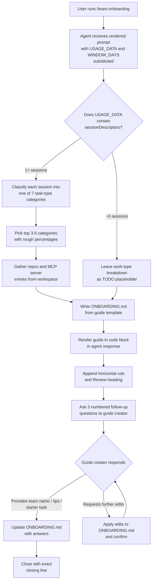

# `/team-onboarding`

> Analysis basis: CC v2.1.158 bundle.js (AST extraction + Claude interpretation)
> Minimum version: v2.1.158

---

## Overview

The `/team-onboarding` command reads a power user's recent Claude Code session transcripts, classifies the work into task-type categories, and co-authors a structured `ONBOARDING.md` guide that a new teammate can paste directly into Claude for an interactive onboarding walkthrough. The command is a `prompt`-type slash command: it injects a fully rendered prompt body into the agent context along with templated usage data, then drives a two-turn collaborative authoring loop — first generating a concrete draft, then refining it based on three targeted follow-up questions.

---

## Registration

| Field | Value |
|---|---|
| type | `prompt` |
| name | `team-onboarding` |
| description | Help teammates ramp on Claude Code with a guide from your usage |
| isHidden | `false` |
| prompt_body length | 12801 characters |

Analysis basis: CC v2.1.158 bundle.js:+12708735

---

## Input Branching

The prompt body contains several logically distinct segments that the agent must navigate. The primary authoring flow is the dominant branch; the other segments (loop control, missed-task recovery, PR monitoring, and session-analysis JSON) are embedded fragments from shared prompt infrastructure that are present in the raw prompt body but are not active paths during a normal `/team-onboarding` invocation.



Analysis basis: CC v2.1.158 bundle.js:+12708735

---

## Behavioral Spec

### 1. Immediate Acknowledgment Line

Before any classification, tool calls, or extended reasoning, the agent must emit exactly one acknowledgment line. This is an explicit ordering constraint in the prompt body: classification is designated step 2, not step 1.

```
function emitAcknowledgment(windowDays):
    print("> Looking at how you've used Claude over the last "
          + windowDays
          + " days to put together an onboarding guide for teammates new to Claude Code.")
    // No tool calls, no thinking blocks, no classification before this line.
    return
```

Analysis basis: CC v2.1.158 bundle.js:+12708735

---

### 2. Session Classification

The agent reads the `sessionDescriptors` array from the injected `USAGE_DATA` JSON. Each descriptor includes a session title, an optional list of linked pull request numbers (`prNumbers`), and the first user message from that session.

The seven recognized task-type categories are:

| Internal identifier | Display label | Canonical scope |
|---|---|---|
| `build_feature` | Build Feature | New functionality, scripts, tools, config, CI, env setup |
| `debug_fix` | Debug Fix | Investigating and fixing bugs |
| `improve_quality` | Improve Quality | Refactoring, tests, cleanup, code review |
| `analyze_data` | Analyze Data | Queries, metrics, number crunching |
| `plan_design` | Plan Design | Architecture, approach, strategy, unfamiliar-code orientation, design review |
| `prototype` | Prototype | Spikes, POCs, throwaway exploration |
| `write_docs` | Write Docs | PRDs, RFCs, READMEs, design docs, copy or doc review |

Classification rules (in priority order):

```
function classifySessions(sessionDescriptors):
    counts = empty map keyed by category

    for each session in sessionDescriptors:
        signal = session.firstUserMessage
        if signal is uninformative:
            signal = weak_hint(session.toolCounts, session.mcpCounts)

        // Review sessions are assigned to the reviewed artifact's type:
        //   code review  -> improve_quality
        //   doc review   -> write_docs
        //   design review -> plan_design

        category = matchToCategory(signal, session.prNumbers, session.title)
        if no category matches and category is genuinely novel:
            category = new label  // rare; use sparingly
        counts[category] += 1

    topCategories = top 3 to 5 entries from counts by frequency
    return topCategories with rough percentage of total sessions each

function formatCategoryLabel(internalId):
    // Convert snake_case to Title Case with spaces
    // e.g. "build_feature" -> "Build Feature"
    return internalId.replace("_", " ").toTitleCase()
```

If `sessionDescriptors` is empty or near-zero in length, the work-type breakdown section is left as a `TODO` placeholder rather than fabricated.

Analysis basis: CC v2.1.158 bundle.js:+12708735

---

### 3. Workspace and MCP Data Gathering

```
function gatherWorkspaceContext(usageData, workspace):
    repos = [usageData.currentRepo]
    siblingDirs = listSiblingRepoDirs(workspace)
    repos += siblingDirs  // deduplicated

    mcpServers = []
    for each entry in usageData.mcpEntries:
        description = inferPurpose(entry.name, entry.urlOrigin)
        accessInstructions = inferAccess(entry.name, entry.urlOrigin)
        mcpServers.append({name, description, accessInstructions})

    return repos, mcpServers
```

Analysis basis: CC v2.1.158 bundle.js:+12708735

---

### 4. ASCII Bar Chart Rendering

Usage statistics are rendered as 20-character-wide ASCII bar charts. Filled segments use `█`; empty segments use `░`.

```
function renderBar(percentage, totalWidth = 20):
    filledCount  = round(percentage / 100 * totalWidth)
    emptyCount   = totalWidth - filledCount
    return "█" * filledCount + "░" * emptyCount
```

Real numeric values from `USAGE_DATA` are substituted directly; placeholder text such as `[N]` must not appear in the rendered guide. The author name is taken from `usageData.generatedBy`; if that field is absent, the name attribution is omitted entirely.

Analysis basis: CC v2.1.158 bundle.js:+12708735

---

### 5. Guide Template Structure

The guide written to `ONBOARDING.md` follows a fixed section order:

```
document ONBOARDING.md:
    heading: "Welcome to [Team Name]"

    section "How We Use Claude":
        attribution line using generatedBy and windowDays
        work-type breakdown table with ASCII bars and percentages
        top skills and commands table with ASCII bars and monthly frequency
        top MCP servers table with ASCII bars and call counts

    section "Your Setup Checklist":
        subsection "Codebases":
            markdown checkbox list of repos with URLs
        subsection "MCP Servers to Activate":
            markdown checkbox list with purpose and access instructions
        subsection "Skills to Know About":
            list of slash commands with descriptions and team usage context

    section "Team Tips":
        placeholder: "_TODO_"   // filled after Review turn

    section "Get Started":
        placeholder: "_TODO_"   // filled after Review turn

    html_comment: verbatim onboarding-buddy instruction block
        // This block instructs Claude how to behave when a new teammate
        // pastes the guide. It must be preserved exactly as specified
        // in the prompt body and must not be paraphrased or omitted.
```

Analysis basis: CC v2.1.158 bundle.js:+12708735

---

### 6. First-Turn Closing and Review Questions

After the guide code block the agent appends a horizontal rule (`---`) followed by a `**Review**` heading. Under that heading three numbered questions are posed:

```
function emitReviewQuestions(inferredTeamName):
    if inferredTeamName is known:
        q1 = "I went with '" + inferredTeamName + "' for the team name — let me know if that sounds right."
    else:
        q1 = "What's the team name? I'll add it in."

    q2 = "Is there a starter task for someone new to Claude Code? (ticket or doc link — optional)"
    q3 = "Any team tips you'd tell a new teammate that aren't already in CLAUDE.md?"

    print numbered list [q1, q2, q3]
```

Analysis basis: CC v2.1.158 bundle.js:+12708735

---

### 7. Second-Turn Update and Closing Line

When the guide creator responds to the Review questions, the agent updates `ONBOARDING.md` with the provided team name, tips, and starter task, then emits an exact, invariant closing line:

```
function closeFinalTurn():
    updateFile("ONBOARDING.md", teamName, tips, starterTask)
    print("Saved to `ONBOARDING.md`. Drop it in your team docs and channels"
          + " — when a new teammate pastes it into Claude Code, they get a"
          + " guided onboarding tour from there.")
    // This line must not be numbered, paraphrased, or reformatted.
```

Subsequent edit requests from the guide creator result in further file updates followed by confirmation; the loop continues until the guide creator stops sending edits.

Analysis basis: CC v2.1.158 bundle.js:+12708735

---

### 8. Embedded Prompt Fragments (Non-Active Paths)

The raw prompt body at the registered location contains several additional text segments that are not part of the normal `/team-onboarding` authoring flow. These are artifacts of shared prompt infrastructure embedded in the bundle and are present as inert text during a standard invocation:

- A self-pacing loop control block describing `delaySeconds`, `reason`, and `prompt` parameters for a scheduling tool.
- A missed-scheduled-task recovery block that gates execution behind an `AskUserQuestion` confirmation.
- A PR monitoring block that checks CI state and merge status via `gh` CLI commands.
- A session-analysis JSON schema block requesting a structured outcome object.
- A PostgreSQL type keyword list (unrelated to command function).
- PowerShell exit-code capture and path-reporting snippets.

These fragments do not alter the authoring behavior described in sections 1 through 7. They are documented here for completeness of the prompt-body analysis.

Analysis basis: CC v2.1.158 bundle.js:+12708735

---

## State and Side Effects

| Item | Detail |
|---|---|
| Telemetry | <!-- TODO: not found in depth-2 traversal; needs --depth 4 --> |
| Hook registration | <!-- TODO: not found in depth-2 traversal; needs --depth 4 --> |
| appState changes | <!-- TODO: not found in depth-2 traversal; needs --depth 4 --> |
| File written | `ONBOARDING.md` in the current working directory (created or overwritten on first turn; updated on second turn) |
| Sound | <!-- TODO: not found in depth-2 traversal; needs --depth 4 --> |
| Call graph depth | AST traversal returned an empty call graph; no callee functions were resolved at depth 2 |
| Template variables | `{{USAGE_DATA}}` and `{{WINDOW_DAYS}}` are substituted into the prompt body before the agent receives it; `{{GUIDE_TEMPLATE}}` is replaced with the full guide skeleton |

---

## Version History

| Version | Change |
|---|---|
| v2.1.158 | Initial analysis; command registered as non-hidden `prompt` type at bundle byte offset 12708735 |

---

## Common Mistakes

1. **Invoking the command with no usage data available.** If the local Claude Code transcript store is empty or inaccessible, `USAGE_DATA` will contain no `sessionDescriptors`. The agent will leave the work-type breakdown as `TODO` rather than fabricating percentages — this is correct behavior, not a bug.

2. **Expecting the guide to be printed inline without a file write.** The command writes `ONBOARDING.md` to disk. The in-response code block is a rendered preview; the authoritative artifact is the file.

3. **Paraphrasing or omitting the HTML comment block at the bottom of the guide.** The comment contains instructions for Claude when a new teammate pastes the guide. Editing or removing it breaks the interactive onboarding behavior.

4. **Treating the Review questions as optional.** The three questions in the Review section are structural: answers feed directly into the `Team Tips` and `Get Started` sections, which are intentionally left as `_TODO_` placeholders in the first turn.

5. **Expecting the closing line to vary.** The final closing sentence is specified as an exact invariant string. Any rephrasing or numbering applied to it is incorrect.

6. **Confusing the seven task-type category labels.** Categories describe task type, not project domain. Review sessions are always classified by the artifact being reviewed, not by the act of reviewing itself (for example, a code-review session is `improve_quality`, not a new category).

7. **Treating embedded prompt fragments as active behavior.** The loop control, missed-task recovery, PR monitoring, and session-analysis JSON schema blocks visible in the raw prompt body are inert infrastructure fragments during a normal invocation and do not trigger any scheduling, monitoring, or JSON-output behavior.

---

## Appendix — Identifier Mapping

> For bundle debugging only. Identifiers change across versions.

| Identifier | Role |
|---|---|
| `zw5` | Local variable in prompt-body assembly function (exact role undetermined at depth 2) |
| `Ow5` | Local variable in prompt-body assembly function (exact role undetermined at depth 2) |

> Note: The AST extraction reported 11 method-body chunks with local variables `_`, `zw5`, `A`, `Ow5`, `q`, `O`, `K`, `L`, `f`, `M`, `$`. Single-letter names (`_`, `A`, `q`, `O`, `K`, `L`, `f`, `M`, `$`) are standard minifier output for loop counters and intermediate values and carry no semantic identity worth mapping. `zw5` and `Ow5` are the only non-trivially-obfuscated identifiers present. The `identifiers` array in the source JSON was empty, so no further mapping is possible at depth 2.

<!-- TODO: not found in depth-2 traversal; needs --depth 4 -->