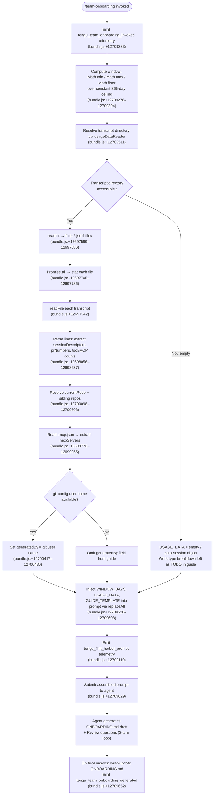

# `/team-onboarding`

> Analysis basis: CC v2.1.158 bundle.js (AST extraction + Claude interpretation)
> Minimum version: v2.1.158

---

## Overview

`/team-onboarding` is a `prompt`-type slash command that scans the invoking user's local Claude Code session transcripts (up to the last 365 days), derives a work-type usage breakdown, and co-authors a ready-to-paste `ONBOARDING.md` guide that a new teammate can drop into Claude Code for an interactive walkthrough. The guide is generated immediately as a concrete draft, then refined collaboratively through a structured three-question review loop.

---

## Registration

| Field | Value |
|---|---|
| type | `prompt` |
| name | `team-onboarding` |
| description | Help teammates ramp on Claude Code with a guide from your usage |
| isHidden | `false` |
| loc_byte | `12708735` |
| loc_byte_end | `12709784` |
| loc_line | `8940` |
| handler_method | `getPromptForCommand` |
| handler_method_start | `12709073` |
| handler_method_end | `12709783` |
| prompt_body.length | `4539` characters |
| prompt_body.trace | `identifier→$ (local→1 ext vars)` |
| arbor_handler.name | `getPromptForCommand` |
| arbor_handler.kind | `Method` |
| arbor_handler.resolution_path | `direct` |
| arbor_handler.fqn | `claude-2.1.158::getPromptForCommand` |
| arbor_handler.n_hits | `2` |

Analysis basis: CC v2.1.158 bundle.js:+12708735

---

## Input Branching

The handler executes a linear preparation pipeline before injecting the prompt, but the transcript-scanning and data-injection sub-steps each contain distinct branches. Four or more meaningful branching points are present in the call graph, so a flowchart is used.



---

## Behavioral Spec

### 1. Handler Entry (`getPromptForCommand`)

The Arbor-resolved handler is `getPromptForCommand` (Method, direct resolution, n_hits=2).

```
function getPromptForCommand(commandContext):
    emit telemetry("tengu_team_onboarding_invoked")

    windowDays = clampWindowDays(365)         // Math.min/max/floor, ceiling = 365
    usageData  = collectUsageData(windowDays) // reads local transcripts
    mcpConfig  = readMcpConfig()              // reads .mcp.json
    repoInfo   = resolveRepos()               // currentRepo + siblings
    authorName = resolveGitUserName()         // "git config user.name"

    prompt = basePromptTemplate               // 4539-char body
    prompt = prompt.replaceAll("{{WINDOW_DAYS}}", windowDays)
    prompt = prompt.replaceAll("{{USAGE_DATA}}",  JSON.stringify(usageData))
    prompt = prompt.replaceAll("{{GUIDE_TEMPLATE}}", guideTemplate)

    emit telemetry("tengu_flint_harbor_prompt")
    return submitPromptToAgent(prompt)        // via CH6 / harbor share path
```

Analysis basis: CC v2.1.158 bundle.js:+12709073

---

### 2. Window Clamping

The look-back window is computed arithmetically from the current timestamp and a hard-coded 365-day ceiling.

```
function clampWindowDays(ceiling = 365):
    nowMs     = Date.now()                    // bundle.js:+12709422
    rawDays   = Math.floor(
                    Math.min(ceiling,
                        Math.max(0, computedDays)))
    return rawDays
```

Constant ceiling: 365 days (bundle.js:+12709322).

Analysis basis: CC v2.1.158 bundle.js:+12709276

---

### 3. Usage Data Collection (`usageDataReader` / `dHK`)

Reads all `.jsonl` transcript files from the Claude Code projects directory, processes each line, and assembles the `USAGE_DATA` payload injected into the prompt.

```
async function collectUsageData(windowDays):
    cutoffMs = Date.now() - windowDays * 24 * 60 * 1000  // bundle.js:+12697558–12697580

    transcriptDir = resolveTranscriptDirectory()          // via O_ / qN
    entries       = await readdir(transcriptDir)          // MA6.readdir
    jsonlFiles    = entries.filter(e => extname(e) == ".jsonl")  // bundle.js:+12697686

    sessions = await Promise.all(jsonlFiles.map(async file =>:
        stats = await stat(join(transcriptDir, file))     // bundle.js:+12697770
        if not stats.isFile(): return null

        raw   = await readFile(join(transcriptDir, file)) // bundle.js:+12697942
        lines = raw.split("\n")                           // bundle.js:+12698056

        sessionDescriptors = []
        for each line in lines:
            if line.includes(MCP_NAME_MARKER):            // "\"name\":\"mcp__" bundle.js:+12698265
                extractMcpToolUsage(line)
            if line.matchAll(CONTENT_ARRAY_PATTERN):      // "\"content\":[" bundle.js:+12698615
                extractMessageContent(line)
            prNumbers  = extractPrNumbers(line, Aw5)      // regex exec bundle.js:+12698406
            toolCounts = extractToolCounts(line, qw5)     // regex exec bundle.js:+12698462
            mcpCounts  = extractMcpCounts(line, Kw5)      // regex exec bundle.js:+12698637

        return buildSessionDescriptor(sessionDescriptors, prNumbers, toolCounts, mcpCounts)
    ))

    return sessions.filter(s => s != null).slice(0, MAX_SESSIONS) // bundle.js:+12698755
```

Maximum raw transcript lines processed per session: first 10 are checked for MCP tool markers (bundle.js:+12698082). Slice limit for session array: 3 entries context-depth (bundle.js:+12698718).

Analysis basis: CC v2.1.158 bundle.js:+12697558

---

### 4. MCP Configuration Reading (`mcpConfigReader` / `Mw5`)

```
async function readMcpConfig():
    mcpJsonPath = join(projectRoot, ".mcp.json")     // bundle.js:+12699786–12699797
    try:
        raw    = await readFile(mcpJsonPath)          // lHK.readFile bundle.js:+12699773
        parsed = JSON.parse(raw)                      // p6 bundle.js:+12699820
        servers = parsed["mcpServers"] ?? {}          // bundle.js:+12699853
        return normalizeMcpServers(servers)           // P8 / N bundle.js:+12699949–12699955
    catch:
        return {}                                     // missing .mcp.json is non-fatal
```

Analysis basis: CC v2.1.158 bundle.js:+12699773

---

### 5. Repo and Author Resolution (`repoContextBuilder` / `$w5`)

```
function resolveRepos():
    projectsDir = resolveProjectsDirectory()         // P0 / JN bundle.js:+12700098–12700105
    currentRepo = normalizeRepoPath(projectsDir)     // hz / AA4 bundle.js:+12700105

    siblingDirs = listWorkspaceSiblings(currentRepo) // filesystem scan

    gitOrigin   = execGit(["remote", "get-url", "origin"])  // bundle.js:+12700492–12700511
    return { currentRepo, siblings: siblingDirs, origin: gitOrigin }

function resolveGitUserName():
    result = execGit(["config", "user.name"])        // bundle.js:+12700417–12700436
    return result.trim() or null
```

`git` subprocess is invoked via the shell-runner path (`G_` → `RGH`). Analysis basis: CC v2.1.158 bundle.js:+12700417

---

### 6. Prompt Assembly and Template Injection

Three template variables are substituted into the 4539-character prompt body using `String.prototype.replaceAll` before dispatch:

| Template Variable | Resolved Value | Citation |
|---|---|---|
| `{{WINDOW_DAYS}}` | Clamped integer (≤ 365) | bundle.js:+12709533 |
| `{{USAGE_DATA}}` | JSON-serialised session array | bundle.js:+12709608 |
| `{{GUIDE_TEMPLATE}}` | Internal guide skeleton string | bundle.js:+12709573 |

Analysis basis: CC v2.1.158 bundle.js:+12709520

---

### 7. Agent-Side Behavior (derived from prompt body)

The assembled prompt instructs the agent to execute a strictly ordered five-step procedure:

```
agent procedure onPromptReceived(windowDays, usageData, guideTemplate):

    // Step 1 — mandatory first output, no thinking or tool calls before this
    output acknowledgmentLine("...last " + windowDays + " days...")

    // Step 2 — work-type classification
    for each session in usageData.sessionDescriptors:
        taskType = classifySession(session.title,
                                   session.prNumbers,
                                   session.firstUserMessage)
        // taskType ∈ {build_feature, debug_fix, improve_quality,
        //              analyze_data, plan_design, prototype, write_docs}
        // new category only if genuinely novel task type
    breakdown = topN(classified, n=3..5, format="title case with spaces")

    // Step 3 — gather remaining context
    repos    = [currentRepo] + siblingRepos
    mcpSetup = inferAccessMethod(mcpServers)
    // Leave "Team Tips" and "Get Started" as TODO placeholders

    // Step 4 — write ONBOARDING.md
    guide = renderGuide(guideTemplate, breakdown, repos, mcpSetup,
                        generatedBy=usageData.generatedBy ?? null,
                        asciiBarCharts=true)      // █ filled, ░ empty, 20 chars wide
    writeFile("ONBOARDING.md", guide)

    // Step 5 — render in code block, then post Review section
    output("```\n" + guide + "\n```")
    output("---\n**Review**")
    output reviewQuestion(1, teamName)
    output reviewQuestion(2, "starter task (ticket or doc link)")
    output reviewQuestion(3, "team tips not already in CLAUDE.md")

    // After user answers review questions:
    updateFile("ONBOARDING.md", answers.teamName, answers.tips, answers.starterTask)
    output("Saved to `ONBOARDING.md`. Drop it in your team docs...")

    // Subsequent turns: apply any further edits to ONBOARDING.md
```

Analysis basis: CC v2.1.158 bundle.js:+12709073 (prompt body, length 4539)

---

### 8. Output Dispatch (`harbourShare` / `CH6`)

After prompt construction the result is passed to the Flint Harbor share pathway (`CH6` → `L1` / `BZ` / `G6`), which records the `tengu_flint_harbor_share` event and emits the final `tengu_team_onboarding_generated` event upon successful guide generation.

Analysis basis: CC v2.1.158 bundle.js:+12709629, +12709652

---

## State & Side Effects

| Item | Detail |
|---|---|
| Telemetry — invocation | `tengu_team_onboarding_invoked` (bundle.js:+12709333) |
| Telemetry — prompt submitted | `tengu_flint_harbor_prompt` (bundle.js:+12709110) |
| Telemetry — guide generated | `tengu_team_onboarding_generated` (bundle.js:+12709652) |
| Telemetry — harbor share | `tengu_flint_harbor_share` (bundle.js:+9591285) |
| Telemetry — config parse error | `tengu_config_parse_error` (bundle.js:+3210888, within config subsystem) |
| Telemetry — config lock | `tengu_config_lock_contention` / `tengu_config_stale_write` / `tengu_config_auth_loss_prevented` (config subsystem) |
| Telemetry — feature flags | `tengu_feature_ok` / `tengu_feature_bad` (feature-flag subsystem) |
| Telemetry — background daemon | `tengu_bg_dispatch_sigkill_escalate`, `tengu_bg_dispatch_low_mem`, `tengu_bg_spare_enable`, `tengu_bg_spare_claim`, `tengu_bg_spare_claim_fail`, `tengu_bg_spare_spawn`, `tengu_bg_low_mem_mb`, `tengu_daemon_control` (daemon subsystem, indirect) |
| File write | `ONBOARDING.md` written/updated in the current working directory by the agent |
| File read | Local `.jsonl` transcript files under the Claude Code projects directory |
| File read | `.mcp.json` in project root (non-fatal if absent) |
| Git subprocess | `git config user.name` and `git remote get-url origin` |
| appState changes | None directly; guide content persisted via agent `writeFile` tool call |
| Sound | None observed in call graph |
| Hook registration | File-watcher registered via `m17` / `j_8.watchFile` (config subsystem, not specific to this command) |

---

## Version History

| Version | Change |
|---|---|
| v2.1.158 | Initial analysis |

---

## Common Mistakes

1. **Running the command with no prior sessions**: If the user has no `.jsonl` transcript files (e.g., a brand-new installation), `USAGE_DATA` will be empty and the agent will leave the work-type breakdown as a `TODO` placeholder. The guide is still generated, but the breakdown section must be filled in manually.
2. **Expecting an interactive question-first flow**: The command explicitly generates a full draft *before* asking any questions. Users who expect a questionnaire first will be surprised — the guide appears immediately, with review questions following it.
3. **Assuming the guide is automatically shared**: The command writes `ONBOARDING.md` to disk and outputs a paste-ready artifact, but does not post it to any team channel or wiki. Distribution is manual.
4. **Misreading the 365-day ceiling as configurable**: The window is clamped to a hard-coded maximum of 365 days (bundle.js:+12709322). There is no user-facing argument to extend or shrink this window.
5. **Editing `ONBOARDING.md` externally between Review turns**: The agent holds the guide content in its context window. External edits made between the initial generation and the Review-answer turn may be silently overwritten when the agent applies the Review answers.
6. **Missing `.mcp.json`**: If the project root has no `.mcp.json`, the MCP server section of the guide will be empty or absent. This is handled gracefully (non-fatal), but the guide will not document MCP setup for teammates.

---

## Appendix — Identifier Mapping

> For bundle debugging only. Identifiers change across versions.

| Identifier | Role |
|---|---|
| `__handler_team-onboarding` | Synthetic BFS entry point for the command handler (not a real bundle symbol) |
| `G6` | Prompt-dispatch / agent-submission coordinator |
| `sz6` | Prompt dispatch sub-helper A |
| `tz6` | Prompt dispatch sub-helper B |
| `Ex` | Prompt execution wrapper |
| `CH` | String coercion / formatting utility |
| `Zx` | Request serialisation helper |
| `NR` | Network request builder |
| `q_8` | Feature-flag / dedup gate for prompt dispatch |
| `Uz_` | Unique request envelope constructor |
| `FEH` | Hydration helper for prompt context |
| `wU` | Random-bytes / nonce generator for request IDs |
| `RH` | JSON serialiser wrapper |
| `f17` | Post-dispatch finaliser |
| `dz_` | Dedup registry helper |
| `yyq` | AQH-based dedup sub-step |
| `B_` | Cp-based content pipeline helper |
| `PFq` | Pipeline filter helper |
| `B$H` | FsK-based feature-set checker |
| `S6` | Session / file-watcher setup orchestrator |
| `g6` | Generic logger / debug emitter |
| `HY_` | Hydration / initialisation step |
| `szH` | Config file reader (with backup/lock logic) |
| `q` | Node `fs` synchronous operations namespace (context-dependent) |
| `p6` | JSON.parse wrapper |
| `Qb` | String prefix-strip utility |
| `_` | Multi-purpose utility (filesystem, string ops, context-dependent) |
| `J8` | Error logger / diagnostics emitter |
| `RFq` | Directory scanner / config-path resolver |
| `N` | Log-level conditional logger |
| `d` | Low-level I/O or state-accessor (context-dependent) |
| `fY_` | Backup-directory path builder |
| `w` | Daemon / background-process manager |
| `m17` | File-watcher registration / config-watch setup |
| `Vr` | Validation helper (context-dependent) |
| `q9` | qOA.register wrapper (hook registration) |
| `z8` | Global/project config loader (top-level read path) |
| `LY_` | Per-project config reader with backup rotation |
| `L` | Async I/O operations namespace (context-dependent) |
| `f` | Async stream / connection object (context-dependent) |
| `nOq` | Config object merge / assign helper |
| `fK_` | lOq-based config field extractor |
| `qY6` | Config cache accessor |
| `A` | Map / collection namespace (context-dependent) |
| `V` | String/path predicate (startsWith checks) |
| `P` | MCP client / SDK connection manager |
| `Ox8` | MCP connection sub-step A |
| `SH` | MCP server list builder / connection logger |
| `F_` | Error/String coercion for connection errors |
| `E` | Slice target / buffer (context-dependent) |
| `hL6` | Atomic file-write helper (temp → rename, with fchmod) |
| `O` | fs.Stats / lstat result object |
| `P8` | Error-type classifier |
| `H` | Generic event emitter / process object (context-dependent) |
| `UQH` | Config-type discriminator |
| `SFq` | Object.entries iterator for config map |
| `BQH` | Timestamp-based staleness checker |
| `KY_` | Global config writer |
| `$w5` | Usage-data collection orchestrator (main transcript scanner) |
| `O_` | Transcript directory resolver |
| `qN` | Base path constructor |
| `P0` | Projects directory path builder |
| `JN` | Projects path sub-resolver |
| `hz` | Relative-path normaliser |
| `AA4` | Math.abs-based path length helper |
| `dHK` | JSONL transcript file reader and session-descriptor extractor |
| `rq` | J8-based error reporter for transcript reads |
| `K` | Array map / padEnd formatter (context-dependent) |
| `$` | Split / line-processor for raw transcript text |
| `$s1` | Session-state tracker / timestamped record builder |
| `z` | Daemon stop / background session signal namespace |
| `hH` | "Stopped" state handler (daemon) |
| `bH` | Background-session state handler (daemon) |
| `Sy` | Daemon control event emitter |
| `Fm` | Process race / exit coordinator |
| `D` | Background-process dispatch / spawn controller |
| `By8` | macOS-specific low-memory check helper |
| `wfA` | Bun.spawn-based background spare session spawner |
| `Iz` | Interrupt / cancellation signal (context-dependent) |
| `Mw5` | `.mcp.json` config file reader |
| `fw5` | <!-- TODO: not found in depth-2 traversal; needs --depth 4 --> |
| `G_` | Git subprocess runner |
| `RGH` | Child-process lifecycle manager (spawn, pipe, kill) |
| `JIA` | Win32 / cross-platform command wrapper |
| `yr8` | LIA-based stream reader A |
| `hr8` | LIA-based stream reader B (with Fq4 helper) |
| `Rr8` | dq4-based output collector |
| `VNA` | Number.isFinite / TypeError validator for process options |
| `RL6` | Promise-based process-wait / exit-code resolver |
| `kr8` | Reflect.apply / Reflect.defineProperty stream proxy |
| `eNA` | Process 'exit' event listener registrar |
| `ENA` | Timeout-race wrapper for process completion |
| `vNA` | Process kill + promise finaliser |
| `TNA` | H / zq4 stream data binder |
| `ZNA` | H.kill signal binder |
| `sNA` | Promise.all-based multi-stream reader |
| `uL6` | Mr8-based buffered output accessor |
| `oNA` | A.pipe / PF6 stdout-pipe setup |
| `aNA` | nNA.default / A.add stream-add helper |
| `yNA` | Pr8.bind stdout/stderr stream binder |
| `rq4` | String coercion for process result |
| `uGH` | Git URL normaliser (trim, match, localhost check) |
| `V94` | L9-based URL fragment extractor |
| `L9` | indexOf / slice URL parser |
| `CH6` | Flint Harbor share / prompt-submission dispatcher |
| `L1` | $VA/CH-based content formatter for Harbor |
| `$VA` | CH-based content-block builder |
| `BZ` | Bq-based Harbor submission helper |

---

Note: index built via Arbor fallback; some signals (telemetry, literals) may be missing — see arbor-fallback.js.