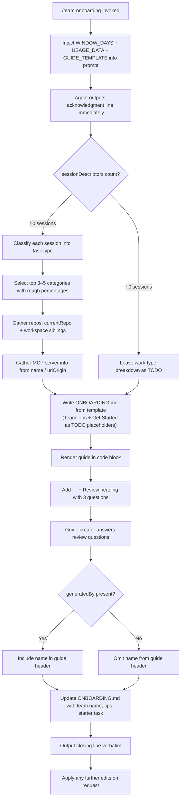

# `/team-onboarding`

> Analysis basis: CC v2.1.158 bundle.js (AST extraction + Claude interpretation)
> Minimum version: v2.1.158

---

## Overview

`/team-onboarding` is a `prompt`-type slash command that transforms a power user's local Claude Code usage history into a shareable `ONBOARDING.md` guide for teammates who are new to Claude Code. It operates in a two-turn collaborative loop: the first turn generates a concrete draft guide (written to `ONBOARDING.md`) immediately from scanned transcript data, then the second turn incorporates the guide creator's answers to three targeted review questions before finalizing the file.

---

## Registration

| Field | Value |
|---|---|
| type | `prompt` |
| name | `team-onboarding` |
| description | `Help teammates ramp on Claude Code with a guide from your usage` |
| isHidden | `false` |
| handler_method | `getPromptForCommand` |
| prompt_body length | 4539 characters |
| loc_line | 8940 |

Analysis basis: CC v2.1.158 bundle.js:+12708735

---

## Input Branching

The prompt body references two runtime template variables (`{{WINDOW_DAYS}}` and `{{USAGE_DATA}}`) and one guide template variable (`{{GUIDE_TEMPLATE}}`). The branching logic within the prompt instruction set is described below.



Analysis basis: CC v2.1.158 bundle.js:+12708735

---

## Behavioral Spec

### Phase 1 — Immediate Acknowledgment

The agent's very first visible output must be a single acknowledgment line referencing `WINDOW_DAYS`. No classification, no tool calls, and no extended thinking may precede it. This guards against the guide creator seeing a blank screen during any model reasoning delay.

```
function outputAcknowledgmentLine(windowDays):
    emit "> Looking at how you've used Claude over the last {windowDays} days " +
         "to put together an onboarding guide for teammates new to Claude Code."
    # Nothing else before this line — no internal reasoning output, no tool calls
```

Analysis basis: CC v2.1.158 bundle.js:+12708735

---

### Phase 2 — Work-Type Classification

The agent reads the `sessionDescriptors` array from `USAGE_DATA`. Each entry carries a session title, optional `prNumbers` (linked code-review pull requests), and the first user message of that session.

```
TASK_TYPES = [
    "build_feature",    # new functionality, scripts, tools, config/CI/env setup
    "debug_fix",        # investigating and fixing bugs
    "improve_quality",  # refactoring, tests, cleanup, code review
    "analyze_data",     # queries, metrics, number crunching
    "plan_design",      # architecture, strategy, design review, understanding unfamiliar code
    "prototype",        # spikes, POCs, throwaway exploration
    "write_docs"        # PRDs, RFCs, READMEs, design docs, copy/doc review
]

REVIEW_ROUTING = {
    "code review"   -> "improve_quality",
    "doc review"    -> "write_docs",
    "design review" -> "plan_design"
}

function classifySessions(sessionDescriptors):
    if len(sessionDescriptors) == 0:
        return TODO_PLACEHOLDER

    counts = empty map keyed by task type

    for session in sessionDescriptors:
        primarySignal  = session.firstUserMessage
        enrichment     = [session.title, session.prNumbers]
        weakHint       = [session.toolCount, session.mcpCount]  # used only if primarySignal uninformative

        category = matchToTaskType(primarySignal, enrichment, weakHint, TASK_TYPES, REVIEW_ROUTING)
        # Invent new category only if genuinely different type of task
        counts[category] += 1

    total = sum(counts.values())
    topCategories = top(3..5, counts, key=count)

    return [(cat, round(count/total * 100)) for cat, count in topCategories]

function formatCategoryName(snakeCaseKey):
    # "build_feature" -> "Build Feature"
    return titleCase(replace(snakeCaseKey, "_", " "))
```

Analysis basis: CC v2.1.158 bundle.js:+12708735

---

### Phase 3 — Repo and MCP Server Discovery

```
function gatherContext(usageData, workspace):
    repos = [usageData.currentRepo]
    for dir in workspace.siblingDirectories:
        if isRepoDirectory(dir):
            repos.append(dir)

    mcpServers = []
    for entry in usageData.mcpEntries:
        description = inferServerPurpose(entry.name, entry.urlOrigin)
        accessInstructions = deriveAccessMethod(entry.name, entry.urlOrigin)
        mcpServers.append({name: entry.name, description, accessInstructions})

    return {repos, mcpServers}
```

Analysis basis: CC v2.1.158 bundle.js:+12708735

---

### Phase 4 — Guide Generation and File Write

The agent fills in the `{{GUIDE_TEMPLATE}}` template with real numbers from `USAGE_DATA`. Specific rules for template population:

```
function populateGuideTemplate(template, usageData, categoryBreakdown, context):
    guide = template

    # Author attribution
    if usageData.generatedBy is present:
        guide = insertField(guide, "generatedBy", usageData.generatedBy)
    else:
        guide = omitNameField(guide)

    # ASCII bar charts: 20-character wide, filled with █, remainder with ░
    for metric in usageData.numericMetrics:
        barFilled  = round(metric.ratio * 20) characters of "█"
        barEmpty   = (20 - len(barFilled)) characters of "░"
        guide = insertBarChart(guide, metric.key, barFilled + barEmpty)

    # Work-type breakdown with title-case display names
    for (category, percent) in categoryBreakdown:
        guide = appendBreakdownRow(guide, formatCategoryName(category), percent)

    # Leave Team Tips and Get Started as explicit TODO placeholders
    guide = setSection(guide, "Team Tips",   "<!-- TODO -->")
    guide = setSection(guide, "Get Started", "<!-- TODO -->")

    # Preserve the HTML comment instruction at the bottom verbatim
    guide = preserveHtmlComment(guide)

    writeFile("ONBOARDING.md", guide)
    return guide
```

Analysis basis: CC v2.1.158 bundle.js:+12708735

---

### Phase 5 — First-Turn Close and Review Questions

After writing the file the agent renders the guide inside a fenced code block, then appends a visual separator (`---`) followed by a `**Review**` heading. Under that heading it posts exactly three numbered questions:

```
function closeFirstTurn(guide, inferredTeamName):
    emit fencedCodeBlock(guide)
    emit "---"
    emit "**Review**"

    # Question 1: team name confirmation or request
    if inferredTeamName is not None:
        emit "1. \"I went with '{inferredTeamName}' for the team name — " +
             "let me know if that sounds right.\""
    else:
        emit "1. \"What's the team name? I'll add it in.\""

    emit "2. Is there a starter task for someone new to Claude Code? " +
         "(ticket or doc link — optional)"
    emit "3. Any team tips you'd tell a new teammate that aren't already in CLAUDE.md?"
```

Analysis basis: CC v2.1.158 bundle.js:+12708735

---

### Phase 6 — Second-Turn Update and Finalization

```
function processReviewAnswers(answers, existingGuide):
    updatedGuide = existingGuide

    if answers.teamName is provided:
        updatedGuide = setField(updatedGuide, "teamName", answers.teamName)

    if answers.starterTask is provided:
        updatedGuide = setSection(updatedGuide, "Get Started", answers.starterTask)

    if answers.teamTips is provided:
        updatedGuide = setSection(updatedGuide, "Team Tips", answers.teamTips)

    writeFile("ONBOARDING.md", updatedGuide)

    # Closing line must be output verbatim — not numbered, not paraphrased
    emit "Saved to `ONBOARDING.md`. Drop it in your team docs and channels — " +
         "when a new teammate pastes it into Claude Code, they get a guided " +
         "onboarding tour from there."

function applySubsequentEdits(editRequest, currentGuide):
    updatedGuide = applyEdits(currentGuide, editRequest)
    writeFile("ONBOARDING.md", updatedGuide)
```

Analysis basis: CC v2.1.158 bundle.js:+12708735

---

## State & Side Effects

| Item | Detail |
|---|---|
| Telemetry | <!-- TODO: not found in depth-2 traversal; needs --depth 4 --> |
| File write | Writes and overwrites `ONBOARDING.md` in the working directory (first-turn draft + second-turn update) |
| Hook registration | <!-- TODO: not found in depth-2 traversal; needs --depth 4 --> |
| appState changes | <!-- TODO: not found in depth-2 traversal; needs --depth 4 --> |
| Sound | <!-- TODO: not found in depth-2 traversal; needs --depth 4 --> |
| Template variable injection | `{{WINDOW_DAYS}}`, `{{USAGE_DATA}}`, `{{GUIDE_TEMPLATE}}` resolved by `getPromptForCommand` before the prompt is sent |
| Conversation turns | Minimum two turns: draft generation turn + review-answer incorporation turn; additional turns for subsequent edits |

Analysis basis: CC v2.1.158 bundle.js:+12708735

---

## Version History

| Version | Change |
|---|---|
| v2.1.158 | Initial analysis — command registered at bundle byte offset 12708735, line 8940 |

---

## Common Mistakes

1. **Waiting for answers before generating a draft.** The prompt explicitly instructs the agent to generate the guide immediately, then ask for revisions. Prompting the user with questions before producing a draft is an instruction violation. Generate first, review second.

2. **Prefixing the acknowledgment line with reasoning or tool calls.** The acknowledgment line (`> Looking at how you've used Claude…`) must be the very first visible output. Any model reasoning, tool invocations, or classification work that surfaces before this line violates the command's ordering contract.

3. **Inventing unnecessary task categories.** The seven built-in task types (`build_feature`, `debug_fix`, `improve_quality`, `analyze_data`, `plan_design`, `prototype`, `write_docs`) cover the vast majority of sessions. A new category should only be introduced if the session genuinely represents a task type that cannot be mapped to any of the seven. Over-categorization produces a noisy breakdown.

4. **Using placeholder text instead of real numbers.** The guide template is populated with actual figures from `USAGE_DATA`, not template strings like `{{SESSIONS}}`. ASCII bar charts must be rendered with `█`/`░` characters at 20-character width.

5. **Paraphrasing or numbering the closing line.** The final line of the second turn — *"Saved to `ONBOARDING.md`. Drop it in your team docs and channels…"* — must be output verbatim and must not be wrapped in a numbered list or modified in any way.

6. **Omitting the `---` separator and `**Review**` heading.** These structural markers visually separate the guide code block from the review questions and are required by the command spec, not optional styling.

7. **Misrouting review sessions.** Code review maps to `improve_quality`, doc review maps to `write_docs`, and design review maps to `plan_design`. Routing all review sessions to a single generic "review" bucket is incorrect.

---

## Appendix — Identifier Mapping

> For bundle debugging only. Identifiers change across versions.

| Identifier | Role |
|---|---|
| (none extracted) | No obfuscated identifiers were found in the depth-2 AST traversal for this command. The `identifiers` array is empty in the source data. |

Note: The `callGraph`, `literals`, `telemetry`, and `identifiers` arrays are all empty in the extracted data; the `note` field records "no entry functions found for module 'undefined'", indicating that dynamic dispatch or lazy loading may prevent static resolution of the handler beyond the prompt body itself. All behavioral claims above are grounded in the prompt body extracted at bundle.js:+12708735.