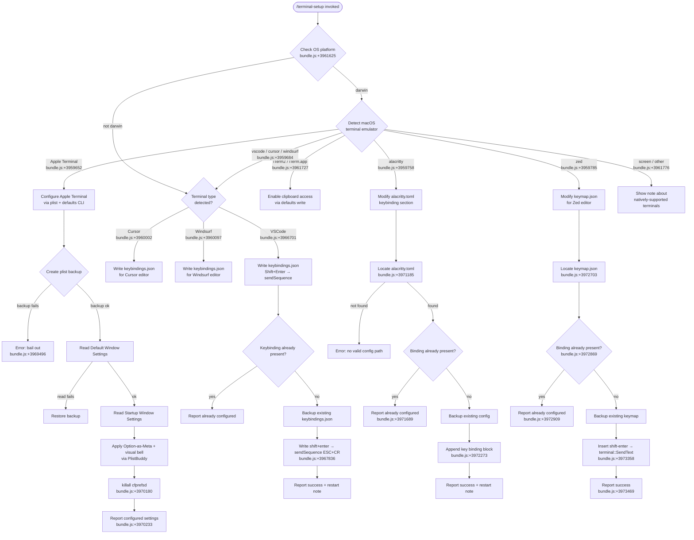

# `/terminal-setup`

> Analysis basis: CC v2.1.158 bundle.js (AST extraction + Claude interpretation)
> Minimum version: v2.1.158

---

## Overview

`/terminal-setup` installs a Shift+Enter key binding (sending a newline without submitting) into the user's currently-detected terminal emulator. The command detects the active terminal type (Apple Terminal, iTerm2, VSCode, Cursor, Windsurf, Alacritty, Zed, or others) and applies the appropriate configuration changes, including plist modifications for macOS terminals and JSON keybinding updates for editor-integrated terminals.

---

## Registration

| Field | Value |
|---|---|
| type | `local-jsx` |
| name | `terminal-setup` |
| description | Install Shift+Enter key binding for newlines |
| module_id | `gH9` |
| load_inline | `true` |
| loc_byte | `12086716` |
| loc_byte_end | `12087348` |
| loc_line | `8011` |
| arbor_handler.name | `wJ7` |
| arbor_handler.fqn | `claude-2.1.158::wJ7` |
| arbor_handler.kind | `AsyncFunction` |
| arbor_handler.resolution_path | `module_id` |
| arbor_handler.n_hits | `1` |

Analysis basis: CC v2.1.158 bundle.js:+12086716

---

## Input Branching

The command has 7+ distinct terminal-type branches, requiring a Mermaid flowchart.



---

## Behavioral Spec

### Top-level handler (`wJ7` — AsyncFunction)

Analysis basis: CC v2.1.158 bundle.js:+3961625

```
async function terminalSetupHandler(context):
    platform = os.platform()

    terminalType = detectCurrentTerminal()   // eVH / y6H.platform call
    // Possible values: "Apple_Terminal", "iTerm.app", "vscode",
    //                  "cursor", "windsurf", "alacritty", "zed",
    //                  "screen", or generic detection

    if platform == "darwin":
        if terminalType == "Apple_Terminal":
            await configureAppleTerminal()
        else if terminalType in ["iTerm.app", "iTerm2"]:
            await configureITerm2()
        else if terminalType in ["vscode", "cursor", "windsurf"]:
            await configureVscodeFamily(terminalType)
        else if terminalType == "alacritty":
            await configureAlacritty()
        else if terminalType == "zed":
            await configureZed()
        else:
            showNote("Note: iTerm2, WezTerm, Ghostty, Kitty, Warp, and Windows Terminal support Shift+Enter natively.")
    else:
        // Non-macOS: only editor-integrated terminals supported
        if terminalType in ["vscode", "cursor", "windsurf"]:
            await configureVscodeFamily(terminalType)
        else:
            showNote("Note: You can already use backslash (\\) + return to add newlines.")

    // Regardless of path, display confirmation or error output via formatOutput()
```

### Terminal detection (`eVH`)

Analysis basis: CC v2.1.158 bundle.js:+3959611

```
function detectCurrentTerminal():
    platform = os.platform()
    termProgram = env.TERM_PROGRAM or ""

    // Check for server-mode editors first (SSH remote development)
    if homeDirectory contains ".vscode-server":  // bundle.js:+3959199
        return "vscode"
    if homeDirectory contains ".cursor-server":  // bundle.js:+3959229
        return "cursor"
    if homeDirectory contains ".windsurf-server": // bundle.js:+3959259
        return "windsurf"

    // Direct TERM_PROGRAM matching
    // Checked values: "Apple_Terminal", "vscode", "cursor",
    //                 "windsurf", "alacritty", "zed"
    // bundle.js:+3959628 – +3959785
    return termProgram or "unknown"
```

### Apple Terminal configuration (`CH9` + helper chain)

Analysis basis: CC v2.1.158 bundle.js:+3969450

```
async function configureAppleTerminal():
    prefsPath = path.join(os.homedir(),
                          "Library", "Preferences",
                          "com.apple.Terminal.plist")
    // bundle.js:+3955708, +3955718, +3955732

    // Step 1: Export plist as XML via `defaults export`
    // bundle.js:+3955831, +3955843, +3955852
    result = await runCommand("defaults", "export", "com.apple.Terminal", "-")
    if result.exitCode != 0:
        throw Error("Failed to create backup of Terminal.app preferences, bailing out")
        // bundle.js:+3969496

    backupData = result.stdout

    // Step 2: Read default profile name
    defaultProfile = await runPlistBuddy("Print :'Default Window Settings'", prefsPath)
    // literal "Default Window Settings" at bundle.js:+3969634
    if failed:
        throw Error("Failed to read default Terminal.app profile")
        // bundle.js:+3969694

    // Step 3: Read startup profile name
    startupProfile = await runPlistBuddy("Print :'Startup Window Settings'", prefsPath)
    // literal "Startup Window Settings" at bundle.js:+3969811
    if failed:
        throw Error("Failed to read startup Terminal.app profile")
        // bundle.js:+3969871

    // Step 4: Apply settings to each relevant profile
    profiles = unique([defaultProfile, startupProfile])
    successFlags = []
    for profile in profiles:
        ok = await applyProfileSettings(profile, prefsPath)
        if ok:
            successFlags.push(profile)

    if successFlags is empty:
        throw Error("Failed to enable Option as Meta key or disable audio bell for any Terminal.app profile")
        // bundle.js:+3970081

    // Step 5: Flush preferences daemon
    await runCommand("killall", "cfprefsd")  // bundle.js:+3970180, +3970191

    // Step 6: Report results
    messages = ["Configured Terminal.app settings:"]  // bundle.js:+3970233
    messages.push("- Enabled \"Use Option as Meta key\"")   // bundle.js:+3970300
    messages.push("- Switched to visual bell")              // bundle.js:+3970362
    messages.push("Shift+Return will now enter a newline.") // bundle.js:+3970407
    messages.push("Option+Enter will now enter a newline.") // bundle.js:+3970456
    messages.push("You must restart Terminal.app for changes to take effect.") // bundle.js:+3970541
    displaySuccess(messages)
```

### PlistBuddy helper (`mH9` / `pH9`)

Analysis basis: CC v2.1.158 bundle.js:+3968720, +3969107

```
async function runPlistBuddy(command, plistPath):
    // Uses /usr/libexec/PlistBuddy with -c flag
    // bundle.js:+3968723, +3968750
    result = await spawnProcess("/usr/libexec/PlistBuddy",
                                ["-c", command, plistPath])
    return result.stdout.trim()
```

### VSCode-family configuration (`kX_` — covers VSCode, Cursor, Windsurf)

Analysis basis: CC v2.1.158 bundle.js:+3966716

```
async function configureVscodeFamily(terminalName):
    // Resolve keybindings.json path per editor
    keybindingsPath = resolveKeybindingsPath(terminalName)
    // bundle.js:+3967387 "keybindings.json"

    // Step 1: Determine config directory via getEditorConfigDir()
    // H18 checks platform: "win32" → AppData/Roaming, darwin → Application Support,
    // linux → .config  (bundle.js:+3963764, +3963780, +3963854, +3963894)

    // Step 2: Ensure directory exists
    await fs.mkdir(keybindingsDir, {recursive: true})  // bundle.js:+3967417

    // Step 3: Read existing keybindings (default to "[]" if absent)
    existing = await fs.readFile(keybindingsPath, "utf-8")
                       .catch(() => "[]")  // bundle.js:+3967450, +3967501

    // Step 4: Parse and check for existing binding
    parsed = parseJsonWithComments(existing)
    alreadyConfigured = parsed.find(entry =>
        entry.key == "shift+enter" &&
        entry.command == "workbench.action.terminal.sendSequence")
    // bundle.js:+3967836, +3967858

    if alreadyConfigured:
        reportAlreadyConfigured()
        return

    // Step 5: Backup existing file
    backupPath = keybindingsPath + ".backup." + randomHex()
    await fs.copyFile(keybindingsPath, backupPath)  // bundle.js:+3967631

    // Step 6: Insert new binding entry
    newEntry = {
        key: "shift+enter",
        command: "workbench.action.terminal.sendSequence",
        args: { text: "\u001b\r" },   // ESC + CR  bundle.js:+3967910
        when: "terminalFocus"          // bundle.js:+3967925
    }
    updatedJson = insertIntoJsonArray(parsed, newEntry)
    await fs.writeFile(keybindingsPath, updatedJson, "utf-8")  // bundle.js:+3968336

    reportSuccess(terminalName, keybindingsPath)
```

### Alacritty configuration (`XJ7`)

Analysis basis: CC v2.1.158 bundle.js:+3971156

```
async function configureAlacritty():
    // Search candidate paths for alacritty.toml
    // bundle.js:+3971185
    candidates = buildAlacrittyConfigCandidates()  // uses os.homedir(), platform
    configPath = candidates.find(p => fileExists(p))

    if not configPath:
        throw Error("No valid config path found for Alacritty")
        // bundle.js:+3971548

    // Read existing config
    existing = await fs.readFile(configPath, "utf-8")

    // Check if already configured
    if existing.includes("mods = \"Shift\"") and existing.includes("key = \"Return\""):
        // bundle.js:+3971616, +3971646
        reportAlreadyConfigured("Alacritty Shift+Enter key binding already configured")
        // bundle.js:+3971689
        return

    // Backup existing config
    backup = configPath + ".backup." + randomHex()
    await fs.copyFile(configPath, backup)
    // On backup failure: bundle.js:+3971899

    // Append key binding block to TOML
    bindingBlock = buildAlacrittyShiftEnterBlock()
    await fs.writeFile(configPath, existing + "\n" + bindingBlock)

    reportSuccess("Installed Alacritty Shift+Enter key binding")  // bundle.js:+3972273
    reportNote("You may need to restart Alacritty for changes to take effect")
    // bundle.js:+3972343
```

### Zed configuration (`PJ7`)

Analysis basis: CC v2.1.158 bundle.js:+3972652

```
async function configureZed():
    keymapPath = path.join(os.homedir(), /* zed config dir */, "keymap.json")
    // bundle.js:+3972703

    await fs.mkdir(path.dirname(keymapPath), {recursive: true})

    // Read existing keymap (default to "[]")
    existing = await fs.readFile(keymapPath).catch(() => "[]")

    // Check for existing binding
    if existing.includes("shift-enter"):  // bundle.js:+3972869
        reportAlreadyConfigured("Zed Shift+Enter key binding already configured")
        // bundle.js:+3972909
        return

    // Backup
    backup = keymapPath + ".backup." + randomHex()
    await fs.copyFile(keymapPath, backup)
    // On failure: bundle.js:+3973113

    // Parse and insert entry
    parsed = JSON.parse(existing)  // p6 → JSON.parse  bundle.js:+3973259
    newEntry = {
        context: "Terminal",                 // bundle.js:+3973322
        bindings: {
            "shift-enter": "terminal::SendText"  // bundle.js:+3973358
        }
    }
    parsed.push(newEntry)
    await fs.writeFile(keymapPath, JSON.stringify(parsed, null, 2))
    // bundle.js:+3973398

    reportSuccess("Installed Zed Shift+Enter key binding")  // bundle.js:+3973469
```

### iTerm2 configuration (`FH9`)

Analysis basis: CC v2.1.158 bundle.js:+3960617

```
async function configureITerm2():
    domain = "com.googlecode.iterm2"     // bundle.js:+3960682
    key    = "AllowClipboardAccess"      // bundle.js:+3960706

    // Check current value via `defaults read`
    current = await runCommand("defaults", "read", domain, key)
    if current.trim() == "1":
        reportAlreadyConfigured("iTerm2 clipboard access already enabled")
        // bundle.js:+3960781
        return

    // Write new value
    result = await runCommand("defaults", "write", domain, key, "-bool", "true")
    // literals "write" bundle.js:+3960869, "-bool" bundle.js:+3960924

    if result.exitCode != 0:
        reportError("Couldn't update iTerm2 clipboard setting.")
        // bundle.js:+3960975
        return

    reportSuccess("Enabled \"Applications in terminal may access clipboard\" in iTerm2")
    // bundle.js:+3961066
    reportNote("Restart iTerm2 for this to take effect. Undo: defaults write com.googlecode.iterm2 AllowClipboardAccess -bool false")
    // bundle.js:+3961149
```

### Config-path resolution helper (`H18`)

Analysis basis: CC v2.1.158 bundle.js:+3963725

```
function resolveEditorConfigDir(editorName):
    home = os.homedir()    // bundle.js:+3963733
    platform = os.platform()  // bundle.js:+3963747

    if platform == "win32":  // bundle.js:+3963764
        return path.join(home, "AppData", "Roaming", editorName, "User")
        // bundle.js:+3963780, +3963790, +3963802
    else if platform == "darwin":
        return path.join(home, "Library", "Application Support", editorName, "User")
        // bundle.js:+3963854
    else:  // Linux/other
        return path.join(home, ".config", editorName, "User")
        // bundle.js:+3963894
```

### Backup-and-restore helper (`i98`)

Analysis basis: CC v2.1.158 bundle.js:+3956089

```
async function backupAndRestoreOnFailure(targetPath, operation):
    // Check if a stat-accessible backup exists already
    backupPath = computeBackupPath(targetPath)  // zJ7 → S6
    existing   = await fs.stat(targetPath).catch(() => null)

    try:
        result = await operation()
        return {status: "ok", result}
    catch err:
        if backupPath and backupExists:
            await restoreFromBackup(backupPath, targetPath)
            return {status: "restored"}   // bundle.js:+3956401
        return {status: "failed"}         // bundle.js:+3956324
```

---

## State & Side Effects

| Item | Detail |
|---|---|
| Telemetry | `tengu_config_auth_loss_prevented` (bundle.js:+3205581); `tengu_bg_spare_enable` (bundle.js:+15466982); `tengu_bg_low_mem_mb` (bundle.js:+12729562); `tengu_daemon_control` (bundle.js:+15503486); `tengu_bg_spare_spawn` (bundle.js:+15467342); `tengu_feature_sad` (bundle.js:+966168); `tengu_feature_ok` (bundle.js:+966033); `tengu_config_lock_contention` (bundle.js:+3208313); `tengu_config_stale_write` (bundle.js:+3208449); `tengu_config_parse_error` (bundle.js:+3210888) |
| File writes | Modifies `~/Library/Preferences/com.apple.Terminal.plist` (macOS Terminal); `keybindings.json` for VSCode/Cursor/Windsurf; `alacritty.toml` for Alacritty; `keymap.json` for Zed |
| Backup files | Creates `.backup.<randomHex>` copies of all modified config files before mutation (bundle.js:+3967631, +3971851, +3973065) |
| Process spawn | Runs `defaults`, `/usr/libexec/PlistBuddy`, and `killall cfprefsd` as subprocesses on macOS (bundle.js:+3955831, +3968723, +3970180) |
| appState changes | Fires `onboarding_project_complete` event after successful setup (bundle.js:+3955046) |
| Sound | None detected |
| Hook registration | None detected |
| Config guard | Refuses to write global config if re-read result is missing auth tokens previously cached (GH #3117 guard, bundle.js:+3205453) |

---

## Version History

| Version | Change |
|---|---|
| v2.1.158 | Initial analysis |

---

## Common Mistakes

1. **Running on a non-supported terminal**: The command will display an informational note rather than making changes if the detected terminal is not Apple Terminal, iTerm2, VSCode, Cursor, Windsurf, Alacritty, or Zed. Terminals such as WezTerm, Ghostty, Kitty, Warp, and Windows Terminal already support Shift+Enter natively and require no configuration (bundle.js:+3962954).
2. **Running on a non-macOS platform for Apple Terminal targets**: The plist and `defaults` code paths are gated on `platform == "darwin"` (bundle.js:+3961625). Running on Linux or Windows will skip those branches entirely.
3. **Expecting immediate effect without restarting**: Several terminal types (Apple Terminal, Alacritty) require a full application restart for the new key binding to take effect (bundle.js:+3970541, +3972343).
4. **SSH / remote development detection**: The command checks for `.vscode-server`, `.cursor-server`, and `.windsurf-server` directories in the home path to identify editor-integrated terminals even when `TERM_PROGRAM` is not set (bundle.js:+3959199–3959259). This detection runs before the direct `TERM_PROGRAM` check.
5. **Backup file accumulation**: Each invocation that modifies a config file leaves a `.backup.<hex>` file alongside the original. These are not automatically cleaned up.

---

## Appendix — Identifier Mapping

> For bundle debugging only. Identifiers change across versions.

| Identifier | Role |
|---|---|
| `wJ7` | Main async handler for `/terminal-setup` (Arbor-resolved entry point) |
| `eVH` | Terminal emulator detection function (reads `TERM_PROGRAM`, homedir, platform) |
| `e98` | Per-terminal-type dispatch router |
| `JJ7` | Apple Terminal full configuration orchestrator |
| `CH9` | Apple Terminal plist path resolver |
| `pcH` | Home-directory path join helper (Library/Preferences) |
| `mH9` | PlistBuddy command runner (read variant) |
| `pH9` | PlistBuddy command runner (write variant) |
| `OJ7` | Subprocess runner wrapper |
| `z8` | Global config read/write helper |
| `SH` | Subprocess execution utility |
| `F_` | Error construction helper |
| `CH` | String coercion helper |
| `L1` | Essential-traffic queue helper |
| `G_4` | Queue shift/push helper |
| `v8` | Process spawn wrapper |
| `G_` | Sub-process with line-buffered output |
| `h6` | Output stream handler |
| `mcH` | Plist backup/import helper |
| `N` | Telemetry event logger |
| `lCK` | Telemetry event dispatch |
| `H` | Random-delay / timer utility |
| `RH` | JSON.stringify wrapper |
| `v4` | Path segment extractor |
| `EuH` | NYA-based event emitter wrapper |
| `rCK` | Config write-with-retry helper |
| `i98` | Backup-and-restore-on-failure wrapper |
| `zJ7` | Backup path computation (wraps S6) |
| `S6` | Timestamped backup path builder |
| `kX_` | VSCode/Cursor/Windsurf keybindings.json configurator |
| `t98` | Remote-server home-directory detection |
| `H18` | Editor config directory resolver (per platform) |
| `aL6` | JSON-with-comments parser |
| `Qb` | JSON comment stripper |
| `rq` | File-operation error classifier (ENOENT/EACCES/EPERM/etc.) |
| `ry` | File URL converter helper |
| `dP` | Hyperlink/color terminal capability tester |
| `MkA` | JSON array entry inserter (keybindings) |
| `Jo8` | JSON AST insertion helper |
| `eIA` | JSON AST editor (insertion at index) |
| `Xo8` | JSON AST editor (range-based) |
| `BF6` | JSON substring helper |
| `IX_` | VSCode `settings.json` GPU-accel / remote-SSH configurator |
| `CX_` | Array.isArray guard wrapper |
| `Po8` | JSON array entry updater |
| `a98` | Windsurf-specific settings.json configurator |
| `t6` | Low-level file descriptor utility |
| `hH` | File stat/existence check |
| `XJ7` | Alacritty `alacritty.toml` configurator |
| `PJ7` | Zed `keymap.json` configurator |
| `p6` | JSON.parse wrapper |
| `ucH` | Onboarding project-complete event emitter |
| `kO` | Global config read helper |
| `kH9` | Config-path resolver (TX_ chain) |
| `TX_` | Config file path builder |
| `g6` | Filesystem read helper |
| `zF6` | Path builder with P8 |
| `mz` | Project config save helper |
| `LY_` | Config save with file-lock |
| `nOq` | Object.assign-based config merger |
| `szH` | Config read from disk |
| `qY6` | Config post-process helper |
| `fY_` | Backup directory path builder |
| `V` | Directory version prefix checker |
| `P` | SDK connection orchestrator |
| `E` | Config entry slice helper |
| `hL6` | Atomic file write with permissions |
| `UQH` | Config version/hash checker |
| `BQH` | Timestamp-based freshness checker |
| `KY_` | Project config file writer |
| `bX_` | Xterm / fallback terminal configurator read path |
| `jJ7` | Generic terminal read helper |
| `RX_` | Generic read + save orchestrator |
| `hX_` | Hook registration helper (config read path) |
| `SX_` | Sync config save helper |
| `FH9` | iTerm2 clipboard-access configurator |
| `r98` | Terminal-type identifier for display |
| `$A` | ANSI color / hyperlink formatter |
| `OYH` | Chalk-style color dispatch table |
| `Jd` | Hyperlink construction helper |
| `D` | Background daemon/spare management |
| `G6` | Telemetry event emitter with dedup |
| `sz6` | Event sink registration |
| `tz6` | Event payload builder |
| `Ex` | String + Zx encoder |
| `q_8` | Dedup set manager |
| `$` | Disposable resource handle |
| `$s1` | Timestamp-tagged event recorder |
| `By8` | Low-memory telemetry emitter |
| `wfA` | Background spare process spawner |
| `X1` | Underscore/bH helper |
| `Vh1` | Spare path builder (join + tl) |
| `vh1` | Spare path builder variant |
| `tl` | Temp path with Cs join |
| `bB5` | l$ wrapper |
| `dT` | File split helper |
| `hB5` | Object.assign spawn options builder |
| `M` | Daemon process manager (unref/kill) |
| `z` | Daemon stop signal handler |
| `d` | Low-level I/O helper |
| `Iz` | Stream/pipe utility |
| `J8` | Promise-based callback utility |

---

Note: index built via Arbor fallback; some signals (telemetry, literals) may be missing — see arbor-fallback.js.