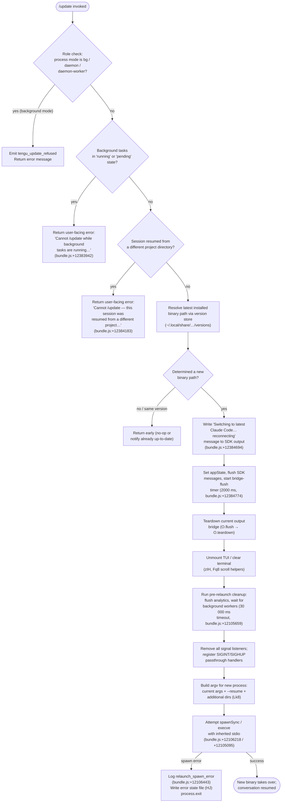

# `/update`

> Analysis basis: CC v2.1.158 bundle.js (AST extraction + Claude interpretation)
> Minimum version: v2.1.158

---

## Overview

`/update` switches the running Claude Code process to the latest installed version while keeping the current conversation alive. It performs a series of safety checks, flushes all in-flight I/O, tears down the current process state, and then relaunches the CLI (via `spawnSync` / `execve`) so that the new binary takes over with a `--resume` flag, restoring the conversation context.

---

## Registration

| Field | Value |
|---|---|
| type | `local` |
| name | `update` |
| description | `Switch to the latest version (conversation continues)` |
| supportsNonInteractive | `false` |
| isHidden | `true` |
| module_id | `Vo1` |
| load_inline | `true` |
| loc_byte | `12385672` |
| loc_byte_end | `12385913` |
| loc_line | `8264` |
| arbor_handler.name | `X$5` |
| arbor_handler.fqn | `claude-2.1.158::X$5` |
| arbor_handler.kind | `AsyncFunction` |
| arbor_handler.resolution_path | `module_id` |
| arbor_handler.n_hits | `0` |

Analysis basis: CC v2.1.158 bundle.js:+12385672

---

## Input Branching

Five or more distinct guard branches exist before the actual relaunch occurs, so a Mermaid flowchart is used.



---

## Behavioral Spec

### Guard — Background-mode rejection

```
function checkNotBackgroundMode(processRole):
    if processRole in ["bg", "daemon", "daemon-worker"]:
        emit telemetry("tengu_update_refused")
        return Error("update not allowed in background mode")
    return OK
```

Analysis basis: CC v2.1.158 bundle.js:+12383578 (telemetry), +12383481 (literal `"claude"`), +2201979–+2202003 (mode literals)

---

### Guard — Running background tasks

```
function checkNoActiveTasks(taskMap):
    for each task in Object.values(taskMap):
        if task.status in ["running", "pending"]:
            return Error(
                "Cannot /update while background tasks are running" +
                " — wait for them to finish, then try again."
            )
    return OK
```

Analysis basis: CC v2.1.158 bundle.js:+12383839 (`"running"`), +12383861 (`"pending"`), +12383942 (error string)

---

### Guard — Mismatched project directory

```
function checkProjectDirectoryMatch(appState, sessionOriginDir):
    currentDir = appState.workingDirectory   // key "working_directory"
    if sessionOriginDir != currentDir:
        return Error(
            "Cannot /update — this session was resumed from a" +
            " different project directory. Restart manually with" +
            " --resume to continue on the latest version."
        )
    return OK
```

Analysis basis: CC v2.1.158 bundle.js:+12384183 (error string), +10679953 (`"working_directory"`)

---

### Version resolution

```
function resolveLatestBinaryPath():
    // Locate the versions directory under ~/.local/share/<name>/versions
    home = os.homedir()                          // via homedirHelper
    versionsDir = path.join(home, ".local", "share", <appName>, "versions")
    // Check available version entries; pick the latest
    entries = listDirectory(versionsDir)
    binPath = path.join(versionsDir, latestEntry, "bin")
    return binPath
```

Analysis basis: CC v2.1.158 bundle.js:+7866820 (`".local"`), +7866829 (`"share"`), +9114665 (`"versions"`), +7866900 (`"bin"`)

The helper that builds this path is `getInstallPathHelper` (bundle identifier `ch`), which in turn calls `pathJoinHelper` (`aW8`) and `homedirPathHelper` (`gLH`/`gj8`).

---

### Pre-relaunch message and bridge flush

```
async function notifyAndFlushBridge(outputBridge):
    outputBridge.writeSdkMessages([
        assistantMessage("Switching to latest Claude Code… reconnecting")
    ])
    await Promise.race([
        outputBridge.flush(),
        timeout(2000)                // "bridge flush" timeout
    ])
    outputBridge.teardown()
```

Analysis basis: CC v2.1.158 bundle.js:+12384694 (message literal), +12384774 (2000 ms), +12384779 (`"bridge flush"`), +12384764 (`O.flush`), +12384815 (`O.teardown`)

---

### TUI teardown

```
function teardownTerminalUI():
    // Stop the spinner / clear interval
    clearInterval(spinnerInterval)               // stopSpinner (identPGroup $P6 → Xv_)
    // Unmount the Ink/React render tree
    unmountTUI()                                 // zIH → H.unmount
    // Restore terminal scroll position (ESC-7 / ESC-8 ANSI sequences)
    restoreTerminalScroll()                      // Fq8: writes "\x1b7" and "\x1b8"
```

Analysis basis: CC v2.1.158 bundle.js:+12105614 (`$P6`), +5355785 (`H.unmount`), +3716519/+3716530 (ANSI escape literals)

---

### Cleanup pipeline before execve

```
async function preRelaunchCleanup(options):
    // 1. Wait for the hook queue to drain
    await drainHookQueue()                       // oxH → qOA.drain

    // 2. Flush analytics with a 500 ms race timeout
    await Promise.race([
        flushAnalytics(),                        // bf8 → g8
        timeout(500)                             // bundle.js:+5357542
    ])

    // 3. Wait for all parallel teardown tasks with a 30 000 ms deadline
    await Promise.race([
        Promise.all(teardownPromises),
        timeout(30000, "flush timeout (relaunch)")  // bundle.js:+12105659 / +12105665
    ])

    // 4. Additional "cleanup timeout" guard (bundle.js:+12105721)
    await Promise.race([
        backgroundWorkerCleanup(),
        timeout(cleanupTimeoutMs, "cleanup timeout")
    ])
```

Analysis basis: CC v2.1.158 bundle.js:+12105638 (`Promise.all`), +12105651 (`tL`), +12105654 (`FT`), +12105710 (`oxH`), +12105766 (`bf8`), +12105659 (`30000`), +12105665, +12105721, +5357542 (`500`)

---

### Argv construction for the new process

```
function buildRelaunchArgv(currentArgv, sessionId, addedDirs, flags):
    newArgv = Array.from(currentArgv)

    // Always include --resume so the new binary picks up the session
    newArgv.push("--resume")
    newArgv.push(sessionId)

    // Forward any extra project directories added during this session
    for dir in addedDirs:
        newArgv.push("--add-dir", dir)           // "--add-dir" literal: +12107116

    // Forward permission-related flags if present
    if flags.allowDangerouslySkipPermissions:
        newArgv.push("--allow-dangerously-skip-permissions")
    if flags.effort:
        newArgv.push("--effort", flags.effort)
    if flags.permissionMode:
        newArgv.push("--permission-mode", flags.permissionMode)

    return newArgv
```

Analysis basis: CC v2.1.158 bundle.js:+12105592 (`"--resume"`), +12107116 (`"--add-dir"`), +12107285, +12107427, +12107444, +12106941 (`Array.from`), +12107088 (`U96`), +12107138, +12107389

---

### Process replacement (execve / spawnSync)

```
async function replaceProcess(binaryPath, newArgv, env):
    // Remove all existing signal listeners to avoid double-handling
    process.removeAllListeners()                 // +12106161
    // Re-register passthrough handlers for SIGINT and SIGHUP
    process.on("SIGINT",  () => {})
    process.on("SIGHUP",  () => {})

    try:
        // Preferred path: true execve (replaces the process image)
        execve(binaryPath, newArgv, env)         // M.execve, +12105095
    catch spawnError:
        // Fallback: spawnSync with inherited stdio
        result = child_process.spawnSync(
            binaryPath, newArgv,
            { stdio: "inherit" }                 // "inherit" literal: +12106253
        )
        if result.status != 0:
            writeErrorStateFile()                // HJ → TuH.writeFileSync
            emit telemetry or log("relaunch_spawn_error")  // +12106443
            process.exit(result.status ?? (128 + signal))  // 128 literal: +12106580
```

Analysis basis: CC v2.1.158 bundle.js:+12106161, +12106191, +12106218 (`cd1.spawnSync`), +12105095 (`M.execve`), +12106253, +12106348, +12106440, +12106443, +12106467, +12106532, +12106580

---

### Session-state propagation to new process

```
function buildSessionFlags(appState, lastMessage):
    flags = {}

    // Carry forward working_directory, allowed_tools, disallowed_tools, etc.
    flags.workingDirectory   = appState["working_directory"]    // +10679953
    flags.allowedTools       = appState["allowed_tools"]        // +10680008
    flags.disallowedTools    = appState["disallowed_tools"]     // +10680063
    flags.avoidPrompts       = appState["avoid_prompts"]        // +10680124
    flags.effort             = appState["effort"]               // +10680448
    flags.model              = appState["model"]                // +10680461
    flags.flagSettings       = appState["flag_settings"]        // +10680473

    return flags
```

Analysis basis: CC v2.1.158 bundle.js:+10679953, +10680008, +10680063, +10680124, +10680448, +10680461, +10680473

---

## State & Side Effects

| Item | Detail |
|---|---|
| Telemetry: `tengu_update_refused` | Fired when `/update` is blocked because the process role is `bg`, `daemon`, or `daemon-worker` (bundle.js:+12383578) |
| Telemetry: `tengu_scroll_summary` | Fired inside the scroll-state helper called during TUI teardown (bundle.js:+5357253) |
| Telemetry: `tengu_amber_creek` | Fired in fullscreen-mode detection path reached during teardown (bundle.js:+3377806) |
| Telemetry: `tengu_pewter_brook` | Fired in an alternate fullscreen-mode detection branch (bundle.js:+3377714) |
| Telemetry: `tengu_bg_dispatch_sigkill_escalate` | Fired if a background worker requires SIGKILL escalation during cleanup (bundle.js:+15467649) |
| Telemetry: `tengu_config_parse_error` | Fired if config-file parsing fails while reading session state (bundle.js:+3210888) |
| SDK output | Writes the "Switching to latest Claude Code… reconnecting" assistant message before teardown |
| appState changes | `_.setAppState` called before teardown to snapshot session state for the new process (bundle.js:+12384584) |
| appState read | `_.getAppState` called twice: once to build session flags (bundle.js:+12384430), once more post-flush (bundle.js:+12385000 via `y$`) |
| Hook drain | `qOA.drain` is awaited to let all registered hooks complete before relaunch |
| Conversation log | `_.appendEntry` called with key `"last-prompt"` to persist the last prompt before exit (bundle.js:+12893779) |
| Signal listeners | All existing `process` listeners are removed; SIGINT and SIGHUP are re-registered as pass-throughs |
| Terminal | TUI is unmounted; terminal scroll state is saved/restored via ANSI escape sequences `\x1b7` / `\x1b8` |
| UUID generation | `Zo1` uses `Uk8.randomUUID` to generate a session-continuation UUID (bundle.js:+12382551) |
| Process replacement | `M.execve` / `cd1.spawnSync` with `stdio: "inherit"` — the current process image is replaced by the new binary |
| Error state file | If relaunch fails, `HJ` writes an error file via `TuH.writeFileSync` to `YB8.join(…)` path (bundle.js:+190998) |

---

## Version History

| Version | Change |
|---|---|
| v2.1.158 | Initial analysis |

---

## Common Mistakes

1. **Running `/update` while background tasks are active.** The command immediately returns an error message if any task has status `"running"` or `"pending"`. Wait for all background tasks to complete before issuing `/update`.

2. **Running `/update` in a daemon/background session.** The command is blocked when the process role is `bg`, `daemon`, or `daemon-worker`. It is designed for interactive foreground sessions only (`supportsNonInteractive: false`).

3. **Session resumed from a mismatched project directory.** If the CLI was started with `--resume` pointing at a session whose `working_directory` no longer matches the current directory, `/update` refuses to proceed. In this case, restart the CLI manually with the correct `--resume` flag after updating.

4. **Expecting immediate reconnection.** The relaunch involves a full process replacement (`execve`). If `execve` is unavailable (non-Linux/macOS environments), a `spawnSync` fallback is used; in either case there is an observable gap before the new process prints its first output.

5. **The command is hidden.** `isHidden: true` means `/update` does not appear in the standard slash-command autocomplete list. It must be typed explicitly.

---

## Appendix — Identifier Mapping

> For bundle debugging only. Identifiers change across versions.

| Identifier | Role |
|---|---|
| `X$5` | Main handler for `/update` (AsyncFunction resolved via module_id `Vo1`) |
| `Bk8` | Pre-flight checker: resolves `claude` binary via PATH and install path |
| `O3` | `which`-wrapper: locates the `claude` executable on PATH |
| `mIA` | Inner helper called by `O3`; invokes `Bun.which` |
| `ch` | Install-path builder: constructs versioned binary path from home dir |
| `aW8` | Path-join helper used by `ch` to build versioned install path |
| `l$` | Array normalization helper used by `aW8` / `ch` |
| `gLH` | Returns the `.local/share` prefix path under `$HOME` |
| `gj8` | `os.homedir()` wrapper |
| `Q_H` | Returns the `bin` subdirectory path inside a versioned install |
| `v9` | Process-role detector (checks `bg` / `daemon` / `daemon-worker`) |
| `QOH` | Inner helper for role detection |
| `d` | Generic logger / debug helper |
| `zj` | Extracts basename of the current executable and calls path-safe helper |
| `I6` | Generic async wrapper / queue helper |
| `qN` | Low-level Promise/callback utility |
| `$k` | File-system stat or path-existence helper |
| `C6A` | Directory resolver: obtains dirname and resolves symlinks for the binary |
| `O_` | Path resolution helper used by `C6A` |
| `UK` | Additional path helper used by `C6A` |
| `EqH` | Background-task map accessor |
| `as` | Hook-set accessor (checks `nJ5.has`, references `"ant"` and `"attachment"` literals) |
| `Oh8` | Hook-set initializer / registry helper |
| `H_A` | Last-prompt persistence helper; calls `_.appendEntry` with key `"last-prompt"` |
| `U4` | Queue/registry register helper |
| `q9` | Calls `qOA.register` to register a teardown callback |
| `SH` | Telemetry/log submission helper (calls `Vi.logError`, manages a rolling buffer via `G_4`) |
| `F_` | Error-to-string formatter |
| `CH` | String coercion utility |
| `L1` | Log-entry builder |
| `$VA` | Log-level formatter; calls `CH` for string coercion |
| `G_4` | Rolling log-buffer manager (`gB6.shift` / `gB6.push`) |
| `uT` | Sets a transient "updating" flag on appState |
| `O` | Output bridge (SDK message writer); exposes `writeSdkMessages`, `flush`, `teardown` |
| `I8` | Inner I/O helper used by `O` |
| `Zo1` | UUID generator for session continuation; calls `Uk8.randomUUID` |
| `tL` | Timeout-race helper (`setTimeout` + `Promise.race` + `clearTimeout`) |
| `tYH` | String formatter for argv values |
| `J2H` | Relaunch orchestrator: stat-checks binary, runs cleanup pipeline, calls `execve`/`spawnSync`, handles error state |
| `$P6` | Spinner stop helper; calls `clearInterval` via `Xv_` |
| `Xv_` | `clearInterval` wrapper |
| `zIH` | TUI unmount helper: writes to stdout (`AjH.writeSync`), unmounts React tree (`H.unmount`), resets terminal |
| `H` | Ink/React render-mount instance |
| `SR` | Screen-clear or cursor-reset helper |
| `Fq8` | Terminal scroll save/restore helper (writes `\x1b7` / `\x1b8` escape sequences) |
| `NVH` | Terminal-emulator detection (Ghostty, iTerm, tmux) |
| `GVH` | Additional terminal-capability helper |
| `YW` | tmux escape-sequence wrapper |
| `Cf8` | Scroll-summary analytics helper; fires `tengu_scroll_summary` |
| `JZ` | Scroll-state accessor |
| `uX9` | Scroll measurement helper |
| `xX9` | Scroll metric calculator (`Date.now`, `Math.max`, `Math.round`) |
| `CX9` | Inner scroll-metric helper |
| `Aq` | Fullscreen/display-mode manager; fires `tengu_amber_creek` / `tengu_pewter_brook` |
| `B$H` | Feature-flag checker (`FsK.has`) |
| `ND_` | Display-mode string formatter |
| `mr` | Fullscreen toggle helper |
| `N` | ANSI / chalk color helper |
| `vD_` | Windows-SSH / ConPTY detection helper |
| `B_` | Fullscreen mode enabler |
| `G77` | Calls `G6` for display-mode state management |
| `G6` | Display-mode state machine (manages `izH`, `oz6`, `PU` sets) |
| `FT` | Flush-wait helper used in parallel teardown; calls `U4` |
| `oxH` | Hook-queue drain helper; calls `qOA.drain` |
| `bf8` | Analytics flush helper; races `Promise.all` against a 500 ms timeout |
| `g8` | Inner analytics flush; manages unlink of temp files via `q` |
| `K` | Worker/process list formatter |
| `q` | Temp-file unlink helper (`WVK.unlinkSync`) |
| `L` | Promise-tracking set helper (`q.add`, `q.delete`) |
| `Qd1` | execve / FFI-based process replacement helper; handles macOS (`libSystem.B.dylib`) and Linux (`libc.so.6`) |
| `f` | Native library handle (dlopen result) |
| `A` | Process/worker map |
| `$` | Module/worker registry |
| `$s1` | Worker-entry helper |
| `w` | Background-worker supervisor (manages spawn, kill, memory checks) |
| `S` | Individual background-session process wrapper |
| `bH` | Fires `tengu_feature_bad` on error |
| `hH` | Fires `tengu_feature_ok` on success |
| `By8` | Memory-usage sampler; fires `tengu_bg_low_mem_mb` |
| `fw6` | Config-file reader (`oP.readFile`) |
| `B` | Background-session roster |
| `jfA` | Background-session send/claim helper; fires `tengu_bg_sendclaim_failed` |
| `ZfA` | Background-session lifecycle manager; fires `tengu_bg_spare_enable`, `tengu_bg_spare_claim`, `tengu_bg_spare_spawn` |
| `D` | Background-worker dispatch loop; fires `tengu_bg_dispatch_sigkill_escalate`, `tengu_bg_dispatch_low_mem` |
| `J8` | Generic error-type helper |
| `R` | Resource-disposable wrapper |
| `M` | execve system-call wrapper (uses `nS6` for path normalization) |
| `nS6` | Path sanitizer for execve targets |
| `z` | Daemon stop/control helper; fires `tengu_daemon_control` |
| `Sy` | Daemon-control message builder |
| `Fm` | Daemon-stop orchestrator (`Promise.race`, `Promise.all`, `process.exit`) |
| `EH` | Error-message string coercion helper |
| `HJ` | Error-state file writer (`TuH.writeFileSync` to `YB8.join(…)`) |
| `Lk8` | Argv builder for the relaunch command; appends `--resume`, `--add-dir`, and other flags |
| `U96` | Session-ID serializer used by `Lk8` |
| `S6` | Auto-update check and binary-copy helper; watches the versions directory |
| `g6` | Config/data directory path helper |
| `HY_` | Version-string comparator |
| `szH` | Binary-copy worker: reads, backs up, and copies new binary with `copyFileSync` |
| `p6` | JSON-parse wrapper |
| `Qb` | Version-string prefix stripper |
| `RFq` | File-search helper (reads directories recursively) |
| `fY_` | Backup-directory path builder |
| `m17` | File-watcher helper (`j_8.watchFile` / `j_8.unwatchFile`) |
| `Vr` | Version comparison utility |
| `V_` | Session-flags extractor from appState (`working_directory`, `allowed_tools`, etc.) |
| `LV8` | Builds `allowed_tools` flag list |
| `aA` | Tool-name formatter |
| `fV8` | Builds `disallowed_tools` flag list |
| `y$` | Secondary appState reader used after flush |