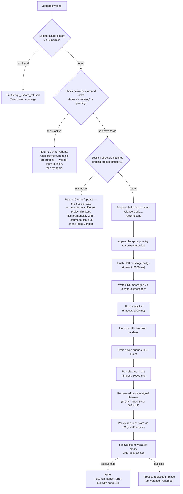

# `/update`

> Analysis basis: CC v2.1.150 bundle.js (AST extraction + Claude interpretation)
> Minimum version: v2.1.150

---

## Overview

The `/update` command upgrades the running Claude Code process to the latest installed version while preserving the current conversation context. It locates the `claude` binary using `Bun.which`, validates that no background tasks are active and that the session directory matches the original project, then performs an in-process teardown followed by an `execve`-style relaunch that passes `--resume` so the conversation continues seamlessly.

---

## Registration

| Field | Value |
|---|---|
| type | `local` |
| name | `update` |
| description | `Switch to the latest version (conversation continues)` |
| supportsNonInteractive | `false` |
| isHidden | `true` |
| module_id | `VF1` |

Analysis basis: CC v2.1.150 bundle.js:+12273027

---

## Input Branching

The command performs several sequential guard checks before initiating the relaunch sequence. The flowchart below captures all branching paths found in the call graph.



Analysis basis: CC v2.1.150 bundle.js:+12270871, +12271232, +12271254, +12271335, +12271576, +12272087, +12272154, +12272157, +12272208, +12003575, +12003824

---

## Behavioral Spec

### Binary Resolution

```
function resolveBinary():
    path = Bun.which("claude")
    if path is null or undefined:
        emitTelemetry("tengu_update_refused")
        return failure("claude binary not found")
    return success(path)
```

Analysis basis: CC v2.1.150 bundle.js:+12270871, +12270874, +1059700, +1059743

---

### Background-Task Guard

```
function checkBackgroundTasks(appState):
    taskStatuses = Object.values(appState.tasks)
    for each status in taskStatuses:
        if status == "running" or status == "pending":
            return failure(
                "Cannot /update while background tasks are running " +
                "— wait for them to finish, then try again."
            )
    return success()
```

The literal error message is fixed at the bundle level.
Analysis basis: CC v2.1.150 bundle.js:+12271194, +12271232, +12271254, +12271335

---

### Project-Directory Guard

```
function checkProjectDirectoryMatch(currentSession, originalSession):
    currentDir  = resolveSessionDirectory(currentSession)   // yG + NP.basename
    originalDir = resolveSessionDirectory(originalSession)
    if currentDir != originalDir:
        return failure(
            "Cannot /update — this session was resumed from a different " +
            "project directory. Restart manually with --resume to continue " +
            "on the latest version."
        )
    return success()
```

Analysis basis: CC v2.1.150 bundle.js:+12271442, +12271449, +12271576, +4062208

---

### Conversation State Preservation

Before teardown, the command persists the last user prompt and conversation messages so the relaunched process can resume them.

```
function preserveConversationState(conversationLog):
    // Append a "last-prompt" marker entry so the relaunched process
    // knows where to resume
    conversationLog.appendEntry("last-prompt", currentPrompt)   // ma_ + _.appendEntry

    // Generate a fresh UUID for the resumed session
    newSessionId = crypto.randomUUID()                          // EF1 + qV8.randomUUID

    // Filter conversation to assistant-prefixed messages only
    assistantMessages = messages.filter(m => m.id.startsWith("assistant-"))

    // Write SDK messages to persistent store
    sdkOutput.writeSdkMessages(assistantMessages)               // O.writeSdkMessages
```

Analysis basis: CC v2.1.150 bundle.js:+12270957, +12271877, +12271902, +12272063, +12272083, +12269944, +12770352, +12770372

---

### Bridge Flush

```
function flushBridge(bridge):
    // Attempt to flush the SDK message bridge within a 2000 ms window
    result = await Promise.race([
        bridge.flush(),
        timeout(2000, label="bridge flush")
    ])
    return result
```

Flush timeout: 2000 milliseconds.
Analysis basis: CC v2.1.150 bundle.js:+12272154, +12272157, +12272167, +12272172, +2226079, +2226142

---

### UI Teardown

```
function teardownUI():
    // Write any remaining output synchronously to stdout
    XDH.writeSync(pendingOutput)
    // Retrieve any mounted Ink/React renderer instance
    renderer = Y7.get(rendererId)
    if renderer is not null:
        renderer.unmount()          // H.unmount
    // Finalize terminal state
    wS.finalizeTerminal()
    // Flush last lines to terminal
    l68.flushLines()
```

Analysis basis: CC v2.1.150 bundle.js:+5283718, +5283744, +5283795, +5283829, +5283877

---

### Analytics Flush

```
function flushAnalytics(analyticsClient):
    result = await Promise.race([
        analyticsClient.flush(),
        timeout(1000, label="analytics flush timeout")
    ])
    return result
```

Analytics flush timeout: 1000 milliseconds.
Analysis basis: CC v2.1.150 bundle.js:+12003008, +12003129, +12003134

---

### Cleanup and Queue Drain

```
function drainAndCleanup():
    // Drain any pending async write queues
    W7A.drain()                                 // kCH -> W7A.drain

    // Run all registered cleanup hooks with a 30000 ms deadline
    await Promise.race([
        runCleanupHooks(),
        timeout(30000, label="flush timeout (relaunch)")
    ])
```

Cleanup hook timeout: 30000 milliseconds.
Analysis basis: CC v2.1.150 bundle.js:+12003016, +12003022, +12003067, +12003078, +58315

---

### Signal Handler Reset

```
function resetSignalHandlers():
    // Remove all existing listeners to prevent double-handling
    // after execve replaces the process image
    process.removeAllListeners("SIGINT")
    process.removeAllListeners("SIGTERM")
    process.removeAllListeners("SIGHUP")

    // Install minimal pass-through handlers for the window
    // between teardown and exec
    process.on("SIGINT",  noOp)
    process.on("SIGTERM", noOp)
    process.on("SIGHUP",  noOp)
```

Analysis basis: CC v2.1.150 bundle.js:+12003489, +12003498, +12003508, +12003518, +12003548

---

### Relaunch via execve

```
function relaunch(binaryPath, currentArgs, resumeStateFile):
    // Build argv: original invocation args plus --resume pointing
    // to the persisted state file
    newArgv = buildArgv(binaryPath, currentArgs, "--resume", resumeStateFile)

    // Persist relaunch metadata to a temp file so the new process
    // can restore conversation state
    nX.writeFileSync(joinPath(...), serializedState)             // nX

    // Load platform-specific libc for execve
    if platform == "macos":
        lib = M.dlopen("/usr/lib/libSystem.B.dylib", ffiSchema)
    else:
        lib = M.dlopen("libc.so.6", ffiSchema)                  // Hu1

    // Replace the current process image; does not return on success
    f.execve(binaryPath, newArgv, currentEnv)                   // Hu1 -> f.execve

    // Reached only if execve fails
    nX.writeFileSync("relaunch_spawn_error", errorInfo)
    process.exit(128)
```

Exit code on relaunch failure: 128.
Analysis basis: CC v2.1.150 bundle.js:+12002474, +12002098, +12002119, +12002148, +12002954, +12003575, +12003797, +12003800, +12003824, +12003937, +190091

---

### Cross-Platform execve Loading

```
function loadExecveLibrary(platform):
    if platform == "windows":
        // execve via Windows-specific path (details not found in depth-2 traversal)
        <!-- TODO: not found in depth-2 traversal; needs --depth 4 -->
    else if platform == "macos":
        lib = M.dlopen("/usr/lib/libSystem.B.dylib", {
            execve: { args: ["ptr", "ptr", "ptr"], returns: "int" }
        })
    else:  // Linux
        lib = M.dlopen("libc.so.6", {
            execve: { args: ["ptr", "ptr", "ptr"], returns: "int" }
        })
    return lib
```

Analysis basis: CC v2.1.150 bundle.js:+12001976, +12002075, +12002111, +12002119, +12002148, +12002175, +12002202

---

### Update-Refused Telemetry Path

```
function handleUpdateRefused(reason, context):
    // Fired whenever /update cannot proceed past binary-resolution
    // or the initial guard checks
    emitTelemetry("tengu_update_refused", {
        reason: reason,
        context: context
    })
    return buildErrorMessage(reason)
```

Analysis basis: CC v2.1.150 bundle.js:+12270971, +12270957

---

## State & Side Effects

| Item | Detail |
|---|---|
| Telemetry | `tengu_update_refused` (emitted when update is blocked at binary resolution or guard checks, bundle.js:+12270971); `tengu_scroll_summary` (emitted during UI teardown scroll state capture, bundle.js:+5285263) |
| Hook registration | All existing `SIGINT`, `SIGTERM`, and `SIGHUP` listeners are removed via `process.removeAllListeners` before relaunch (bundle.js:+12003518); new minimal handlers registered via `process.on` (bundle.js:+12003548) |
| appState changes | `_.getAppState` is read to check background task statuses (bundle.js:+12271823); `_.setAppState` is called to mark the session as transitioning (bundle.js:+12271977) |
| SDK output | `O.writeSdkMessages` persists filtered assistant messages; `O.flush` and `O.teardown` are called in sequence (bundle.js:+12272063, +12272157, +12272208) |
| Conversation log | A `last-prompt` entry is appended via `_.appendEntry` before teardown (bundle.js:+12770352, +12770372) |
| Async queues | `W7A.drain()` is called to empty write queues before process replacement (bundle.js:+58315) |
| Sound | <!-- TODO: not found in depth-2 traversal; needs --depth 4 --> |
| Process image | `f.execve` replaces the running process image entirely; the OS-level PID is preserved but all JS heap is discarded (bundle.js:+12002474) |
| Relaunch state file | A serialized state file is written synchronously via `nX` / `eCH.writeFileSync` so the new process can load it via `--resume` (bundle.js:+190091, +12003797) |
| Error exit | If `execve` fails, `relaunch_spawn_error` is written and the process exits with code `128` (bundle.js:+12003800, +12003937) |

---

## Version History

| Version | Change |
|---|---|
| v2.1.150 | Initial analysis. Build timestamp: `2026-05-23T01:22:49Z`. Commit: `28d4819e0f0a51840356d175c2a710f0c83db5b4` (bundle.js:+12272756, +12272787) |

---

## Common Mistakes

1. **Running `/update` during active tool calls or background tasks.** The command explicitly blocks if any task has status `"running"` or `"pending"`. Wait for all background tasks to complete before invoking `/update`. (bundle.js:+12271335)

2. **Expecting `/update` to work in a cross-directory resumed session.** If the session was started in one project directory and resumed from another, the project-directory guard will reject the command with a hard error. Use `--resume` on the command line instead. (bundle.js:+12271576)

3. **Using `/update` in non-interactive (scripted) mode.** `supportsNonInteractive` is `false`; the command will not execute in headless or piped invocations. (bundle.js:+12273027)

4. **Expecting the command to appear in `/help` or command lists.** `isHidden` is `true`; the command is intentionally unlisted. (bundle.js:+12273027)

5. **Assuming a fresh conversation after update.** The relaunch is designed for continuity: the `--resume` flag and the persisted state file restore the conversation on the new binary. The conversation is not reset.

6. **Interrupting the process during the teardown window.** Signal handlers are removed before `execve` is called. Sending `SIGINT` or `SIGTERM` during the teardown window (after `removeAllListeners` but before exec) may leave the state file in a partially-written state.

---

## Appendix — Identifier Mapping

> For bundle debugging only. Identifiers change across versions.

| Identifier | Role |
|---|---|
| `LV8` | Binary-resolution entry point — resolves `claude` binary path via `Bun.which` |
| `i3` | Wrapper that calls `sGA` to perform the actual `Bun.which` lookup |
| `sGA` | Low-level binary locator; delegates to `Bun.which` |
| `Ku` | Version-path resolver; builds the versioned binary path using `.local/bin` segments |
| `ej8` | Path-join helper; constructs the versioned binary directory path |
| `$8H` | Secondary path builder; joins `.local` and `bin` components |
| `rf` | Array normalization utility; handles both array and scalar path inputs |
| `E_5` | Main `/update` command handler (top-level orchestrator) |
| `bq` | Process-type classifier; distinguishes `bg`, `daemon`, and `daemon-worker` modes |
| `f$H` | Helper for process-type determination |
| `c` | Generic continuation / callback utility used throughout the handler |
| `yG` | Session-directory resolver; extracts basename via `NP.basename` |
| `S6` | Shared utility used in directory resolution and message building |
| `YI` | App-state accessor helper |
| `Zo_` | Conversation-directory resolver; calls `Lu1.dirname` to find project root |
| `j_` | Lower-level directory utility wrapping `Dv` |
| `rK` | Additional directory resolution helper wrapping `Dv` |
| `n_H` | Pre-teardown notification helper |
| `wa` | Hook-type checker; tests whether a hook entry has type `"ant"` via `cL5.has` |
| `Sv8` | Hook registry accessor used by `wa` |
| `ma_` | Conversation-log persistence function; calls `_.appendEntry` with `"last-prompt"` |
| `h4` | Conversation-entry builder used by `ma_` and `FV` |
| `RH` | Network / essential-traffic drain helper; manages a capped queue via `xiK` |
| `c_` | Error normalizer; coerces values to `Error` or `String` |
| `mH` | String serialization utility |
| `G1` | Essential-traffic handler invoking `Z2A` |
| `xiK` | Fixed-size queue manager; shifts old entries and pushes new ones |
| `eG` | Message-filter predicate; selects `assistant-` prefixed messages |
| `O` | SDK output bridge object; exposes `writeSdkMessages`, `flush`, and `teardown` |
| `k8` | Background-session writer used by `O` |
| `EF1` | Session-ID generator; calls `qV8.randomUUID` |
| `t5` | Timeout-race utility; wraps `setTimeout` / `clearTimeout` with `Promise.race` |
| `PzH` | String coercion helper used during final state assembly |
| `RXH` | Relaunch orchestrator; drives teardown, cleanup, and `execve` sequence |
| `_j6` | File-descriptor utility wrapping `_G_` |
| `TvH` | UI teardown function; unmounts renderer and flushes terminal output |
| `X48` | Scroll-summary capture function; emits `tengu_scroll_summary` |
| `FV` | Conversation flush helper; uses `h4` to finalize entries |
| `kCH` | Async-queue drain wrapper; calls `W7A.drain` |
| `P48` | Parallel shutdown coordinator; runs renderer teardown and related steps via `Promise.race` |
| `Hu1` | Platform-aware `execve` loader; opens `libSystem.B.dylib` or `libc.so.6` via FFI |
| `nX` | Relaunch-state file writer; calls `eCH.writeFileSync` to persist state |