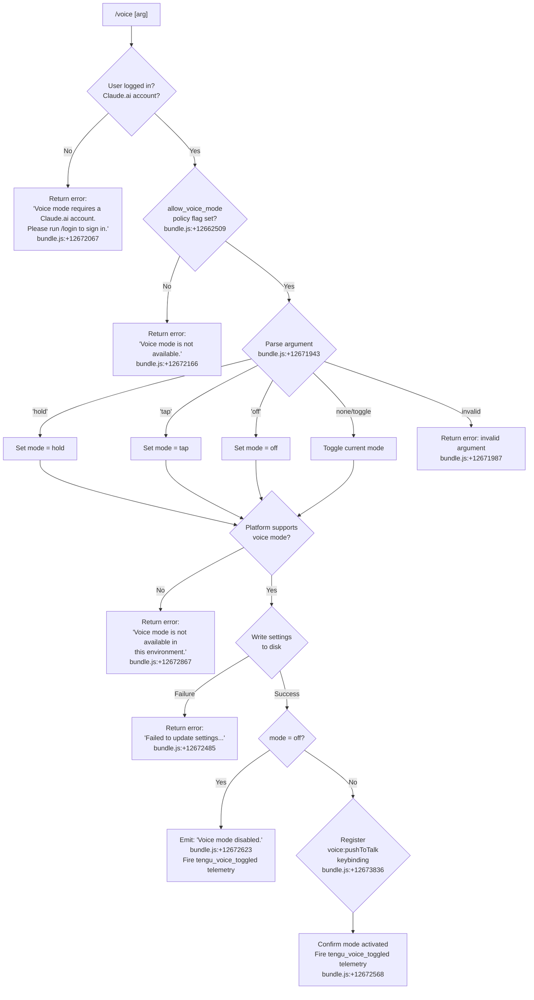

# `/voice`

> Analysis basis: CC v2.1.158 bundle.js (AST extraction + Claude interpretation)
> Minimum version: v2.1.158

---

## Overview

The `/voice` command toggles voice input mode in Claude Code CLI, allowing users to switch between `hold`, `tap`, and `off` interaction styles for microphone-based input. It validates account eligibility and policy permissions before applying the mode, then persists the setting and optionally registers a push-to-talk keybinding. The command is only available to users with a Claude.ai account and when the `allow_voice_mode` policy flag is enabled.

---

## Registration

| Field | Value |
|---|---|
| type | `local` |
| name | `voice` |
| description | Toggle voice mode |
| argumentHint | `[hold\|tap\|off]` |
| supportsNonInteractive | `false` |
| isHidden | `null` |
| module_id | `DHK` |
| load_inline | `true` |
| loc_byte | `12674572` |
| loc_byte_end | `12674814` |
| loc_line | `8798` |
| arbor_handler.name | `jD5` |
| arbor_handler.fqn | `claude-2.1.158::jD5` |
| arbor_handler.kind | `AsyncFunction` |
| arbor_handler.resolution_path | `module_id` |
| arbor_handler.n_hits | `1` |

Analysis basis: CC v2.1.158 bundle.js:+12674572

---

## Input Branching

The command has 5+ distinct branches depending on authentication state, policy, argument value, and platform availability. A Mermaid flowchart is used.



---

## Behavioral Spec

### 1. Authentication and Policy Gate

Before any mode change, the handler (`jD5`, resolved via `module_id` → `DHK`) checks two preconditions in sequence.

```
async function voiceCommandHandler(args, appContext):
    # Step 1: Account check
    loginStatus = getLoginStatus(appContext)
    if loginStatus is not a Claude.ai account:
        return textMessage("Voice mode requires a Claude.ai account. Please run /login to sign in.")

    # Step 2: Policy check
    settings = loadSettingsFromDisk()   # via settingsLoader (va8/Cp chain)
    if settings.allow_voice_mode is not true:
        return textMessage("Voice mode is not available.")
```

Analysis basis: CC v2.1.158 bundle.js:+12672026 (jD5→qA6), +12662509 (allow_voice_mode literal), +12672067 (login error message), +12672166 (policy error message)

The `allow_voice_mode` policy flag (`bundle.js:+12662509`) is read from merged settings (policy + user layers) via the settings-loader chain (`qA6` → `RAA` → `N9`).

---

### 2. Argument Parsing

The argument string is trimmed (`wD5` helper, `bundle.js:+12672251`) and matched against the known mode literals.

```
function parseVoiceArg(rawArg):
    arg = rawArg.trim()
    if arg == "hold":   return "hold"
    if arg == "tap":    return "tap"
    if arg == "off":    return "off"
    if arg == "":       return "toggle"   # no argument → cycle/toggle
    return "invalid"
```

Analysis basis: CC v2.1.158 bundle.js:+12671943 (`hold`), +12671955 (`tap`), +12671966 (`off`), +12671987 (`invalid`)

---

### 3. Mode Resolution (Toggle Logic)

When no argument is supplied the handler reads the current voice mode from app state and advances it.

```
function resolveTargetMode(parsed, currentMode):
    if parsed == "toggle":
        # Cycle: off → tap → hold → off
        return nextMode(currentMode)
    else:
        return parsed
```

Analysis basis: CC v2.1.158 bundle.js:+12672204 (B_ / settings-reader call), +12672318 (H.trim call on current mode value)

---

### 4. Platform Availability Check

After resolving the target mode, the handler checks whether the runtime environment supports voice input.

```
function checkVoiceAvailable(platform):
    if platform does not support microphone access:
        return error("Voice mode is not available in this environment.")
    # macOS: may reference System Settings → Privacy & Security → Microphone
    return ok
```

Analysis basis: CC v2.1.158 bundle.js:+12672867 (environment error message), +12673374 (macOS microphone settings hint string)

---

### 5. Settings Persistence

The resolved mode is written back to user settings via the atomic settings-writer chain (`U_`, `bundle.js:+12672387`), which acquires a file lock, re-reads the current settings, merges the new value, and writes atomically.

```
async function persistVoiceMode(targetMode):
    try:
        settingsWriter = acquireSettingsWriter()   # U_ chain
        settingsWriter.set("voiceMode", targetMode)
        await settingsWriter.flush()               # atomic write + lock release
    catch WriteError:
        return error("Failed to update settings. Check your settings file for syntax errors.")
```

Analysis basis: CC v2.1.158 bundle.js:+12672387 (U_ call), +12672485 (settings-write failure message)

The settings path follows the standard `.claude/settings.json` hierarchy (`bundle.js:+1219331`, `+1219341`). The writer uses `hL6` for atomic file replacement (`bundle.js:+1228842`).

---

### 6. Keybinding Registration (hold / tap modes)

When the resolved mode is `hold` or `tap`, the handler registers a default push-to-talk keybinding.

```
function registerPushToTalkKeybinding():
    action  = "voice:pushToTalk"        # bundle.js:+12673836
    context = "Chat"                    # bundle.js:+12673855
    key     = "Space"                   # bundle.js:+12673862

    keybindingConfig = loadKeybindingConfig()   # IX → j98 → bD6 chain
    if action not already mapped in context:
        registerBinding(context, key, action)
```

Analysis basis: CC v2.1.158 bundle.js:+12673833 (IX call), +12673836 (`voice:pushToTalk`), +12673855 (`Chat`), +12673862 (`Space`)

The keybinding loader reads `keybindings.json` (`bundle.js:+3799742`) from the user config directory, validates the `bindings` array structure (`bundle.js:+3801774`), and emits `tengu_keybinding_fallback_used` (`bundle.js:+3808681`) if the action is not found.

---

### 7. Result Emission and Telemetry

```
function emitResult(targetMode):
    fire telemetry: tengu_voice_toggled   # bundle.js:+12672568
    if targetMode == "off":
        return textMessage("Voice mode disabled.")
    else:
        return textMessage("Voice mode set to <targetMode>.")
```

Analysis basis: CC v2.1.158 bundle.js:+12672568 (`tengu_voice_toggled`), +12672623 (`Voice mode disabled.`)

---

## State & Side Effects

| Item | Detail |
|---|---|
| Telemetry | `tengu_voice_toggled` (bundle.js:+12672568) — fired on every successful mode change |
| Telemetry | `tengu_feature_ok` (bundle.js:+966033) — generic feature-success event |
| Telemetry | `tengu_feature_sad` (bundle.js:+966168) — feature soft-failure |
| Telemetry | `tengu_feature_bad` (bundle.js:+966091) — feature hard-failure |
| Telemetry | `tengu_keybinding_customization_release` (bundle.js:+3799228) — keybinding subsystem init |
| Telemetry | `tengu_custom_keybindings_loaded` (bundle.js:+3799648) — keybinding file loaded |
| Telemetry | `tengu_keybinding_fallback_used` (bundle.js:+3808681) — action not found in keybinding config |
| Telemetry | `tengu_config_parse_error` (bundle.js:+3210888) — settings JSON parse failure |
| Telemetry | `tengu_config_lock_contention` (bundle.js:+3208313) — settings file lock contention |
| Telemetry | `tengu_config_stale_write` (bundle.js:+3208449) — stale settings write detected |
| Telemetry | `tengu_config_auth_loss_prevented` (bundle.js:+3208792) — auth-loss safety guard triggered |
| Settings write | User settings file (`~/.claude/settings.json`) updated with new `voiceMode` value |
| Keybinding registration | `voice:pushToTalk` bound to `Space` in `Chat` context when mode is `hold` or `tap` (bundle.js:+12673836) |
| appState changes | Voice mode state updated in app context; downstream UI components observe the change |
| Platform hint | On macOS, microphone permission hint points to `System Settings → Privacy & Security → Microphone` (bundle.js:+12673374) |
| Sound | <!-- TODO: not found in depth-2 traversal; needs --depth 4 --> |
| Event emission | `opH.emit` called after settings write (bundle.js:+1229395) to notify listeners of config change |

---

## Version History

| Version | Change |
|---|---|
| v2.1.158 | Initial analysis |

---

## Common Mistakes

1. **Running `/voice` without a Claude.ai account** — The command unconditionally requires an authenticated Claude.ai session. Running it in API-key-only mode produces the login prompt error (`bundle.js:+12672067`). Use `/login` first.

2. **`allow_voice_mode` policy not set** — In enterprise or team deployments the `allow_voice_mode` policy flag (`bundle.js:+12662509`) may be absent or false. This cannot be overridden by the user; an admin must enable the flag in the policy settings layer.

3. **Providing an unrecognized argument** — Only `hold`, `tap`, and `off` are valid arguments. Any other string (e.g. `/voice on`) is treated as `invalid` (`bundle.js:+12671987`) and returns an error.

4. **Expecting voice mode in non-interactive pipelines** — `supportsNonInteractive: false` (registration) means `/voice` is silently unavailable when Claude Code is invoked with non-interactive flags. The command will not execute.

5. **Corrupted or malformed settings file** — If `settings.json` has syntax errors the write path fails with "Failed to update settings. Check your settings file for syntax errors." (`bundle.js:+12672485`). Validate the file manually before retrying.

6. **Platform availability on unsupported environments** — On environments without microphone access (e.g. certain Linux CI runners or container environments) the command will return "Voice mode is not available in this environment." (`bundle.js:+12672867`) even when fully authenticated.

---

## Appendix — Identifier Mapping

> For bundle debugging only. Identifiers change across versions.

| Identifier | Role |
|---|---|
| `jD5` | Main voice command handler (AsyncFunction; Arbor-resolved via module_id DHK) |
| `qA6` | Voice availability pre-check orchestrator |
| `SAA` | Settings + auth validation helper |
| `EY` | Authentication state resolver |
| `BK` | Base auth token accessor |
| `pP` | Auth profile and credential builder |
| `NO` | First-party auth checker |
| `qX` | OAuth token accessor |
| `F3` | API key / auth token validator |
| `eO6` | Auth object merger |
| `ogH` | Credential formatter |
| `BZ` | Settings Bq-delegate accessor |
| `qy6` | Voice availability result formatter |
| `RAA` | Policy settings reader |
| `N9` | Enterprise/team plan + policy flag resolver |
| `o89` | Plan-type loader |
| `QR` | Plan-based feature gate |
| `L1` | Settings flag evaluator |
| `gKH` | Channel/string formatter |
| `ww6` | Plan-gated settings dispatcher |
| `B_` | Current voice mode reader from app state |
| `Cp` | Settings loader from disk (entry point) |
| `DZ` | Settings disk-path resolver |
| `Z9` | Memory-usage tracker / perf marker |
| `Ib` | Module require wrapper (perf_hooks) |
| `va8` | Core settings load orchestrator |
| `w8` | Log file appender |
| `SC6` | Settings source classifier |
| `X56` | Flag settings accumulator |
| `fhA` | Settings file reader |
| `E3H` | Settings path builder |
| `MQ` | Settings merge coordinator |
| `qhA` | SDK inline settings handler |
| `$Q` | Parsed settings object constructor |
| `O_` | Config path resolver |
| `P56` | Platform (WSL/non-WSL) settings picker |
| `hC6` | Settings load finalizer |
| `wD5` | Argument trimmer / mode string validator |
| `H` | Misc string / random util (also setTimeout wrapper) |
| `U_` | Settings writer (atomic, with lock) |
| `ZO` | Settings write pre-validator |
| `Va8` | Settings write path builder |
| `jP` | Config directory resolver |
| `Ni` | File reader with encoding detection |
| `F$` | Filesystem stat / FIFO / socket checker |
| `N` | OS/platform info helper |
| `rB6` | File existence checker |
| `oB6` | Encoding sniffer |
| `P8` | ENOENT error handler |
| `J8` | Error code extractor |
| `Go8` | Timestamp cache setter |
| `iGH` | Settings write post-validator |
| `Ig6` | Settings directory resolver |
| `hL6` | Atomic file writer (temp + rename) |
| `O` | Symbolic-link stat checker |
| `I8` | Background-session stop sentinel |
| `RH` | JSON serializer wrapper |
| `vz` | Cache clear helper (yC6, uu8) |
| `uF6` | Gitignore / file-exclusion checker |
| `h6` | AsyncLocalStorage store accessor |
| `iB6` | nB6 store getter |
| `Ao8` | Git cache key builder |
| `A` | String/array util (toLowerCase, endsWith, values…) |
| `xF6` | Git-ignore check dispatcher |
| `G_` | Git command runner |
| `v94` | Path normaliser (tilde expansion, absolute) |
| `iIA` | Git ls-files tracker |
| `rIA` | Gitignore rule appender |
| `lb` | `.claude` directory path joiner |
| `hH` | Feature-ok telemetry emitter |
| `d` | Generic telemetry dispatcher |
| `t6` | Feature-sad telemetry emitter |
| `bH` | Feature-bad telemetry emitter |
| `SH` | Structured log / event emitter |
| `F_` | Error string coercer |
| `CH` | String coercer |
| `G_4` | Log-ring-buffer manager |
| `M` | Plugin/staging directory remover |
| `nS6` | Plugin path resolver + safety checker |
| `iS6` | Plugin synced-path builder |
| `$` | Daemon status accessor |
| `$s1` | Daemon status file reader |
| `ii` | Daemon status parser |
| `s1H` | Status JSON normaliser |
| `s9` | AsyncLocalStorage (YJ7) getter |
| `pk6` | Daemon status file path builder |
| `IX` | Keybinding initialiser / action registrar |
| `j98` | Keybinding config loader |
| `bD6` | keybindings.json parser and validator |
| `pJ_` | Keybinding schema validator |
| `uU` | Keybinding release-flag checker |
| `S4H` | keybindings.json path builder |
| `p6` | JSON.parse wrapper |
| `Y98` | Array-of-strings validator |
| `$98` | Keybinding entries extractor |
| `Esq` | Keybinding telemetry emitter |
| `uJ_` | Duplicate keybinding detector |
| `mJ_` | Keybinding block normaliser |
| `EH` | Error message string coercer |
| `J98` | Keybinding action-map builder |
| `QJ_` | Keybinding context merger |
| `gJ_` | Context key validator |
| `W6H` | Keybinding entry mapper |
| `bxH` | Locale / language detector |
| `S6` | Config file watcher / MCJS manager |
| `HY_` | Config watcher path helper |
| `szH` | Config snapshot loader + backup manager |
| `Qb` | String prefix stripper |
| `RFq` | Config backup directory reader |
| `fY_` | Config path joiner |
| `w` | Background-session dispatcher |
| `S` | Background-session process wrapper |
| `By8` | macOS memory threshold checker |
| `fw6` | Background-session status file reader |
| `B` | Retired-session filter |
| `G6` | Session-store getter |
| `jfA` | Background-session IPC connector |
| `ZfA` | Background-session lifecycle manager |
| `D` | Session disposal / spare-pool manager |
| `R` | Session resource disposer |
| `m17` | Config file watcher registrar |
| `Vr` | File watch debouncer |
| `q9` | Native file-watch registrar |
| `z8` | Global config reader / writer |
| `LY_` | Global config load-with-lock |
| `nOq` | Config object merger |
| `fK_` | Config base constructor |
| `qY6` | Config cache invalidator |
| `V` | Config version comparator |
| `P` | MCP server connection manager |
| `Ox8` | MCP server list builder |
| `E` | MCP slice extractor |
| `UQH` | Config upgrade migrator |
| `SFq` | Config entry iterator |
| `BQH` | Config write timestamp logger |
| `KY_` | Global config atomic writer |