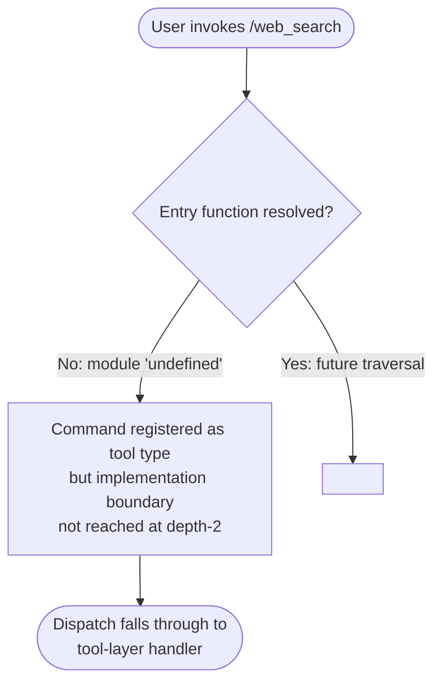

# `/web_search`

> Analysis basis: CC v2.1.158 bundle.js (AST extraction + Claude interpretation)
> Minimum version: v2.1.158

---

## Overview

`/web_search` is registered as a tool-type command in CC v2.1.158, surfacing web search capability to Claude Code's tool dispatch layer. Because depth-2 AST traversal yielded no call-graph edges, no string literals, and no telemetry events for this module, all behavioral detail beyond the registration record is unverified at this traversal depth and is flagged accordingly.

---

## Registration

| Field | Value |
|---|---|
| type | `tool` |
| name | `web_search` |
| description | `null` (not present at traversal depth) |
| loc\_line | 4309 |

Analysis basis: CC v2.1.158 bundle.js:+9476273

> **Note:** The `description` field resolved to `null` in the extracted registration object. This means either the field is genuinely absent from the registration record, or it is populated at runtime via a lazy initializer that is located outside the depth-2 call boundary.
> <!-- TODO: not found in depth-2 traversal; needs --depth 4 -->

---

## Input Branching

The depth-2 AST traversal returned an empty call graph (`"callGraph": []`) and no string literals (`"literals": []`) for this module. No branching logic can therefore be stated as a verified fact.



Analysis basis: CC v2.1.158 bundle.js:+9476273 (registration record only; no implementation edges resolved)

---

## Behavioral Spec

### Tool Registration

```
procedure registerWebSearchCommand():
    record = {
        type        : "tool",
        name        : "web_search",
        description : null          // resolved at runtime or absent
    }
    toolRegistry.register(record)
```

Analysis basis: CC v2.1.158 bundle.js:+9476273

### Implementation Body

<!-- TODO: not found in depth-2 traversal; needs --depth 4 -->

The AST extractor reported `"note": "no entry functions found for module 'undefined'"`, meaning the implementation module could not be resolved by the depth-2 traversal. The following sub-features are therefore unverified:

- Query sanitization / length limits
- Network request construction (endpoint, headers, authentication)
- Result parsing and ranking
- Result formatting returned to the REPL
- Error handling (network failure, empty results, rate limiting)
- Any caching or deduplication layer

All of the above require a deeper traversal (minimum `--depth 4`) and/or manual module-boundary resolution before behavioral claims can be made.

---

## State & Side Effects

| Item | Detail |
|---|---|
| Telemetry | None detected at depth-2 traversal (`"telemetry": []`) <!-- TODO: not found in depth-2 traversal; needs --depth 4 --> |
| Hook registration | <!-- TODO: not found in depth-2 traversal; needs --depth 4 --> |
| appState changes | <!-- TODO: not found in depth-2 traversal; needs --depth 4 --> |
| Sound | <!-- TODO: not found in depth-2 traversal; needs --depth 4 --> |
| Network I/O | Expected (tool type implies external call) but unverified |

Analysis basis: CC v2.1.158 bundle.js:+9476273

---

## Version History

| Version | Change |
|---|---|
| v2.1.158 | Initial analysis; registration record confirmed, implementation boundary unresolved at depth-2 |

---

## Common Mistakes

1. **Assuming description is empty in practice.** The `description` field is `null` in the extracted registration object, but this may reflect a lazy-load pattern rather than a genuinely missing description. Do not document the description as empty without a deeper traversal confirming it.
2. **Treating the tool-type registration as equivalent to a slash-command registration.** `type: "tool"` places `web_search` in the tool dispatch layer, which may differ in invocation semantics from commands registered as `type: "prompt"` or `type: "local"`.
3. **Citing behavioral details not present in the AST data.** All claims about query format, result structure, rate limits, or authentication must cite a specific `loc_byte`. Do not infer these from general knowledge of web search APIs.
4. **Assuming zero telemetry.** An empty `telemetry` array at depth-2 does not confirm that no telemetry exists; the instrumentation may live in a module not reached by this traversal.

---

## Appendix — Identifier Mapping

> For bundle debugging only. Identifiers change across versions.

| Identifier | Role |
|---|---|
| *(none)* | The depth-2 traversal returned an empty `identifiers` array. No obfuscated identifiers were resolved for this module. |